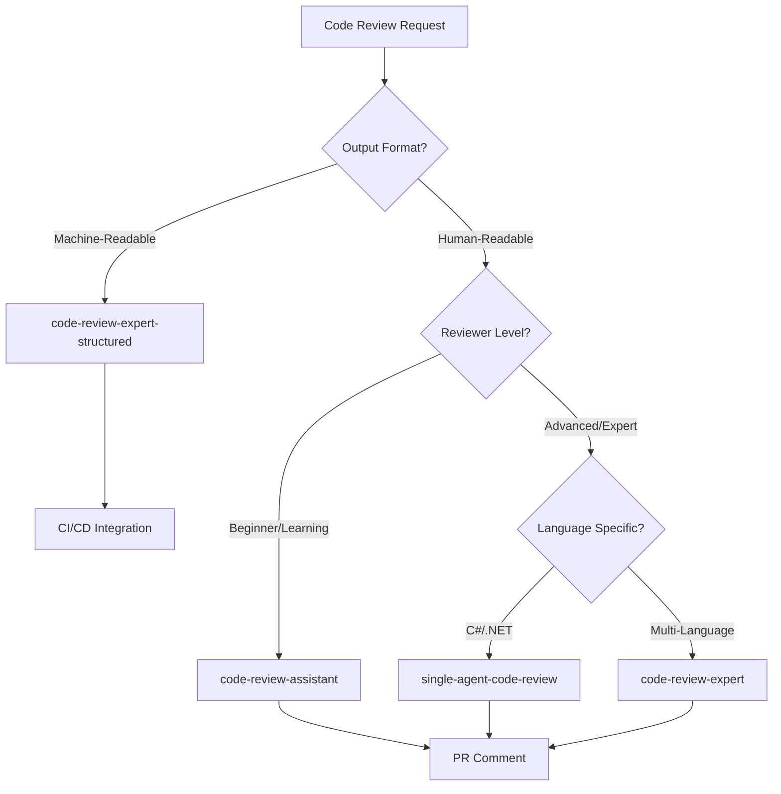

# Code Review Orchestration Workflow

## Overview

This workflow orchestrates the code review process by intelligently routing to the appropriate review prompt based on:

- **Review Context** (PR review, security audit, refactoring)
- **Audience Level** (beginner, intermediate, advanced)
- **Output Format** (narrative, structured JSON, CI/CD integration)
- **Language/Framework** (generic, C#/.NET specific)

## Workflow Decision Tree



## Available Review Prompts

### 1. Code Review Assistant (Beginner-Friendly)
**Path**: `prompts/developers/code-review-assistant.md`

**When to Use**:
- Junior developers learning code review practices
- Educational contexts
- First-time contributors
- General purpose reviews with explanations

**Characteristics**:
- Beginner difficulty
- Multi-platform support
- Educational tone with rationale
- Includes learning tips and best practice references

**Output**: Narrative format with detailed explanations

---

### 2. Code Review Expert (Advanced)
**Path**: `prompts/developers/code-review-expert.md`

**When to Use**:
- Senior engineer reviews
- Complex architecture decisions
- SOLID principle enforcement
- Security-critical components

**Characteristics**:
- Advanced difficulty
- Claude-optimized
- Google Engineering Practices alignment
- Emphasis on SOLID, security, performance

**Output**: Structured narrative with severity-based sections

---

### 3. Code Review Expert: Structured Output
**Path**: `prompts/developers/code-review-expert-structured.md`

**When to Use**:
- CI/CD pipeline integration
- Automated quality gates
- Dashboard/metrics collection
- Machine parsing required

**Characteristics**:
- JSON or structured Markdown output
- Schema-compliant formatting
- Severity classification with metrics
- Automation-friendly

**Output**: JSON or parseable Markdown for tooling

---

### 4. Single-Agent Code Review (C#/.NET)
**Path**: `techniques/agentic/single-agent/code-review-agent.md`

**When to Use**:
- .NET/C# codebases
- ASP.NET Core applications
- Entity Framework reviews
- Microsoft stack projects

**Characteristics**:
- .NET best practices focus
- SQL Server patterns
- Async/await enforcement
- Dependency injection patterns

**Output**: Comprehensive .NET-specific review

---

### 5. Code Review Agent (Multi-Tool Integration)
**Path**: `agents/code-review-agent.agent.md`

**When to Use**:
- IDE/Editor integration
- Real-time feedback during development
- Tool-augmented reviews (search, usages, problems)
- Multi-language repositories

**Characteristics**:
- Tool integration support
- Multi-language expertise
- Real-time analysis capability
- Contextual awareness

**Output**: Contextual feedback with tool integration

---

## Workflow Stages

### Stage 1: Context Analysis

**Input Variables**:
- `[CODE_SNIPPET]` - The code to review
- `[REVIEW_CONTEXT]` - PR review, security audit, refactoring, etc.
- `[LANGUAGE]` - Programming language/framework
- `[REVIEWER_LEVEL]` - Beginner, intermediate, advanced
- `[OUTPUT_FORMAT]` - Narrative, JSON, CI/CD

**Decision Logic**:
```python
def select_review_prompt(context):
    if context.output_format == "JSON":
        return "code-review-expert-structured"
    elif context.language == "C#" and context.framework == ".NET":
        return "single-agent-code-review"
    elif context.reviewer_level == "beginner":
        return "code-review-assistant"
    elif context.tool_integration_required:
        return "code-review-agent"
    else:
        return "code-review-expert"
```

### Stage 2: Review Execution

**Process**:
1. Load selected prompt template
2. Inject context variables
3. Execute review with appropriate AI model
4. Parse and validate output format

**Model Selection**:
- **Structured Output**: Claude Opus (best JSON adherence)
- **Narrative Reviews**: Claude Sonnet or GPT-4
- **Real-time/IDE**: GPT-4 Turbo or Claude Instant

### Stage 3: Post-Processing

**Actions**:
- Format output for target platform (GitHub PR, Azure DevOps, Slack)
- Extract severity metrics
- Generate summary statistics
- Create action items/TODOs

### Stage 4: Integration

**Output Destinations**:
- **GitHub**: Post as PR comment with emoji severity indicators
- **CI/CD**: Fail build on critical issues
- **Dashboard**: Send metrics to monitoring
- **Notifications**: Alert team on critical findings

---

## Usage Examples

### Example 1: PR Review for Junior Developer

```bash
# Context
REVIEW_CONTEXT="pull-request"
REVIEWER_LEVEL="beginner"
OUTPUT_FORMAT="narrative"

# Result: Routes to code-review-assistant.md
# - Educational explanations
# - Best practice references
# - Encouragement on strengths
```

### Example 2: CI/CD Pipeline Integration

```yaml
# .github/workflows/code-review.yml
- name: AI Code Review
  run: |
    gh copilot review \
      --prompt prompts/developers/code-review-expert-structured.md \
      --output json \
      --severity-threshold MAJOR
```

### Example 3: .NET API Security Audit

```bash
# Context
LANGUAGE="C#"
FRAMEWORK=".NET 6"
REVIEW_CONTEXT="security-audit"
FOCUS_AREAS="SQL injection, authentication, secrets"

# Result: Routes to single-agent-code-review.md
# - .NET security patterns
# - SQL parameterization checks
# - Configuration best practices
```

### Example 4: Multi-Language Monorepo

```bash
# Context
REPOSITORY_TYPE="monorepo"
LANGUAGES=["Python", "TypeScript", "Go"]
TOOL_INTEGRATION="required"

# Result: Routes to code-review-agent.agent.md
# - Multi-language expertise
# - Cross-repository awareness
# - Tool-augmented analysis
```

---

## Integration Patterns

### GitHub Actions Integration

```yaml
name: AI Code Review
on: [pull_request]

jobs:
  review:
    runs-on: ubuntu-latest
    steps:
      - uses: actions/checkout@v3
      
      - name: Determine Review Strategy
        id: strategy
        run: |
          if [[ "${{ github.event.pull_request.user.login }}" == "dependabot"* ]]; then
            echo "prompt=code-review-expert-structured" >> $GITHUB_OUTPUT
          elif [[ $(git diff --name-only | grep -c ".cs$") -gt 0 ]]; then
            echo "prompt=single-agent-code-review" >> $GITHUB_OUTPUT
          else
            echo "prompt=code-review-expert" >> $GITHUB_OUTPUT
          fi
      
      - name: Run AI Review
        run: |
          gh copilot review \
            --prompt .agent/workflows/coderev.md \
            --strategy ${{ steps.strategy.outputs.prompt }}
```

### Azure DevOps Pipeline

```yaml
trigger:
  - main
  - develop

pool:
  vmImage: 'ubuntu-latest'

steps:
- script: |
    python scripts/code_review_orchestrator.py \
      --files $(git diff --name-only HEAD~1) \
      --workflow .agent/workflows/coderev.md \
      --output-format json
  displayName: 'AI Code Review'

- task: PublishTestResults@2
  inputs:
    testResultsFormat: 'JUnit'
    testResultsFiles: '**/review-results.xml'
```

---

## Severity Classification Standard

All prompts use consistent severity levels:

| Severity | Emoji | Criteria | Action |
|----------|-------|----------|--------|
| **CRITICAL** | 🔴 | Security vulnerabilities, data loss risk, production blockers | Block merge immediately |
| **MAJOR** | 🟡 | Logic bugs, performance issues, missing error handling | Request changes |
| **MINOR** | 🟢 | Code quality, maintainability, style issues | Suggest improvements |
| **INFO** | ℹ️ | Informational, alternative approaches | Optional consideration |

---

## Output Format Standards

### Narrative Format
```markdown
## Code Review Summary
**Overall Assessment**: [APPROVE | REQUEST CHANGES | COMMENT]

### 🔴 BLOCKERS (Must Fix)
[Critical issues with code examples]

### 🟡 IMPORTANT (Should Fix)
[Major issues with recommendations]

### 🟢 SUGGESTIONS (Nice to Have)
[Minor improvements]

### Strengths
[Positive observations]
```

### Structured JSON Format
```json
{
  "review_id": "uuid",
  "timestamp": "2025-12-11T09:37:11Z",
  "repository": "org/repo",
  "commit_sha": "abc123",
  "recommendation": "REQUEST_CHANGES",
  "issues": [
    {
      "severity": "CRITICAL",
      "category": "security",
      "line_start": 15,
      "description": "SQL injection vulnerability",
      "suggested_fix": "Use parameterized queries"
    }
  ],
  "metrics": {
    "files_reviewed": 5,
    "issues_found": 12,
    "critical": 2,
    "major": 5,
    "minor": 5
  }
}
```

---

## Best Practices

### Prompt Selection
1. **Start with assistant** for new team members learning review practices
2. **Use expert** for production-critical reviews requiring deep analysis
3. **Use structured** for automation and metrics collection
4. **Use single-agent** for language-specific deep dives

### Context Provision
- Always include programming language and framework version
- Specify PR intent (bugfix, feature, refactoring)
- Mention specific concerns (security, performance, etc.)
- Provide relevant project standards or conventions

### Review Iteration
- For large changes (>500 lines), review in chunks
- Focus on critical paths first (auth, payment, data access)
- Use different prompts for different file types in same PR

### Human Oversight
- AI reviews are first-pass; always require human approval
- Critical security findings should be verified by security team
- Architecture decisions need senior engineer sign-off

---

## Related Resources

### Prompts
- [Code Review Assistant](../prompts/developers/code-review-assistant.md)
- [Code Review Expert](../prompts/developers/code-review-expert.md)
- [Code Review Expert: Structured](../prompts/developers/code-review-expert-structured.md)
- [Security Code Auditor](../prompts/developers/security-code-auditor.md)

### Agents
- [Code Review Agent](../agents/code-review-agent.agent.md)

### Techniques
- [Single-Agent Code Review](../techniques/agentic/single-agent/code-review-agent.md)

### Supporting Tools
- [Test Automation Engineer](../prompts/developers/test-automation-engineer.md)
- [Performance Optimization Specialist](../prompts/developers/performance-optimization-specialist.md)

---

## Metrics and Monitoring

Track these metrics across reviews:

- **Issue Detection Rate**: Critical/Major issues found per 1000 LOC
- **False Positive Rate**: Issues marked "not applicable" by humans
- **Review Consistency**: Agreement between AI and human reviewers
- **Time Savings**: Time from AI first-pass vs full human review
- **Adoption Rate**: % of PRs receiving AI review

---

## Continuous Improvement

This workflow evolves based on:
- Team feedback on review quality
- False positive/negative analysis
- New language/framework support
- Integration with additional tools
- Compliance requirement changes

**Last Updated**: 2025-12-11
**Next Review**: Quarterly or when major prompt updates occur

