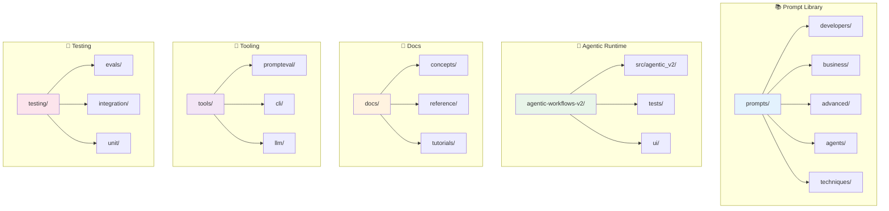

# Enterprise AI Prompt Library


A comprehensive, community-driven prompt library designed for everyone—from developers to business professionals. This repository provides well-organized, reusable prompts for AI/LLM interactions across diverse use cases, optimized for **Claude Sonnet 4.5** and **Code 5**.

Based on **scientific research** and analysis of 95+ prompts, we've identified and documented the **top 20% most effective prompts** (scoring 75+/100):

- ✅ **Research-Backed Methodology**: Based on academic papers from NeurIPS, ICLR, and industry standards from Anthropic, OpenAI, Microsoft
- 📊 **Scored on 5 Dimensions**: Clarity, Structure, Usefulness, Technical Quality, Ease of Use
- 🏆 **11 Tier-1 Prompts**: Exceptional quality (85-100 points) across advanced techniques, development, and analysis
- 🚀 **Platform-Specific**: Templates for GitHub Copilot, M365 Copilot, Windows Copilot, Claude, GPT

📖 **[Explore the Ultimate Prompting Guide →](docs/ultimate-prompting-guide.md)**  
⚡ **[Quick Start Templates →](docs/platform-specific-templates.md)**  
🔬 **[View Scoring Methodology →](docs/prompt-effectiveness-scoring-methodology.md)**

## 🎯 Who This Library Is For

- **Developers**: Technical prompts for code generation, debugging, testing, and architecture
- **Business Professionals**: Prompts for analysis, strategy, reporting, and communication
- **Creative Teams**: Content creation, marketing, and storytelling prompts
- **Data Analysts**: Prompts for data analysis, insights extraction, and visualization
- **Advanced Users**: Chain-of-Thought, ReAct, RAG, and Tree-of-Thoughts patterns
- **Enterprise Teams**: Legal, compliance, security, and governance prompts with audit controls
- **Multi-Agent Developers**: Build orchestrated AI workflows with LangChain & MCP 🆕
- **Everyone**: General-purpose system prompts and templates

## ✨ New: Advanced Techniques & Enterprise Governance

### Advanced Prompting Techniques

Frontier model capabilities require advanced prompting patterns. We now include:

- **Chain-of-Thought (CoT)**: Step-by-step reasoning with concise and detailed modes
- **ReAct**: Reasoning + Acting patterns for tool-augmented tasks
- **RAG (Retrieval-Augmented Generation)**: Document retrieval with citation frameworks
- **Reflection**: Self-critique and iterative improvement patterns
- **Tree-of-Thoughts (ToT)**: Multi-branch reasoning with backtracking

📚 **[Explore Advanced Techniques →](prompts/advanced/)**

### Enterprise Governance & Compliance

Production AI requires governance, risk management, and compliance controls:

- **Legal Prompts**: Contract review, compliance checks, policy drafting
- **Security Prompts**: Incident response, threat modeling, vulnerability assessment
- **Governance Metadata**: PII-handling, risk levels, approval requirements, audit trails
- **Regulatory Compliance**: GDPR, CCPA, SOX, HIPAA, ISO 27001, NIST frameworks
- **Access Controls**: Role-based permissions, human review requirements

📋 **[Explore Governance & Compliance →](prompts/governance/)**

### Agentic Workflows V2 (State-of-the-Art) 🚀

**The new standard for high-performance AI orchestration.**

- **DAG Engine**: Parallel execution of complex dependency graphs
- **Smart Router**: Intelligent model selection (Tier 0-3) based on task complexity
- **CLI-First**: Powerful `agentic` command line interface
- **Strict Typing**: Built on Pydantic v2 for robustness

📦 **[Explore Agentic V2 →](agentic-workflows-v2/)**
💻 **CLI**: `python -m agentic_v2.cli.main`

### Runtime Surface Map

For active vs legacy runtime surfaces, use the authoritative map:

- 📍 **[Active vs Legacy Tooling Map →](docs/reports/ACTIVE_VS_LEGACY_TOOLING_MAP.md)**

## 🤖 GitHub Copilot Custom Agents

We provide a library of pre-built custom agents optimized for GitHub Copilot:

| Agent | Description | Best For |
| ------- | ------------- | ---------- |
| **[@docs_agent](prompts/agents/docs-agent.agent.md)** | Technical writing specialist | README, API docs, guides |
| **[@code_review_agent](prompts/agents/code-review-agent.agent.md)** | Code quality reviewer | PR reviews, best practices |
| **[@test_agent](prompts/agents/test-agent.agent.md)** | Test generation expert | Unit tests, integration tests |
| **[@refactor_agent](prompts/agents/refactor-agent.agent.md)** | Code improvement specialist | Code cleanup, optimization |
| **[@prompt_agent](prompts/agents/prompt-agent.agent.md)** | Prompt creation expert | AI prompts, templates |
| **[@security_agent](prompts/agents/security-agent.agent.md)** | Security analysis expert | Vulnerability review, hardening |
| **[@architecture_agent](prompts/agents/architecture-agent.agent.md)** | System design specialist | Design decisions, patterns |

### Quick Start with Agents

1. Copy an agent to `.github/agents/` in your repository
2. Merge to your default branch
3. Use `@agent_name` in Copilot Chat

📖 **[Complete Agents Guide →](prompts/agents/AGENTS_GUIDE.md)**  
📋 **[Agent Template →](prompts/agents/agent-template.md)**

---

## 🔧 Unified Tooling

The library includes a powerful CLI and a unified backend for executing, evaluating, and improving prompts across local (ONNX/NPU) and cloud providers.

| Tool | Purpose | Key Command |
| ------ | --------- | ------------- |
| **Prompt Runner** | Execute prompts on local/cloud models | `python prompt.py run` |
| **Tiered Eval** | Multi-tier prompt quality evaluation | `python prompt.py eval` |
| **CoVe Runner** | Fact-checking via Chain-of-Verification | `python prompt.py cove` |
| **Windows AI** | Local NPU-accelerated inference | `python prompt.py run -p windows` |
| **Local Media** | Local Image Gen & Speech-to-Text | `python tools/local_media.py` |

📖 **[Full Tools Documentation & Usage Guide →](tools/README.md)**  
⚡ **[Windows AI Setup Guide →](WINDOWS_AI_INSTALL.md)**

---

## 📁 Repository Structure

```text
prompts/
├── .github/                # GitHub config, agents & workflows
├── docs/                   # 📖 Documentation & Guides
│   ├── concepts/           # Theory & understanding
│   ├── instructions/       # Copilot instructions files
│   ├── planning/           # Project planning docs
│   ├── reference/          # Quick lookup & Glossary
│   ├── research/           # Research documentation
│   └── tutorials/          # Step-by-step learning
├── agentic-workflows-v2/   # 🤖 Active workflow runtime
│   ├── src/agentic_v2/     # Core runtime, server, integrations
│   ├── tests/              # Runtime test suite
│   └── ui/                 # Dashboard web UI
├── prompts/                # 📚 Prompt Library (196+ prompts)
│   ├── advanced/           # CoT, ReAct, ToT, RAG patterns
│   ├── agents/             # 🤖 GitHub Copilot Agents
│   ├── analysis/           # Analysis prompts
│   ├── business/           # Business & strategy
│   ├── developers/         # Code generation, debugging
│   ├── frameworks/         # 🏗️ Prompting frameworks
│   ├── system/             # System-level prompts
│   ├── techniques/         # 🎯 Advanced techniques
│   ├── templates/          # 📄 Reusable templates
│   └── registry.yaml       # Central prompt registry
├── scripts/                # 🛠️ Utility scripts
├── testing/                # 🧪 Test framework (103+ tests)
│   ├── evals/              # Evaluation tests
│   ├── framework/          # Test framework utilities
│   ├── integration/        # Integration tests
│   └── unit/               # Unit tests
├── tools/                  # 🔧 Unified Tooling Suite
│   ├── agents/             # Agent implementations
│   ├── cli/                # CLI commands
│   ├── core/               # Core utilities
│   ├── llm/                # LLM client implementations
│   ├── prompteval/         # Prompt evaluation framework
│   └── rubrics/            # Scoring rubrics
├── workflows/              # Workflow definitions
│   └── agentic_planning/   # Agentic planning workflows
├── prompt.py               # Main CLI entry point
└── README.md               # This file
```

### Visual Architecture



### User Journey: Finding and Using a Prompt

```mermaid
journey
    title User Journey: Prompt Discovery to Success
    section 🔍 Discovery
      Land on README: 5: User
      Browse categories: 4: User
      Find relevant prompt: 4: User
    section ✅ Selection
      Read description: 5: User
      Check examples: 5: User
      Verify platform compatibility: 4: User
    section 🚀 Usage
      Copy prompt text: 5: User
      Replace variables: 3: User
      Paste into AI tool: 5: User
    section 🔄 Iteration
      Review output: 4: User
      Adjust prompt if needed: 3: User
      Achieve goal: 5: User
```text

<details>
<summary>📊 <strong>Library Statistics</strong></summary>

| Category | Items | Description |
| ---------- | --------- | ------------------------ |
| **Prompts** | 196+ | Across 12 categories |
| Developers | 29 | Code generation, debugging, testing |
| Business | 16 | Analysis, strategy, reporting |
| Advanced | 29 | CoT, ReAct, ToT, RAG patterns |
| Analysis | 25 | Data analysis, insights |
| System | 25 | System-level configurations |
| Techniques | 18 | Advanced prompting techniques |
| Frameworks | 17 | Prompting frameworks |
| Agents | 13 | GitHub Copilot agents |
| **Testing** | 103+ | Unit, integration, evaluation tests |
| **Tools** | 176+ | CLI, LLM clients, evaluators |
| **Multi-Agent** | 152+ | Workflow configs, LangChain, MCP |

</details>

## 🚀 Quick Start

### Start Here

| Your Goal | Start Here | Time |
| ----------- | ------------ | ------ |
| **First time?** | [Your First Prompt](/docs/tutorials/first-prompt) | 15 min |
| **Using GitHub Copilot?** | [Quickstart for Copilot](/docs/get-started/quickstart-copilot) | 10 min |
| **Using ChatGPT?** | [Quickstart for ChatGPT](/docs/get-started/quickstart-chatgpt) | 10 min |
| **Using Claude?** | [Quickstart for Claude](/docs/get-started/quickstart-claude) | 10 min |
| **Using M365 Copilot?** | [Quickstart for M365](/docs/get-started/quickstart-m365) | 10 min |
| **Need quick patterns?** | [Cheat Sheet](/docs/reference/cheat-sheet) | 5 min |
| **Something not working?** | [Troubleshooting](/docs/troubleshooting/) | varies |

### For Non-Technical Users

1. **Browse by Category**: Navigate to the folder that matches your need (business, creative, etc.)
2. **Find a Prompt**: Each prompt file contains:
   - Description of what it does
   - When to use it
   - Example usage
   - Expected output
3. **Copy & Use**: Copy the prompt text and paste it into your AI tool
4. **Customize**: Replace placeholder text (marked with `[brackets]`) with your specific information

### For Developers

1. **Clone the repository**:

   ```bash
   git clone https://github.com/tafreeman/prompts.git
   cd prompts
   ```

1. **Use prompts programmatically**:
   - Prompts are stored in Markdown format with YAML frontmatter
   - Parse metadata for categorization, versioning, and filtering
   - Integrate into your prompt management systems

2. **Version control**: All prompts are version-controlled via Git
   - Track changes and improvements
   - Roll back to previous versions
   - Collaborate through pull requests

## 📝 Prompt Format

Each prompt follows a consistent structure:

```markdown
---
title: "Prompt Title"
category: "developers|business|creative|analysis|system"
tags: ["tag1", "tag2", "tag3"]
author: "Author Name"
version: "1.0"
date: "2025-10-29"
difficulty: "beginner|intermediate|advanced"
---

# Prompt Title

## Description
Brief description of what this prompt does and when to use it.

## Use Cases

- Use case 1
- Use case 2
- Use case 3

## Prompt

[Your actual prompt text goes here]

## Variables

- `[variable1]`: Description of what to replace this with
- `[variable2]`: Description of what to replace this with

## Example Usage

**Input:**
```text

Example of the prompt with real values

```text

**Output:**
```text

Example of expected output

```text

## Tips

- Tip 1 for better results
- Tip 2 for customization

```text

## 🤝 Contributing

We welcome contributions from everyone! See [CONTRIBUTING.md](CONTRIBUTING.md) for guidelines on:

- Adding new prompts
- Improving existing prompts
- Reporting issues
- Suggesting new categories

## 📚 Documentation

### Getting Started

- **[Your First Prompt](/docs/tutorials/first-prompt)**: 15-minute hands-on tutorial
- **[Choosing the Right Pattern](/docs/get-started/choosing-the-right-pattern)**: Decision guide for prompt selection
- **[Platform Quickstarts](/docs/get-started/)**: Get productive on any platform in 10 minutes

### Reference

- **[Cheat Sheet](/docs/reference/cheat-sheet)**: Quick patterns and templates
- **[Platform Comparison](/docs/reference/platform-comparison)**: GPT vs Claude vs Copilot
- **[Glossary](/docs/reference/glossary)**: Prompt engineering terminology

### Curated Guides (Research-Backed)

- **[Ultimate Prompting Guide](docs/ultimate-prompting-guide.md)**: Top 20% most effective prompts, platform-specific templates, research-backed best practices
- **[Platform-Specific Templates](docs/platform-specific-templates.md)**: Ready-to-use templates for GitHub Copilot, M365, Windows Copilot, and more
- **[Prompt Effectiveness Methodology](docs/prompt-effectiveness-scoring-methodology.md)**: Scientific scoring system based on academic research and industry standards

### General Documentation

- **[Getting Started Guide](docs/getting-started.md)**: For first-time users
- **[Best Practices](docs/best-practices.md)**: Tips for effective prompt engineering
- **[Prompt Template](prompts/templates/prompt-template.md)**: Template for creating new prompts

## 🏷️ Categories

### Developers

Code generation, debugging, testing, architecture design, documentation, refactoring, and technical problem-solving.

### Business

Business analysis, strategy planning, market research, financial analysis, reporting, and decision-making support.

### Creative

Content creation, copywriting, marketing campaigns, social media, storytelling, brainstorming, and brand development.

### Analysis

Data analysis, research synthesis, statistical interpretation, trend analysis, and insight generation.

### System

System-level prompts for AI agents, role definitions, behavior guidelines, and general-purpose configurations.

## 📖 Learning Resources

- **New to Prompt Engineering?** Start with our [Introduction to Prompts](docs/intro-to-prompts.md)
- **Advanced Techniques**: Check out [Advanced Prompt Engineering](docs/advanced-techniques.md)
- **Examples**: Browse [examples/](examples/) for real-world use cases

## 🔍 Finding the Right Prompt

1. **By Use Case**: Navigate to the relevant category folder
2. **By Tag**: Search for specific tags in prompt metadata
3. **By Difficulty**: Filter by beginner, intermediate, or advanced levels
4. **By Search**: Use GitHub's search feature to find keywords

## 📊 Prompt Quality Standards

All prompts in this library:

- ✅ Are tested and validated
- ✅ Include clear descriptions and examples
- ✅ Follow consistent formatting
- ✅ Include metadata for easy discovery
- ✅ Are reviewed by the community

## 🔄 Version History

Prompts are versioned to track improvements:

- **1.0**: Initial version
- **1.1**: Minor improvements  
- **2.0**: Major changes or rewrites

### Recent Updates (2026)

- **Feb 2026**: Multi-agent workflow system with LangChain & MCP integration
- **Jan 2026**: Comprehensive testing framework (103+ tests)
- **Jan 2026**: Dashboard UI for workflow monitoring
- **Jan 2026**: Benchmark framework (HumanEval, MBPP, SWE-bench)

Check individual prompt files for version history.

## 📄 License

This project is licensed under the MIT License - see the [LICENSE](LICENSE) file for details.

## 🌟 Acknowledgments

This library is inspired by popular prompt libraries including:

- weam-ai/weam
- danielrosehill/System-Prompt-Library
- kevin-hammond/prompt-library

Thank you to all contributors who help improve this resource!

## 📞 Support

- **Issues**: Report bugs or suggest improvements via [GitHub Issues](https://github.com/tafreeman/prompts/issues)
- **Discussions**: Join conversations in [GitHub Discussions](https://github.com/tafreeman/prompts/discussions)
- **Pull Requests**: Contribute directly via [Pull Requests](https://github.com/tafreeman/prompts/pulls)

---

**Made with ❤️ by the community, for the community.**
