<](https://www.python.org/downloads/)
[](LICENSE)
[](https://github.com/psf/black)
[](https://github.com/astral-sh/ruff)
[](http://mypy-lang.org/)

</div>

---

## Overview

Agentic Workflows is a framework for orchestrating multi-agent AI pipelines where each agent occupies a specific role (planner, researcher, coder, reviewer) and operates at a defined capability tier. Workflows are authored as declarative YAML files and compiled into executable DAGs with automatic parallel scheduling, conditional branching, iterative loops, and failure cascade propagation.

The system solves three core problems in production AI orchestration:

1. **Scheduling complexity** — Real-world agent pipelines have diamond dependencies, conditional execution, and iterative refinement loops. A linear pipeline can't express "run two analysts in parallel, then merge results only if a confidence threshold is met." A DAG with Kahn's algorithm can.

2. **Model reliability** — Any single LLM endpoint can rate-limit, timeout, or fail. The tiered routing system maps each workflow step to a capability tier (not a specific model), then resolves to the best available model at runtime with health-weighted selection, adaptive cooldowns, and circuit breaker patterns.

3. **Evaluation rigor** — "Does the output look good?" isn't a scoring methodology. The evaluation framework uses YAML-defined rubrics with weighted criteria, multidimensional scoring across coverage/quality/agreement/verification/recency dimensions, and LLM-as-judge integration for subjective quality assessment.

---

## Architecture

```mermaid
graph TD
    A["📄 YAML Workflow DSL<br/><i>deep_research · code_review · tdd_codegen</i>"] --> B["🔍 Workflow Loader & Validator<br/><i>Expression resolution · Input typing</i>"]

    B --> C["⚡ DAG Executor<br/><i>Native Runtime</i>"]
    B --> D["🔗 LangGraph Compiler<br/><i>LangChain Engine</i>"]

    C --> E["🔀 Tiered Model Router"]
    D --> E

    E --> F["☁️ Provider Backends"]

    subgraph DAG ["DAG Executor"]
        C
        C1["Kahn's algorithm scheduling"]
        C2["asyncio.wait FIRST_COMPLETED"]
        C3["Cascade failure propagation"]
        C4["Max concurrency control"]
    end

    subgraph LG ["LangGraph Compiler"]
        D
        D1["StateGraph node generation"]
        D2["Conditional + loop edges"]
        D3["Checkpointing support"]
    end

    subgraph Router ["Model Router"]
        E
        E1["Tier 0 → Deterministic · no LLM"]
        E2["Tier 1 → Small · flash-lite, 4o-mini"]
        E3["Tier 2 → Medium · flash, haiku"]
        E4["Tier 3 → Large · 2.5-flash, gpt-4o"]
        E5["Tier 4 → Premium · 2.5-pro, claude-sonnet"]
        E6["Tier 5 → Frontier · claude-opus"]
        E7["Health-weighted selection · Adaptive cooldowns<br/>Circuit breakers · Cost-aware routing"]
    end

    subgraph Providers ["Providers"]
        F
        F1["OpenAI"]
        F2["Anthropic"]
        F3["Google Gemini"]
        F4["Ollama / LM Studio"]
        F5["Azure OpenAI"]
        F6["GitHub Models"]
    end

    style A fill:#4a90d9,stroke:#2c5f8a,color:#fff
    style B fill:#6c5ce7,stroke:#4834a8,color:#fff
    style E fill:#e17055,stroke:#b34530,color:#fff
    style F fill:#00b894,stroke:#008060,color:#fff
    style C fill:#fdcb6e,stroke:#c8a034,color:#333
    style D fill:#fdcb6e,stroke:#c8a034,color:#333
```



---

## Key Design Decisions

### Why DAG over Pipeline?

Multi-agent workflows rarely execute linearly. Consider the **deep research** workflow: after an initial planning step, _two specialist analysts_ (AI-focused and SWE-focused) run in parallel over the same evidence bundle. Their outputs merge into a Chain-of-Verification (CoVe) step, which conditionally triggers another research round based on confidence scoring. A pipeline would serialize the analysts unnecessarily; a DAG with `asyncio.wait(FIRST_COMPLETED)` maximizes throughput.

### Why YAML Workflow Definitions?

Workflow structure should be auditable and version-controlled separately from execution logic. Each YAML file declares steps, their agent assignments, input/output mappings with expression syntax (`${steps.intake_scope.outputs.scoped_goal}`), conditional gates (`when:`), and loop termination conditions (`loop_until:`). The runtime compiles these into executable graphs — the YAML is the single source of truth for workflow topology.

### Why Tiered Model Routing?

Mapping workflow steps to models by name creates brittleness: model names change, endpoints go down, pricing shifts. Instead, each agent is assigned a _capability tier_ (e.g., `tier3_analyst`). The router resolves this to the best available model at runtime, with fallback chains like:

```
Tier 3: gemini-2.5-flash → gh:gpt-4o → openai:gpt-4o → anthropic:claude-sonnet
```

The `SmartModelRouter` extends this with health-weighted selection, adaptive cooldowns (exponential backoff on failures), and circuit breaker patterns — if a model fails repeatedly, it's temporarily excluded from selection.

### Why Rubric-Based Scoring?

LLM outputs resist binary pass/fail evaluation. The scoring system uses YAML-defined rubrics with weighted criteria, score normalization with clamping, and explicit handling of missing criteria. For complex evaluations, a multidimensional scoring engine classifies outputs across five orthogonal dimensions (coverage, source quality, agreement, verification, recency) into lettered tiers (S/A/B/C/D/F), with configurable pass/fail gates per dimension.

---

## Workflow Definitions

The engine ships with **10 production workflow definitions**, each solving a distinct orchestration pattern:

| Workflow | Steps | Pattern | Description |
|----------|-------|---------|-------------|
| `deep_research` | 28 | Iterative DAG with conditional rounds | ToT planning → ReAct retrieval → dual-specialist analysis → CoVe verification → confidence gating → up to 4 iterative rounds → final synthesis + RAG packaging |
| `code_review` | 5 | Fan-out / fan-in | Parse code → parallel architecture + quality reviews → synthesis |
| `bug_resolution` | 6 | Sequential with verification | Reproduce → root cause analysis → fix → test → verify |
| `tdd_codegen_e2e` | 27 | Multi-loop with bounded iteration | Spec → test scaffolding → implementation → iterative test/fix cycles |
| `multi_agent_codegen_e2e` | 32 | Full pipeline with review loops | Plan → architect → implement → review → iterate until quality gates pass |
| `fullstack_generation` | 7 | Sequential with parallel sub-steps | Requirements → API design → frontend + backend in parallel → integration |
| `plan_implementation` | 24 | Complex DAG with checkpoints | Breakdown → dependency analysis → phased implementation → validation |
| `test_deterministic` | 1 | Tier-0 only | Deterministic step for testing the engine without LLM calls |

### Example: Deep Research Workflow

The `deep_research.yaml` workflow demonstrates the full power of the DSL — iterative research with bounded rounds, conditional execution, parallel specialist analysis, and confidence-gated termination:

```yaml
steps:
  - name: intake_scope
    agent: tier3_planner
    description: Clarify user objective, constraints, and success criteria
    tools: [context_store]
    inputs:
      topic: ${inputs.topic}
      goal: ${coalesce(inputs.goal, inputs.topic)}
    outputs:
      scoped_goal: scoped_goal

  - name: analyst_ai_round1         # ← Runs in parallel
    agent: tier3_analyst             #   with analyst_swe_round1
    depends_on: [retrieval_react_round1]
    ...

  - name: analyst_swe_round1        # ← Runs in parallel
    agent: tier3_analyst             #   with analyst_ai_round1
    depends_on: [retrieval_react_round1]
    ...

  - name: hypothesis_tree_tot_round2
    agent: tier3_reasoner
    depends_on: [coverage_confidence_audit_round1]
    when: ${inputs.max_rounds} >= 2 and not ${steps...gate_passed}
    # ↑ Conditional: only runs if confidence gate hasn't passed
```

#### Execution Flow (Single Research Round)

```mermaid
graph LR
    A["🎯 intake_scope<br/><i>tier3_planner</i>"] --> B["📋 source_policy<br/><i>tier2_researcher</i>"]
    B --> C["🌳 hypothesis_tree<br/><i>tier3_reasoner</i>"]
    C --> D["🔎 retrieval_react<br/><i>tier2_researcher</i>"]

    D --> E["🤖 analyst_ai<br/><i>tier3_analyst</i>"]
    D --> F["💻 analyst_swe<br/><i>tier3_analyst</i>"]

    E --> G["✅ cove_verify<br/><i>tier3_reviewer</i>"]
    F --> G

    G --> H{"📊 confidence<br/>gate passed?"}

    H -- "No" --> C2["🌳 next round<br/><i>refine hypotheses</i>"]
    H -- "Yes" --> I["📝 final_synthesis<br/><i>tier4_writer</i>"]
    I --> J["📦 rag_package<br/><i>tier2_assembler</i>"]

    style A fill:#4a90d9,stroke:#2c5f8a,color:#fff
    style E fill:#e17055,stroke:#b34530,color:#fff
    style F fill:#e17055,stroke:#b34530,color:#fff
    style G fill:#6c5ce7,stroke:#4834a8,color:#fff
    style H fill:#fdcb6e,stroke:#c8a034,color:#333
    style I fill:#00b894,stroke:#008060,color:#fff
    style C2 fill:#fd79a8,stroke:#c0392b,color:#fff
```



---

## Project Structure

```
agentic-workflows/
├── agentic-workflows-v2/          # Core runtime package
│   ├── agentic_v2/
│   │   ├── engine/                # DAG executor, step runner, expression engine
│   │   │   ├── dag_executor.py    # Kahn's algorithm with asyncio scheduling
│   │   │   ├── dag.py             # DAG data structure with cycle detection
│   │   │   ├── expressions.py     # ${...} expression resolver
│   │   │   ├── runtime.py         # Subprocess & Docker isolated execution
│   │   │   └── step.py            # Step execution with should_run() gates
│   │   ├── models/                # Model routing and provider abstraction
│   │   │   ├── router.py          # Tier-based routing with DSL chain builder
│   │   │   ├── smart_router.py    # Health-weighted selection, circuit breakers
│   │   │   ├── backends.py        # Provider adapters (OpenAI, Anthropic, Gemini, etc.)
│   │   │   └── model_stats.py     # Performance tracking and persistence
│   │   ├── agents/                # Agent implementations
│   │   │   ├── orchestrator.py    # Capability-based agent matching + DAG scheduling
│   │   │   ├── architect.py       # System design agent
│   │   │   ├── coder.py           # Code generation agent
│   │   │   └── reviewer.py        # Code review agent
│   │   ├── workflows/             # Workflow runtime
│   │   │   ├── definitions/       # 10 YAML workflow definitions
│   │   │   ├── loader.py          # YAML → WorkflowConfig parser
│   │   │   └── runner.py          # Workflow execution orchestrator
│   │   ├── langchain/             # LangGraph integration
│   │   │   └── graph.py           # YAML → LangGraph StateGraph compiler
│   │   ├── server/                # FastAPI backend
│   │   │   ├── app.py             # Application factory
│   │   │   ├── evaluation.py      # Evaluation endpoints
│   │   │   ├── judge.py           # LLM-as-judge integration
│   │   │   ├── websocket.py       # Live SSE/WebSocket streaming
│   │   │   └── scoring_profiles.py
│   │   ├── contracts/             # Typed data contracts (Pydantic + dataclasses)
│   │   ├── prompts/               # Agent system prompts (Markdown)
│   │   ├── tools/                 # Built-in agent tools
│   │   └── cli/                   # `agentic` CLI entry point
│   ├── ui/                        # React dashboard (Vite + TypeScript)
│   ├── tests/                     # 36 test files
│   └── pyproject.toml             # hatchling build, optional dep groups
│
├── agentic-v2-eval/               # Evaluation framework package
│   ├── src/agentic_v2_eval/
│   │   ├── datasets/              # Dataset adapters (SWE-bench, etc.)
│   │   ├── evaluators/            # Rubric-based evaluators
│   │   ├── reporters/             # Result reporting
│   │   └── scoring/               # Scoring utilities
│   └── tests/
│
├── tools/                         # Shared utilities
│   ├── llm/                       # Provider adapters, probes, ranking
│   └── core/                      # Config, errors, caching, helpers
│
└── .github/                       # CI/CD and GitHub configuration
```

---

## Technical Highlights

### DAG Executor — Concurrent Scheduling Engine

The heart of the runtime is `dag_executor.py`, implementing Kahn's algorithm with `asyncio.wait(FIRST_COMPLETED)` for true parallel scheduling:

- **Dynamic scheduling**: Steps are dispatched as soon as all dependencies resolve — no artificial batching
- **Max concurrency control**: Configurable limit prevents resource exhaustion on large DAGs
- **Cascade failure propagation**: When a step fails, all transitively dependent steps are automatically skipped via BFS traversal
- **Deadlock detection**: Unreachable steps (unmet dependencies after all runnable steps complete) are detected and force-skipped
- **Observable execution**: Every step transition emits structured events via an `on_update` callback for SSE/WebSocket streaming to the React UI

### Smart Model Router — Resilient Model Selection

The `SmartModelRouter` goes beyond simple fallback chains:

- **Health-weighted selection**: Models with better track records are preferred, scored by `success_rate × (1 / avg_latency)`
- **Adaptive cooldowns**: Cooldown duration scales with consecutive failures via exponential backoff (`base × multiplier^failures`)
- **Circuit breaker pattern**: Models in `OPEN` state are excluded from selection until a configurable number of probe successes
- **Cost-aware routing**: Optional `max_cost` filter excludes models above a cost-per-token threshold
- **Stats persistence**: Performance data survives process restarts via atomic JSON serialization

### LangGraph Compiler — YAML to Executable Graph

`graph.py` compiles YAML workflow configs into LangGraph `StateGraph` objects:

- One node per step, with tier-appropriate agent construction
- Conditional edges from `when:` expressions (steps self-skip when conditions aren't met, preserving graph connectivity)
- Loop edges from `loop_until:` expressions with iteration counting and max bounds
- Multi-model failover: each LLM node tries candidates in order, catching retryable errors and advancing to the next model
- Full token tracking via provider-specific metadata extraction (OpenAI, Anthropic, Gemini)

### Evaluation Framework — Rubric-Based Scoring

The evaluation system supports multiple scoring profiles:

- **Weighted criteria scoring**: Each rubric criterion has a weight; final scores are normalized with clamping and missing-criteria awareness
- **Multidimensional scoring**: DORA-style classification across 5 dimensions with S/A/B/C/D/F tiers and configurable gate logic
- **LLM-as-judge**: Integrates an LLM evaluator for subjective quality assessment with structured rubric prompts
- **Scoring profiles**: Switchable configurations (Profile A–E) for different evaluation contexts

---

## Quick Start

### Prerequisites

- Python 3.11+
- At least one LLM provider configured (see `.env.example` for supported providers)

### Installation

```bash
# Clone the repository
git clone https://github.com/tafreeman/prompts.git
cd prompts

# Install the core runtime with development + server + LangChain dependencies
cd agentic-workflows-v2
pip install -e ".[dev,server,langchain]"

# Configure your environment
cp ../.env.example ../.env
# Edit .env with your API keys
```

### Running a Workflow

```bash
# List available workflows
agentic list workflows

# Run the deep research workflow
agentic run deep_research --input topic="agentic AI architectures"

# Run with dry-run (validates DAG without executing)
agentic run code_review --dry-run
```

### Starting the Dashboard

```bash
# Start the FastAPI backend
cd agentic-workflows-v2
uvicorn agentic_v2.server.app:create_app --factory --reload --port 8000

# Start the React UI (in another terminal)
cd agentic-workflows-v2/ui
npm install && npm run dev
```

### Running Tests

```bash
# Runtime tests (36 test files)
cd agentic-workflows-v2
pytest tests/ -v --cov=agentic_v2

# Evaluation framework tests
cd agentic-v2-eval
pytest tests/ -v
```

---

## Development

### Code Quality Toolchain

This project enforces code quality through pre-commit hooks:

| Tool | Purpose |
|------|---------|
| **black** | Code formatting (88 char line length) |
| **isort** | Import sorting (black-compatible profile) |
| **ruff** | Fast linting with auto-fix |
| **mypy** | Static type checking |
| **docformatter** | Docstring formatting |
| **pydocstyle** | Google-style docstring enforcement |

```bash
# Install pre-commit hooks
pre-commit install

# Run all hooks manually
pre-commit run --all-files
```

### Code Style

- **Type annotations throughout** — `dict[str, float]`, `Optional[str]`, `list[dict[str, Any]]` — consistent Python 3.11+ generics
- **Dataclasses** — frozen where appropriate, field factories, clean defaults
- **Custom exception hierarchy** — `MissingDependencyError`, `CycleDetectedError` with structured attributes
- **Google-style docstrings** — Args/Returns/Raises sections across all public APIs
- **Async-first** — `pytest-asyncio` for async test infrastructure

### Optional Dependency Groups

```toml
[project.optional-dependencies]
dev       = ["pytest", "pytest-asyncio", "pytest-cov", "black", "ruff"]
server    = ["fastapi", "uvicorn", "python-multipart"]
langchain = ["langchain", "langchain-openai", "langchain-anthropic", "langchain-google-genai"]
tracing   = ["opentelemetry-sdk", "opentelemetry-exporter-otlp-proto-grpc"]
claude    = ["anthropic", "claude-agent-sdk"]
```

---

## Contributing

See [CONTRIBUTING.md](agentic-workflows-v2/CONTRIBUTING.md) for development guidelines, code review process, and pull request standards.

## Security

See [SECURITY.md](agentic-workflows-v2/SECURITY.md) for vulnerability reporting procedures.

## License

This project is licensed under the MIT License — see [LICENSE](agentic-workflows-v2/LICENSE) for details.
]]>
