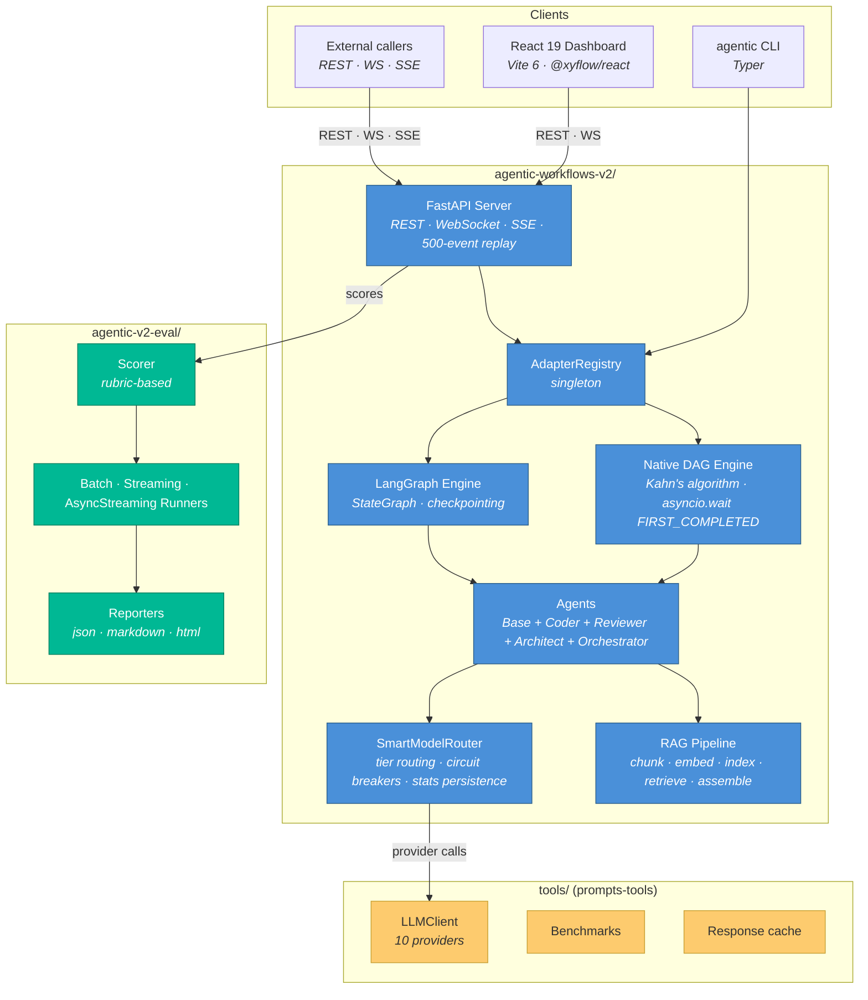

# Architecture

> **Audience:** Engineers orienting to the monorepo for design or review work.
> **Outcome:** After reading, you know which package owns which concern, how they communicate, and where to dive deeper.
> **Last verified:** 2026-04-22

This document is the umbrella. It does not re-derive system internals — it points at the existing per-package architecture docs and the ADRs that ratify each decision. If you are new to the repo, read this in full first; if you are in a specific area, jump to the per-package link.

---

## 1. System at a glance

The three Python packages have **zero cross-package imports**. They communicate via:

- `tools/` is published as a wheel (`prompts-tools`) — the runtime and eval packages consume it like any other library.
- The runtime exposes `agentic-v2-eval` through its REST API (`POST /runs/:id/evaluation`, `GET /runs/:id/evaluation`) — the eval framework does not import runtime internals.

---

## 2. Per-package deep dives

| Package | Entry point | Deep dive |
|---------|------------|-----------|
| Runtime | `agentic-workflows-v2/agentic_v2/` | [`architecture-runtime.md`](architecture-runtime.md) |
| UI | `agentic-workflows-v2/ui/src/` | [`architecture-ui.md`](architecture-ui.md) |
| Evaluation | `agentic-v2-eval/src/agentic_v2_eval/` | [`architecture-eval.md`](architecture-eval.md) |
| Shared tools | `tools/` | [`architecture-tools.md`](architecture-tools.md) |
| Cross-package integration | — | [`integration-architecture.md`](integration-architecture.md) |

Additional supporting documents:

- [`api-contracts-runtime.md`](api-contracts-runtime.md) — 16 REST endpoints + WebSocket + SSE schemas.
- [`data-models-runtime.md`](data-models-runtime.md) — 38+ Pydantic v2 models across server, contracts, core.
- [`component-inventory-ui.md`](component-inventory-ui.md) — 17 UI components across 6 categories.
- [`source-tree-analysis.md`](source-tree-analysis.md) — full annotated directory tree.
- [`development-guide.md`](development-guide.md) — dev environments, CLI, tests.
- [`deployment-guide.md`](deployment-guide.md) — CI/CD, environment variables, production checklist.

---

## 3. The five load-bearing mechanisms

These are the places where a change ripples across the system. Understand these before proposing architectural work.

### 3.1 Adapter registry

`AdapterRegistry` is a process-wide singleton in [`agentic_v2/adapters/registry.py`](../agentic-workflows-v2/agentic_v2/adapters/registry.py). Engines register with a name (`native`, `langchain`), the CLI resolves `--adapter <name>` at runtime, and tests reset the singleton via an autouse fixture to prevent cross-test leakage.

- **Why it exists:** [ADR-001](adr/ADR-001-002-003-architecture-decisions.md) — dual execution engine.
- **Current default:** `langchain` (configurable per run).
- **Direction of travel:** [ADR-013](adr/ADR-013-foundation-native-dag.md) — native DAG as the single long-term engine.

### 3.2 Typed execution-event wire format

`contracts/events.py` defines a Pydantic discriminated union covering `workflow_start`, `step_start`, `step_end`, `step_complete`, `step_error`, `workflow_end`, `evaluation_start`, `evaluation_complete`. WebSocket and SSE broadcasts validate before emit. TypeScript interfaces in `ui/src/api/types.ts` mirror this union by hand — drift is detected by convention, not yet by automation.

- **Ratifies:** [ADR-014](adr/ADR-014-pydantic-wire-format.md).
- **Related:** the 500-event replay buffer in `server/websocket.py` — clients reconnecting mid-run receive missed events.

### 3.3 SLO gates in git

Time-to-first-span p95 and nightly flake rate are stored as rolling windows in git — measurements are appended to JSON artifacts committed on each CI run, and the gate reads the window, not a fresh sample. This keeps the signal stable across single bad runs.

- **Ratifies:** [ADR-015](adr/ADR-015-slo-in-git-rolling-window.md).
- **Known limitation:** p95 gate passes trivially when the window is empty — see [`KNOWN_LIMITATIONS.md`](KNOWN_LIMITATIONS.md).

### 3.4 SmartModelRouter

Maps tier (`tier3_analyst`) → capability → best available model at runtime. Health-weighted selection, exponential cooldowns, circuit breakers, persisted stats across restarts, `Retry-After` header awareness.

- **Ratifies:** [ADR-002](adr/ADR-001-002-003-architecture-decisions.md).
- **Provider default for CI:** GitHub Models via `GITHUB_TOKEN` — see [ADR-016](adr/ADR-016-github-token-as-default-e2e-llm.md).

### 3.5 RAG pipeline

Thirteen modules in [`agentic_v2/rag/`](../agentic-workflows-v2/agentic_v2/rag/): loader → recursive chunker → embedder (content-hash dedup) → cosine vectorstore + BM25 keyword index → RRF hybrid retriever → token-budget assembler. Full OTEL tracing. Memory backed by `MemoryStoreProtocol` (`InMemoryStore` or `RAGMemoryStore`).

- **Blueprint:** [`adr/RAG-pipeline-blueprint.md`](adr/RAG-pipeline-blueprint.md).

---

## 4. The decision record

| ADR | Domain | Status |
|-----|--------|--------|
| [001](adr/ADR-001-002-003-architecture-decisions.md) | Dual execution engine | Accepted (superseded by 013) |
| [002](adr/ADR-001-002-003-architecture-decisions.md) | SmartModelRouter circuit breakers | Accepted |
| [003](adr/ADR-001-002-003-architecture-decisions.md) | Deep research supervisor | Superseded → 007 |
| [007](adr/ADR-007-classification-matrix-stop-policy.md) | Multidimensional classification + stop policy | Proposed |
| [008](adr/ADR-008-testing-approach-overhaul.md) | Test value taxonomy | Accepted |
| [009](adr/ADR-009-scoring-enhancements.md) | Scoring enhancements | Accepted |
| [010](adr/ADR-010-eval-harness-methodology.md) | Commit-driven A/B eval harness | Proposed |
| [011](adr/ADR-011-eval-harness-api-interface.md) | Eval harness API design | Proposed |
| [012](adr/ADR-012-ui-evaluation-hub.md) | UI evaluation hub | Proposed |
| [013](adr/ADR-013-foundation-native-dag.md) | Native DAG as single engine | Accepted |
| [014](adr/ADR-014-pydantic-wire-format.md) | Pydantic wire format for execution events | Accepted |
| [015](adr/ADR-015-slo-in-git-rolling-window.md) | SLO rolling window in git | Accepted |
| [016](adr/ADR-016-github-token-as-default-e2e-llm.md) | GitHub Models as default E2E provider | Accepted |

ADRs 004–006 are **intentionally unused** — the gap is documented in [`adr/ADR-INDEX.md`](adr/ADR-INDEX.md) and should not be reclaimed.

---

## 5. What this document is not

- Not a replacement for per-package docs — it is a map.
- Not a roadmap — see [`ROADMAP.md`](ROADMAP.md).
- Not a limitations list — see [`KNOWN_LIMITATIONS.md`](KNOWN_LIMITATIONS.md).
- Not a migration guide — see [`MIGRATIONS.md`](MIGRATIONS.md).
