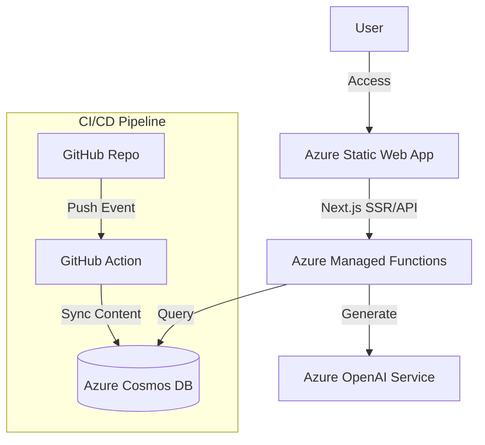

# 🏗️ Unified Architecture Plan: Evaluation, Testing & Webapp

**Version**: 2.1  
**Date**: December 4, 2025  
**Status**: Active - Phase 1 Complete  
**Research Sources**: Anthropic Courses, GitHub Docs, Enterprise Prompt Library Guide

> **📋 See Also**: [CONSOLIDATED_IMPROVEMENT_PLAN.md](CONSOLIDATED_IMPROVEMENT_PLAN.md) for remaining tasks across all improvement areas.

---

## Executive Summary

This document consolidates the repository's evaluation, testing, and webapp architecture into a single coherent plan. It replaces multiple outdated planning documents and establishes the canonical architecture going forward.

### Implementation Status

| Area | Status | Notes |
|------|--------|-------|
| **Repository Cleanup** | ✅ Complete | Tools and docs archived Dec 4, 2025 |
| **Evaluation Tooling** | ✅ Complete | `dual_eval.py` with 116 tests |
| **Testing Infrastructure** | ✅ Complete | `conftest.py`, validators added |
| **CI/CD Workflow** | ✅ Complete | `prompt-validation.yml` working |
| **Webapp** | 🔮 Not Started | Design complete, needs execution |

### Key Decisions

| Area | Current State | Target State | Rationale |
|------|---------------|--------------|-----------|
| **Evaluation** | ~~4+ overlapping tools~~ | ✅ Single `dual_eval.py` | Completed Dec 4, 2025 |
| **Testing** | ~~Complex framework~~ | ✅ Simplified pytest | 116 tests passing |
| **Webapp** | Azure SWA + Cosmos DB design | Keep design, implement Phase 1 | Solid architecture, needs execution |
| **Rubrics** | ~~2 different scoring systems~~ | ✅ Unified 8-dimension rubric | Implemented in dual_eval.py |

---

## Part 1: Repository Cleanup ✅ COMPLETE

### Files Archived (December 4, 2025)

Moved to `docs/archive/2025-12-04/`:

| File | Reason |
|------|--------|
| `docs/REFACTOR_TODO.md` | ✅ All phases marked complete |
| `docs/UNIFIED_REFACTOR_GUIDE_REACT.md` | ✅ Refactor complete |
| `docs/IMPROVEMENT_PLAN.md` | ✅ Marked "COMPLETED" |
| `docs/PHASED_EVALUATION_PLAN.md` | Superseded by dual_eval.py |
| `docs/TOT_EVALUATION_REPORT.md` | Historical snapshot (Dec 2, 2025) |
| `docs/EVALUATION_REPORT.md` | Regenerate with new tooling |

Moved to `tools/archive/`:

| Tool | Reason |
|------|--------|
| `evaluation_agent.py` | Superseded by dual_eval.py |
| `evaluate_library.py` | Different approach, not API-based |
| `improve_prompts.py` | Redundant with eval outputs |
| `generate_eval_files.py` | Logic merged into dual_eval.py |
| `run_gh_eval.py` | Superseded by dual_eval.py batch mode |

### Files Kept (Active)

| File | Purpose |
|------|---------|
| `docs/COMPREHENSIVE_PROMPT_DEVELOPMENT_GUIDE.md` | Core reference (8-dimension rubric) |
| `docs/CONSOLIDATED_IMPROVEMENT_PLAN.md` | **NEW** - Master task list |
| `docs/prompt-authorship-guide.md` | Active guidance |
| `docs/best-practices.md` | Active reference |
| `app.prompts.library/architecture.md` | Webapp architecture |
| `tools/rubrics/*` | Scoring definitions |

---

## Part 2: Evaluation Architecture ✅ COMPLETE
5. **Promptfoo Integration**: Industry-standard eval framework

### Unified Evaluation System

```
┌─────────────────────────────────────────────────────────────────┐
│                    EVALUATION ARCHITECTURE                       │
├─────────────────────────────────────────────────────────────────┤
│                                                                  │
│  ┌──────────────┐    ┌──────────────┐    ┌──────────────┐       │
│  │   PROMPTS    │───▶│  EVAL FILES  │───▶│  EXECUTION   │       │
│  │  (markdown)  │    │  (.yml)      │    │  (gh models) │       │
│  └──────────────┘    └──────────────┘    └──────────────┘       │
│         │                   │                   │                │
│         ▼                   ▼                   ▼                │
│  ┌──────────────────────────────────────────────────────┐       │
│  │              dual_eval.py (ORCHESTRATOR)              │       │
│  │  - Parses prompt frontmatter                          │       │
│  │  - Generates temp eval YAML                           │       │
│  │  - Runs multiple models in sequence                   │       │
│  │  - Cross-validates results                            │       │
│  │  - Real-time markdown logging                         │       │
│  └──────────────────────────────────────────────────────┘       │
│                            │                                     │
│         ┌─────────────────┴─────────────────┐                   │
│         ▼                                   ▼                   │
│  ┌──────────────┐                   ┌──────────────┐            │
│  │   REPORTS    │                   │   METRICS    │            │
│  │  (markdown)  │                   │  (JSON)      │            │
│  └──────────────┘                   └──────────────┘            │
│                                                                  │
└─────────────────────────────────────────────────────────────────┘
```

### Scoring Rubric (8 Dimensions)

From `COMPREHENSIVE_PROMPT_DEVELOPMENT_GUIDE.md`:

| Dimension | Weight | Description | Pass Threshold |
|-----------|--------|-------------|----------------|
| **Clarity** | 12.5% | Unambiguous, easy to understand | ≥7.0 |
| **Specificity** | 12.5% | Concrete, actionable instructions | ≥7.0 |
| **Actionability** | 12.5% | Clear steps to achieve goal | ≥7.0 |
| **Structure** | 12.5% | Logical organization, formatting | ≥7.0 |
| **Completeness** | 12.5% | All necessary information present | ≥7.0 |
| **Factuality** | 12.5% | Accurate, verifiable claims | ≥7.0 |
| **Consistency** | 12.5% | No contradictions, uniform style | ≥7.0 |
| **Safety** | 12.5% | No harmful content, PII safe | ≥7.0 |

**Pass Criteria**:
- Overall score ≥ 7.0/10
- No individual dimension < 5.0/10
- Cross-validation variance ≤ 1.5 between models

### CLI Interface

```bash
# Evaluate single prompt
python testing/evals/dual_eval.py prompts/developers/code-review.md

# Evaluate folder with custom models
python testing/evals/dual_eval.py prompts/advanced/ \
  --models "openai/gpt-4.1,meta/llama-3.3-70b-instruct" \
  --runs 3

# Real-time logging to markdown
python testing/evals/dual_eval.py prompts/ \
  --log-file docs/EVALUATION_LOG.md

# JSON output for CI/CD
python testing/evals/dual_eval.py prompts/ \
  --output results.json
```

### Future: Promptfoo Integration

For advanced evals (model-graded, classification), integrate promptfoo:

```yaml
# promptfooconfig.yaml
description: "Prompt Library Evaluation"

prompts:
  - file://prompts/developers/code-review.md

providers:
  - anthropic:messages:claude-sonnet-4-20250514
  - openai:gpt-4.1

defaultTest:
  assert:
    - type: llm-rubric
      provider: anthropic:messages:claude-sonnet-4-20250514
      value: |
        Evaluate this prompt on 8 dimensions (1-10 each):
        1. Clarity: Is the prompt unambiguous?
        2. Specificity: Are instructions concrete?
        3. Actionability: Can the user follow clear steps?
        4. Structure: Is it logically organized?
        5. Completeness: Is all information present?
        6. Factuality: Are claims accurate?
        7. Consistency: Is style uniform?
        8. Safety: Is it PII-safe and harmless?
        
        Return JSON: {"scores": {...}, "overall": X.X, "pass": true/false}
```

---

## Part 3: Testing Architecture

### Simplified Test Framework

Replace the complex `testing/framework/` with focused pytest tests:

```
testing/
├── evals/
│   ├── dual_eval.py          # Main evaluation script
│   ├── test_dual_eval.py     # 40 unit tests (existing)
│   └── results/              # Eval output storage
├── validators/
│   ├── test_frontmatter.py   # Frontmatter validation tests
│   └── test_schema.py        # Schema compliance tests
├── conftest.py               # Shared fixtures
├── requirements.txt          # Test dependencies
└── README.md                 # Updated documentation
```

### Test Categories

| Category | Purpose | Example |
|----------|---------|---------|
| **Unit** | Test individual functions | `test_parse_prompt_file()` |
| **Integration** | Test tool workflows | `test_full_eval_pipeline()` |
| **Validation** | Test prompt schema | `test_frontmatter_required_fields()` |
| **Eval** | Model-graded quality | `test_prompt_passes_rubric()` |

### CI/CD Integration

```yaml
# .github/workflows/prompt-validation.yml
name: Prompt Validation

on:
  push:
    paths: ['prompts/**', 'testing/**']
  pull_request:
    paths: ['prompts/**']

jobs:
  validate:
    runs-on: ubuntu-latest
    steps:
      - uses: actions/checkout@v4
      
      - name: Setup Python
        uses: actions/setup-python@v5
        with:
          python-version: '3.13'
      
      - name: Install dependencies
        run: pip install -r testing/requirements.txt
      
      - name: Run unit tests
        run: pytest testing/ -v
      
      - name: Validate frontmatter
        run: python tools/validators/frontmatter_validator.py --all
      
      - name: Run evaluations (PR only)
        if: github.event_name == 'pull_request'
        env:
          GH_TOKEN: ${{ secrets.GITHUB_TOKEN }}
        run: |
          python testing/evals/dual_eval.py \
            --changed-only \
            --output eval-results.json
```

---

## Part 4: Webapp Architecture

### Design (from `app.prompts.library/architecture.md`)

The webapp exposes the prompt library as a user-friendly web application.



### Components

| Component | Technology | Purpose |
|-----------|------------|---------|
| **Frontend** | Next.js (App Router) | Static site with dynamic features |
| **Hosting** | Azure Static Web Apps | Global CDN, Easy Auth |
| **Database** | Cosmos DB for MongoDB | Prompt storage, search |
| **AI** | Azure OpenAI | Prompt refinement, chat |
| **CI/CD** | GitHub Actions | Auto-deploy on push |

### Implementation Phases

#### Phase 1: Foundation (Week 1-2)
- [ ] Create Azure resource group
- [ ] Provision Cosmos DB (serverless)
- [ ] Setup Azure Static Web App
- [ ] Create Git→Cosmos sync script

#### Phase 2: Core App (Week 3-4)
- [ ] Build Next.js gallery view
- [ ] Implement prompt detail page
- [ ] Add variable form generation
- [ ] Deploy to Azure SWA

#### Phase 3: AI Features (Week 5-6)
- [ ] Integrate Azure OpenAI
- [ ] Add "Ask the Architect" chat
- [ ] Implement prompt refinement suggestions

### Data Model

```typescript
interface PromptDocument {
  _id: string;
  slug: string;
  
  // Frontmatter fields
  title: string;
  shortTitle: string;
  intro: string;
  type: 'how_to' | 'template' | 'reference';
  difficulty: 'beginner' | 'intermediate' | 'advanced';
  audience: string[];
  platforms: string[];
  topics: string[];
  
  // Content
  rawContent: string;      // Full markdown
  templateCode: string;    // Extracted prompt
  variables: Variable[];   // Auto-extracted
  
  // Metadata
  author: string;
  version: string;
  lastSynced: Date;
  filePath: string;
  
  // Evaluation
  evalScore?: number;
  evalDate?: Date;
  evalPassed?: boolean;
}
```

---

## Part 5: File Structure (Target State)

```
prompts/                          # Repository root
├── prompts/                      # Prompt content (unchanged)
│   ├── advanced/
│   ├── analysis/
│   ├── business/
│   ├── creative/
│   ├── developers/
│   ├── governance/
│   ├── m365/
│   └── system/
├── agents/                       # Custom agents (unchanged)
├── instructions/                 # Instruction files (unchanged)
├── templates/                    # Prompt templates (unchanged)
│
├── testing/                      # Simplified testing
│   ├── evals/
│   │   ├── dual_eval.py         # Primary eval tool
│   │   ├── test_dual_eval.py    # Unit tests
│   │   └── results/             # Eval outputs
│   ├── validators/
│   │   └── test_*.py            # Validation tests
│   ├── conftest.py
│   ├── requirements.txt
│   └── README.md
│
├── tools/                        # Consolidated tools
│   ├── audit_prompts.py         # CSV migration audit
│   ├── validators/
│   │   ├── frontmatter_validator.py
│   │   └── metadata_schema.yaml
│   ├── rubrics/
│   │   ├── prompt-scoring.yaml
│   │   └── quality_standards.json
│   ├── archive/                  # Deprecated tools
│   │   ├── evaluation_agent.py
│   │   ├── evaluate_library.py
│   │   └── improve_prompts.py
│   └── README.md
│
├── app.prompts.library/          # Webapp (future)
│   ├── architecture.md
│   ├── mockups/
│   └── src/                      # Next.js app (TBD)
│
├── docs/                         # Documentation
│   ├── ARCHITECTURE_PLAN.md     # This document
│   ├── COMPREHENSIVE_PROMPT_DEVELOPMENT_GUIDE.md
│   ├── best-practices.md
│   ├── prompt-authorship-guide.md
│   └── archive/                  # Historical docs
│
└── .github/
    └── workflows/
        └── prompt-validation.yml # CI/CD
```

---

## Part 6: Implementation Roadmap

### Week 1: Cleanup
- [ ] Archive stale documents
- [ ] Move deprecated tools to `tools/archive/`
- [ ] Update `tools/README.md`
- [ ] Update `testing/README.md`

### Week 2: Testing Consolidation
- [ ] Simplify `testing/` structure
- [ ] Ensure all 40 dual_eval tests pass
- [ ] Add frontmatter validation tests
- [ ] Create CI workflow

### Week 3-4: Evaluation Pipeline
- [ ] Run full library evaluation with dual_eval.py
- [ ] Generate new `EVALUATION_REPORT.md`
- [ ] Identify prompts needing improvement
- [ ] Optionally integrate promptfoo for advanced evals

### Week 5-6: Webapp Foundation
- [ ] Create Azure resources
- [ ] Build Git→Cosmos sync
- [ ] Scaffold Next.js app
- [ ] Deploy to Azure SWA

---

## Appendix A: Research Sources

### Anthropic Courses (prompt_evaluations)
- **Key Insight**: 100+ test cases, model-graded evals, promptfoo integration
- **Applied**: 8-dimension rubric, LLM-as-judge pattern

### GitHub Docs Repository
- **Key Insight**: Learning tracks, content types, index.md navigation
- **Applied**: Frontmatter schema, folder structure

### Enterprise Prompt Library Guide
- **Key Insight**: Role-based organization, MCP integration, scoring rubrics
- **Applied**: Role folders (developers, architects), scorecard format

### Modern Prompt Patterns
- **Key Insight**: Context engineering, few-shot prompting, XML delimiters
- **Applied**: Prompt authorship guidance

---

## Appendix B: Migration Checklist

```markdown
## Pre-Migration
- [ ] Backup current docs/archive/
- [ ] Create dated archive folder (e.g., archive/2025-12-04/)
- [ ] Run final eval with old tools for comparison

## Migration
- [ ] Move stale docs to archive/
- [ ] Move deprecated tools to tools/archive/
- [ ] Update README files
- [ ] Run pytest to verify no breakage
- [ ] Commit with descriptive message

## Post-Migration
- [ ] Run dual_eval.py on full library
- [ ] Generate fresh EVALUATION_REPORT.md
- [ ] Verify CI workflow passes
- [ ] Update ARCHITECTURE_PLAN.md status
```

---

**Document Owner**: Prompts Library Team  
**Last Updated**: December 4, 2025  
**Next Review**: January 2026
