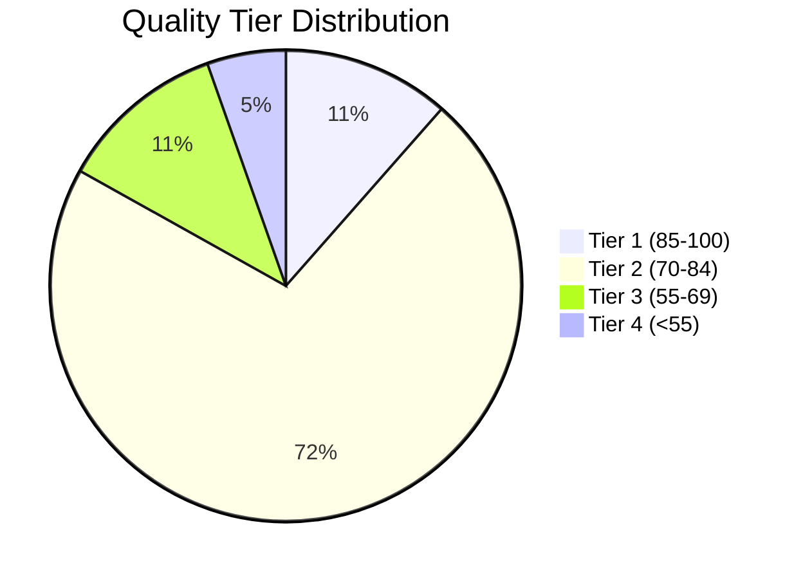
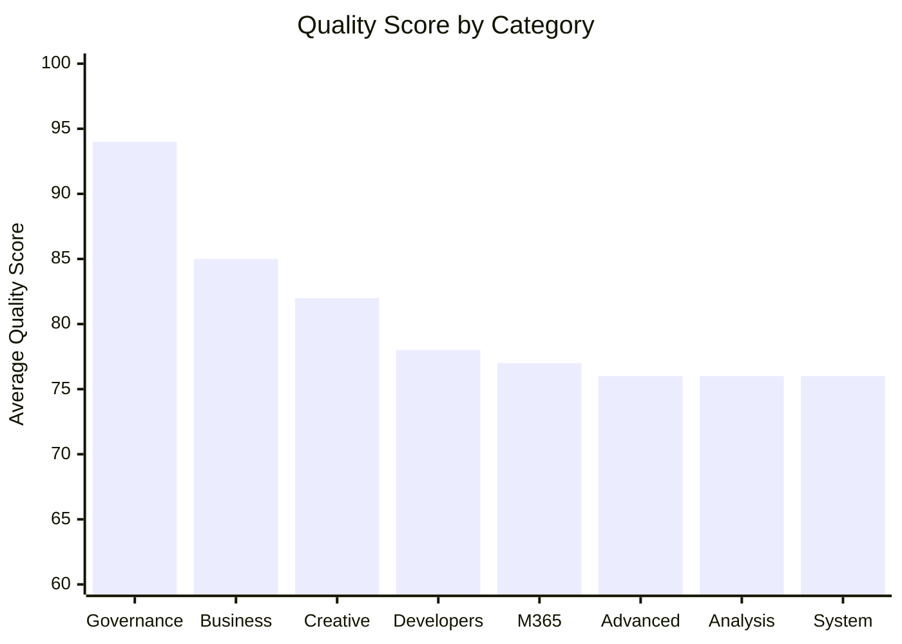

# 📊 Prompt Library Evaluation Report

<div align="center">


**Enterprise AI Prompt Library Assessment**

*Generated: December 2025 | Methodology: Dual-Rubric Scoring with ToT Reflection*

</div>

---

## 📈 Executive Dashboard

<table>
<tr>
<td width="33%" align="center">

### 🎯 Overall Score
# 71/100
**Grade B-**

*Good with reservations*

</td>
<td width="33%" align="center">

### 📚 Total Prompts
# 148
**Production Ready: 113**

*76.4% deployment-ready*

</td>
<td width="33%" align="center">

### ⭐ Avg Effectiveness
# 4.02/5.0
**★★★★☆**

*Good output quality*

</td>
</tr>
</table>

---

## 🏆 Grade Distribution

```
Grade A (90-100) ████████████████████░░░░░░░░░░░░░░░░░░░░   0 prompts (0.0%)
Grade B (75-89)  ████████████████████████████████████████ 113 prompts (76.4%)
Grade C (60-74)  ████████████░░░░░░░░░░░░░░░░░░░░░░░░░░░░  27 prompts (18.2%)
Grade D (40-59)  ████░░░░░░░░░░░░░░░░░░░░░░░░░░░░░░░░░░░░   8 prompts (5.4%)
Grade F (<40)    ░░░░░░░░░░░░░░░░░░░░░░░░░░░░░░░░░░░░░░░░   0 prompts (0.0%)
```

| Grade | Description | Count | Percentage | Status |
|:-----:|-------------|------:|:----------:|:------:|
| 🏅 **A** | Exceptional | 0 | 0.0% | — |
| ✅ **B** | Production Ready | 113 | 76.4% | 🟢 |
| ⚠️ **C** | Usable | 27 | 18.2% | 🟡 |
| 🔧 **D** | Needs Work | 8 | 5.4% | 🟠 |
| ❌ **F** | Critical | 0 | 0.0% | — |

---

## 📊 Quality Tier Breakdown



| Tier | Range | Count | % | Assessment |
|:----:|:-----:|------:|:-:|------------|
| 🥇 **Tier 1** | 85-100 | 17 | 11.5% | Exceptional quality, best-in-class |
| 🥈 **Tier 2** | 70-84 | 106 | 71.6% | Solid quality, production ready |
| 🥉 **Tier 3** | 55-69 | 17 | 11.5% | Acceptable, minor improvements needed |
| ⚙️ **Tier 4** | <55 | 8 | 5.4% | Below standard, requires rework |

---

## 🎨 Category Performance



### Category Leaderboard

| Rank | Category | Prompts | Avg Quality | Avg Effectiveness | Top Performer |
|:----:|----------|--------:|:-----------:|:-----------------:|---------------|
| 🥇 | **Governance** | 2 | 94/100 | 4.0 ⭐⭐⭐⭐ | Security Incident Response |
| 🥈 | **Business** | 36 | 85/100 | 4.1 ⭐⭐⭐⭐ | Business Strategy Analysis |
| 🥉 | **Creative** | 8 | 82/100 | 4.1 ⭐⭐⭐⭐ | Brand Voice Developer |
| 4 | **Developers** | 24 | 78/100 | 4.0 ⭐⭐⭐⭐ | Cloud Migration Specialist |
| 5 | **M365** | 20 | 77/100 | 4.0 ⭐⭐⭐⭐ | Personal Task Collector |
| 6 | **Advanced** | 16 | 76/100 | 3.9 ⭐⭐⭐ | ReAct Tool-Augmented |
| 7 | **Analysis** | 20 | 76/100 | 4.0 ⭐⭐⭐⭐ | Data Analysis Insights |
| 8 | **System** | 22 | 76/100 | 4.0 ⭐⭐⭐⭐ | Security Architecture |

---

## 🔬 Scoring Methodology

### Dual-Rubric System

This evaluation uses **two complementary scoring systems** to provide a comprehensive assessment:

<table>
<tr>
<td width="50%">

#### 📋 Quality Standards (0-100)

| Criterion | Weight | Focus |
|-----------|:------:|-------|
| Completeness | 25% | All sections present |
| Example Quality | 30% | Realistic examples |
| Specificity | 20% | Domain-specific |
| Format | 15% | Valid YAML/MD |
| Enterprise | 10% | Professional |

</td>
<td width="50%">

#### ⭐ Effectiveness Score (1.0-5.0)

| Dimension | Weight | Focus |
|-----------|:------:|-------|
| Clarity | 25% | Unambiguous |
| Effectiveness | 30% | Output quality |
| Reusability | 20% | Cross-context |
| Simplicity | 15% | Minimal friction |
| Examples | 10% | Helpful demos |

</td>
</tr>
</table>

### Combined Grade Calculation

```
Combined Score = (Quality × 0.6) + (Effectiveness × 20 × 0.4)

Grade Thresholds:
  A  = 90-100  (Exceptional)
  B  = 75-89   (Production Ready)
  C  = 60-74   (Acceptable)
  D  = 40-59   (Needs Improvement)
  F  = <40     (Critical)
```

---

## 🚨 Priority Actions

### 🔴 High Priority — Grade D Prompts (8)

These prompts need significant improvement before production use:

| # | Prompt | Quality | Effectiveness | Primary Issue |
|:-:|--------|:-------:|:-------------:|---------------|
| 1 | ReAct: Large-Scale Library Analysis | 21 | 3.4 | Missing Prompt section |
| 2 | Example Research Output | 22 | 3.4 | Missing Prompt section |
| 3 | ReAct: Prompt Library Analysis | 33 | 3.1 | Missing Prompt section |
| 4 | Library Capability Radar | 39 | 3.8 | Missing Variables |
| 5 | Chain-of-Thought: Decision Guide | 40 | 3.3 | Missing Prompt section |
| 6 | Library Structure Treemap | 41 | 3.9 | Missing Variables |
| 7 | Library Network Graph | 44 | 3.8 | Missing Variables |
| 8 | ReAct: Knowledge Base Research | 57 | 4.0 | Expand examples |

### 🟡 Common Issues Across Library

| Issue | Count | Priority | Impact |
|-------|------:|:--------:|:------:|
| Variables lack example values | 34 | P1 | -3 pts |
| Example too short (<20 lines) | 44 | P1 | -5 pts |
| Missing Tips section | 10 | P2 | -2 pts |
| Missing Variables section | 7 | P1 | -3 pts |
| Missing Prompt section | 4 | P0 | -5 pts |
| No example section | 3 | P0 | -10 pts |

---

## 🏅 Top Performers

### 🌟 Tier 1 Excellence (Quality 85+)

<details>
<summary><b>View all 17 Tier 1 prompts</b></summary>

| Prompt | Category | Quality | Effectiveness |
|--------|----------|:-------:|:-------------:|
| ReAct: Tool-Augmented Reasoning | Advanced | 100 | 4.2 ⭐⭐⭐⭐ |
| Chain-of-Thought: Detailed Mode | Advanced | 97 | 4.2 ⭐⭐⭐⭐ |
| ReAct: Document Search & Synthesis | Advanced | 97 | 4.2 ⭐⭐⭐⭐ |
| Tree-of-Thoughts: Multi-Branch | Advanced | 97 | 4.1 ⭐⭐⭐⭐ |
| RAG: Document Retrieval | Advanced | 95 | 4.2 ⭐⭐⭐⭐ |
| Reflection: Self-Critique | Advanced | 95 | 3.8 ⭐⭐⭐ |
| Security: Incident Response | Governance | 94 | 4.1 ⭐⭐⭐⭐ |
| Business Strategy Analysis | Business | 94 | 4.0 ⭐⭐⭐⭐ |
| Legal: Contract Review | Governance | 93 | 4.0 ⭐⭐⭐⭐ |
| Cloud Migration Specialist | Developers | 92 | 4.1 ⭐⭐⭐⭐ |
| Agile Sprint Planner | Business | 92 | 4.1 ⭐⭐⭐⭐ |
| Board Update Generator | Business | 92 | 4.0 ⭐⭐⭐⭐ |
| Risk Management Analyst | Business | 92 | 4.1 ⭐⭐⭐⭐ |
| Data Analysis Insights | Analysis | 90 | 4.0 ⭐⭐⭐⭐ |
| Change Management Coordinator | Business | 90 | 4.1 ⭐⭐⭐⭐ |
| Interview Questions Generator | Business | 90 | 4.1 ⭐⭐⭐⭐ |
| Pitch Deck Generator | Business | 90 | 4.2 ⭐⭐⭐⭐ |

</details>

---

## 📁 Detailed Category Reports

### 🧠 Advanced Techniques (16 prompts)

**Average: Q:76 | E:3.9** | Chain-of-Thought, ReAct, RAG, Tree-of-Thoughts patterns

| Status | Prompt | Quality | Effectiveness |
|:------:|--------|:-------:|:-------------:|
| ✅ | ReAct: Tool-Augmented Reasoning | 100 | 4.2 ⭐⭐⭐⭐ |
| ✅ | Chain-of-Thought: Detailed Mode | 97 | 4.2 ⭐⭐⭐⭐ |
| ✅ | ReAct: Document Search & Synthesis | 97 | 4.2 ⭐⭐⭐⭐ |
| ✅ | Tree-of-Thoughts: Multi-Branch | 97 | 4.1 ⭐⭐⭐⭐ |
| ✅ | RAG: Document Retrieval | 95 | 4.2 ⭐⭐⭐⭐ |
| ⚠️ | Reflection: Self-Critique | 95 | 3.8 ⭐⭐⭐ |
| ✅ | Chain-of-Thought: Concise Mode | 87 | 4.2 ⭐⭐⭐⭐ |
| ✅ | Tree-of-Thoughts: Architecture | 85 | 4.2 ⭐⭐⭐⭐ |
| ⚠️ | Chain-of-Thought: Debugging | 82 | 3.9 ⭐⭐⭐ |
| ✅ | Chain-of-Thought: Performance | 80 | 4.0 ⭐⭐⭐⭐ |
| ✅ | ReAct: Library Analysis | 78 | 4.3 ⭐⭐⭐⭐ |
| ⚠️ | ToT Evaluator: Reflection | 65 | 3.9 ⭐⭐⭐ |
| 🔧 | ReAct: Knowledge Base | 57 | 4.0 ⭐⭐⭐⭐ |
| 🔧 | Chain-of-Thought: Decision Guide | 40 | 3.3 ⭐⭐⭐ |
| 🔧 | ReAct: Prompt Library Analysis | 33 | 3.1 ⭐⭐⭐ |
| 🔧 | ReAct: Large-Scale Analysis | 21 | 3.4 ⭐⭐⭐ |

---

### 📊 Analysis (20 prompts)

**Average: Q:76 | E:4.0** | Data analysis, market research, business intelligence

| Status | Prompt | Quality | Effectiveness |
|:------:|--------|:-------:|:-------------:|
| ✅ | Data Analysis Insights | 90 | 4.0 ⭐⭐⭐⭐ |
| ✅ | Business Case Developer | 84 | 4.2 ⭐⭐⭐⭐ |
| ✅ | Consumer Behavior Researcher | 84 | 4.0 ⭐⭐⭐⭐ |
| ✅ | Data Analysis Specialist | 84 | 4.0 ⭐⭐⭐⭐ |
| ✅ | Gap Analysis Expert | 84 | 4.0 ⭐⭐⭐⭐ |
| ✅ | Market Research Analyst | 84 | 4.1 ⭐⭐⭐⭐ |
| ✅ | Process Optimization | 84 | 4.0 ⭐⭐⭐⭐ |
| ✅ | Requirements Analysis | 84 | 4.1 ⭐⭐⭐⭐ |
| ✅ | User Experience Analyst | 84 | 4.0 ⭐⭐⭐⭐ |
| ✅ | Competitive Analysis | 81 | 4.0 ⭐⭐⭐⭐ |
| ✅ | Data Quality Assessment | 80 | 4.1 ⭐⭐⭐⭐ |
| ✅ | Industry Analysis Expert | 79 | 4.0 ⭐⭐⭐⭐ |
| ✅ | Metrics and KPI Designer | 79 | 4.0 ⭐⭐⭐⭐ |
| ✅ | Stakeholder Requirements | 79 | 4.1 ⭐⭐⭐⭐ |
| ✅ | Trend Analysis Specialist | 79 | 4.1 ⭐⭐⭐⭐ |
| ✅ | Workflow Designer | 79 | 4.0 ⭐⭐⭐⭐ |
| ✅ | Competitive Intelligence | 77 | 4.2 ⭐⭐⭐⭐ |
| 🔧 | Library Network Graph | 44 | 3.8 ⭐⭐⭐ |
| 🔧 | Library Structure Treemap | 41 | 3.9 ⭐⭐⭐ |
| 🔧 | Library Capability Radar | 39 | 3.8 ⭐⭐⭐ |

---

### 💼 Business (36 prompts)

**Average: Q:85 | E:4.1** | Strategy, planning, communication, management

<details>
<summary><b>View all 36 Business prompts</b></summary>

| Status | Prompt | Quality | Effectiveness |
|:------:|--------|:-------:|:-------------:|
| ✅ | Business Strategy Analysis | 94 | 4.0 ⭐⭐⭐⭐ |
| ✅ | Agile Sprint Planner | 92 | 4.1 ⭐⭐⭐⭐ |
| ✅ | Board Update Generator | 92 | 4.0 ⭐⭐⭐⭐ |
| ✅ | Risk Management Analyst | 92 | 4.1 ⭐⭐⭐⭐ |
| ✅ | Change Management | 90 | 4.1 ⭐⭐⭐⭐ |
| ✅ | Interview Questions | 90 | 4.1 ⭐⭐⭐⭐ |
| ✅ | Pitch Deck Generator | 90 | 4.2 ⭐⭐⭐⭐ |
| ✅ | Performance Review Writer | 89 | 4.2 ⭐⭐⭐⭐ |
| ✅ | Budget Controller | 88 | 4.0 ⭐⭐⭐⭐ |
| ✅ | Cold Email Generator | 88 | 4.2 ⭐⭐⭐⭐ |
| ✅ | Digital Transformation | 88 | 4.2 ⭐⭐⭐⭐ |
| ✅ | Job Description Writer | 88 | 4.1 ⭐⭐⭐⭐ |
| ✅ | Competitive Analysis | 87 | 4.0 ⭐⭐⭐⭐ |
| ✅ | Meeting Summary | 87 | 4.2 ⭐⭐⭐⭐ |
| ✅ | Sales Objection Handler | 87 | 4.2 ⭐⭐⭐⭐ |
| ✅ | Vendor Management | 86 | 4.0 ⭐⭐⭐⭐ |
| ✅ | Follow-Up Email | 85 | 4.0 ⭐⭐⭐⭐ |
| ✅ | Business Process Reengineering | 84 | 4.0 ⭐⭐⭐⭐ |
| ✅ | Client Presentation | 84 | 4.1 ⭐⭐⭐⭐ |
| ✅ | Due Diligence Analyst | 84 | 4.2 ⭐⭐⭐⭐ |
| ✅ | Innovation Strategy | 84 | 4.0 ⭐⭐⭐⭐ |
| ✅ | Management Consulting | 84 | 4.1 ⭐⭐⭐⭐ |
| ✅ | Market Entry Strategist | 84 | 4.2 ⭐⭐⭐⭐ |
| ✅ | Performance Improvement | 84 | 4.0 ⭐⭐⭐⭐ |
| ✅ | Project Closure | 84 | 4.1 ⭐⭐⭐⭐ |
| ✅ | Stakeholder Communication | 84 | 4.1 ⭐⭐⭐⭐ |
| ✅ | Strategic Planning | 84 | 4.1 ⭐⭐⭐⭐ |
| ✅ | Team Performance Manager | 84 | 4.0 ⭐⭐⭐⭐ |
| ✅ | Onboarding Checklist | 82 | 4.1 ⭐⭐⭐⭐ |
| ✅ | Crisis Management | 81 | 4.1 ⭐⭐⭐⭐ |
| ✅ | Organizational Change | 81 | 4.1 ⭐⭐⭐⭐ |
| ✅ | Project Documentation | 81 | 4.2 ⭐⭐⭐⭐ |
| ✅ | Quality Assurance Planner | 81 | 4.1 ⭐⭐⭐⭐ |
| ✅ | Resource Allocation | 79 | 4.0 ⭐⭐⭐⭐ |
| ✅ | Timeline Tracker | 79 | 4.0 ⭐⭐⭐⭐ |
| ✅ | Meeting Facilitator | 76 | 4.0 ⭐⭐⭐⭐ |

</details>

---

### 🎨 Creative (8 prompts)

**Average: Q:82 | E:4.1** | Content creation, marketing, copywriting

| Status | Prompt | Quality | Effectiveness |
|:------:|--------|:-------:|:-------------:|
| ✅ | Brand Voice Developer | 85 | 4.2 ⭐⭐⭐⭐ |
| ✅ | Video Script Writer | 84 | 4.2 ⭐⭐⭐⭐ |
| ✅ | Ad Copy Generator | 82 | 4.1 ⭐⭐⭐⭐ |
| ✅ | Product Description | 82 | 4.1 ⭐⭐⭐⭐ |
| ⚠️ | Content Marketing Blog | 81 | 3.9 ⭐⭐⭐ |
| ✅ | Email Newsletter | 81 | 4.1 ⭐⭐⭐⭐ |
| ✅ | Social Media Content | 80 | 4.1 ⭐⭐⭐⭐ |
| ✅ | Headline Creator | 77 | 4.0 ⭐⭐⭐⭐ |

---

### 💻 Developers (24 prompts)

**Average: Q:78 | E:4.0** | Code generation, review, architecture, DevOps

| Status | Prompt | Quality | Effectiveness |
|:------:|--------|:-------:|:-------------:|
| ✅ | Cloud Migration Specialist | 92 | 4.1 ⭐⭐⭐⭐ |
| ✅ | Refactoring Plan Designer | 89 | 4.0 ⭐⭐⭐⭐ |
| ✅ | Code Review Assistant | 87 | 4.0 ⭐⭐⭐⭐ |
| ✅ | Data Pipeline Engineer | 87 | 4.0 ⭐⭐⭐⭐ |
| ✅ | DevOps Pipeline Architect | 87 | 4.2 ⭐⭐⭐⭐ |
| ✅ | C# Refactoring Assistant | 86 | 4.3 ⭐⭐⭐⭐ |
| ✅ | Documentation Generator | 83 | 4.2 ⭐⭐⭐⭐ |
| ✅ | Legacy Modernization | 83 | 4.1 ⭐⭐⭐⭐ |
| ✅ | Microservices Architect | 83 | 4.2 ⭐⭐⭐⭐ |
| ✅ | Performance Optimization | 83 | 4.0 ⭐⭐⭐⭐ |
| ✅ | Code Generation Assistant | 82 | 4.1 ⭐⭐⭐⭐ |
| ✅ | C# Enterprise Standards | 81 | 4.1 ⭐⭐⭐⭐ |
| ✅ | Database Schema Designer | 81 | 4.0 ⭐⭐⭐⭐ |
| ✅ | .NET API Designer | 79 | 4.0 ⭐⭐⭐⭐ |
| ✅ | Mobile App Developer | 79 | 4.1 ⭐⭐⭐⭐ |
| ✅ | SQL Query Analyzer | 78 | 4.1 ⭐⭐⭐⭐ |
| ✅ | Frontend Architecture | 77 | 4.2 ⭐⭐⭐⭐ |
| ✅ | Mid-Level Architecture Coach | 76 | 4.0 ⭐⭐⭐⭐ |
| ⚠️ | Test Automation Engineer | 68 | 3.8 ⭐⭐⭐ |
| ⚠️ | Code Review Expert (Structured) | 65 | 3.7 ⭐⭐⭐ |
| ⚠️ | Code Review Expert | 65 | 3.5 ⭐⭐⭐ |
| ⚠️ | SQL Security Standards | 63 | 3.9 ⭐⭐⭐ |
| ⚠️ | API Design Consultant | 61 | 3.9 ⭐⭐⭐ |
| ⚠️ | Security Code Auditor | 60 | 3.8 ⭐⭐⭐ |

---

### 🏛️ Governance (2 prompts)

**Average: Q:94 | E:4.0** | Legal, security, compliance

| Status | Prompt | Quality | Effectiveness |
|:------:|--------|:-------:|:-------------:|
| ✅ | Security: Incident Response | 94 | 4.1 ⭐⭐⭐⭐ |
| ✅ | Legal: Contract Review | 93 | 4.0 ⭐⭐⭐⭐ |

> ⚠️ **Gap Identified**: Only 2 prompts in Governance category. Target: 10+ prompts covering GDPR, SOC2, PII detection, audit trails.

---

### 📧 M365 Copilot (20 prompts)

**Average: Q:77 | E:4.0** | Microsoft 365 productivity prompts

| Status | Prompt | Quality | Effectiveness |
|:------:|--------|:-------:|:-------------:|
| ✅ | Personal Task Collector | 86 | 4.1 ⭐⭐⭐⭐ |
| ✅ | Daily Standup Assistant | 85 | 4.2 ⭐⭐⭐⭐ |
| ✅ | Email Triage Helper | 83 | 4.1 ⭐⭐⭐⭐ |
| ✅ | Presentation Outline | 83 | 4.1 ⭐⭐⭐⭐ |
| ✅ | Project Status Reporter | 83 | 4.2 ⭐⭐⭐⭐ |
| ✅ | Document Summarizer | 81 | 4.1 ⭐⭐⭐⭐ |
| ✅ | Meeting Prep Brief | 81 | 4.2 ⭐⭐⭐⭐ |
| ✅ | Meeting Recap Assistant | 81 | 4.2 ⭐⭐⭐⭐ |
| ✅ | Weekly Review Coach | 81 | 4.2 ⭐⭐⭐⭐ |
| ✅ | Data Insights Assistant | 80 | 4.1 ⭐⭐⭐⭐ |
| ⚠️ | Slide Content Refiner | 77 | 3.8 ⭐⭐⭐ |
| ⚠️ | Sway Document to Story | 76 | 3.8 ⭐⭐⭐ |
| ⚠️ | Manager Sync Planner | 75 | 3.9 ⭐⭐⭐ |
| ⚠️ | Designer Image Prompt | 72 | 3.8 ⭐⭐⭐ |
| ⚠️ | Designer Infographic | 72 | 3.8 ⭐⭐⭐ |
| ⚠️ | Designer Social Media Kit | 70 | 3.8 ⭐⭐⭐ |
| ⚠️ | Excel Formula Expert | 70 | 3.9 ⭐⭐⭐ |
| ⚠️ | Handover Document | 70 | 3.9 ⭐⭐⭐ |
| ⚠️ | Sway Visual Newsletter | 67 | 3.9 ⭐⭐⭐ |
| ⚠️ | Customer Feedback Analyzer | 66 | 3.8 ⭐⭐⭐ |

---

### ⚙️ System (22 prompts)

**Average: Q:76 | E:4.0** | Architecture, system design, AI agents

| Status | Prompt | Quality | Effectiveness |
|:------:|--------|:-------:|:-------------:|
| ✅ | Security Architecture | 88 | 4.0 ⭐⭐⭐⭐ |
| ✅ | Data Architecture Designer | 84 | 4.0 ⭐⭐⭐⭐ |
| ✅ | DevOps Architecture | 84 | 4.1 ⭐⭐⭐⭐ |
| ✅ | Disaster Recovery | 84 | 4.0 ⭐⭐⭐⭐ |
| ⚠️ | Legacy Modernization | 84 | 3.9 ⭐⭐⭐ |
| ⚠️ | Performance Architecture | 84 | 3.9 ⭐⭐⭐ |
| ✅ | Solution Architecture | 84 | 4.0 ⭐⭐⭐⭐ |
| ✅ | Cloud Architecture | 81 | 4.0 ⭐⭐⭐⭐ |
| ✅ | Compliance Architecture | 81 | 4.0 ⭐⭐⭐⭐ |
| ✅ | AI Assistant System Prompt | 79 | 4.0 ⭐⭐⭐⭐ |
| ✅ | API Architecture Designer | 79 | 4.0 ⭐⭐⭐⭐ |
| ✅ | Blockchain Architecture | 79 | 4.0 ⭐⭐⭐⭐ |
| ✅ | Enterprise Integration | 79 | 4.1 ⭐⭐⭐⭐ |
| ✅ | IoT Architecture | 79 | 4.0 ⭐⭐⭐⭐ |
| ✅ | Microservices Architecture | 79 | 4.1 ⭐⭐⭐⭐ |
| ✅ | Mobile Architecture | 79 | 4.0 ⭐⭐⭐⭐ |
| ⚠️ | ToT Repository Evaluator | 77 | 3.6 ⭐⭐⭐ |
| ⚠️ | Prompt Quality Evaluator | 75 | 3.8 ⭐⭐⭐ |
| ⚠️ | M365 Frontier Research | 69 | 4.2 ⭐⭐⭐⭐ |
| ⚠️ | Office Agent Tech Spec | 66 | 4.0 ⭐⭐⭐⭐ |
| ⚠️ | Office Agent Deep Research | 64 | 4.1 ⭐⭐⭐⭐ |
| 🔧 | Example Research Output | 22 | 3.4 ⭐⭐⭐ |

---

## 📋 Appendix

### Status Legend

| Icon | Meaning |
|:----:|---------|
| ✅ | Production Ready (Grade B+) |
| ⚠️ | Usable with Improvements (Grade C) |
| 🔧 | Needs Significant Work (Grade D) |
| ❌ | Critical Issues (Grade F) |

### Star Ratings

| Rating | Meaning | Score Range |
|--------|---------|:-----------:|
| ⭐⭐⭐⭐⭐ | Exceptional | 4.5-5.0 |
| ⭐⭐⭐⭐ | Good | 4.0-4.4 |
| ⭐⭐⭐ | Acceptable | 3.5-3.9 |
| ⭐⭐ | Below Average | 3.0-3.4 |
| ⭐ | Poor | <3.0 |

### Related Documents

- 📊 [ToT Evaluation Report](TOT_EVALUATION_REPORT.md) — Full Tree-of-Thoughts assessment
- 📋 [Improvement Plan](IMPROVEMENT_PLAN.md) — Prioritized action items
- 🔬 [Scoring Methodology](prompt-effectiveness-scoring-methodology.md) — Research-backed rubrics

---

<div align="center">

**Report Generated**: December 2, 2025  
**Methodology**: Dual-Rubric Scoring + Tree-of-Thoughts Reflection  
**Tools**: `evaluate_library.py`, `improve_prompts.py`

*Enterprise AI Prompt Library — tafreeman/prompts*

</div>
