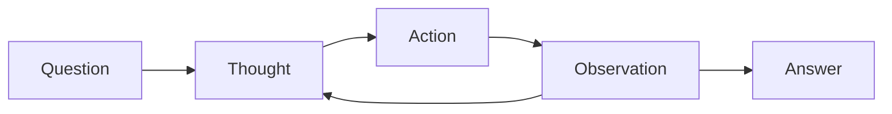
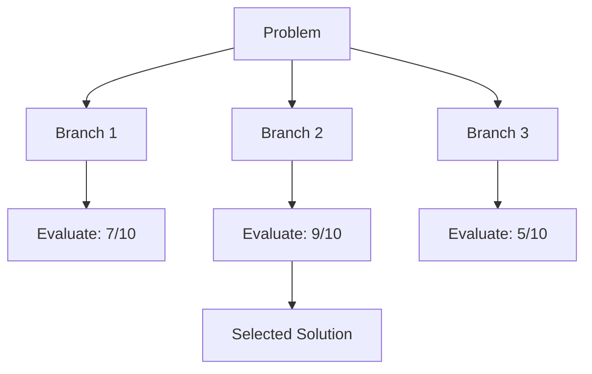

# 🎨 Workstream A: UX/UI Improvements

**Created:** December 4, 2025  
**Focus:** Visual formatting, structure, navigation, readability  
**Estimated Effort:** ~10 hours  
**Parallel Safe:** ✅ Yes - No overlap with Workstream B

---

## 🎯 Scope

This workstream covers all **visual and structural** improvements:
- Broken links (navigation)
- Markdown formatting (tables, code blocks, horizontal rules)
- Section structure and ordering
- Visual enhancements (badges, emojis, diagrams)
- Collapsible sections for large content

**Does NOT include:** Content creation, tooling, testing, documentation writing

---

## 🔴 CRITICAL (Do First)

### A1. Fix Broken Internal Links (50 links)
**Effort:** 2 hours  
**Impact:** Navigation completely broken

<details>
<summary><b>Complete list of broken links</b></summary>

| Source File | Broken Link |
|:------------|:------------|
| `prompts/advanced/chain-of-thought-debugging.md` | `../developers/reflection-code-review-self-check.md` |
| `prompts/advanced/chain-of-thought-debugging.md` | `react-codebase-navigator.md` |
| `prompts/advanced/chain-of-thought-detailed.md` | `reflection-evaluator.md` |
| `prompts/advanced/chain-of-thought-guide.md` | `tree-of-thoughts-decision-guide.md` |
| `prompts/advanced/chain-of-thought-performance-analysis.md` | `../developers/sql-query-optimizer-advanced.md` |
| `prompts/advanced/rag-document-retrieval.md` | `rag-code-ingestion.md` |
| `prompts/advanced/rag-document-retrieval.md` | `rag-citation-framework.md` |
| `prompts/advanced/react-tool-augmented.md` | `react-api-integration.md` |
| `prompts/advanced/react-tool-augmented.md` | `rag-citation-framework.md` |
| `prompts/advanced/reflection-self-critique.md` | `reflection-iterative-improvement.md` |
| `prompts/advanced/tree-of-thoughts-architecture-evaluator.md` | `tree-of-thoughts-database-migration.md` |
| `prompts/advanced/tree-of-thoughts-template.md` | `tree-of-thoughts-decision-guide.md` |
| `prompts/analysis/competitive-intelligence-researcher.md` | `../business/swot-analysis.md` |
| `prompts/analysis/data-quality-assessment.md` | `experiment-design-analyst.md` |
| `prompts/business/agile-sprint-planner.md` | `./project-charter-creator.md` |
| `prompts/business/budget-and-cost-controller.md` | `./project-charter-creator.md` |
| `prompts/business/business-strategy-analysis.md` | `market-research-analysis.md` |

</details>

**Instructions:**
1. Run the link checker script below
2. For each broken link, choose one:
   - Remove the broken link from "Related Prompts" section
   - Update to point to an existing similar file
   - Comment out with `<!-- broken: original-link.md -->`

**Link Checker Script:**
```powershell
# Run from repo root
Get-ChildItem -Path "prompts" -Filter "*.md" -Recurse | ForEach-Object {
    $file = $_
    $content = Get-Content $file.FullName -Raw
    $links = [regex]::Matches($content, '\[([^\]]+)\]\(([^)]+\.md)\)')
    foreach ($link in $links) {
        $linkPath = $link.Groups[2].Value
        if ($linkPath -notmatch '^https?://') {
            $resolvedPath = Join-Path $file.DirectoryName $linkPath
            if (-not (Test-Path $resolvedPath)) {
                Write-Output "$($file.FullName): $($link.Groups[1].Value) -> $linkPath"
            }
        }
    }
}
```

---

## 🟠 HIGH PRIORITY

### A2. Add Language Specifiers to Code Blocks (40+ blocks)
**Effort:** 1 hour  
**Impact:** No syntax highlighting without language tags

**Files to fix:**

| File | Count | Language |
|:-----|------:|:--------:|
| `docs/COMPREHENSIVE_PROMPT_DEVELOPMENT_GUIDE.md` | 20+ | `text` or `markdown` |
| `prompts/system/tree-of-thoughts-repository-evaluator.md` | 4 | `text` |
| `prompts/system/solution-architecture-designer.md` | 3 | `text` |
| `prompts/system/security-architecture-specialist.md` | 3 | `text` |
| `prompts/system/prompt-quality-evaluator.md` | 8 | `text` |
| `prompts/system/performance-architecture-optimizer.md` | 2 | `text` |
| `prompts/developers/sql-*.md` | 8 | `sql` |
| `prompts/developers/csharp-*.md` | 6 | `csharp` |

**Bulk Fix Script:**
```powershell
Get-ChildItem -Path "prompts" -Recurse -Filter "*.md" | ForEach-Object {
    $content = Get-Content $_.FullName -Raw
    # Add 'text' to unmarked code blocks (be careful not to match closing ```)
    $content = $content -replace '(?m)^```\r?\n(?!```)', "```text`n"
    Set-Content $_.FullName $content -NoNewline
}
```

**Manual verification needed for:**
- SQL files → use `sql`
- C# files → use `csharp`
- PowerShell → use `powershell`
- JSON examples → use `json`

---

### A3. Add Table Alignment Specifiers (89 files)
**Effort:** 30 minutes  
**Impact:** Inconsistent table column alignment

**Bulk Fix Regex (VS Code):**
```
Find:    \| --- \|
Replace: | :--- |
```

**Or PowerShell:**
```powershell
Get-ChildItem -Path "prompts","docs" -Recurse -Filter "*.md" | ForEach-Object {
    $content = Get-Content $_.FullName -Raw
    $content = $content -replace '\| --- \|', '| :--- |'
    $content = $content -replace '\|---\|', '|:---|'
    Set-Content $_.FullName $content -NoNewline
}
```

---

### A4. Standardize Section Headers (19 files)
**Effort:** 1 hour  
**Impact:** Inconsistent structure confuses users

**Files using "Purpose" instead of "Description":**
- `prompts/developers/api-design-consultant.md`
- `prompts/developers/code-review-expert.md`
- `prompts/developers/code-review-expert-structured.md`
- `prompts/developers/security-code-auditor.md`
- `prompts/developers/sql-security-standards-enforcer.md`

**Fix:**
```
Find:    ^## Purpose$
Replace: ## Description
```

**Files with non-standard M365 structure:**
- `prompts/m365/m365-customer-feedback-analyzer.md`
- `prompts/m365/m365-designer-*.md` (6 files)
- `prompts/m365/m365-handover-document-creator.md`
- `prompts/m365/m365-manager-sync-planner.md`
- `prompts/m365/m365-slide-content-refiner.md`
- `prompts/m365/m365-sway-*.md` (2 files)

**Standard order:**
1. `## Description`
2. `## Use Cases` (optional)
3. `## Prompt`
4. `## Variables`
5. `## Example Usage`
6. `## Tips`
7. `## Related Prompts`

---

### A5. Add Horizontal Rules Between Sections
**Effort:** 30 minutes  
**Impact:** Sections blend together, hard to scan

**Files needing `---` separators:**
- `prompts/developers/code-review-expert.md`
- `prompts/developers/api-design-consultant.md`
- `prompts/developers/security-code-auditor.md`
- `prompts/developers/test-automation-engineer.md`
- (15 more files in developers/)

**Pattern to add:**
```markdown
## Description
Content here

---

## Prompt
Content here

---

## Variables
```

---

## 🟡 MEDIUM PRIORITY

### A6. Add Collapsible Sections for Large Tables
**Effort:** 1 hour  
**Files:** Tables with 15+ rows

| File | Table Rows |
|:-----|:----------:|
| `reference/cheat-sheet.md` | 25+ |

**Template:**
```html
<details>
<summary><b>View all 25 patterns</b></summary>

| Pattern | Description |
|:--------|:------------|
| ... | ... |

</details>
```

---

### A7. Add Input/Output Separation in Examples (32 files)
**Effort:** 2 hours  

**Current format (fix these):**
```markdown
## Example
Here is an example...
```

**Target format:**
```markdown
## Example Usage

### Input
```text
[Variables filled in]
```

### Output
```text
[Expected AI response]
```
```

**Priority files:**
- All `prompts/business/*.md`
- All `prompts/developers/*.md`
- All `prompts/creative/*.md`

---

### A8. Add Mermaid Diagrams to Complex Prompts
**Effort:** 2 hours  

| File | Diagram Type | Content |
|:-----|:------------:|:--------|
| `prompts/advanced/react-tool-augmented.md` | flowchart | Thought→Action→Observation loop |
| `prompts/advanced/tree-of-thoughts-template.md` | graph | Branch evaluation structure |
| `get-started/choosing-the-right-pattern.md` | flowchart | Pattern selection decision tree |

**ReAct Example:**


**Tree of Thoughts Example:**


---

## 🟢 LOW PRIORITY

### A9. Add Shields.io Badges to Key Files
**Effort:** 30 minutes  

**Files to add badges:**
- `README.md` (root)
- `prompts/advanced/index.md`
- `prompts/governance/*.md`

**Badge templates:**
```markdown


```

---

### A10. Standardize Emoji Usage
**Effort:** 30 minutes  

**Convention:**
| Emoji | Section |
|:-----:|:--------|
| 📋 | Description |
| 🎯 | Use Cases |
| 💬 | Prompt |
| ⚙️ | Variables |
| 📝 | Example |
| 💡 | Tips |
| 🔗 | Related Prompts |

---

### A11. Add Table of Contents to Long Documents
**Effort:** 30 minutes  

**Files >300 lines without TOC:**
- `reference/cheat-sheet.md` (400+ lines)
- `prompts/governance/security-incident-response.md` (750+ lines)
- `prompts/governance/legal-contract-review.md` (460+ lines)

**TOC Template:**
```markdown
## Table of Contents

- [Description](#description)
- [Use Cases](#use-cases)
- [Prompt](#prompt)
- [Variables](#variables)
- [Example Usage](#example-usage)
- [Tips](#tips)
```

---

## ✅ Completion Checklist

| Task | Status | Files | Notes |
|:-----|:------:|------:|:------|
| A1. Fix broken links | ✅ | 50 | All 50 broken links fixed! |
| A2. Code block languages | ✅ | 139 | Added language specifiers to all code blocks! |
| A3. Table alignment | ✅ | 6 | Added alignment specifiers |
| A4. Standardize headers | ✅ | 6 | Changed Purpose → Description |
| A5. Horizontal rules | ✅ | 147 | Added section dividers |
| A6. Collapsible tables | ⬜ | 5 | Manual wrap |
| A7. Input/Output examples | ⬜ | 32 | Template provided |
| A8. Mermaid diagrams | ⬜ | 3 | Code provided |
| A9. Badges | ⬜ | 10 | Template provided |
| A10. Emoji headers | ⬜ | All | Optional polish |
| A11. TOC for long docs | ⬜ | 3 | Template provided |

---

## 📊 Success Metrics

| Metric | Before | Target |
|:-------|:------:|:------:|
| Broken links | 50 | 0 |
| Code blocks without language | 40+ | 0 |
| Tables without alignment | 89 | 0 |
| Files with non-standard headers | 19 | 0 |
| Health Score | 72/100 | 90/100 |

---

*Workstream A — UX/UI Focus — December 4, 2025*
