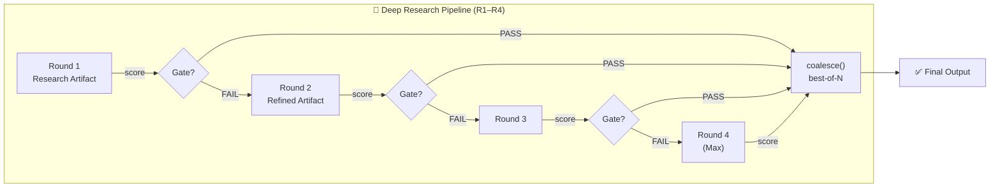
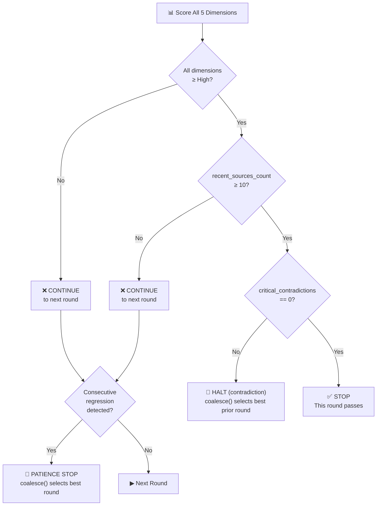
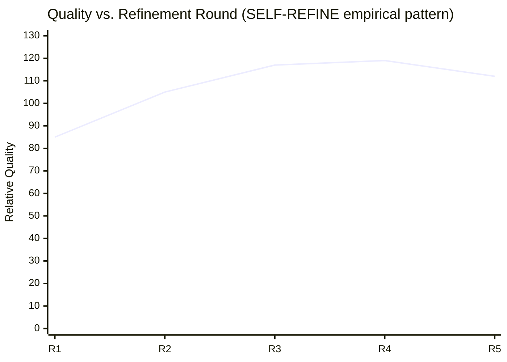

# ADR-007: Multidimensional Classification Matrix and Stop Policy for Iterative Deep Research

---

| Field        | Value |
|--------------|-------|
| **ID**       | ADR-007 |
| **Status**   | 🟡 Proposed |
| **Date**     | 2026-02-23 |
| **System**   | agentic-workflows-v2 · deep-research pipeline |
| **Authors**  | Platform Engineering |
| **Reviewers**| Research Infra, ML Platform |
| **Supersedes** | _(none)_ |

---

## 1. TL;DR

> **We abandon the single weighted "Confidence Index" scalar as the gate for stopping iterative research rounds. Instead, we adopt a DORA-style multidimensional classification matrix where every dimension must independently achieve "High" or better before stopping. The CI scalar is retained only as a tiebreaker for the `coalesce()` best-of-N selector.**

---

## 2. Status History

| Date | Status | Note |
|------|--------|------|
| 2026-02-10 | 🔵 Draft | Initial CI-weighted-sum proposal |
| 2026-02-18 | 🟠 Under Review | Challenge: compensability masks single-dimension failures |
| 2026-02-23 | 🟡 Proposed | Pivoted to multidimensional matrix; CI demoted to tiebreaker |

---

## 3. Context & Problem Statement

The **agentic-workflows-v2** system runs a **10-node deep research pipeline** with bounded iterative rounds R1–R4. Each round produces a research artifact. The system must answer three questions before committing to a round result or continuing:

```
┌───────────────────────────────────────────────────────────────┐
│           THREE QUESTIONS THE STOP POLICY MUST ANSWER         │
├───────────────────────────────────────────────────────────────┤
│  Q1 │ How should multi-dimensional research quality be scored? │
│  Q2 │ When should iterative refinement stop?                   │
│  Q3 │ How should source temporal freshness factor in?          │
└───────────────────────────────────────────────────────────────┘
```

### 3.1 Pipeline Architecture



### 3.2 Why the Original CI Formula Failed

The original proposal was a **weighted arithmetic mean (WAM)**:

> **CI = 0.25 × coverage + 0.20 × source_quality + 0.20 × agreement + 0.20 × verification + 0.15 × recency**
>
> _Stop when: CI ≥ 0.80 AND recent_sources_count ≥ 10 AND critical_contradictions == 0_

**The compensability problem** — a WAM lets high scores in one dimension mask failure in another:

| Scenario | Coverage | Verification | Recency | **WAM Result** | **Actual Quality** |
|----------|----------|--------------|---------|----------------|--------------------|
| Nominal | 0.90 | 0.85 | 0.80 | **0.87** ✅ | Good |
| Masked failure | 0.95 | **0.20** | 0.95 | **0.67** ✅ | ❌ Dangerous |
| True failure | 0.40 | 0.40 | 0.40 | **0.40** ❌ | Correctly caught |

> A verification score of 0.20 represents unverified claims — yet the WAM returns a passing score of 0.67. The single composite number hides the failure.

---

## 4. Decision

> **Adopt a DORA-style multidimensional classification matrix as the primary stop gate. Demote the CI weighted sum to a secondary tiebreaker role only.**

### 4.1 The Multidimensional Classification Matrix

Each research dimension is independently scored into one of four performance tiers:

```
╔══════════════════════════════════════════════════════════════════╗
║          RESEARCH QUALITY CLASSIFICATION MATRIX                  ║
╠══════════╦═══════════╦════════════╦═══════════╦════════════╦════╣
║ Tier     ║ Coverage  ║ Src Quality║ Agreement ║Verification║Rec.║
╠══════════╬═══════════╬════════════╬═══════════╬════════════╬════╣
║ 🏆 Elite ║  ≥ 0.90   ║  ≥ 0.90   ║  ≥ 0.90   ║  ≥ 0.90   ║≥90d║
║ ✅ High  ║  ≥ 0.75   ║  ≥ 0.75   ║  ≥ 0.75   ║  ≥ 0.75   ║≥60d║
║ ⚠️ Medium║  ≥ 0.50   ║  ≥ 0.50   ║  ≥ 0.50   ║  ≥ 0.50   ║≥30d║
║ ❌ Low   ║  < 0.50   ║  < 0.50   ║  < 0.50   ║  < 0.50   ║<30d║
╚══════════╩═══════════╩════════════╩═══════════╩════════════╩════╝
```

> **Dimension definitions:**
>
> - **Coverage** — breadth of topics addressed relative to the query scope
> - **Source Quality** — authority, peer-review status, and citation depth of sources
> - **Agreement** — cross-source corroboration; absence of contradicting claims
> - **Verification** — active fact-checking and claim provenance tracing
> - **Recency** — proportion of sources published within the domain-adaptive window

### 4.2 Stop Gate Logic



**Stopping conditions (formal):**

| Condition | Type | Trigger |
|-----------|------|---------|
| All dimensions ≥ High | Non-compensatory conjunction | Primary pass gate |
| recent_sources_count ≥ 10 | Hard floor | Minimum evidence gate |
| critical_contradictions == 0 | Veto override | Single disqualifier |
| Consecutive regression (patience = 1) | ML early stopping | Performance degradation |
| Round R4 reached | Hard bound | Max iteration guard |

### 4.3 Best-of-N Tiebreaker (CI as Secondary Scorer)

When `coalesce()` must rank multiple passing rounds — or select the "least bad" round when all fail — the CI weighted sum is used **only at this step**:

```
CI (tiebreaker) = 0.25 × coverage
                + 0.20 × source_quality
                + 0.20 × agreement
                + 0.20 × verification
                + 0.15 × recency
```

> ⚠️ **This weight vector has no empirical calibration.** See §7 (Open Questions) for sensitivity analysis requirements.

**Alternative tiebreaker weight candidates:**

| Weight Strategy | Coverage | Src Quality | Agreement | Verification | Recency | Basis |
|-----------------|----------|-------------|-----------|--------------|---------|-------|
| Proposed | 0.25 | 0.20 | 0.20 | 0.20 | 0.15 | Intuitive ranking |
| Equal weights | 0.20 | 0.20 | 0.20 | 0.20 | 0.20 | Dawes (1979) |
| ROC weights | **0.46** | 0.21 | 0.21 | 0.21 | **0.11** | Barron & Barrett (1996) |

---

## 5. Rationale

### 5.1 Production Precedents for Multidimensional Gates

| System | Approach | Compensatory? | Analog in This ADR |
|--------|----------|---------------|--------------------|
| **DORA Metrics** | Elite/High/Medium/Low per dimension; no aggregate | ❌ No | Direct inspiration for tier model |
| **SonarQube** | Conjunctive A-ratings; any failure = overall FAIL | ❌ No | `critical_contradictions == 0` veto |
| **Google SRE Error Budget** | Binary gate; budget exhaustion halts all changes | ❌ No | Hard floor constraints |
| **Dynatrace Quality Gates** | key_SLI flag creates hard non-compensatory gate | ❌ No (for key SLIs) | Dimension-level "veto" semantics |
| **OpenAI Evals** | Per-metric scores; no built-in composite | ❌ No | Per-dimension reporting |
| **Stanford HELM** | Equal-weighted composite (abandoned) | ✅ Yes (original) | ⚠️ Counter-example — HELM moved away |

### 5.2 Compensability Danger Illustrated

```
┌─────────────────────────────────────────────────────────┐
│  "The Masking Problem" — WAM Hides Catastrophic Failure  │
│                                                         │
│  Coverage      ████████████████████  0.95              │
│  Src Quality   ████████████████████  0.95              │
│  Agreement     ██████████████████░░  0.90              │
│  Verification  ████░░░░░░░░░░░░░░░░  0.20  ← FAILURE  │
│  Recency       ████████████████████  0.95              │
│                                            ─────────── │
│  WAM Result:   0.79  ✅ (PASSES old CI gate!)          │
│  Matrix Gate:  ❌ FAIL  (Verification = Low)           │
└─────────────────────────────────────────────────────────┘
```

### 5.3 Iterative Refinement Degradation — Why Bounds Matter

LLM iterative self-improvement has **empirically established limits**:



| Research | Finding | Implication |
|----------|---------|-------------|
| SELF-REFINE (NeurIPS 2023) | Quality plateaus by round 3–4 | R1–R4 bound is empirically justified |
| Huang et al. (ICLR 2024) | Without external feedback, self-correction degrades | Consecutive-regression stop is necessary |
| Snell et al. (2024) | 38% of revisions corrupt correct answers | `coalesce()` best-of-N is required, not optional |
| Gao, Schulman & Hilton (ICML 2023) | BON degrades past N≈16 under proxy scoring | 4-round bound is safely within optimum |

### 5.4 Recency — Why 183 Days Is Wrong

The prior 183-day freshness window was borrowed from **international tax residency law** (IRS Substantial Presence Test), not information retrieval. It has no IR basis.

**Domain-adaptive window targets (to replace 183-day hard cutoff):**

| Domain | Recommended Freshness Window | Rationale |
|--------|------------------------------|-----------|
| Current events / politics | 7–30 days | High publication velocity |
| Technology releases | 30–90 days | Rapid version churn |
| Academic research surveys | 12–24 months | Peer review cycle |
| Foundational science | Recency not required | Timeless literature |
| Financial market data | Hours–days | Real-time decay |

> **Decision:** Replace the fixed 183-day window with a **domain-adaptive freshness classifier** that infers the appropriate window from source publication rate (following the Google QDF model).

---

## 6. Consequences

### 6.1 Positive Outcomes

| Outcome | Mechanism |
|---------|-----------|
| No more masked failures | Non-compensatory conjunction; one Low blocks the gate |
| Aligns with industry direction | DORA, OpenAI Evals, HELM all moved to per-dimension reporting |
| Empirically bounded iterations | R1–R4 cap validated by SELF-REFINE & BON overoptimization research |
| Scores are interpretable | Each dimension has a clear tier; no opaque composite |

### 6.2 Trade-offs and Risks

| Risk | Severity | Mitigation |
|------|----------|------------|
| CI tiebreaker weights are uncalibrated | 🟠 Medium | Sensitivity analysis (§7) before deployment |
| Recency tier thresholds are provisional | 🟠 Medium | Domain-adaptive window per §5.4 |
| All-fail scenarios need fallback | 🟡 Low | `coalesce()` selects lowest-CI "least bad" round |
| No confidence intervals on tier scores | 🟡 Low | Follow Anthropic "Adding Error Bars" guidance |
| `recent_sources_count ≥ 10` floor is arbitrary | 🟡 Low | Validate against corpus quality benchmarks |

---

## 7. Open Questions & Required Actions

| # | Action | Owner | Priority | Deadline |
|---|--------|-------|----------|----------|
| 1 | Sensitivity analysis: test Proposed vs. Equal vs. ROC tiebreaker weights on historical pipeline outputs | Research Infra | 🔴 P1 | Before prod |
| 2 | Implement domain-adaptive recency window; replace 183-day hard cutoff | Platform Eng | 🔴 P1 | Before prod |
| 3 | Add confidence intervals to dimension tier classifications | ML Platform | 🟠 P2 | Sprint +1 |
| 4 | Validate `recent_sources_count ≥ 10` floor against corpus size benchmarks | Research Infra | 🟠 P2 | Sprint +2 |
| 5 | Difficulty-adaptive thresholds: consider varying "High" bar by query complexity | Research | 🟡 P3 | Backlog |

---

## 8. Alternatives Considered

| Alternative | Description | Rejected Because |
|-------------|-------------|-----------------|
| **Weighted CI as primary gate** (prior design) | WAM of 5 dimensions with 0.80 threshold | Compensability masks catastrophic single-dimension failures |
| **Geometric mean** | Partial compensability penalty | Double-penalizes low scores alongside explicit floor gates; over-penalizes |
| **Pure minimum (SonarQube-strict)** | Gate = `min(all dimensions) ≥ 0.75` | Too brittle; single noisy dimension could permanently stall pipeline |
| **No composite, conjunct-only** | Report tier vector; no CI tiebreaker at all | `coalesce()` requires a scalar to rank candidates; cannot avoid |

---

## 9. References

| Citation | Relevance |
|----------|-----------|
| DORA State of DevOps 2024 | Foundation for multidimensional tier model |
| Madaan et al. — SELF-REFINE (NeurIPS 2023) | Validates R1–R4 iteration bound |
| Huang et al. (ICLR 2024) | Demonstrates intrinsic self-correction degradation |
| Snell et al. (2024) — Sequential Revision Models | Motivates `coalesce()` best-of-N over final-round selection |
| Gao, Schulman & Hilton (ICML 2023) | BON overoptimization scaling laws; validates 4-round bound |
| Dawes (1979) — Robust Beauty of Improper Models | Equal-weight baseline for tiebreaker |
| Barron & Barrett (1996) — ROC Weights | ROC weight alternative for tiebreaker |
| Prechelt (1998) — Early Stopping | Patience-based stopping; maps to consecutive-regression mechanism |
| Barbaresi (2020) — htmldate (JOSS) | Date extraction reliability limits |
| Anthropic — Adding Error Bars to Evals (2024) | Confidence interval guidance |

---

## 10. Decision Record Summary

```
┌──────────────────────────────────────────────────────────┐
│                    ADR-007 DECISION MAP                  │
├──────────────────────────────────────────────────────────┤
│                                                          │
│  OLD:  One CI score ──→ threshold gate ──→ stop/continue │
│                                                          │
│  NEW:  5 Dimensions ──→ each classified independently    │
│             │                                            │
│             ├── All ≥ High? ──→ AND ──→ sources ≥ 10?   │
│             │                    AND ──→ contradictions=0│
│             │                     │                     │
│             │                  STOP ✅                   │
│             │                                            │
│             └── Any < High? ──→ CONTINUE or PATIENCE     │
│                                    STOP after regression │
│                                                          │
│  coalesce(): CI score used ONLY to rank candidates       │
└──────────────────────────────────────────────────────────┘
```

> **Approved by:** _(pending review)_
> **Next review date:** 2026-03-23
