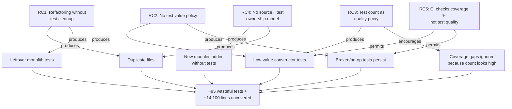

# ADR-008: Testing Approach Overhaul — Value-Driven Test Quality and Coverage Strategy

---

| Field        | Value |
|--------------|-------|
| **ID**       | ADR-008 |
| **Status**   | 🟡 Proposed |
| **Date**     | 2026-03-02 |
| **System**   | All packages — agentic-workflows-v2, tools/, agentic-v2-eval, UI |
| **Authors**  | Platform Engineering |
| **Reviewers** | Backend Lead, QA |
| **Supersedes** | ADR-0023 (planned, never authored: "Unit-test strategy and deterministic fixtures") |

---

## 1. TL;DR

> **The test suite has grown to ~1,100 functions but ~9% are duplicative, low-value, or broken — consuming maintenance effort while providing zero defect-detection capability. Meanwhile, ~14,100 lines of critical production code (including the YAML-to-LLM bridge, model availability detection, and the entire benchmark subsystem) have zero test coverage. We adopt a value-driven testing policy: a formal Test Value Taxonomy that classifies every test into one of four tiers, seven enforceable rules to prevent future degradation, and a phased remediation plan that first removes ~95 problematic tests, then invests in the highest-risk uncovered modules.**

---

## 2. Status History

| Date | Status | Note |
|------|--------|------|
| 2026-03-02 | 🟡 Proposed | Full audit of 60+ test files completed; ADR authored with quantitative findings |

---

## 3. Context & Problem Statement

The `tafreeman/prompts` monorepo targets 80%+ test coverage (per `.claude/rules/common/testing.md`) and mandates TDD workflows. A comprehensive audit of all test files revealed two systemic problems operating in opposite directions: **test bloat** (redundant tests inflating counts without adding defect detection) and **coverage voids** (critical modules with zero or near-zero coverage).

### 3.1 The Bloat Problem — Quantitative Evidence

An audit of all 60+ test files across the monorepo uncovered **~95 tests** that should be removed, consolidated, or rewritten:

```
╔══════════════════════════════════════════════════════════════════════════╗
║                    TEST QUALITY AUDIT FINDINGS                          ║
╠═══════════════════════════════════╦══════╦════════════════════════════════╣
║ Category                          ║ Count║ Impact                        ║
╠═══════════════════════════════════╬══════╬════════════════════════════════╣
║ Duplicate files (entire files)    ║  2   ║ ~35 redundant test functions   ║
║ Cross-file duplications           ║ ~30  ║ Same behavior tested 2-3x     ║
║ Low-value tests                   ║ ~25  ║ Assert constructors/enums only ║
║ Broken / no-op tests              ║  4   ║ Can never fail                 ║
╠═══════════════════════════════════╬══════╬════════════════════════════════╣
║ TOTAL                             ║ ~95  ║ ~9% of all test functions      ║
╚═══════════════════════════════════╩══════╩════════════════════════════════╝
```

**Detailed findings are documented in [`docs/TEST_COVERAGE_ANALYSIS.md`](../TEST_COVERAGE_ANALYSIS.md)**, sections A1 through A12.

#### 3.1.1 Duplicate Files

Two test files are **complete duplicates** of other test files, created when modules were refactored but old tests were never removed:

| Duplicate File | Original File | Overlap |
|---|---|---|
| `test_server_auth.py` (15 tests) | `test_auth.py` (15 tests) | 14 of 15 tests identical |
| `test_server_websocket.py` (20 tests) | `test_websocket.py` (20 tests) | 19 of 20 tests identical |

The duplicate files use inferior patterns: `sys.modules` stub hacks, manual setup/teardown instead of `monkeypatch`, missing `@pytest.mark.asyncio` decorators on async tests (which can cause silent test skips under strict pytest-asyncio modes).

A third file, `test_agents_integration.py` (8 tests), overlaps almost entirely with `test_agents.py` and `test_agents_orchestrator.py` — including a misleadingly named test (`test_orchestrator_creates_dag_from_subtasks`) that only tests agent registration.

#### 3.1.2 Monolith Extraction Without Cleanup

When `test_langchain_engine.py` (76 tests, 1,197 lines) was refactored to extract focused unit test files, **the original tests were left in place**:

```
test_langchain_engine.py (ORIGINAL — 76 tests)
    ├── TestExpressions (7 tests)       ──→ DUPLICATED in test_langchain_expressions.py (19 tests)
    ├── TestCoalesceExpression (4 tests) ──→ DUPLICATED in test_langchain_expressions.py
    ├── TestCompositeExpressions (3 tests)──→ DUPLICATED in test_langchain_expressions.py
    ├── TestConfigLoader (2 tests)      ──→ DUPLICATED in test_langchain_config.py (13 tests)
    ├── TestModelRegistry (4 tests)     ──→ DUPLICATED in test_langchain_models_unit.py (32 tests)
    └── [Unique tests: graph compilation, workflow runner, response parsing, fan-out, tracing]
```

The same pattern appears in evaluation tests: `test_server_evaluation.py` re-tests 7 hard-gate paths already covered by `test_evaluation_scoring.py`, because the scoring logic was extracted to a dedicated module but the integration-level tests were never pruned.

#### 3.1.3 Low-Value Test Patterns

Across 10+ test files, we found tests that assert only:

- **Constructor defaults:** `assert config.name == "agent"` after `AgentConfig()` — tests that `@dataclass` stores default values
- **Enum string values:** `assert StepState.PENDING.value == "pending"` — tests Python's `Enum` class
- **Type identity:** `assert isinstance(result, str)` on a function with `-> str` return annotation — tests the type system
- **API surface existence:** `assert hasattr(obj, "method") and callable(obj.method)` — would fail at import time if missing
- **Tautologies:** `assert isinstance(result, type(result))` — always `True` for any object

These tests contribute to coverage % but detect zero defects. They also create false confidence ("we have 1,000 tests") while masking that critical modules have none.

#### 3.1.4 Broken Tests

Four tests can **never fail** due to implementation errors:

| Test | Problem |
|------|---------|
| `test_runner_ui.py::test_returns_empty_dict_when_file_missing_and_probe_unavailable` | Body is `with patch(...): pass` — asserts nothing |
| `test_provider_adapters.py::test_resolves_to_onnx_directory` | Asserts `result is None or isinstance(result, Path)` — vacuously true |
| `test_cli.py::test_no_arguments` | Asserts `exit_code == 2 or exit_code == 0` — accepts all outcomes |
| `test_cli.py::test_orchestrate_shows_note` | `"LLM" in output or "orchestration" in output.lower()` — overly permissive |

### 3.2 The Coverage Void Problem — Quantitative Evidence

```
╔══════════════════════════════════════════════════════════════════════════╗
║               MODULES WITH ZERO TEST COVERAGE                           ║
╠════════════════════════════════════════════════════╦═══════╦═════════════╣
║ Module                                             ║ Lines ║ Risk        ║
╠════════════════════════════════════════════════════╬═══════╬═════════════╣
║ engine/agent_resolver.py                           ║   979 ║ CRITICAL    ║
║ tools/llm/model_probe.py                           ║ 2,313 ║ CRITICAL    ║
║ tools/agents/benchmarks/llm_evaluator.py           ║   777 ║ CRITICAL    ║
║ tools/agents/benchmarks/evaluation_pipeline.py     ║   320 ║ HIGH        ║
║ tools/agents/benchmarks/workflow_pipeline.py       ║   394 ║ HIGH        ║
║ tools/agents/benchmarks/datasets.py                ║   310 ║ HIGH        ║
║ tools/agents/benchmarks/loader.py                  ║   556 ║ HIGH        ║
║ tools/agents/benchmarks/registry.py                ║   261 ║ HIGH        ║
║ tools/core/tool_init.py                            ║   501 ║ MEDIUM      ║
║ tools/core/local_media.py                          ║   464 ║ MEDIUM      ║
║ tools/llm/model_inventory.py                       ║   528 ║ MEDIUM      ║
║ tools/llm/model_bakeoff.py                         ║   633 ║ MEDIUM      ║
║ workflows/artifact_extractor.py                    ║   137 ║ MEDIUM      ║
║ integrations/langchain.py                          ║   246 ║ MEDIUM      ║
║ integrations/otel.py                               ║   199 ║ MEDIUM      ║
╠════════════════════════════════════════════════════╬═══════╬═════════════╣
║ TOTAL UNTESTED                                     ║ 8,618 ║             ║
╚════════════════════════════════════════════════════╩═══════╩═════════════╝
```

Additionally, **6 modules with existing but thin coverage** (under 30%):

| Module | Lines | Current Tests | Effective Coverage |
|--------|-------|--------------|-------------------|
| `server/routes/workflows.py` | 1,247 | 9 tests | ~15% |
| `server/evaluation_scoring.py` | 1,141 | 18 tests | ~21% |
| `models/backends.py` | 824 | 11 tests | ~24% |
| `server/judge.py` | 561 | 4 tests | ~15% |
| `server/datasets.py` | 858 | 0 dedicated | ~10% (indirect) |
| `langchain/models.py` | 811 | 32 tests | ~25% |

The `tools/` root package is the worst offender: **only 3 of 35+ source modules have any tests** (test_config.py, test_errors.py, test_llm_client.py).

### 3.3 Root Cause Analysis



### 3.4 Impact on Well-Tested Areas

Not all test files have quality issues. The following serve as **exemplars** of the testing approach we want to codify:

| Module | Tests | Why it's good |
|--------|-------|--------------|
| `engine/expressions.py` (480 lines → 46 tests) | Parametrized boundary tests, both happy and error paths | Tests behavior, not constructors |
| `models/rate_limit_tracker.py` (353 lines → 67 tests) | Exhaustive edge cases, time-dependent behavior mocked correctly | Tests state transitions under real conditions |
| `server/multidimensional_scoring.py` (527 lines → 50 tests) | Full matrix of scoring dimensions, boundary values | Tests computation logic, not schemas |
| `agentic-v2-eval/` (4,200 lines → 230 tests) | Best-covered package; evaluators, scorers, reporters all tested | Consistent quality across entire package |
| UI test suite (6 files, 29 tests) | Behavioral assertions on rendered output, no implementation leaking | Tests user-visible behavior |

---

## 4. Options Considered

### Option A — Coverage-Only Enforcement

Set `--cov-fail-under=80` globally in CI and let developers add whatever tests reach the threshold.

**Pros:** Simple to implement. Single enforcement point.
**Cons:** Goodhart's Law — "when a measure becomes a target, it ceases to be a good measure." You can reach 80% coverage with tautological assertions and constructor tests. Does not address existing bloat. Does not distinguish high-risk from low-risk modules.

### Option B — Test Value Classification + Targeted Remediation

Define a formal **Test Value Taxonomy** (4 tiers), clean up existing debt per the audit findings, add 7 enforceable rules to prevent future degradation, and invest new tests in the highest-risk uncovered modules.

**Pros:** Addresses both quality and coverage simultaneously. Provides clear, actionable criteria for test reviews. Prevents the patterns that caused the current state.
**Cons:** Requires upfront cleanup effort (~95 test removals). Rules need team buy-in. Test value classification requires human judgment during code review.

### Option C — Full TDD Reset

Delete all existing tests and re-derive from scratch using strict RED-GREEN-REFACTOR methodology.

**Pros:** Theoretically produces the cleanest test suite.
**Cons:** Destroys ~1,005 good tests to fix ~95 bad ones. The eval package (230 tests), rate_limit_tracker (67 tests), and expressions (46 tests) are already excellent. Impractical time investment. Would pause all feature development.

### Option D — AI-Assisted Continuous Audit

Use the existing `/test-coverage` command to periodically re-audit tests. No policy changes — rely on ongoing audits to flag issues.

**Pros:** Low implementation cost. Leverages existing tooling.
**Cons:** Reactive, not preventive. Does not address the ~95 existing problematic tests. Does not establish criteria for what "good" looks like.

### Tradeoff Matrix

| Criterion | A: Coverage-Only | B: Value Taxonomy | C: Full Reset | D: Continuous Audit |
|---|---|---|---|---|
| Addresses existing bloat | No | **Yes** | Yes (nuclear) | Partially |
| Addresses coverage voids | Indirectly | **Yes (prioritized)** | Yes | No |
| Prevents future degradation | Weakly | **Strongly (7 rules)** | Initially | No |
| Implementation cost | Low | **Medium** | Very High | Low |
| Team disruption | None | **Low-Medium** | Extreme | None |
| Quality signal | Weak (% only) | **Strong (taxonomy)** | Strong | Weak |
| Production precedent | Common but insufficient | Google (Test Sizes), Stripe | — | — |

---

## 5. Decision

> **Adopt Option B (Test Value Classification + Targeted Remediation), supplemented by Option D (periodic AI-assisted audits) for ongoing maintenance.**

The decision is grounded in three principles:

1. **Value over volume** — A test suite's strength is measured by defects caught, not functions counted. Removing 95 wasteful tests and adding 50 targeted tests for `agent_resolver.py` produces a net improvement despite lower absolute count.

2. **Risk-proportional investment** — Coverage investment should be proportional to module complexity and blast radius. A 979-line module that bridges YAML to LLM execution deserves 50+ tests; a 37-line enum module does not need 7 individual transition tests when one parametrized test suffices.

3. **Prevention over cure** — The 7 enforceable rules (Section 6) address the root causes identified in Section 3.3, preventing future accumulation of the patterns that caused the current state.

---

## 6. Test Value Taxonomy

Every test function in the repository can be classified into one of four value tiers:

### Tier 1 — High Value (MUST HAVE)

Tests that exercise **branching logic, error handling, state transitions, or integration boundaries**. These are the tests that actually catch bugs.

**Characteristics:**
- Tests a code path that involves at least one conditional branch (`if`, `match`, loop, exception handler)
- Asserts on output values that depend on the code's logic, not just its type
- Covers both the happy path AND at least one error/edge case
- Would fail if the implementation were changed in a semantically meaningful way

**Examples from this codebase:**
- `test_dag_executor.py::test_step_failure_cascades_to_dependents` — Tests three-level failure cascade with grandchild skip
- `test_rate_limit_tracker.py::test_cooldown_exponential_backoff` — Tests time-dependent state machine behavior
- `test_expressions.py::test_evaluate_comparison_operators` — Parametrized across 6 operators with boundary values

### Tier 2 — Moderate Value (KEEP)

Tests that validate **contracts, schemas, or boundary conditions** without exercising complex logic.

**Characteristics:**
- Validates Pydantic model serialization/deserialization with non-trivial schemas (nested objects, optional fields, validators)
- Tests boundary values of numeric parameters
- Validates that error messages contain expected context
- Tests configuration loading from YAML/env with real file I/O

**Examples from this codebase:**
- `test_contracts.py::test_workflow_result_serialization` — Validates round-trip serialization of complex nested model
- `test_workflow_loader.py::test_load_invalid_yaml_raises` — Validates error handling on malformed input

### Tier 3 — Low Value (CONSOLIDATE OR REMOVE)

Tests that assert **constructor defaults, enum values, type identity, or Python language guarantees**. These test the framework, not the application.

**Red flags that indicate Tier 3:**
- `assert config.name == "agent"` after `AgentConfig()` — tests dataclass default
- `assert isinstance(result, str)` on a function with `-> str` — tests type system
- `assert StepState.PENDING.value == "pending"` — tests Python Enum
- `assert hasattr(obj, "method")` — tests API surface existence

**Policy:** Consolidate into a single parametrized test if the values serve as a schema contract (e.g., "all enum members have expected string values"). Remove outright if the assertion is redundant with type checking.

### Tier 4 — Negative Value (MUST REMOVE)

Tests that **can never fail**, **duplicate another test with weaker assertions**, or **contain broken mocking**. These actively harm the test suite by creating false confidence.

**Red flags that indicate Tier 4:**
- `assert isinstance(result, type(result))` — tautology
- `assert exit_code == 0 or exit_code == 2` — accepts all outcomes
- `with patch(...): pass` — mocks something but asserts nothing
- `assert result is None or isinstance(result, Path)` — vacuously true

**Policy:** Remove immediately. No consolidation — these provide negative signal.

```
╔══════════════════════════════════════════════════════════════════╗
║              TEST VALUE DECISION FLOWCHART                       ║
╠══════════════════════════════════════════════════════════════════╣
║                                                                  ║
║  Does the test exercise a conditional branch?                    ║
║     YES → Does it cover both success and error paths?            ║
║              YES → TIER 1 (High Value) ✅                        ║
║              NO  → TIER 2 (Moderate) if behavioral               ║
║     NO  → Does it validate a non-trivial schema or boundary?     ║
║              YES → TIER 2 (Moderate) ✅                          ║
║              NO  → Can the assertion ever fail in practice?       ║
║                     NO  → TIER 4 (Negative) ❌ Remove            ║
║                     YES → Is it testing Python/framework itself?  ║
║                            YES → TIER 3 (Low) ⚠️ Consolidate    ║
║                            NO  → TIER 2 (Moderate) ✅            ║
║                                                                  ║
╚══════════════════════════════════════════════════════════════════╝
```

---

## 7. Enforceable Rules

Seven rules that address the five root causes identified in Section 3.3:

### Rule 1: One Canonical Test File Per Source Module

> **When a source module has tests, there must be exactly one test file for it. No parallel/shadow test files.**

Addresses: RC1 (refactoring without cleanup), RC4 (no ownership model).

When refactoring a source module (e.g., extracting `evaluation_scoring.py` from `evaluation.py`), the corresponding tests must be extracted to a new test file AND the originals must be deleted from the old test file. This prevents the duplication pattern found in `test_auth.py` / `test_server_auth.py` and `test_websocket.py` / `test_server_websocket.py`.

**Naming convention:** `test_{module_name}.py` maps to `{module_name}.py`. If a test file tests multiple related modules (e.g., `test_phase2d_tools.py` covers multiple `tools/builtin/` modules), document the mapping in a module docstring.

### Rule 2: Every Test Must Assert Behavior

> **No bare `isinstance`, `is not None`, `hasattr`, or `callable` assertions unless they guard a subsequent behavioral assertion.**

Addresses: RC2 (no test value policy), RC3 (count as quality proxy).

```python
# FORBIDDEN — Tier 3/4, tests Python's type system
def test_returns_string():
    result = my_function("input")
    assert isinstance(result, str)

# ALLOWED — isinstance guards a behavioral check
def test_parse_returns_valid_json():
    result = parse_response(raw_text)
    assert isinstance(result, dict)  # guard
    assert "status" in result         # behavioral
    assert result["status"] in ("success", "failed")  # behavioral
```

### Rule 3: Parametrize, Don't Duplicate

> **When 3+ tests differ only in input values, consolidate into a single `@pytest.mark.parametrize` test.**

Addresses: RC2, RC3.

```python
# FORBIDDEN — 7 nearly identical test functions
def test_valid_transition_pending_to_ready(): ...
def test_valid_transition_ready_to_running(): ...
def test_valid_transition_running_to_success(): ...
# ... 4 more

# REQUIRED — single parametrized test
@pytest.mark.parametrize("from_state,to_state", [
    (StepState.PENDING, StepState.READY),
    (StepState.READY, StepState.RUNNING),
    (StepState.RUNNING, StepState.SUCCESS),
    (StepState.RUNNING, StepState.FAILED),
    (StepState.RUNNING, StepState.RETRYING),
    (StepState.RETRYING, StepState.RUNNING),
    (StepState.PENDING, StepState.SKIPPED),
])
def test_valid_state_transitions(from_state, to_state):
    manager = StepStateManager()
    manager._states["step"] = from_state
    manager.transition("step", to_state)
    assert manager.get_state("step") == to_state
```

### Rule 4: Test File Hygiene on Refactor

> **When extracting code from a monolithic source file into focused modules, the corresponding tests must move too. The PR must not merge until the old test file no longer contains tests for the extracted code.**

Addresses: RC1 (refactoring without cleanup).

This is the rule that would have prevented the `test_langchain_engine.py` bloat. The PR that created `test_langchain_expressions.py` should have also deleted `TestExpressions`, `TestCoalesceExpression`, and `TestCompositeExpressions` from `test_langchain_engine.py`.

**CI enforcement opportunity:** A pre-commit hook or CI check that flags when a test file imports from a module other than the one implied by its filename. For example, `test_langchain_engine.py` importing `resolve_expression` from `langchain.expressions` is a signal that these tests belong in `test_langchain_expressions.py`.

### Rule 5: No Facade Re-Testing

> **If function A trivially delegates to function B (no conditional logic, no transformation), test B directly. Don't create separate tests for A unless A adds meaningful logic.**

Addresses: RC2, RC5.

This is the rule that would have prevented the 7 duplicate hard-gate tests between `test_server_evaluation.py` and `test_evaluation_scoring.py`. The `score_workflow_result()` function in `evaluation.py` is a one-line delegation to `score_workflow_result_impl()` in `evaluation_scoring.py`. Testing both is pure duplication.

### Rule 6: Mock Completeness

> **Every mock/patch must have at least one assertion that exercises the mocked behavior. `with patch(...): pass` is forbidden.**

Addresses: RC2, RC5.

```python
# FORBIDDEN — mock is never used
def test_something():
    with patch("module.expensive_function"):
        pass  # asserts nothing

# REQUIRED — mock enables a behavioral assertion
def test_fallback_on_failure():
    with patch("module.primary_api", side_effect=ConnectionError):
        result = get_data_with_fallback()
        assert result.source == "cache"  # behavioral assertion
```

### Rule 7: Coverage Floors Per Package

> **Enforce differentiated coverage targets based on module risk level.**

Addresses: RC5 (CI checks coverage % not quality).

| Package/Module Category | Coverage Floor | Rationale |
|---|---|---|
| Business logic (engine/, agents/, workflows/, models/) | 80% | Core execution paths, high blast radius |
| Server routes and evaluation | 70% | API contract enforcement |
| Infrastructure (integrations/, CLI, config) | 60% | Lower blast radius, harder to unit test |
| UI components | 40% | Snapshot/render tests have diminishing returns |
| Shared tools (tools/) | 60% | Currently at ~5%, needs significant investment |

---

## 8. Immediate Remediation Plan

### Phase 0: Cleanup (~95 test removals)

Execute the cleanup documented in [`docs/TEST_COVERAGE_ANALYSIS.md`](../TEST_COVERAGE_ANALYSIS.md), sections A1-A12:

| Action | Tests Removed | Reference |
|--------|--------------|-----------|
| Delete `test_server_auth.py` (migrate 1 unique test first) | 14 | A1 |
| Delete `test_server_websocket.py` (migrate 1 unique test first) | 19 | A1 |
| Delete `test_agents_integration.py` (migrate unique tests first) | 8 | A2 |
| Remove 3 orchestrator/integration tests from `test_agents.py` | 3 | A2 |
| Remove `TestExpressions`, `TestCoalesceExpression`, `TestCompositeExpressions` + 6 config/model tests from `test_langchain_engine.py` | 18 | A3 |
| Remove 5 duplicate tests from `test_langchain_integration.py` | 5 | A4 |
| Remove 7 duplicate hard-gate tests from `test_server_evaluation.py` | 7 | A5 |
| Remove 3 duplicate tests from `test_dag.py` | 3 | A6 |
| Fix or remove 4 broken/no-op tests | 4 | A8 |
| Remove `test_execute_as_pipeline_deprecated` | 1 | A9 |
| Clean dead code in `server/evaluation.py` lines 102-120 | — | A10 |
| **TOTAL** | **~82** | |

Remaining ~13 low-value tests (Section A7) should be consolidated into parametrized tests or removed during normal code review, not as a bulk operation.

### Phase 1: Highest-Impact New Coverage

Target the 3 critical zero-coverage modules:

| New Test File | Source Module | Target Tests | Key Functions |
|---|---|---|---|
| `tests/test_agent_resolver.py` | `engine/agent_resolver.py` (979 lines) | 50+ | `_extract_json_candidates`, `_parse_llm_json_output`, `_run_tool_calls`, `_make_llm_step` |
| `tools/tests/test_model_probe.py` | `tools/llm/model_probe.py` (2,313 lines) | 40+ | `ModelProbeCache`, `check_model`, `_classify_error`, `_retry_with_backoff` |
| `tools/tests/test_llm_evaluator.py` | `tools/agents/benchmarks/llm_evaluator.py` (777 lines) | 30+ | `LLMEvaluator.__call__`, `_score_with_rubric`, `_compute_confidence` |
| `tools/tests/test_benchmark_pipeline.py` | `tools/agents/benchmarks/evaluation_pipeline.py` + `workflow_pipeline.py` (714 lines) | 30+ | Pipeline orchestration, dataset loading |

### Phase 2: Server Hardening

Expand existing thin test files:

| Test File | Current | Target | Key Gaps |
|---|---|---|---|
| `test_server_workflow_routes.py` | 9 | 40+ | Streaming, dataset integration, error paths, pagination |
| `test_evaluation_scoring.py` | 18 | 50+ | 23 helper functions, multi-stage pipeline edge cases |
| `test_server_judge.py` | 4 | 25+ | Calibration, consistency, structured output validation |
| `test_provider_adapters.py` | 11 | 40+ | Per-backend auth, rate limits, streaming, network errors |
| `test_server_datasets.py` (NEW) | 0 | 25+ | Dataset management, sample loading, workflow matching |

### Phase 3: Fill Remaining Gaps

| Test File | Current | Target | Module |
|---|---|---|---|
| `test_memory_context_tools.py` | 3 | 20+ | `memory_ops.py` + `context_ops.py` |
| `test_run_logger.py` | 3 | 12+ | `run_logger.py` |
| `test_tool_init.py` (NEW) | 0 | 15+ | `tools/core/tool_init.py` |
| `test_model_inventory.py` (NEW) | 0 | 20+ | `tools/llm/model_inventory.py` |
| `test_artifact_extractor.py` (NEW) | 0 | 8+ | `workflows/artifact_extractor.py` |
| `test_integrations.py` (NEW) | 0 | 15+ | `integrations/langchain.py` + `otel.py` |

### Phase 4: Frontend & E2E

| Area | Current | Target | Focus |
|---|---|---|---|
| UI components | 29 tests across 6 files | 80+ across 15+ files | Pages, DAG components, hooks |
| E2E | 1 smoke test | 5-10 tests | Full workflow execution, multi-agent coordination, WebSocket streaming |

### Projected Impact

```
╔══════════════════════════════════════════════════════════════════╗
║                    PROJECTED TEST SUITE EVOLUTION                ║
╠═══════════════════════════╦═══════════╦══════════════════════════╣
║ Metric                    ║ Before    ║ After (all phases)       ║
╠═══════════════════════════╬═══════════╬══════════════════════════╣
║ Total test functions      ║ ~1,100    ║ ~1,350 (+250 new, -95)   ║
║ Duplicate/broken tests    ║ ~95       ║ 0                        ║
║ Zero-coverage modules     ║ 15        ║ 0                        ║
║ Modules under 30%         ║ 6         ║ 0                        ║
║ tools/ package coverage   ║ 3 of 35+  ║ 12 of 35+               ║
║ UI test coverage          ║ 29 tests  ║ 80+ tests               ║
║ E2E test coverage         ║ 1 test    ║ 5-10 tests              ║
║ Average test quality tier ║ ~2.1      ║ ~1.6 (more Tier 1)      ║
╚═══════════════════════════╩═══════════╩══════════════════════════╝
```

---

## 9. Consequences

### Positive

1. **Higher defect detection rate** — Net addition of ~250 Tier 1/2 tests targeting the riskiest untested code paths (tool loops, error recovery, multi-provider routing)
2. **Lower maintenance burden** — Removing ~95 duplicate/broken tests eliminates churn when source modules change
3. **Clear review criteria** — The 4-tier taxonomy gives reviewers an objective framework for evaluating new tests during code review
4. **Prevents recurrence** — The 7 rules address all 5 root causes, making it structurally harder to reintroduce the patterns that caused the current state
5. **Focused investment** — Risk-proportional coverage floors ensure high-blast-radius modules get tested first

### Negative

1. **Upfront effort** — Phase 0 cleanup and Phase 1 new tests require dedicated sprint allocation
2. **Temporary coverage dip** — Removing ~95 tests in Phase 0 will reduce the absolute test count before Phase 1 adds replacements. Coverage percentage may briefly decrease.
3. **Judgment required** — The Tier 3/4 distinction requires human judgment during code review. Edge cases will arise (e.g., is a Pydantic serialization test Tier 2 or Tier 3?). Resolve ambiguity by asking: "Would this test catch a real bug?"
4. **Rule enforcement overhead** — Rules 1-6 require attention during code review. Some may benefit from automated enforcement (see Section 10).

---

## 10. Code-Level Recommendations

### 10.1 Immediate Actions (Phase 0)

1. **Migrate unique tests, then delete duplicate files:**
   - Move `test_whitespace_stripped_from_x_api_key` from `test_server_auth.py` to `test_auth.py` → delete `test_server_auth.py`
   - Move `test_broadcast_tolerates_failed_ws` from `test_server_websocket.py` to `test_websocket.py` → delete `test_server_websocket.py`
   - Move any unique tests from `test_agents_integration.py` to `test_agents_orchestrator.py` → delete `test_agents_integration.py`

2. **Strip extracted tests from `test_langchain_engine.py`:**
   - Delete classes: `TestExpressions`, `TestCoalesceExpression`, `TestCompositeExpressions`
   - Delete tests: `TestConfigLoader::test_list_workflows`, `TestConfigLoader::test_load_nonexistent_raises`
   - Delete tests: `TestModelRegistry::test_retryable_model_error_detects_rate_limits`, `test_env_model_override_with_fallback`, `test_env_model_override_uses_env_value`, `test_model_candidates_keep_explicit_override`

3. **Remove dead code:** Delete unreachable lines 102-120 in `agentic_v2/server/evaluation.py`

4. **Fix broken tests:** Either rewrite with proper assertions or delete:
   - `test_runner_ui.py::test_returns_empty_dict_when_file_missing_and_probe_unavailable`
   - `test_provider_adapters.py::test_resolves_to_onnx_directory`
   - `test_cli.py::test_no_arguments` and `test_orchestrate_shows_note`

### 10.2 CI/Automation Opportunities

5. **Add per-package coverage enforcement to `ci.yml`:**
   ```yaml
   # agentic-workflows-v2 business logic
   - run: pytest tests/ --cov=agentic_v2 --cov-fail-under=70
   # tools package (currently ~5%, ramp to 40% after Phase 1)
   - run: pytest tests/ --cov=tools --cov-fail-under=40
   ```

6. **Add a pre-commit check** (optional, future) that warns when a test file's imports suggest cross-module testing (e.g., `test_langchain_engine.py` importing from `langchain.expressions` instead of `langchain.graph`).

### 10.3 Update Existing Rules

7. **Update `.claude/rules/common/testing.md`** to reference this ADR and incorporate the Test Value Taxonomy as the authoritative guide for what constitutes a valuable test.

---

## 11. References

| Citation | Relevance |
|---|---|
| Fowler, M. — "Test Coverage" (martinfowler.com, 2012) | "High coverage numbers are too easy to reach with low quality testing. Coverage is a useful tool for finding untested parts of a codebase — it is of little use as a numeric statement of how good your tests are." |
| Google Testing Blog — "Test Sizes" (2010) | Google's small/medium/large test taxonomy for enforcement. Precedent for tier-based classification. |
| Goodhart's Law (1975) | "When a measure becomes a target, it ceases to be a good measure." Explains why coverage % alone fails as a quality metric. |
| ADR-001 (this repo) | Conformance testing approach for dual execution engines. Section on `hypothesis` property-based testing. |
| ADR-007 (this repo) | Multidimensional quality classification. Precedent for non-compensatory scoring in this codebase. |
| DORA State of DevOps (2024) | Test suite reliability as a predictor of deployment frequency. Flaky and low-value tests reduce developer trust in the suite. |
| Fowler, M. — "Mocks Aren't Stubs" (martinfowler.com, 2007) | Classical vs. mockist testing. Relevant to Rule 6 (Mock Completeness). |
| `docs/TEST_COVERAGE_ANALYSIS.md` (this repo) | Companion document with full line-by-line audit of every test file, including specific function names, line numbers, and duplication mappings. |

---

## 12. Open Questions

| # | Question | Priority | Owner |
|---|----------|----------|-------|
| Q1 | Should Rule 7 coverage floors be enforced in CI immediately or phased in with ratcheting (e.g., `--cov-fail-under` increases by 5% per quarter)? | P1 | Backend Lead |
| Q2 | Should the `/test-coverage` slash command be extended to automatically classify tests into the 4-tier taxonomy? | P2 | Platform Engineering |
| Q3 | Should we add a `pytest` plugin or custom marker (`@pytest.mark.tier1`) to track test value tiers in CI reports? | P3 | QA |
| Q4 | For the `tools/` package (3 of 35+ modules tested), should we enforce "no new module without tests" as a merge-blocking rule? | P1 | Backend Lead |
