---
---
title: UI/UX Improvement Plan
shortTitle: UI/UX Plan
intro: Comprehensive plan for improving repository accessibility through interface enhancements, visual improvements, and a prompt selector application.
type: reference
difficulty: intermediate
audience:
  - senior-engineer
  - solution-architect
platforms:
  - github-copilot
topics:
  - documentation
  - architecture
author: Docs UX Agent
version: "1.0"
date: "2025-11-30"
governance_tags:
  - PII-safe
dataClassification: internal
reviewStatus: draft
description: Detailed UI/UX improvement roadmap covering documentation fixes, visual enhancements, and a prompt selector app.
---

# UI/UX Improvement Plan

This document outlines the comprehensive plan for improving the Prompt Library's user experience through interface enhancements, visual improvements, and a new Prompt Selector application.

---

## Table of Contents

- [Executive Summary](#executive-summary)
- [Part 1: Documentation Issues Found](#part-1-documentation-issues-found)
- [Part 2: Visual & Navigation Improvements](#part-2-visual--navigation-improvements)
- [Part 3: Prompt Selector App Specification](#part-3-prompt-selector-app-specification)
- [Part 4: Implementation Roadmap](#part-4-implementation-roadmap)

---

## Executive Summary

### Current State

The Prompt Library contains **137+ prompts** across 8 categories with:
- Well-structured YAML frontmatter schema
- Comprehensive data files (`audiences.yml`, `platforms.yml`, `topics.yml`)
- Existing CLI tools for generation and validation
- Rich documentation but with some gaps

### Proposed Improvements

1. **Fix Documentation Issues** - Address typos, broken links, and inconsistencies
2. **Enhance Visual Navigation** - Add Mermaid diagrams, improve discoverability
3. **Build Prompt Selector App** - Interactive web interface for browsing and using prompts
4. **Improve Charts & Visualizations** - Add architecture diagrams and decision flowcharts

---

## Part 1: Documentation Issues Found

### Critical Issues

| File | Issue | Priority | Status |
|------|-------|----------|--------|
| `tools/README.md` | Title says "Prompts Prompts" - incorrect | High | 🔴 Open |
| `tools/README.md` | Intro text doesn't match content (shows as generic) | High | 🔴 Open |
| `get-started/quickstart-copilot.md` | Duplicate `senior-engineer` in audience array | Medium | 🔴 Open |
| `get-started/choosing-the-right-pattern.md` | Duplicate `senior-engineer` in audience array | Medium | 🔴 Open |

### Consistency Issues

| File | Issue | Priority |
|------|-------|----------|
| Multiple files | Mixed `date` formats (some YYYY-MM-DD, some quoted) | Low |
| Multiple files | `reviewStatus: draft` on many files that appear complete | Medium |
| `concepts/index.md` | References `/concepts/model-capabilities` and `/concepts/prompt-anatomy` - files may not exist | Medium |

### Missing Content

| Location | Missing | Priority |
|----------|---------|----------|
| `/troubleshooting/` | Directory referenced but content minimal | Medium |
| `/tutorials/` | Referenced in index.md but directory not found | Medium |
| `/learning-tracks/` | Referenced multiple times but content not verified | Medium |

### Recommendations

1. **Immediate**: Fix typos in `tools/README.md`
2. **Short-term**: Audit all `children` and `featuredLinks` paths for validity
3. **Medium-term**: Add missing troubleshooting and tutorial content

---

## Part 2: Visual & Navigation Improvements

### 2.1 Add Repository Architecture Diagram

Add to `README.md` or create `docs/architecture.md`:

```mermaid
graph TD
    subgraph "📚 Content Layer"
        A[prompts/] --> B[developers/]
        A --> C[business/]
        A --> D[advanced/]
        A --> E[governance/]
        A --> F[...]
    end
    
    subgraph "📖 Documentation Layer"
        G[docs/] --> H[Getting Started]
        G --> I[Best Practices]
        G --> J[Reference]
    end
    
    subgraph "🔧 Tools Layer"
        K[tools/] --> L[validators/]
        K --> M[cli/]
        K --> N[analyzers/]
    end
    
    subgraph "🤖 Agents Layer"
        O[agents/] --> P[docs-agent]
        O --> Q[code-review-agent]
        O --> R[...]
    end
    
    style A fill:#e3f2fd
    style G fill:#fff3e0
    style K fill:#f3e5f5
    style O fill:#e8f5e9
```



### 2.2 Add User Journey Diagram


### 2.3 Enhance Category Landing Pages

Each category index should include:
- [ ] Visual icon/emoji for quick recognition
- [ ] Prompt count badge
- [ ] Difficulty distribution chart
- [ ] Most popular prompts section
- [ ] Quick filter by platform

### 2.4 Add Quick Reference Cards

Create collapsible quick reference sections:

```markdown
<details>
<summary>⚡ Quick Reference: Pattern Selection</summary>

| Task Type | Pattern | Example |
|-----------|---------|---------|
| Simple Q&A | Zero-shot | "Summarize this..." |
| Code generation | Role-based | "As a senior dev..." |
| Complex reasoning | Chain-of-thought | "Think step by step..." |

</details>
```

---

## Part 3: Prompt Selector App Specification

### 3.1 Overview

Build an interactive web application that allows users to:
1. **Browse** prompts with filters and search
2. **Preview** prompts with syntax highlighting
3. **Fill** variables through a dynamic form
4. **Copy** completed prompts to clipboard
5. **Export** to various formats

### 3.2 Data Model

The app will consume existing data files:

```yaml
# Core Data Sources
- data/audiences.yml      # User personas
- data/platforms.yml      # AI platforms
- data/topics.yml         # Topic tags
- prompts/**/*.md         # Prompt content with frontmatter

# Derived Schema
Prompt:
  - id: string (filename)
  - title: string
  - shortTitle: string
  - intro: string
  - type: enum
  - difficulty: enum
  - audience: string[]
  - platforms: string[]
  - topics: string[]
  - promptText: string
  - variables: Variable[]
  - examples: Example[]
  
Variable:
  - name: string
  - description: string
  - defaultValue: string?
  - required: boolean
```

### 3.3 Technical Architecture


### 3.4 Wireframes

#### Home / Browse View

```
┌─────────────────────────────────────────────────────────────┐
│  🎯 Prompt Library                    [Search...] [🔍]      │
├─────────────────────────────────────────────────────────────┤
│                                                             │
│  FILTERS                    PROMPTS (137 results)           │
│  ┌─────────────┐           ┌─────────────────────────────┐  │
│  │ Category    │           │ 📝 Code Review Assistant    │  │
│  │ ☑ Developer │           │    ⭐⭐⭐ Intermediate       │  │
│  │ ☐ Business  │           │    🏷️ GitHub Copilot, Claude│  │
│  │ ☐ Advanced  │           │    Review code for quality, │  │
│  │ ☐ Analysis  │           │    security, and best...    │  │
│  │ ...         │           │    [Preview] [Use →]        │  │
│  ├─────────────┤           └─────────────────────────────┘  │
│  │ Difficulty  │           ┌─────────────────────────────┐  │
│  │ ☑ Beginner  │           │ 📝 Chain-of-Thought Debug   │  │
│  │ ☑ Intermed. │           │    ⭐⭐⭐⭐ Advanced          │  │
│  │ ☐ Advanced  │           │    🏷️ Claude, ChatGPT       │  │
│  ├─────────────┤           │    Step-by-step debugging   │  │
│  │ Platform    │           │    with reasoning trace...  │  │
│  │ ☑ Copilot   │           │    [Preview] [Use →]        │  │
│  │ ☐ Claude    │           └─────────────────────────────┘  │
│  │ ☐ ChatGPT   │                                            │
│  └─────────────┘           [Load More...]                   │
│                                                             │
└─────────────────────────────────────────────────────────────┘
```

#### Prompt Detail / Fill View

```
┌─────────────────────────────────────────────────────────────┐
│  ← Back to Browse          Code Review Assistant            │
├─────────────────────────────────────────────────────────────┤
│                                                             │
│  ABOUT                     FILL VARIABLES                   │
│  ┌─────────────────┐       ┌─────────────────────────────┐  │
│  │ Review code for │       │ Programming Language        │  │
│  │ quality and     │       │ ┌───────────────────────┐   │  │
│  │ best practices  │       │ │ Python               ▼│   │  │
│  │                 │       │ └───────────────────────┘   │  │
│  │ 📊 Difficulty:  │       │                             │  │
│  │    Intermediate │       │ Code to Review *            │  │
│  │                 │       │ ┌───────────────────────┐   │  │
│  │ 🏷️ Platforms:  │       │ │ def calculate():      │   │  │
│  │    Copilot,     │       │ │   # paste code here   │   │  │
│  │    Claude       │       │ │                       │   │  │
│  │                 │       │ └───────────────────────┘   │  │
│  │ 👤 Audience:    │       │                             │  │
│  │    Junior/Senior│       │ Focus Areas (optional)      │  │
│  │    Engineers    │       │ ☑ Security  ☑ Performance   │  │
│  └─────────────────┘       │ ☐ Readability ☐ Testing    │  │
│                            └─────────────────────────────┘  │
│  PREVIEW                                                    │
│  ┌─────────────────────────────────────────────────────────┐│
│  │ You are a senior code reviewer. Review the following    ││
│  │ Python code for quality, security, and best practices:  ││
│  │                                                         ││
│  │ ```python                                               ││
│  │ def calculate():                                        ││
│  │   # paste code here                                     ││
│  │ ```                                                     ││
│  │                                                         ││
│  │ Focus on: Security, Performance                         ││
│  └─────────────────────────────────────────────────────────┘│
│                                                             │
│  [📋 Copy to Clipboard]  [💾 Download]  [🔗 Share Link]     │
│                                                             │
└─────────────────────────────────────────────────────────────┘
```

### 3.5 Feature Requirements

#### MVP (Phase 1)

- [ ] Parse all prompts from markdown files
- [ ] Display browsable list with filters
- [ ] Search by title, description, tags
- [ ] View prompt details
- [ ] Fill variables via form
- [ ] Copy to clipboard
- [ ] Responsive design (mobile-friendly)

#### Phase 2 Enhancements

- [ ] Share links with pre-filled variables
- [ ] Favorite/bookmark prompts (local storage)
- [ ] Recently used prompts
- [ ] Export to JSON/YAML
- [ ] Dark mode support
- [ ] Keyboard shortcuts

#### Phase 3 Advanced

- [ ] User accounts (optional)
- [ ] Custom prompt collections
- [ ] Analytics (popular prompts, usage)
- [ ] API for programmatic access
- [ ] Integration with AI platforms (direct send)

### 3.6 Technology Recommendations

| Component | Recommendation | Rationale |
|-----------|----------------|-----------|
| Framework | Next.js 14+ | Static generation, great DX |
| Styling | Tailwind CSS | Rapid UI development |
| State | Zustand or React Context | Lightweight state management |
| Markdown | gray-matter + remark | Parse frontmatter + content |
| Search | Fuse.js | Client-side fuzzy search |
| Deployment | Vercel / GitHub Pages | Easy CI/CD |

### 3.7 File Structure (Proposed)

```
prompt-selector-app/
├── public/
│   └── prompts.json          # Generated at build time
├── src/
│   ├── app/
│   │   ├── page.tsx          # Browse view
│   │   ├── prompt/[id]/      # Detail view
│   │   └── layout.tsx
│   ├── components/
│   │   ├── PromptCard.tsx
│   │   ├── FilterPanel.tsx
│   │   ├── VariableForm.tsx
│   │   ├── PromptPreview.tsx
│   │   └── SearchBar.tsx
│   ├── lib/
│   │   ├── prompts.ts        # Data loading
│   │   ├── search.ts         # Search logic
│   │   └── clipboard.ts      # Copy utilities
│   └── types/
│       └── prompt.ts         # TypeScript interfaces
├── scripts/
│   └── build-prompts.ts      # Parse MD → JSON
├── package.json
└── README.md
```

---

## Part 4: Implementation Roadmap

### Phase 1: Foundation (Week 1-2)

| Task | Priority | Effort | Owner |
|------|----------|--------|-------|
| Fix documentation issues (Part 1) | High | 2h | Docs UX Agent |
| Add architecture diagram to README | High | 1h | Docs UX Agent |
| Add user journey diagram | Medium | 1h | Docs UX Agent |
| Audit and fix broken internal links | High | 4h | Docs UX Agent |

### Phase 2: Visual Improvements (Week 2-3)

| Task | Priority | Effort | Owner |
|------|----------|--------|-------|
| Add Mermaid diagrams to key docs | Medium | 4h | Docs UX Agent |
| Enhance category landing pages | Medium | 4h | Docs UX Agent |
| Create quick reference cards | Medium | 2h | Docs UX Agent |
| Add decision flowcharts | Medium | 2h | Docs UX Agent |

### Phase 3: App MVP (Week 3-6)

| Task | Priority | Effort | Owner |
|------|----------|--------|-------|
| Set up Next.js project | High | 2h | Developer |
| Build prompt parser script | High | 4h | Developer |
| Create browse view | High | 8h | Developer |
| Create detail/fill view | High | 8h | Developer |
| Add search and filters | High | 4h | Developer |
| Implement copy to clipboard | High | 2h | Developer |
| Mobile responsive design | High | 4h | Developer |
| Testing and polish | High | 8h | Developer |

### Phase 4: App Enhancements (Week 7-8)

| Task | Priority | Effort | Owner |
|------|----------|--------|-------|
| Share links feature | Medium | 4h | Developer |
| Favorites/bookmarks | Medium | 4h | Developer |
| Dark mode | Low | 2h | Developer |
| Documentation | Medium | 4h | Developer |

---

## Success Metrics

| Metric | Current | Target | Measurement |
|--------|---------|--------|-------------|
| Documentation coverage | ~80% | 95% | Pages with complete frontmatter |
| Broken links | Unknown | 0 | Automated link checker |
| User task completion | N/A | <3 clicks to copy prompt | User testing |
| App page load time | N/A | <2s | Lighthouse score |
| Mobile usability | N/A | 90+ | Lighthouse score |

---

## Next Steps

1. **Immediate**: Review and approve this plan
2. **This Week**: Execute Phase 1 documentation fixes
3. **Next Week**: Begin visual improvements
4. **2 Weeks**: Start app development

---

*Document created: 2025-11-30*
*Last updated: 2025-11-30*
*Owner: Docs UX Agent*
