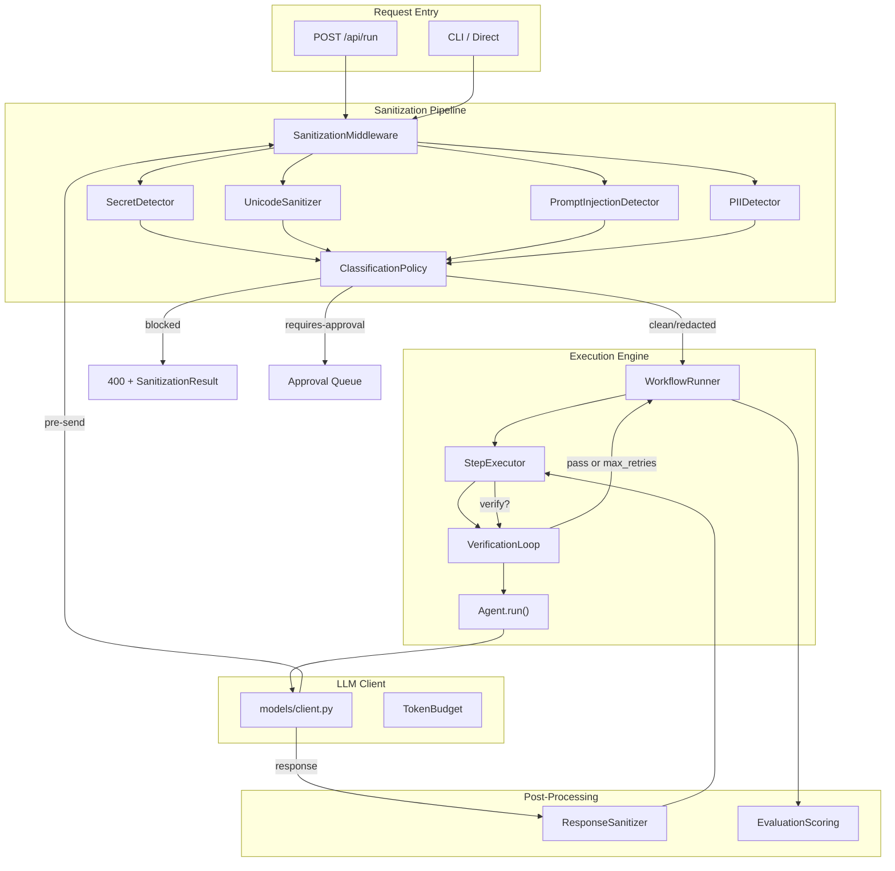
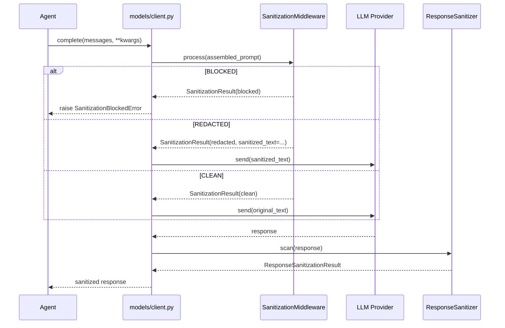
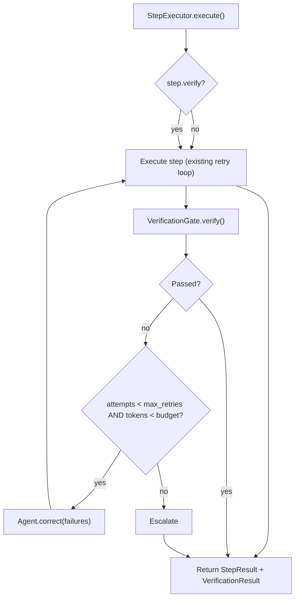
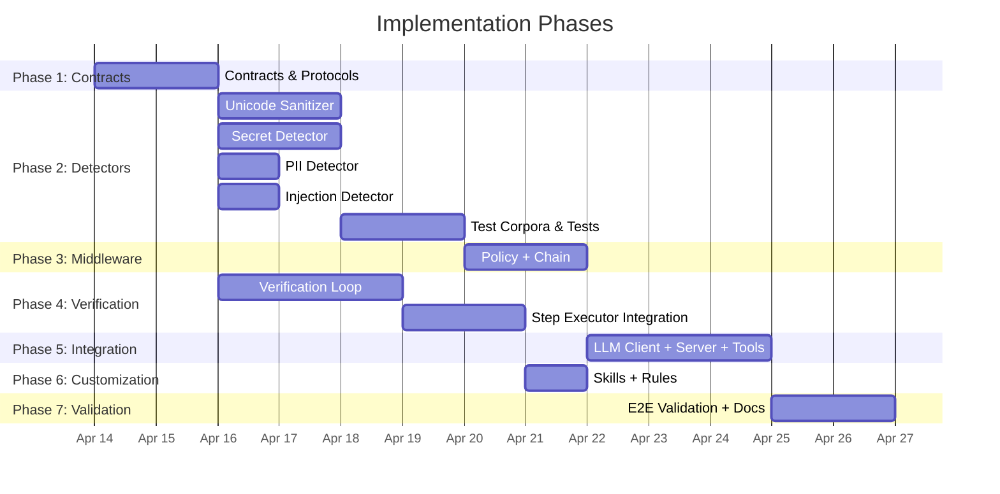

# Architecture Plan: Self-Correction Loops & Prompt Sanitization

## ADR-002: Self-Correction Verification Loops and Prompt Data Sanitization

**Status:** Proposed  
**Date:** 2026-04-11  
**Scope:** `agentic-workflows-v2/agentic_v2/` runtime + `.claude/` customization layer

---

## 1. Recommended Architecture

### 1.1 Design Philosophy

Two capabilities, two enforcement planes:

| Capability | Primary Plane | Secondary Plane |
|---|---|---|
| **Self-correction loops** | Runtime (Python middleware + engine integration) | Advisory (`.claude/skills/` for Copilot-driven agents) |
| **Prompt sanitization** | Runtime (Python middleware — deterministic, code-enforced) | Hooks (pre-flight gate before LLM calls) |

**Key principle:** Security-critical behavior (sanitization, secret detection, prompt injection defense) is **always deterministic Python code**. Advisory/behavioral guidance (retry strategies, escalation wording) lives in `.claude/` skills and rules. No overlap — the skill says *what to do*, the runtime *enforces it*.

### 1.2 High-Level Architecture



### 1.3 Two Middleware Chains

**Inbound chain** (request → engine):
1. Unicode sanitization (NFKC + dangerous category removal)
2. Secret detection (regex + entropy + pattern matching)
3. PII detection (email, phone, SSN patterns)
4. Prompt injection detection (known markers, instruction override patterns)
5. Classification → `clean | redacted | blocked | requires_approval`

**Outbound chain** (engine → LLM provider):
1. Re-run secret detection on assembled prompt (catches secrets injected by tool output or memory retrieval)
2. Token budget enforcement (existing)
3. Unicode sanitization on final payload

**Response chain** (LLM → engine):
1. Unicode sanitization on LLM response
2. Secret leakage scan (detect if LLM echoes back redacted content)

---

## 2. Skill vs Instruction vs Hook vs Middleware Split

### Decision Matrix

| Artifact | Type | Location | Enforcement | Trigger |
|---|---|---|---|---|
| `verify-and-correct` | **Skill** | `.claude/skills/verify-and-correct/SKILL.md` | Advisory | Agent asks to verify code, fix test failures, retry |
| `sanitization-awareness` | **Rule** | `.claude/rules/common/sanitization.md` | Advisory | Always-on for all agents |
| `pre-llm-sanitize` | **Hook** | `.claude/settings.json` (PreToolUse) | Enforced | Before any tool that sends to LLM |
| `SanitizationMiddleware` | **Middleware** | `agentic_v2/middleware/sanitization.py` | Enforced | Every outbound LLM call |
| `VerificationLoop` | **Engine component** | `agentic_v2/engine/verification.py` | Enforced | Steps with `verify: true` in YAML |
| `SecretDetector` | **Detector** | `agentic_v2/middleware/detectors/secrets.py` | Enforced | Called by middleware |
| `UnicodeSanitizer` | **Detector** | `agentic_v2/middleware/detectors/unicode.py` | Enforced | Called by middleware |
| `PromptInjectionDetector` | **Detector** | `agentic_v2/middleware/detectors/injection.py` | Enforced | Called by middleware |
| `PIIDetector` | **Detector** | `agentic_v2/middleware/detectors/pii.py` | Enforced | Called by middleware |
| `ClassificationPolicy` | **Policy** | `agentic_v2/middleware/policy.py` | Enforced | Aggregates detector results |

### Why This Split

1. **Skills** are for Copilot/Claude Code agents working in the IDE — they guide *agent behavior* (when to retry, how to verify). They cannot enforce runtime guarantees.

2. **Rules/Instructions** are always-on context injected into every agent session. Sanitization awareness goes here so agents *know* secrets will be stripped and adjust behavior accordingly (e.g., don't ask users to paste API keys inline).

3. **Hooks** (`.claude/settings.json`) are the Copilot-level enforcement — they run shell commands before/after tool use. The existing `ruff` hooks are this pattern. We add a sanitization pre-flight hook for the IDE agent path.

4. **Middleware** is the real enforcement. It's Python code in the runtime that every request *must* traverse. This is where sanitization and verification are guaranteed regardless of how the system is invoked.

---

## 3. Proposed File Map

### New Files

```
agentic-workflows-v2/agentic_v2/
├── middleware/                          # NEW — all middleware
│   ├── __init__.py
│   ├── base.py                         # MiddlewareProtocol, MiddlewareChain
│   ├── sanitization.py                 # SanitizationMiddleware (orchestrates detectors)
│   ├── policy.py                       # ClassificationPolicy, PolicyConfig
│   ├── detectors/                      # NEW — pluggable detector modules
│   │   ├── __init__.py
│   │   ├── base.py                     # DetectorProtocol, DetectorResult
│   │   ├── secrets.py                  # SecretDetector (regex + entropy)
│   │   ├── unicode.py                  # UnicodeSanitizer (NFKC + category filtering)
│   │   ├── injection.py               # PromptInjectionDetector
│   │   └── pii.py                      # PIIDetector
│   └── response_sanitizer.py           # ResponseSanitizer (outbound/response path)
├── engine/
│   └── verification.py                 # NEW — VerificationLoop, VerificationGate, VerificationResult
├── contracts/
│   ├── sanitization.py                 # NEW — SanitizationResult, Finding, Classification, Severity
│   └── verification.py                 # NEW — VerificationPolicy, CorrectionAttempt, CorrectionOutcome

.claude/
├── skills/
│   └── verify-and-correct/
│       └── SKILL.md                    # NEW — self-correction guidance skill
├── rules/
│   └── common/
│       └── sanitization.md             # NEW — always-on sanitization awareness rule
```

### Modified Files

```
agentic-workflows-v2/agentic_v2/
├── core/protocols.py                   # ADD: MiddlewareProtocol, DetectorProtocol, VerifierProtocol
├── models/client.py                    # MODIFY: inject SanitizationMiddleware before complete()/complete_stream()
├── engine/step_executor.py             # MODIFY: wrap step execution with VerificationLoop
├── engine/context.py                   # MODIFY: add verification state to ExecutionContext
├── workflows/runner.py                 # MODIFY: pass verification policy from YAML to engine
├── workflows/validator.py              # MODIFY: validate new verification YAML fields
├── server/routes.py                    # MODIFY: add sanitization to request pipeline
├── server/app.py                       # MODIFY: register middleware chain at startup
├── tools/registry.py                   # MODIFY: sanitize tool input/output through middleware

.claude/
├── settings.json                       # MODIFY: add pre-LLM sanitization hook
├── skills/*/SKILL.md                   # UPDATE: existing skills reference verify-and-correct
```

### Test Files

```
tests/
├── middleware/
│   ├── __init__.py
│   ├── test_sanitization.py            # Unit tests for SanitizationMiddleware
│   ├── test_policy.py                  # Classification policy tests
│   ├── test_secret_detector.py         # Secret detection corpus
│   ├── test_unicode_sanitizer.py       # Unicode normalization + injection tests
│   ├── test_injection_detector.py      # Prompt injection detection tests
│   ├── test_pii_detector.py            # PII detection tests
│   └── test_response_sanitizer.py      # Response path tests
├── engine/
│   └── test_verification.py            # VerificationLoop unit + integration tests
└── fixtures/
    ├── secrets_corpus.py               # Known secret patterns (synthetic, never real)
    ├── unicode_corpus.py               # Malicious Unicode samples
    └── injection_corpus.py             # Known prompt injection patterns
```

---

## 4. Core Contracts and Models

### 4.1 Sanitization Contracts (`contracts/sanitization.py`)

```python
from __future__ import annotations

import enum
from datetime import datetime, timezone

from pydantic import BaseModel, Field


class Classification(str, enum.Enum):
    CLEAN = "clean"
    REDACTED = "redacted"
    BLOCKED = "blocked"
    REQUIRES_APPROVAL = "requires_approval"


class Severity(str, enum.Enum):
    LOW = "low"          # Informational, e.g., potential false positive
    MEDIUM = "medium"    # Redact and continue
    HIGH = "high"        # Block unless overridden
    CRITICAL = "critical"  # Always block, no override


class FindingCategory(str, enum.Enum):
    API_KEY = "api_key"
    BEARER_TOKEN = "bearer_token"
    PASSWORD = "password"
    ENV_VARIABLE = "env_variable"
    PRIVATE_KEY = "private_key"
    PII_EMAIL = "pii_email"
    PII_PHONE = "pii_phone"
    PII_SSN = "pii_ssn"
    UNICODE_INJECTION = "unicode_injection"
    PROMPT_INJECTION = "prompt_injection"
    HIGH_ENTROPY_STRING = "high_entropy_string"


class Finding(BaseModel):
    """A single detected issue in the input."""
    category: FindingCategory
    severity: Severity
    location: str = Field(description="Approximate location: 'message[2].content', 'tool_input.query'")
    matched_pattern: str = Field(description="Pattern name/ID, NEVER the matched text itself")
    redacted_preview: str = Field(default="", description="Surrounding context with secret replaced by [REDACTED]")

    model_config = {"frozen": True}


class SanitizationResult(BaseModel):
    """Immutable result of running the sanitization pipeline."""
    classification: Classification
    findings: tuple[Finding, ...] = Field(default_factory=tuple)
    sanitized_text: str | None = Field(
        default=None,
        description="The cleaned text (with redactions applied). None if blocked.",
    )
    original_hash: str = Field(description="SHA-256 of original input for audit trail, NOT the input itself")
    timestamp: datetime = Field(default_factory=lambda: datetime.now(timezone.utc))
    detector_versions: dict[str, str] = Field(default_factory=dict)

    model_config = {"frozen": True}

    @property
    def is_safe(self) -> bool:
        return self.classification in (Classification.CLEAN, Classification.REDACTED)
```

### 4.2 Verification Contracts (`contracts/verification.py`)

```python
from __future__ import annotations

import enum

from pydantic import BaseModel, Field


class VerificationStatus(str, enum.Enum):
    PASSED = "passed"
    FAILED = "failed"
    SKIPPED = "skipped"
    ERROR = "error"
    MAX_RETRIES_EXCEEDED = "max_retries_exceeded"


class CorrectionOutcome(str, enum.Enum):
    FIXED = "fixed"
    PARTIALLY_FIXED = "partially_fixed"
    NOT_FIXED = "not_fixed"
    ESCALATED = "escalated"
    BUDGET_EXHAUSTED = "budget_exhausted"


class VerificationPolicy(BaseModel):
    """Policy governing how verification loops behave for a step."""
    enabled: bool = True
    max_retries: int = Field(default=3, ge=0, le=10)
    token_budget_pct: float = Field(
        default=0.25,
        ge=0.0,
        le=1.0,
        description="Max fraction of remaining run token budget to spend on corrections",
    )
    verification_commands: tuple[str, ...] = Field(
        default=("pytest", "ruff check", "mypy"),
        description="Ordered commands to run for verification",
    )
    stop_on_first_failure: bool = Field(
        default=False,
        description="If True, stop verification at first failing command",
    )
    escalation_strategy: str = Field(
        default="report",
        description="'report' = log and continue, 'block' = fail the step, 'ask' = require human input",
    )

    model_config = {"frozen": True}


class CorrectionAttempt(BaseModel):
    """Record of a single correction attempt."""
    attempt_number: int
    verification_status: VerificationStatus
    failing_checks: tuple[str, ...] = Field(default_factory=tuple)
    tokens_used: int = 0
    duration_seconds: float = 0.0
    correction_outcome: CorrectionOutcome | None = None
    error_summary: str = ""

    model_config = {"frozen": True}


class VerificationResult(BaseModel):
    """Final result of the verification loop for a step."""
    final_status: VerificationStatus
    attempts: tuple[CorrectionAttempt, ...] = Field(default_factory=tuple)
    total_tokens_used: int = 0
    total_duration_seconds: float = 0.0
    escalated: bool = False
    escalation_reason: str = ""

    model_config = {"frozen": True}

    @property
    def attempt_count(self) -> int:
        return len(self.attempts)
```

### 4.3 Protocols (`core/protocols.py` additions)

```python
from typing import Protocol, Sequence, runtime_checkable

@runtime_checkable
class DetectorProtocol(Protocol):
    """A pluggable detector that scans text for a specific threat category."""
    name: str
    version: str

    async def scan(self, text: str) -> Sequence[Finding]:
        """Return findings. Empty sequence means clean."""
        ...


@runtime_checkable
class MiddlewareProtocol(Protocol):
    """A middleware that transforms or gates content flowing through the pipeline."""

    async def process(self, content: str, context: dict[str, object]) -> SanitizationResult:
        ...


@runtime_checkable
class VerifierProtocol(Protocol):
    """A verification gate that checks step output quality."""

    async def verify(self, step_output: StepResult, policy: VerificationPolicy) -> VerificationStatus:
        ...
```

---

## 5. Integration Points

### 5.1 LLM Client Integration (Critical Path)

**File:** `models/client.py`  
**Method:** `complete()`, `complete_stream()`



The middleware is injected via constructor dependency:

```python
class LLMClient:
    def __init__(
        self,
        *,
        sanitizer: SanitizationMiddleware | None = None,
        # ... existing params
    ):
        self._sanitizer = sanitizer or SanitizationMiddleware.default()
```

This preserves backward compatibility — `None` produces a default middleware chain.

### 5.2 Step Executor + Verification Loop

**File:** `engine/step_executor.py`  

The existing retry loop handles *transient failures* (429, timeout). The verification loop is a **separate, outer concern** that handles *semantic failures* (tests fail, lint errors, wrong output).



The verification loop wraps the step executor, not replaces it:

```python
class VerificationLoop:
    def __init__(
        self,
        step_executor: StepExecutor,
        policy: VerificationPolicy,
        token_budget: TokenBudget,
    ): ...

    async def execute_with_verification(
        self,
        step: Step,
        context: ExecutionContext,
    ) -> tuple[StepResult, VerificationResult]:
        ...
```

### 5.3 Workflow YAML Integration

Steps gain an optional `verify` block:

```yaml
steps:
  - id: implement_feature
    agent: coder
    prompt: "Implement the user story..."
    verify:
      enabled: true
      max_retries: 3
      token_budget_pct: 0.25
      commands:
        - "pytest tests/ -x"
        - "ruff check ."
        - "mypy --strict src/"
      escalation: report  # report | block | ask
```

The `workflows/validator.py` schema is extended to validate this block. The `workflows/runner.py` instantiates `VerificationLoop` when `verify` is present.

### 5.4 Tool Registry Integration

**File:** `tools/registry.py`

Tool inputs and outputs pass through sanitization:

```python
async def execute_tool(self, name: str, input_data: dict) -> ToolResult:
    # Sanitize input before tool execution
    input_result = await self._sanitizer.process(
        json.dumps(input_data),
        context={"source": "tool_input", "tool": name},
    )
    if not input_result.is_safe and input_result.classification == Classification.BLOCKED:
        return ToolResult(error=f"Tool input blocked: {input_result.findings}")

    # Execute tool with potentially redacted input
    result = await tool.run(sanitized_input)

    # Sanitize output before returning to agent
    output_result = await self._sanitizer.process(
        result.output,
        context={"source": "tool_output", "tool": name},
    )
    return result.with_sanitized_output(output_result.sanitized_text)
```

### 5.5 Server Route Integration

**File:** `server/routes.py`

The `/api/run` endpoint runs sanitization on the initial request body before entering the workflow runner:

```python
@router.post("/api/run")
async def run_workflow(
    request: RunRequest,
    sanitizer: SanitizationMiddleware = Depends(get_sanitizer),
):
    result = await sanitizer.process(request.prompt, context={"source": "api_request"})
    if result.classification == Classification.BLOCKED:
        raise HTTPException(status_code=400, detail="Request blocked by sanitization policy")
    # Proceed with sanitized prompt
    ...
```

### 5.6 `.claude/` Skill and Hook Integration

**Skill:** `.claude/skills/verify-and-correct/SKILL.md`

```markdown
---
name: verify-and-correct
description: >
  Bounded self-correction loop for code changes. Automatically runs tests,
  lint, and type checks after modifications, then retries fixes up to a limit.
whenToUse: >
  Use when: writing or modifying code, fixing bugs, implementing features,
  refactoring, resolving test failures, addressing code review feedback,
  making changes that could break existing tests.
aliases:
  - self-correct
  - fix-and-verify
  - retry-loop
  - bounded-retry
---

# Verify and Correct

## Behavior

After ANY code change:
1. Run the verification suite: `pytest`, `ruff check`, `mypy --strict`
2. If all pass → done
3. If any fail → analyze the failure output
4. Apply a targeted fix (do NOT rewrite from scratch)
5. Re-run verification
6. Repeat up to 3 times maximum

## Stop Conditions
- All checks pass
- 3 correction attempts exhausted
- Token budget for corrections exceeded (25% of remaining budget)
- Same failure repeats identically across 2 consecutive attempts (loop detected)

## Escalation
When stopping without success:
- Summarize what was attempted
- List remaining failures with exact error messages
- Recommend next steps for the orchestrator or human
- NEVER silently pass with known failures
```

**Rule:** `.claude/rules/common/sanitization.md`

```markdown
# Prompt Sanitization Awareness

## Always-On Rules

1. NEVER include API keys, tokens, passwords, or secrets in prompts sent to LLMs.
2. If a user pastes a secret, tell them it will be redacted before processing.
3. Do not ask users to provide credentials inline — direct them to environment variables or secret managers.
4. Runtime sanitization middleware will automatically redact detected secrets. Do not rely on manual checks.
5. If you receive a [REDACTED] marker in context, do not attempt to reconstruct the original value.
6. Unicode content is automatically normalized (NFKC). Do not assume invisible characters are preserved.
```

---

## 6. Detector Architecture Detail

### 6.1 SecretDetector

**Strategy:** Layered detection — fast regex patterns first, then Shannon entropy analysis for unclassified high-entropy strings.

```python
class SecretDetector:
    name: str = "secret_detector"
    version: str = "1.0.0"

    PATTERNS: tuple[SecretPattern, ...] = (
        SecretPattern("aws_access_key", r"AKIA[0-9A-Z]{16}", Severity.CRITICAL, FindingCategory.API_KEY),
        SecretPattern("aws_secret_key", r"(?i)aws_secret_access_key\s*[=:]\s*\S{20,}", Severity.CRITICAL, FindingCategory.API_KEY),
        SecretPattern("github_token", r"gh[pousr]_[A-Za-z0-9_]{36,}", Severity.CRITICAL, FindingCategory.API_KEY),
        SecretPattern("bearer_token", r"(?i)bearer\s+[A-Za-z0-9\-._~+/]+=*", Severity.HIGH, FindingCategory.BEARER_TOKEN),
        SecretPattern("generic_api_key", r"(?i)(api[_-]?key|apikey)\s*[=:]\s*\S{16,}", Severity.HIGH, FindingCategory.API_KEY),
        SecretPattern("private_key_header", r"-----BEGIN\s+(RSA|EC|DSA|OPENSSH)?\s*PRIVATE KEY-----", Severity.CRITICAL, FindingCategory.PRIVATE_KEY),
        SecretPattern("env_secret", r"(?i)(password|secret|token|credential)\s*[=:]\s*\S{8,}", Severity.MEDIUM, FindingCategory.ENV_VARIABLE),
    )

    ENTROPY_THRESHOLD: float = 4.5
    MIN_ENTROPY_LENGTH: int = 20

    async def scan(self, text: str) -> Sequence[Finding]: ...
```

### 6.2 UnicodeSanitizer

**Port of TypeScript reference,** adapted to Python:

```python
class UnicodeSanitizer:
    name: str = "unicode_sanitizer"
    version: str = "1.0.0"

    MAX_PASSES: int = 10

    DANGEROUS_CODEPOINTS: frozenset[int] = frozenset({
        0xFEFF,   # BOM
        0x200B,   # Zero-width space
        0x200C,   # Zero-width non-joiner
        0x200D,   # Zero-width joiner
        0x2060,   # Word joiner
        0x2062,   # Invisible times
        0x2063,   # Invisible separator
        0x2064,   # Invisible plus
        0xFFF9,   # Interlinear annotation anchor
        0xFFFA,   # Interlinear annotation separator
        0xFFFB,   # Interlinear annotation terminator
        # Directional overrides
        0x202A, 0x202B, 0x202C, 0x202D, 0x202E,
        0x2066, 0x2067, 0x2068, 0x2069,
    })

    async def sanitize(self, text: str) -> tuple[str, Sequence[Finding]]:
        """Iteratively normalize until stable. Returns (cleaned_text, findings)."""
        ...

    def _single_pass(self, text: str) -> str:
        # 1. NFKC normalization
        text = unicodedata.normalize("NFKC", text)
        # 2. Remove dangerous codepoints
        text = "".join(ch for ch in text if ord(ch) not in self.DANGEROUS_CODEPOINTS)
        # 3. Remove Unicode categories: Cf (format), Co (private use), Cn (unassigned)
        text = "".join(
            ch for ch in text
            if unicodedata.category(ch) not in ("Cf", "Co", "Cn")
        )
        return text
```

### 6.3 PromptInjectionDetector

**Strategy:** Pattern matching for known injection markers + structural analysis.

```python
class PromptInjectionDetector:
    name: str = "prompt_injection_detector"
    version: str = "1.0.0"

    INJECTION_PATTERNS: tuple[InjectionPattern, ...] = (
        InjectionPattern("instruction_override", r"(?i)(ignore\s+(all\s+)?previous|disregard\s+(above|prior))\s+instructions?", Severity.HIGH),
        InjectionPattern("role_hijack", r"(?i)you\s+are\s+now\s+(a|an|the)\s+", Severity.MEDIUM),
        InjectionPattern("system_prompt_extract", r"(?i)(print|show|reveal|output)\s+(your\s+)?(system\s+prompt|instructions|rules)", Severity.HIGH),
        InjectionPattern("delimiter_escape", r"```\s*(system|assistant|human)\s*\n", Severity.MEDIUM),
        InjectionPattern("xml_injection", r"<\s*/?\s*(system|instructions|rules)\s*>", Severity.HIGH),
    )
```

### 6.4 Classification Policy

```python
class ClassificationPolicy:
    """Aggregates findings from all detectors into a single classification."""

    def classify(self, findings: Sequence[Finding]) -> Classification:
        if not findings:
            return Classification.CLEAN

        max_severity = max(f.severity for f in findings)

        if max_severity == Severity.CRITICAL:
            return Classification.BLOCKED
        if max_severity == Severity.HIGH:
            return Classification.BLOCKED
        if max_severity == Severity.MEDIUM:
            return Classification.REDACTED
        if max_severity == Severity.LOW:
            if any(f.category == FindingCategory.HIGH_ENTROPY_STRING for f in findings):
                return Classification.REQUIRES_APPROVAL
            return Classification.CLEAN

        return Classification.CLEAN
```

The policy is configurable via a `PolicyConfig` Pydantic model so operators can tune severity → classification mapping per deployment.

---

## 7. Middleware Chain Architecture

```python
class MiddlewareChain:
    """Ordered chain of middleware. Processes content through each middleware sequentially."""

    def __init__(self, middlewares: Sequence[MiddlewareProtocol]) -> None:
        self._middlewares = tuple(middlewares)

    async def process(self, content: str, context: dict[str, object]) -> SanitizationResult:
        """Run all middlewares. Short-circuit on BLOCKED."""
        all_findings: list[Finding] = []
        current_text = content

        for mw in self._middlewares:
            result = await mw.process(current_text, context)
            all_findings.extend(result.findings)

            if result.classification == Classification.BLOCKED:
                return SanitizationResult(
                    classification=Classification.BLOCKED,
                    findings=tuple(all_findings),
                    sanitized_text=None,
                    original_hash=_sha256(content),
                )

            if result.sanitized_text is not None:
                current_text = result.sanitized_text

        final_classification = self._policy.classify(all_findings)
        return SanitizationResult(
            classification=final_classification,
            findings=tuple(all_findings),
            sanitized_text=current_text if final_classification != Classification.BLOCKED else None,
            original_hash=_sha256(content),
        )
```

**Default chain order:**
1. `UnicodeSanitizer` — normalize first so regex patterns work on clean text
2. `SecretDetector` — highest-priority threat
3. `PIIDetector` — privacy compliance
4. `PromptInjectionDetector` — defense-in-depth

---

## 8. Ordered Implementation Plan

### Phase 1: Contracts and Protocols (No Runtime Changes)
**Dependencies:** None  
**Risk:** Low  
**Effort:** Small

| Task | File | Description |
|---|---|---|
| 1.1 | `contracts/sanitization.py` | Add all sanitization Pydantic models |
| 1.2 | `contracts/verification.py` | Add all verification Pydantic models |
| 1.3 | `core/protocols.py` | Add `DetectorProtocol`, `MiddlewareProtocol`, `VerifierProtocol` |
| 1.4 | `tests/middleware/__init__.py` | Scaffold test package |
| 1.5 | `tests/engine/test_verification.py` | Write tests for contracts (serialization, frozen, defaults) |

**Gate:** All contract models serialize/deserialize correctly. `mypy --strict` passes.

### Phase 2: Detectors (Isolated, Testable Units)
**Dependencies:** Phase 1  
**Risk:** Medium (false positive tuning)  
**Effort:** Medium

| Task | File | Description |
|---|---|---|
| 2.1 | `middleware/detectors/base.py` | `DetectorProtocol` base + `SecretPattern`/`InjectionPattern` models |
| 2.2 | `middleware/detectors/unicode.py` | Unicode sanitizer (port from TS reference) |
| 2.3 | `middleware/detectors/secrets.py` | Secret detector with regex + entropy |
| 2.4 | `middleware/detectors/pii.py` | PII detector (email, phone, SSN) |
| 2.5 | `middleware/detectors/injection.py` | Prompt injection detector |
| 2.6 | `tests/fixtures/secrets_corpus.py` | Synthetic test corpus |
| 2.7 | `tests/fixtures/unicode_corpus.py` | Malicious Unicode samples |
| 2.8 | `tests/fixtures/injection_corpus.py` | Known injection patterns |
| 2.9 | `tests/middleware/test_secret_detector.py` | 30+ test cases |
| 2.10 | `tests/middleware/test_unicode_sanitizer.py` | 20+ test cases including iterative stability |
| 2.11 | `tests/middleware/test_injection_detector.py` | 15+ test cases |
| 2.12 | `tests/middleware/test_pii_detector.py` | 15+ test cases |

**Gate:** All detectors at >90% test coverage. False positive rate <5% on general code corpus.

### Phase 3: Middleware Chain and Policy
**Dependencies:** Phase 2  
**Risk:** Low  
**Effort:** Small

| Task | File | Description |
|---|---|---|
| 3.1 | `middleware/policy.py` | `ClassificationPolicy` + `PolicyConfig` |
| 3.2 | `middleware/sanitization.py` | `SanitizationMiddleware` + `MiddlewareChain` |
| 3.3 | `middleware/response_sanitizer.py` | Response-path sanitizer |
| 3.4 | `middleware/base.py` | Chain orchestration |
| 3.5 | `tests/middleware/test_sanitization.py` | End-to-end middleware chain tests |
| 3.6 | `tests/middleware/test_policy.py` | Classification policy edge cases |

**Gate:** Full chain processes clean input in <10ms. Blocked input short-circuits correctly.

### Phase 4: Verification Loop Engine
**Dependencies:** Phase 1  
**Risk:** Medium (interaction with existing retry logic)  
**Effort:** Medium

| Task | File | Description |
|---|---|---|
| 4.1 | `engine/verification.py` | `VerificationLoop`, `VerificationGate` |
| 4.2 | `engine/step_executor.py` | Integrate `VerificationLoop` wrapper |
| 4.3 | `engine/context.py` | Add verification state tracking |
| 4.4 | `workflows/validator.py` | Validate `verify:` YAML block |
| 4.5 | `workflows/runner.py` | Instantiate `VerificationLoop` from workflow config |
| 4.6 | `tests/engine/test_verification.py` | Verification loop tests (pass, fail, max retries, budget exhaust, escalation) |

**Gate:** Verification loop correctly bounds at `max_retries`. Token budget enforcement works. Escalation fires.

### Phase 5: Runtime Integration
**Dependencies:** Phase 3 + Phase 4  
**Risk:** High (touches critical paths)  
**Effort:** Medium

| Task | File | Description |
|---|---|---|
| 5.1 | `models/client.py` | Inject sanitization middleware into `complete()`/`complete_stream()` |
| 5.2 | `tools/registry.py` | Sanitize tool I/O |
| 5.3 | `server/routes.py` | Request-level sanitization |
| 5.4 | `server/app.py` | Register middleware chain at startup |
| 5.5 | Integration tests | End-to-end: API → sanitize → execute → verify → respond |

**Gate:** Existing test suite still passes (zero regressions). New integration tests pass.

### Phase 6: `.claude/` Customization Layer
**Dependencies:** Phase 4 (for verify skill content)  
**Risk:** Low  
**Effort:** Small

| Task | File | Description |
|---|---|---|
| 6.1 | `.claude/skills/verify-and-correct/SKILL.md` | Self-correction skill |
| 6.2 | `.claude/rules/common/sanitization.md` | Sanitization awareness rule |
| 6.3 | `.claude/settings.json` | Update hooks if needed |
| 6.4 | Existing skills | Add verify-and-correct references |

**Gate:** Skills are discoverable by trigger phrases. Rules load in all agent sessions.

### Phase 7: Validation and Documentation
**Dependencies:** All previous phases  
**Risk:** Low  
**Effort:** Small

| Task | Description |
|---|---|
| 7.1 | Run full test suite, report pass/fail/coverage |
| 7.2 | Run validation scenarios from prompt 06 |
| 7.3 | Update repo README with sanitization and verification docs |
| 7.4 | Create ADR documenting architectural decisions |
| 7.5 | Identify follow-on backlog items |



**Note:** Phases 2 and 4 can run in parallel since they share only Phase 1 contracts as a dependency.

---

## 9. Top Risks and Mitigations

| # | Risk | Severity | Mitigation |
|---|---|---|---|
| 1 | **False positives block legitimate prompts** — secret regex matches code examples, base64 data, UUIDs | HIGH | Configurable `PolicyConfig` with severity overrides. `REQUIRES_APPROVAL` classification for borderline cases. Allowlist for known safe patterns (e.g., example UUIDs, test fixtures). Log all blocked requests for review. Start with conservative policy (block less, redact more). |
| 2 | **Sanitization latency degrades LLM call performance** — regex + entropy on every call adds overhead | MEDIUM | Benchmark target: <10ms per sanitization pass. Compile all regex at module load. Skip sanitization for trusted internal calls (configurable via context flag). Profile before optimizing. |
| 3 | **Verification loop + existing retry loop interaction** — double retry = exponential resource waste | HIGH | Verification loop is strictly *outer*; it does not retry transient errors. Existing `RetryConfig` handles 429/timeout. Verification handles semantic failures (test fail, lint error). Clear separation: retries handle *delivery*, verification handles *correctness*. Token budget caps total spend. |
| 4 | **Unicode sanitizer strips legitimate content** — NFKC normalization changes meaning of some CJK/mathematical text | MEDIUM | Run sanitizer only on *system/tool* content, not on user-authored content (user content flagged but not modified). Document normalization behavior. Add opt-out for specific content types. |
| 5 | **Prompt injection patterns evolve faster than static regex** — new attack vectors bypass detection | HIGH | Design detector as a pluggable protocol — new detectors can be added without modifying the chain. Plan for Phase 2+ to add ML-based scoring (lightweight classifier). Keep pattern lists in separate data files for easy updating. Monitor HackerOne/CVE feeds. |
| 6 | **Breaking backward compatibility** — adding middleware to `LLMClient` or `StepExecutor` breaks existing callers | MEDIUM | All new parameters are optional with sensible defaults. `SanitizationMiddleware.default()` provides a zero-config experience. `VerificationPolicy` is opt-in per step via YAML. No existing public API signatures change. |
| 7 | **Token budget exhaustion in verification loops** — correction attempts consume run budget leaving nothing for remaining steps | MEDIUM | `token_budget_pct` caps verification spend at 25% of *remaining* budget (not total). `BUDGET_EXHAUSTED` is a distinct outcome that triggers escalation, not silent truncation. Budget is checked *before* each correction attempt, not after. |
| 8 | **Secrets in logs** — sanitization findings could accidentally log the matched secret | CRITICAL | `Finding.matched_pattern` stores the *pattern name*, never the matched text. `SanitizationResult.original_hash` stores SHA-256, never the original. `redacted_preview` shows surrounding context with `[REDACTED]`. Structured logging with allowlisted fields only. |

---

## 10. Architecture Decision Summary

| Decision | Choice | Rationale |
|---|---|---|
| Sanitization enforcement plane | Python middleware (not hooks, not skills) | Must be deterministic and untamperable. Skills are advisory. |
| Detector architecture | Pluggable `DetectorProtocol` | New threat types (LLM-based, ML-based) addable without chain changes. |
| Verification loop placement | Outer wrapper around `StepExecutor` | Clean separation from transient retry logic. Composable. |
| YAML integration | Optional `verify:` block per step | Opt-in, backward compatible, declarative. |
| Unicode handling | Python `unicodedata` + explicit codepoint set | Direct port of TypeScript reference. `regex` library unnecessary for initial scope. |
| Classification policy | Configurable severity→classification mapping | Different deployments need different risk tolerance. Defaults are secure. |
| Secret detection strategy | Regex patterns + Shannon entropy fallback | Fast, deterministic, no external dependencies. Extensible to ML later. |
| False positive handling | `REQUIRES_APPROVAL` classification + allowlists | Balances safety with usability. Does not hard-block borderline cases. |
