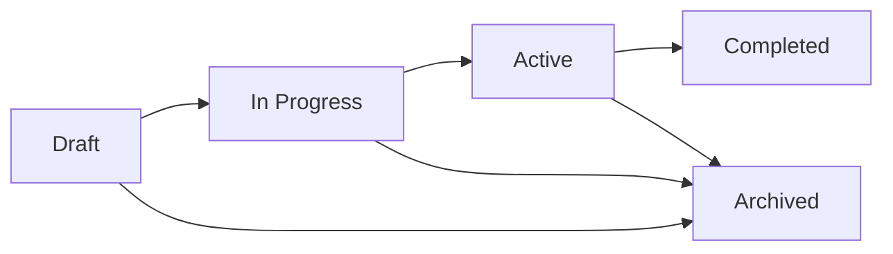

# Planning

Strategic planning documents, architectural frameworks, and repository evolution documentation. This directory tracks the long-term vision, design decisions, and organizational improvements for the Enterprise AI Prompt Library.

## 📚 Overview

The **Planning** directory contains forward-looking documentation about library architecture, refactoring strategies, and repository maintenance. These documents help contributors understand the project's direction, architectural decisions, and planned improvements.

**Target Audience**: Contributors, maintainers, architects, and technical leads interested in the library's evolution and strategic direction.

## 📁 Contents

### Repository Management

| Document | Description | Status |
| ---------- | ------------- | -------- |
| **[Repository Cleanup Analysis](REPOSITORY_CLEANUP_ANALYSIS.md)** | Analysis of repo structure, duplicates, and cleanup recommendations | Active |
| **[Repo Update Tracking](REPO_UPDATE_TRACKING.md)** | Change log for major repository reorganizations | Active |

### Architectural Planning

| Document | Description | Status |
| ---------- | ------------- | -------- |
| **[Tree-of-Thoughts Architecture Evaluator](tree-of-thoughts-architecture-evaluator.md)** | Design for advanced reasoning pattern implementation | In Progress |
| **[Tree-of-Thoughts Evaluator Reflection](tree-of-thoughts-evaluator-reflection.md)** | Analysis and lessons learned from ToT implementation | In Progress |
| **[Tree-of-Thoughts Template](tree-of-thoughts-template.md)** | Reusable template for ToT prompt patterns | Draft |
| **[ToT Evaluator Ready](tot_evaluator_ready.md)** | Readiness assessment for ToT evaluator tool | Draft |

### Refactoring & Evolution

| Document | Description | Status |
| ---------- | ------------- | -------- |
| **[Prompt Library Refactor - ReAct](prompt-library-refactor-react.md)** | Plan for incorporating ReAct patterns into library | Proposed |

## 🎯 Use These Documents When
- ✅ You're **contributing** major features or refactors
- ✅ You want to **understand design decisions** behind library structure
- ✅ You're **proposing architectural changes** or improvements
- ✅ You need **context on past reorganizations** to avoid breaking changes
- ✅ You're **researching advanced patterns** like Tree-of-Thoughts
- ✅ You're a **maintainer** planning the next library version

## 🚀 Getting Started

### For Contributors

**Understanding the Library's Direction**:

1. **[Repository Cleanup Analysis](REPOSITORY_CLEANUP_ANALYSIS.md)** — See current structure and rationale
2. **[Repo Update Tracking](REPO_UPDATE_TRACKING.md)** — Review recent major changes
3. **[Prompt Library Refactor - ReAct](prompt-library-refactor-react.md)** — Understand planned improvements

### For Maintainers

**Managing Repository Evolution**:

1. Review **[REPOSITORY_CLEANUP_ANALYSIS.md](REPOSITORY_CLEANUP_ANALYSIS.md)** before major refactors
2. Update **[REPO_UPDATE_TRACKING.md](REPO_UPDATE_TRACKING.md)** after significant changes
3. Create new planning docs for proposed architectural shifts
4. Link planning docs in PRs for architectural changes

### For Architects

**Advanced Pattern Implementation**:

1. Study **[Tree-of-Thoughts Architecture](tree-of-thoughts-architecture-evaluator.md)** design
2. Review **[ToT Evaluator Reflection](tree-of-thoughts-evaluator-reflection.md)** for lessons learned
3. Use **[ToT Template](tree-of-thoughts-template.md)** for new implementations
4. Consider **[ReAct Refactor Plan](prompt-library-refactor-react.md)** for integration strategies

## 📖 Planning Document Types

### Analysis Documents

**Purpose**: Examine current state, identify issues, propose solutions

**Examples**:

- Repository structure analysis
- Technical debt assessments
- Performance audits
- Security reviews

**Format**:

```markdown
# Analysis Title
## Current State
## Issues Identified
## Recommendations
## Implementation Plan
```

### Architecture Documents

**Purpose**: Define technical design for major features or patterns

**Examples**:

- Tree-of-Thoughts evaluator design
- Multi-model orchestration framework
- Prompt validation pipeline

**Format**:

```markdown
# Architecture Title
## Goals & Objectives
## Design Overview
## Components
## Data Flow
## API Design
## Testing Strategy
## Deployment Plan
```

### Refactoring Plans

**Purpose**: Document planned changes to existing codebase or structure

**Examples**:

- Library reorganization
- Breaking changes roadmap
- Migration strategies

**Format**:

```markdown
# Refactor Plan
## Motivation
## Current Issues
## Proposed Changes
## Migration Path
## Backward Compatibility
## Timeline
```

### Tracking Documents

**Purpose**: Record historical changes and decision rationale

**Examples**:

- Repository update log
- Breaking changes history
- Deprecation timeline

**Format**:

```markdown
# Update Tracking
## [Version/Date] - Change Title
### What Changed
### Why Changed
### Migration Notes
```

## 🔗 Related Documentation

### Implementation Resources

- **[Concepts](../concepts/)** — Theory behind planned patterns
- **[Research](../research/)** — Evidence supporting architectural decisions
- **[Prompts Library](../../prompts/)** — Current prompt implementations

### Contributing

- **[CONTRIBUTING.md](../../CONTRIBUTING.md)** — How to propose changes
- **[Reference](../reference/)** — Standards and conventions
- **[Tutorials](../tutorials/)** — Learning resources for new patterns

## 💡 Key Planning Areas

### Repository Structure

Current focus areas:

- **Organization**: Logical directory structure for scalability
- **Duplication**: Eliminating redundant content
- **Naming**: Consistent file naming conventions
- **Navigation**: Clear path for users to find content
- **Automation**: CI/CD for validation and deployment

### Advanced Pattern Integration

Planned implementations:

- **Tree-of-Thoughts**: Multi-path reasoning evaluation
- **ReAct**: Iterative reasoning and action loops
- **Multi-Agent**: Orchestrated AI collaboration
- **Meta-Prompting**: Prompts that generate/improve prompts
- **Evaluation Framework**: Automated prompt quality assessment

### Documentation Evolution

Ongoing improvements:

- **Searchability**: Enhanced metadata and tagging
- **Interactivity**: Code sandboxes and live examples
- **Versioning**: Documentation for multiple library versions
- **Localization**: Multi-language support planning
- **Accessibility**: Screen reader and navigation improvements

### Governance & Compliance

Strategic considerations:

- **PII Handling**: Data classification policies
- **Citation Standards**: Research attribution requirements
- **Security Reviews**: Regular prompt security audits
- **License Compliance**: Third-party content attribution
- **Quality Gates**: Automated validation before merge

## 🛠️ Creating Planning Documents

### When to Create a Planning Doc

Create a planning document when:

- Proposing **architectural changes** affecting multiple components
- Planning **breaking changes** requiring migration path
- Conducting **analysis** of current state and issues
- Designing **new major features** or patterns
- Documenting **historical decisions** for future reference

### Planning Document Template

```markdown
---
title: "Planning Document Title"
type: "planning"
status: "draft|in-progress|active|completed|archived"
author: "Your Name"
created: "YYYY-MM-DD"
updated: "YYYY-MM-DD"
reviewers: ["Reviewer1", "Reviewer2"]
---

# [Document Title]

## Executive Summary
Brief overview (2-3 sentences) of the plan and its impact.

## Context & Motivation
Why is this needed? What problem does it solve?

## Goals & Non-Goals
**Goals:**

- What we're trying to achieve

**Non-Goals:**

- What's explicitly out of scope

## Current State
Detailed analysis of how things work today.

## Proposed Solution
Detailed design, architecture, or refactoring plan.

## Alternatives Considered
Other approaches evaluated and why they were not chosen.

## Implementation Plan

1. Phase 1: ...
2. Phase 2: ...

## Testing & Validation
How will we verify this works?

## Timeline
Estimated dates for key milestones.

## Risks & Mitigations
Potential issues and how we'll address them.

## Success Metrics
How will we measure if this was successful?

## Open Questions
Unresolved issues requiring discussion.

## References

- Links to research, issues, PRs, discussions

```

## 📊 Planning Status Workflow

Planning documents follow this lifecycle:



- **Draft**: Proposed idea, seeking feedback
- **In Progress**: Actively being implemented
- **Active**: Implementation complete, document serves as reference
- **Completed**: Goal achieved, archived for historical reference
- **Archived**: Superseded or no longer relevant

## ❓ Frequently Asked Questions

**Q: Should I create a planning doc or just open an issue?**  
A: Use issues for bugs or small features. Create planning docs for architectural changes, major refactors, or complex features requiring design discussion.

**Q: Who approves planning documents?**  
A: Repository maintainers review and approve. Complex changes may require community discussion.

**Q: How detailed should planning docs be?**  
A: Enough detail for implementation without requiring additional design work. Include diagrams, pseudocode, and API examples.

**Q: Can planning docs be updated after implementation?**  
A: Yes! Update with lessons learned, actual vs. planned differences, and implementation notes.

**Q: Are planning docs required for all PRs?**  
A: No. Only for significant architectural changes, breaking changes, or new major features.

## 🤝 Contributing

Help shape the library's future:

- **Propose new patterns** with architectural planning docs
- **Review planning documents** and provide feedback
- **Update tracking docs** after completing planned work
- **Create retrospectives** documenting lessons learned
- **Suggest improvements** to planning processes

See [CONTRIBUTING.md](../../CONTRIBUTING.md) for guidelines.

## 📄 License

All planning documentation is licensed under [MIT License](../../LICENSE).

---

**Next Steps**:

- 📖 Review: [Repository Cleanup Analysis](REPOSITORY_CLEANUP_ANALYSIS.md)
- 🚀 Propose: Create a planning doc for your idea
- 💬 Discuss: [GitHub Discussions](https://github.com/tafreeman/prompts/discussions)
