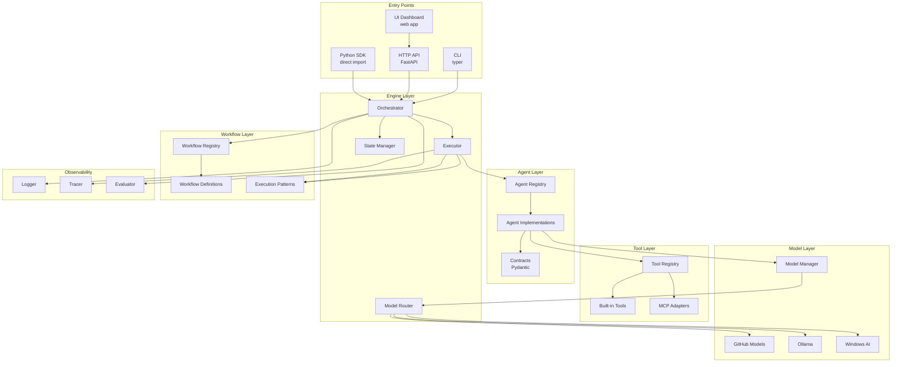

# Agentic Workflows v2 Architecture Plan

**Version:** 2.0  
**Date:** February 2, 2026  
**Status:** Draft - Architecture & Planning Phase  

---

## Executive Summary

This document outlines the architecture and migration plan for consolidating the existing agentic workflow tooling into a production-ready, team-deployable system. The new structure eliminates duplication in the long term, enforces schema validation between agents, provides proper tool integration, and implements missing control flow patterns. During migration, all existing code remains intact and a complete duplicate of required components is created in the new package to enable a safe cutover.

---

## 1. Current State Analysis

### 1.1 Identified Issues

| Issue Category | Description | Severity |
|----------------|-------------|----------|
| **Duplication** | Multiple orchestrator implementations (`multi_agent_orchestrator.py`, `workflow_runner.py`, `workflow_engine.py`) | High |
| **Path Fragmentation** | Workflow code spread across `multiagent-workflows/`, `tools/agents/`, `workflows/` | High |
| **Schema Enforcement** | Contracts exist but not enforced at runtime boundaries | Medium |
| **Tool Registration** | Tools declared in YAML but not connected to actual implementations | High |
| **Missing Loops** | No retry-with-feedback, self-refinement, or LATS patterns | Medium |
| **Import Chaos** | `sys.path` hacks throughout; non-standard module resolution | Medium |
| **Config Scatter** | YAML configs in multiple locations with inconsistent formats | Medium |
| **Missing Checkpointing** | No state persistence for long-running workflows | Medium |
| **UI Integration** | No consolidated UI layer for workflow execution | Medium |

### 1.2 Current File Locations

```
EXISTING LOCATIONS (to consolidate):
├── multiagent-workflows/
│   ├── src/multiagent_workflows/
│   │   ├── agents/           # Agent implementations (4 agents)
│   │   ├── core/             # Engine, contracts, evaluator, logger
│   │   ├── workflows/        # Workflow implementations
│   │   └── tools/            # Empty __init__.py only
│   ├── config/               # YAML configs
│   ├── scripts/              # CLI scripts
│   └── prompts/              # Agent prompts (MD files)
├── tools/agents/             # DUPLICATE orchestrators
│   ├── multi_agent_orchestrator.py
│   ├── workflow_runner.py
│   └── fullstack_generator/
├── workflows/
│   ├── agentic_planning/
│   └── langchain_*.py        # LangChain experiments
└── tools/llm/                # LLM client (KEEP - good abstraction)
```

---

## 2. Target Architecture

### 2.1 New Folder Structure

```
agentic-workflows/                    # NEW consolidated package (duplicate of required components)
├── README.md                         # Setup, usage, examples
├── pyproject.toml                    # Package definition
├── __init__.py
│
├── agents/                           # Agent Definitions
│   ├── __init__.py
│   ├── base.py                       # BaseAgent ABC + AgentConfig
│   ├── registry.py                   # Agent type registry & factory
│   ├── implementations/
│   │   ├── __init__.py
│   │   ├── analyst.py
│   │   ├── architect.py
│   │   ├── coder.py
│   │   ├── reviewer.py
│   │   ├── tester.py
│   │   ├── researcher.py
│   │   ├── writer.py
│   │   ├── validator.py
│   │   └── vision.py
│   └── prompts/                      # System prompts per agent
│       ├── analyst.md
│       ├── architect.md
│       └── ... (one per agent)
│
├── contracts/                        # Schema Enforcement
│   ├── __init__.py
│   ├── base.py                       # Pydantic base models
│   ├── messages.py                   # AgentMessage, StepResult
│   ├── agent_contracts.py            # Input/Output schemas per agent
│   ├── workflow_contracts.py         # Workflow input/output schemas
│   └── validation.py                 # Runtime validation utilities
│
├── tools/                            # Tool System
│   ├── __init__.py
│   ├── base.py                       # BaseTool ABC + ToolResult
│   ├── registry.py                   # Tool registry with auto-discovery
│   ├── builtin/                      # Built-in tools
│   │   ├── __init__.py
│   │   ├── file_operations.py        # read, write, list, search
│   │   ├── code_execution.py         # run_python, run_shell
│   │   ├── search.py                 # grep, semantic_search
│   │   └── formatting.py             # json, yaml, markdown
│   └── integrations/                 # External integrations
│       ├── __init__.py
│       └── mcp_adapter.py            # MCP server tools
│
├── workflows/                        # Workflow Definitions
│   ├── __init__.py
│   ├── base.py                       # BaseWorkflow ABC
│   ├── registry.py                   # Workflow registry
│   ├── definitions/                  # YAML workflow configs
│   │   ├── fullstack_generation.yaml
│   │   ├── code_review.yaml
│   │   ├── defect_resolution.yaml
│   │   ├── repository_maintenance.yaml
│   │   └── system_design.yaml
│   └── implementations/              # Complex workflow Python
│       ├── __init__.py
│       ├── fullstack.py
│       └── maintenance.py
│
├── engine/                           # Orchestration Engine
│   ├── __init__.py
│   ├── orchestrator.py               # Main workflow orchestrator
│   ├── executor.py                   # Step execution (parallel/sequential)
│   ├── context.py                    # WorkflowContext, StepContext
│   ├── state.py                      # State management + checkpointing
│   ├── routing.py                    # Model routing + fallback chains
│   └── patterns/                     # Control Flow Patterns
│       ├── __init__.py
│       ├── sequential.py             # Linear step execution
│       ├── parallel.py               # Parallel step execution
│       ├── conditional.py            # Branching based on output
│       ├── iterative.py              # Retry-with-feedback loops
│       ├── hierarchical.py           # Nested workflow delegation
│       └── self_refine.py            # LATS / self-refinement loops
│
├── evaluation/                       # Evaluation & Scoring
│   ├── __init__.py
│   ├── evaluator.py                  # WorkflowEvaluator
│   ├── rubrics/                      # Scoring rubrics
│   │   ├── fullstack.yaml
│   │   └── code_quality.yaml
│   ├── golden/                       # Golden test examples
│   └── reporters/
│       ├── __init__.py
│       ├── json_reporter.py
│       └── markdown_reporter.py
│
├── logging/                          # Observability
│   ├── __init__.py
│   ├── logger.py                     # VerboseLogger
│   ├── tracing.py                    # Step tracing + spans
│   └── exporters/
│       ├── __init__.py
│       ├── json_exporter.py
│       └── opentelemetry.py
│
├── models/                           # LLM Integration
│   ├── __init__.py
│   ├── manager.py                    # ModelManager (from existing)
│   ├── providers/
│   │   ├── __init__.py
│   │   ├── base.py
│   │   ├── github_models.py
│   │   ├── ollama.py
│   │   ├── windows_ai.py
│   │   └── openai_compatible.py
│   └── routing.py                    # Task→Model routing rules
│
├── config/                           # Configuration
│   ├── __init__.py
│   ├── loader.py                     # Config loading + validation
│   ├── defaults/
│   │   ├── agents.yaml
│   │   ├── models.yaml
│   │   └── workflows.yaml
│   └── schemas/                      # JSON schemas for validation
│       ├── agent_config.schema.json
│       └── workflow_config.schema.json
│
├── cli/                              # Command Line Interface
│   ├── __init__.py
│   ├── main.py                       # Typer CLI app
│   ├── commands/
│   │   ├── __init__.py
│   │   ├── run.py                    # Run workflow
│   │   ├── list.py                   # List workflows/agents
│   │   ├── validate.py               # Validate configs
│   │   └── eval.py                   # Run evaluation
│   └── formatters.py                 # Output formatting
│
└── server/                           # HTTP Server (optional)
    ├── __init__.py
    ├── app.py                        # FastAPI app
    ├── routes/
    │   ├── __init__.py
    │   ├── workflows.py
    │   └── health.py
    └── websocket.py                  # Real-time progress

ui/                                   # NEW UI package (simplified integration)
├── README.md                         # UI setup and integration notes
├── package.json                      # UI dependencies
├── src/
│   ├── app/                          # Minimal workflow dashboard
│   ├── components/                   # Shared UI components
│   ├── pages/                        # Routes / views
│   ├── services/                     # API client for server endpoints
│   └── styles/                       # Theme + layout
└── public/
  └── index.html
```

### 2.2 Architecture Diagram



---

## 3. Key Design Decisions

### 3.1 Schema Enforcement (Pydantic-Based)

**Rationale:** The current system has contracts defined but not enforced. We adopt the AutoGen/LangGraph pattern of Pydantic models for all inter-agent communication.

```python
# contracts/messages.py
from pydantic import BaseModel, Field
from typing import Any, Dict, List, Optional
from enum import Enum

class MessageType(str, Enum):
    TASK = "task"
    RESULT = "result"
    ERROR = "error"
    HANDOFF = "handoff"

class AgentMessage(BaseModel):
    """Base message passed between agents."""
    type: MessageType
    source_agent: str
    target_agent: Optional[str] = None
    content: Dict[str, Any]
    metadata: Dict[str, Any] = Field(default_factory=dict)
    
    class Config:
        extra = "forbid"  # Strict validation

class StepResult(BaseModel):
    """Result from a workflow step."""
    step_id: str
    agent_id: str
    success: bool
    outputs: Dict[str, Any]
    errors: List[str] = Field(default_factory=list)
    duration_ms: float
    model_used: str
    tokens_used: int = 0
```

### 3.2 Tool Integration Pattern

**Rationale:** Current tools are declared in YAML but not wired to implementations. We implement a registry with auto-discovery.

```python
# tools/base.py
from abc import ABC, abstractmethod
from pydantic import BaseModel
from typing import Any, Dict, Optional

class ToolSchema(BaseModel):
    """Schema exposed to agents for tool selection."""
    name: str
    description: str
    parameters: Dict[str, Any]
    required: list[str]
    returns: str

class ToolResult(BaseModel):
    """Standardized tool result."""
    success: bool
    output: Any
    error: Optional[str] = None
    execution_time_ms: float

class BaseTool(ABC):
    """Base class for all tools."""
    
    @property
    @abstractmethod
    def schema(self) -> ToolSchema:
        """Return tool schema for agent consumption."""
        pass
    
    @abstractmethod
    async def execute(self, **params) -> ToolResult:
        """Execute the tool with given parameters."""
        pass
```

### 3.3 Execution Patterns

**Rationale:** The current system only supports sequential execution. We add patterns from LangGraph.

| Pattern | Description | Use Case |
|---------|-------------|----------|
| Sequential | Steps run one after another | Simple pipelines |
| Parallel | Independent steps run concurrently | Code + Test generation |
| Conditional | Branch based on step output | Review → Fix cycle |
| Iterative | Retry with feedback until threshold | Self-refinement |
| Hierarchical | Delegate to sub-workflows | Complex orchestration |
| Self-Refine (LATS) | Generate → Evaluate → Refine loop | Quality improvement |

```python
# engine/patterns/iterative.py
class IterativePattern:
    """Retry-with-feedback loop pattern."""
    
    async def execute(
        self,
        step: WorkflowStep,
        context: StepContext,
        max_iterations: int = 3,
        success_threshold: float = 0.8,
    ) -> StepResult:
        for i in range(max_iterations):
            result = await self._execute_step(step, context)
            
            # Evaluate result
            score = await self._evaluate(result, context)
            
            if score >= success_threshold:
                return result
            
            # Add feedback to context for next iteration
            context.add_feedback(
                iteration=i,
                score=score,
                issues=result.errors,
            )
        
        return result  # Return best attempt
```

### 3.4 State Management & Checkpointing

**Rationale:** Long-running workflows need persistence (inspired by LangGraph checkpoints).

```python
# engine/state.py
from pydantic import BaseModel
from typing import Any, Dict
from pathlib import Path
import json

class WorkflowCheckpoint(BaseModel):
    """Checkpoint for workflow state."""
    workflow_id: str
    workflow_name: str
    current_step: str
    completed_steps: list[str]
    step_results: Dict[str, Any]
    context: Dict[str, Any]
    timestamp: str
    
class StateManager:
    """Manages workflow state and checkpointing."""
    
    def __init__(self, checkpoint_dir: Path):
        self.checkpoint_dir = checkpoint_dir
        self.checkpoint_dir.mkdir(parents=True, exist_ok=True)
    
    def save_checkpoint(self, checkpoint: WorkflowCheckpoint) -> None:
        path = self.checkpoint_dir / f"{checkpoint.workflow_id}.json"
        path.write_text(checkpoint.model_dump_json(indent=2))
    
    def load_checkpoint(self, workflow_id: str) -> WorkflowCheckpoint | None:
        path = self.checkpoint_dir / f"{workflow_id}.json"
        if path.exists():
            return WorkflowCheckpoint.model_validate_json(path.read_text())
        return None
    
    def resume_from_checkpoint(self, workflow_id: str) -> StepContext:
        checkpoint = self.load_checkpoint(workflow_id)
        if not checkpoint:
            raise ValueError(f"No checkpoint found for {workflow_id}")
        
        # Reconstruct context from checkpoint
        return StepContext.from_checkpoint(checkpoint)
```

### 3.5 Model Routing Strategy

### 3.6 UI Integration (Simplified)

**Rationale:** The new system must include a UI while keeping integration minimal. The UI will be a thin client that speaks to the HTTP server and does not embed workflow logic. It will be redeveloped for clarity and reduced coupling.

**Key points:**
- UI is built as a separate package with a small, stable API surface.
- UI only consumes server endpoints (no direct engine imports).
- Basic views: workflow list, run workflow, live progress, results.

**Rationale:** Consolidate the routing logic into a single module with clear tiers.

```python
# models/routing.py
from enum import Enum
from typing import List, Optional

class TaskComplexity(Enum):
    SIMPLE = "simple"       # Classification, extraction
    MODERATE = "moderate"   # Code generation, summarization
    COMPLEX = "complex"     # Architecture, deep reasoning
    VISION = "vision"       # Image analysis

# Tier definitions with fallback chains
MODEL_TIERS = {
    "cloud_premium": ["gh:openai/gpt-4o", "gh:openai/o3-mini"],
    "cloud_standard": ["gh:openai/gpt-4o-mini", "gh:deepseek/deepseek-r1"],
    "local_large": ["ollama:qwen2.5-coder:14b", "ollama:deepseek-r1:14b"],
    "local_small": ["local:phi4", "local:phi4mini"],
    "vision": ["gh:openai/gpt-4o", "local:phi3.5-vision"],
}

TASK_TO_TIER = {
    TaskComplexity.SIMPLE: ["local_small", "cloud_standard"],
    TaskComplexity.MODERATE: ["cloud_standard", "local_large"],
    TaskComplexity.COMPLEX: ["cloud_premium"],
    TaskComplexity.VISION: ["vision"],
}

class ModelRouter:
    """Routes tasks to appropriate models with fallback."""
    
    def get_model_chain(
        self,
        complexity: TaskComplexity,
        prefer_local: bool = False,
    ) -> List[str]:
        tiers = TASK_TO_TIER[complexity]
        if prefer_local:
            tiers = [t for t in tiers if "local" in t] + [t for t in tiers if "local" not in t]
        
        chain = []
        for tier in tiers:
            chain.extend(MODEL_TIERS.get(tier, []))
        return chain
```

---

## 4. Migration Plan

### Phase 1: Foundation (Week 1)

| Task | Priority | Dependencies |
|------|----------|--------------|
| Create `agentic-workflows/` package structure | P0 | None |
| Set up `pyproject.toml` with proper packaging | P0 | Package structure |
| Migrate Pydantic contracts from existing `contracts.py` | P0 | Package structure |
| Implement tool registry with auto-discovery | P0 | Package structure |
| Port existing tools from `tool_registry.py` | P1 | Tool registry |

### Phase 2: Core Engine (Week 2)

| Task | Priority | Dependencies |
|------|----------|--------------|
| Implement unified `Orchestrator` | P0 | Contracts |
| Implement `Executor` with pattern support | P0 | Orchestrator |
| Add sequential and parallel patterns | P0 | Executor |
| Implement `StateManager` with checkpointing | P1 | Orchestrator |
| Port `ModelManager` from existing code | P0 | None |

### Phase 3: Agents & Workflows (Week 3)

| Task | Priority | Dependencies |
|------|----------|--------------|
| Migrate agent implementations | P0 | Base agent |
| Create agent registry with factory | P0 | Agent base |
| Migrate workflow definitions (YAML) | P0 | Registry |
| Implement workflow registry | P0 | Orchestrator |
| Add iterative and conditional patterns | P1 | Executor |

### Phase 4: Integration & Polish (Week 4)

| Task | Priority | Dependencies |
|------|----------|--------------|
| Implement CLI with Typer | P1 | Core engine |
| Add VerboseLogger and tracing | P1 | Core engine |
| Migrate evaluation system | P2 | Orchestrator |
| Create HTTP server (optional) | P3 | Core engine |
| Write comprehensive tests | P0 | All components |
| Build simplified UI package | P1 | HTTP server endpoints |
| Documentation and examples | P1 | All components |

---

## 5. Files to Copy vs. Rewrite

### 5.1 Copy & Adapt (Good Foundation)

| File | Source | Notes |
|------|--------|-------|
| `contracts.py` | `multiagent-workflows/src/.../core/` | Good structure, add Pydantic |
| `agent_base.py` | `multiagent-workflows/src/.../core/` | Clean abstraction |
| `model_manager.py` | `multiagent-workflows/src/.../core/` | Works well |
| `logger.py` | `multiagent-workflows/src/.../core/` | Good verbose logging |
| `evaluator.py` | `multiagent-workflows/src/.../core/` | Solid scoring |
| Agent implementations | `multiagent-workflows/src/.../agents/` | 4 agents ready |
| LLM client | `tools/llm/llm_client.py` | Excellent abstraction |
| LangChain adapter | `tools/llm/langchain_adapter.py` | Good for LC chains |

### 5.2 Rewrite (Problematic)

| File | Issue | Action |
|------|-------|--------|
| `workflow_engine.py` | Path issues, incomplete | Rewrite as `orchestrator.py` |
| `tool_registry.py` | Tools not connected | Rewrite with auto-discovery |
| `multi_agent_orchestrator.py` | Duplicate, different patterns | Consolidate |
| `workflow_runner.py` | Duplicate orchestration | Consolidate |
| Import hacks (`sys.path.insert`) | Throughout | Fix with proper packaging |

### 5.3 Delete (Deprecated)

| Path | Reason |
|------|--------|
| `archive/prompttools-deprecated/` | Explicitly deprecated |
| `multiagent-workflows/1` | Artifact file |
| `maintenance_report_*.md/json` | Generated reports (keep latest only) |

---

## 6. Configuration Consolidation

### 6.1 Unified Agent Config

```yaml
# config/defaults/agents.yaml
version: "2.0"

agents:
  architect:
    name: Architect Agent
    role: System & Solution Architect
    description: Expert at designing architectures and algorithms
    prompt_file: agents/prompts/architect.md
    
    model_preferences:
      complexity_simple: ["local:phi4mini", "gh:openai/gpt-4o-mini"]
      complexity_moderate: ["gh:openai/gpt-4o-mini", "gh:openai/gpt-4o"]
      complexity_complex: ["gh:openai/o3-mini", "gh:openai/gpt-4o"]
    
    tools:
      - name: diagram_generator
        required: false
      - name: file_writer
        required: true
    
    contract:
      inputs:
        - name: requirements
          type: text
          required: true
        - name: constraints
          type: dict
          required: false
      outputs:
        - name: architecture
          type: dict
          required: true
        - name: tech_stack
          type: dict
          required: true
        - name: component_diagram
          type: text
          required: false
```

### 6.2 Unified Workflow Config

```yaml
# workflows/definitions/fullstack_generation.yaml
version: "2.0"

workflow:
  name: Full-Stack Generation
  description: Generate complete application from requirements
  
  inputs:
    - name: requirements
      type: text
      required: true
    - name: tech_preferences
      type: dict
      required: false
  
  outputs:
    - name: application_code
      type: dict
    - name: tests
      type: dict
    - name: documentation
      type: text
  
  steps:
    - id: analyze_requirements
      agent: analyst
      pattern: sequential
      inputs:
        requirements: $inputs.requirements
      outputs: [user_stories, data_entities]
      
    - id: design_architecture
      agent: architect
      pattern: sequential
      inputs:
        user_stories: $steps.analyze_requirements.user_stories
        constraints: $inputs.tech_preferences
      outputs: [architecture, tech_stack]
      
    - id: generate_code
      pattern: parallel  # Backend and frontend in parallel
      branches:
        - id: generate_backend
          agent: coder
          inputs:
            spec: $steps.design_architecture.architecture.backend
            tech_stack: $steps.design_architecture.tech_stack
          outputs: [backend_code]
          
        - id: generate_frontend
          agent: coder
          inputs:
            spec: $steps.design_architecture.architecture.frontend
            tech_stack: $steps.design_architecture.tech_stack
          outputs: [frontend_code]
      
    - id: review_code
      agent: reviewer
      pattern: iterative
      max_iterations: 2
      success_threshold: 0.8
      inputs:
        code: 
          backend: $steps.generate_backend.backend_code
          frontend: $steps.generate_frontend.frontend_code
      outputs: [review_result, issues]
      
    - id: fix_issues
      agent: coder
      pattern: conditional
      condition: $steps.review_code.issues.length > 0
      inputs:
        code: $steps.generate_code
        issues: $steps.review_code.issues
      outputs: [fixed_code]
      
    - id: generate_tests
      agent: tester
      pattern: sequential
      inputs:
        code: $steps.fix_issues.fixed_code || $steps.generate_code
      outputs: [tests]
```

---

## 7. CLI Design

```bash
# Run a workflow
agentic run fullstack --requirements "Build a todo app" --prefer-local

# Run with specific model
agentic run fullstack --model gh:openai/gpt-4o --requirements "..."

# Resume from checkpoint
agentic run fullstack --resume wf-abc123

# List available workflows
agentic list workflows

# List available agents
agentic list agents

# Validate configuration
agentic validate config/agents.yaml

# Run evaluation
agentic eval fullstack --golden golden/fullstack_1.json

# Start HTTP server
agentic serve --port 8000
```

---

## 8. Testing Strategy

### 8.1 Unit Tests

- Contract validation (Pydantic models)
- Tool execution
- Pattern execution (each pattern)
- Model routing logic
- Config loading and validation

### 8.2 Integration Tests

- End-to-end workflow execution (mocked LLM)
- Checkpoint save/restore
- Multi-agent handoffs
- Error handling and retries

### 8.3 Evaluation Tests

- Run against golden examples
- Score comparison with baseline
- Regression detection

---

## 9. Success Criteria

| Criterion | Metric | Target |
|-----------|--------|--------|
| Single import | `from agentic_workflows import Orchestrator` | ✅ |
| No `sys.path` hacks | Grep for `sys.path.insert` | 0 occurrences |
| Schema enforcement | All inter-agent messages validated | 100% |
| Tool connectivity | All declared tools have implementations | 100% |
| Pattern coverage | Sequential, parallel, conditional, iterative | 4/4 |
| Checkpointing | Resume interrupted workflows | Works |
| CLI usability | Single command workflow execution | Works |
| Test coverage | Unit + integration tests | >80% |
| UI availability | Workflow dashboard operational | ✅ |

---

## 10. Next Steps

1. **Review this plan** with stakeholders
2. **Create the package skeleton** (`agentic-workflows/` structure)
3. **Create the UI package skeleton** (`ui/` structure)
4. **Set up CI/CD** for the new package and UI
5. **Begin Phase 1** migration

---

## Appendix A: File Mapping

| Current Location | New Location |
|-----------------|--------------|
| `multiagent-workflows/src/multiagent_workflows/core/contracts.py` | `agentic-workflows/contracts/base.py` |
| `multiagent-workflows/src/multiagent_workflows/core/agent_base.py` | `agentic-workflows/agents/base.py` |
| `multiagent-workflows/src/multiagent_workflows/core/workflow_engine.py` | `agentic-workflows/engine/orchestrator.py` |
| `multiagent-workflows/src/multiagent_workflows/core/tool_registry.py` | `agentic-workflows/tools/registry.py` |
| `multiagent-workflows/src/multiagent_workflows/core/model_manager.py` | `agentic-workflows/models/manager.py` |
| `multiagent-workflows/src/multiagent_workflows/core/evaluator.py` | `agentic-workflows/evaluation/evaluator.py` |
| `multiagent-workflows/src/multiagent_workflows/core/logger.py` | `agentic-workflows/logging/logger.py` |
| `multiagent-workflows/src/multiagent_workflows/agents/*.py` | `agentic-workflows/agents/implementations/*.py` |
| `multiagent-workflows/config/agents.yaml` | `agentic-workflows/config/defaults/agents.yaml` |
| `multiagent-workflows/config/workflows.yaml` | `agentic-workflows/workflows/definitions/*.yaml` |
| `multiagent-workflows/config/prompts/*.md` | `agentic-workflows/agents/prompts/*.md` |
| `multiagent-workflows/scripts/run_repo_maintenance.py` | `agentic-workflows/workflows/implementations/maintenance.py` |
| `tools/llm/llm_client.py` | `agentic-workflows/models/providers/` (import, don't copy) |
| `tools/agents/multi_agent_orchestrator.py` | DELETE (consolidated) |
| `tools/agents/workflow_runner.py` | DELETE (consolidated) |

---

## Appendix C: Migration Safety Requirements

- **Full duplication required:** All required components are duplicated into the new package; no in-place modification of existing workflows.
- **Existing system remains intact:** Old paths stay functional until the new repo is created and cutover is complete.
- **UI included:** UI is redeveloped for simpler integration and is delivered alongside the new package.

---

## Appendix B: Best Practices Applied

### From AutoGen
- Component validation service pattern
- Tool schema with strict mode
- Agent config serialization/deserialization
- Built-in tool definitions

### From LangGraph
- Checkpoint-based state management
- StateGraph pattern for workflow definition
- Conditional edges and branching
- Pregel-style execution model

### From Industry Standards
- Pydantic for runtime validation
- Typer for CLI
- FastAPI for HTTP server
- OpenTelemetry for tracing (future)
