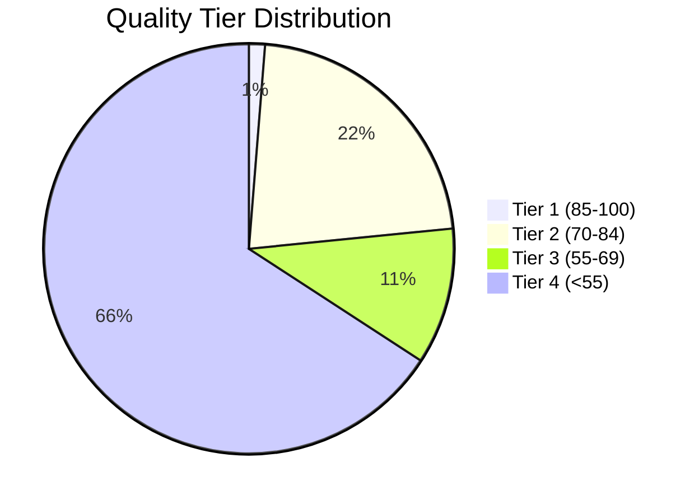
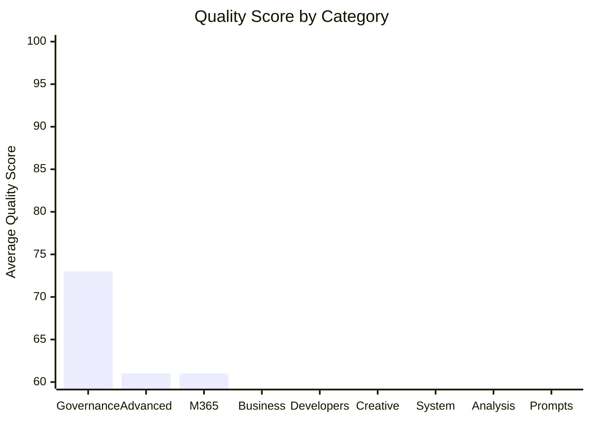

# 📊 Prompt Library Evaluation Report

<div align="center">


**Enterprise AI Prompt Library Assessment**

*Generated: December 2025 | Methodology: Dual-Rubric Scoring with ToT Reflection*

</div>

---

## 📈 Executive Dashboard

<table>
<tr>
<td width="33%" align="center">

### 🎯 Overall Score
# 66/100
**Grade C**

*Needs improvement*

</td>
<td width="33%" align="center">

### 📚 Total Prompts
# 158
**Production Ready: 30**

*19.0% deployment-ready*

</td>
<td width="33%" align="center">

### ⭐ Avg Effectiveness
# 3.87/5.0
**★★★☆☆**

*Acceptable quality*

</td>
</tr>
</table>

---

## 🏆 Grade Distribution

```
Grade A (90-100) ░░░░░░░░░░░░░░░░░░░░░░░░░░░░░░░░░░░░░░░░   0 prompts (0.0%)
Grade B (75-89)  ███████░░░░░░░░░░░░░░░░░░░░░░░░░░░░░░░░░  30 prompts (19.0%)
Grade C (60-74)  ██████░░░░░░░░░░░░░░░░░░░░░░░░░░░░░░░░░░  24 prompts (15.2%)
Grade D (40-59)  ██████████████████████████░░░░░░░░░░░░░░ 104 prompts (65.8%)
Grade F (<40)    ░░░░░░░░░░░░░░░░░░░░░░░░░░░░░░░░░░░░░░░░   0 prompts (0.0%)
```

| Grade | Description | Count | Percentage | Status |
|:-----:|-------------|------:|:----------:|:------:|
| 🏅 **A** | Exceptional | 0 | 0.0% | — |
| ✅ **B** | Production Ready | 30 | 19.0% | 🟢 |
| ⚠️ **C** | Usable | 24 | 15.2% | 🟡 |
| 🔧 **D** | Needs Work | 104 | 65.8% | 🟠 |
| ❌ **F** | Critical | 0 | 0.0% | — |

---

## 📊 Quality Tier Breakdown



| Tier | Range | Count | % | Assessment |
|:----:|:-----:|------:|:-:|------------|
| 🥇 **Tier 1** | 85-100 | 2 | 1.3% | Exceptional quality, best-in-class |
| 🥈 **Tier 2** | 70-84 | 35 | 22.2% | Solid quality, production ready |
| 🥉 **Tier 3** | 55-69 | 17 | 10.8% | Acceptable, minor improvements needed |
| ⚙️ **Tier 4** | <55 | 104 | 65.8% | Below standard, requires rework |

---

## 🎨 Category Performance



### Category Leaderboard

| Rank | Category | Prompts | Avg Quality | Avg Effectiveness | Top Performer |
|:----:|----------|--------:|:-----------:|:-----------------:|---------------|
| 🥇 | **Governance** | 8 | 73/100 | 4.0 ⭐⭐⭐⭐ | Security: Incident Respon... |
| 🥈 | **Advanced** | 18 | 61/100 | 3.9 ⭐⭐⭐ | Reflection: Initial Answe... |
| 🥉 | **M365** | 20 | 61/100 | 3.9 ⭐⭐⭐ | M365 Slide Content Refine... |
| 4 | **Business** | 36 | 59/100 | 3.9 ⭐⭐⭐ | Agile Sprint Planner |
| 5 | **Developers** | 24 | 58/100 | 3.8 ⭐⭐⭐ | DevOps Pipeline Architect |
| 6 | **Creative** | 8 | 57/100 | 3.9 ⭐⭐⭐ | Ad Copy Generator |
| 7 | **System** | 23 | 55/100 | 3.8 ⭐⭐⭐ | M365 Copilot Frontier Res... |
| 8 | **Analysis** | 20 | 53/100 | 3.9 ⭐⭐⭐ | Data Quality Assessment |
| 9 | **Prompts** | 1 | 38/100 | 3.3 ⭐⭐⭐ | Self-Consistency Chain-of... |

---

## 🔬 Scoring Methodology

### Dual-Rubric System

This evaluation uses **two complementary scoring systems** to provide a comprehensive assessment:

<table>
<tr>
<td width="50%">

#### 📋 Quality Standards (0-100)

| Criterion | Weight | Focus |
|-----------|:------:|-------|
| Completeness | 25% | All sections present |
| Example Quality | 30% | Realistic examples |
| Specificity | 20% | Domain-specific |
| Format | 15% | Valid YAML/MD |
| Enterprise | 10% | Professional |

</td>
<td width="50%">

#### ⭐ Effectiveness Score (1.0-5.0)

| Dimension | Weight | Focus |
|-----------|:------:|-------|
| Clarity | 25% | Unambiguous |
| Effectiveness | 30% | Output quality |
| Reusability | 20% | Cross-context |
| Simplicity | 15% | Minimal friction |
| Examples | 10% | Helpful demos |

</td>
</tr>
</table>

### Combined Grade Calculation

```
Combined Score = (Quality × 0.6) + (Effectiveness × 20 × 0.4)

Grade Thresholds:
  A  = 90-100  (Exceptional)
  B  = 75-89   (Production Ready)
  C  = 60-74   (Acceptable)
  D  = 40-59   (Needs Improvement)
  F  = <40     (Critical)
```

---

## 🚨 Priority Actions

### 🔴 High Priority — Grade D Prompts (104)

These prompts need significant improvement before production use:

| # | Prompt | Quality | Effectiveness | Primary Issue |
|:-:|--------|:-------:|:-------------:|---------------|
| 1 | Chain-of-Verification (CoVe) | 22 | 3.0 | Missing required sections (Des... |
| 2 | Example Research Output: Modern Pro | 22 | 3.4 | Missing required sections (Des... |
| 3 | ToT-ReAct: Prompt Library Evaluatio | 33 | 3.1 | Missing required sections (Des... |
| 4 | Mid-Level Developer Architecture Co | 35 | 3.7 | Missing required sections (Des... |
| 5 | API Design Consultant | 36 | 3.6 | Missing required sections (Des... |
| 6 | Chain-of-Thought: Decision Guide | 38 | 3.4 | Missing required sections (Des... |
| 7 | Self-Consistency Chain-of-Thought R | 38 | 3.3 | Missing required sections (Des... |
| 9 | Brand Voice Developer | 40 | 3.9 | Missing required sections (Des... |
| 10 | Code Review Expert | 40 | 3.3 | Missing required sections (Des... |

### 🟡 Common Issues Across Library

| Issue | Count | Priority | Impact |
|-------|------:|:--------:|:------:|
| Missing Example section | 108 | P1 | -3 pts |
| Example section too short (<20 lines) | 34 | P1 | -3 pts |
| Content lacks specificity (generic tips, | 21 | P2 | -2 pts |
| Missing required sections (Description,  | 14 | P1 | -3 pts |

---

## 🏅 Top Performers

### 🌟 Tier 1 Excellence (Quality 85+)

<details>
<summary><b>View all 2 Tier 1 prompts</b></summary>

| Prompt | Category | Quality | Effectiveness |
|--------|----------|:-------:|:-------------:|
| Reflection: Initial Answer + Self-Critiq | Advanced | 98 | 3.9 ⭐⭐⭐ |
| Chain-of-Thought: Detailed Mode | Advanced | 97 | 4.2 ⭐⭐⭐⭐ |

</details>

---

## 📁 Detailed Category Reports

### 🧠 Advanced (18 prompts)

**Average: Q:62 | E:3.9** | Chain-of-Thought, ReAct, RAG, Tree-of-Thoughts patterns

<details>
<summary><b>View all 18 Advanced prompts</b></summary>

| Status | Prompt | Quality | Effectiveness |
|:------:|--------|:-------:|:-------------:|
| ⚠️ | Reflection: Initial Answer + Self-Cri... | 98 | 3.9 ⭐⭐⭐ |
| ✅ | Chain-of-Thought: Detailed Mode | 97 | 4.2 ⭐⭐⭐⭐ |
| ✅ | Chain-of-Thought: Concise Mode | 87 | 4.2 ⭐⭐⭐⭐ |
| ✅ | RAG: Document Retrieval and Citation | 87 | 4.2 ⭐⭐⭐⭐ |
| ⚠️ | Chain-of-Thought: Debugging & Root Ca... | 82 | 3.9 ⭐⭐⭐ |
| ✅ | Advanced Prompt Engineering Technique... | 77 | 4.2 ⭐⭐⭐⭐ |
| ⚠️ | ReAct: Large-Scale Prompt Library Ana... | 70 | 4.2 ⭐⭐⭐⭐ |
| ⚠️ | Tree-of-Thoughts Evaluator: Reflectio... | 70 | 4.0 ⭐⭐⭐⭐ |
| 🔧 | ReAct: Document Search and Synthesis | 58 | 3.9 ⭐⭐⭐ |
| 🔧 | ReAct: Knowledge Base Research | 57 | 4.0 ⭐⭐⭐⭐ |
| 🔧 | Tree-of-Thoughts: Architecture Evaluator | 56 | 3.9 ⭐⭐⭐ |
| 🔧 | ReAct: Library Structure & Content An... | 49 | 4.0 ⭐⭐⭐⭐ |
| 🔧 | ReAct: Tool-Augmented Reasoning | 44 | 3.9 ⭐⭐⭐ |
| 🔧 | Chain-of-Thought: Performance Analysi... | 42 | 3.8 ⭐⭐⭐ |
| 🔧 | Tree-of-Thoughts: Multi-Branch Reason... | 41 | 3.8 ⭐⭐⭐ |
| 🔧 | Chain-of-Thought: Decision Guide | 38 | 3.4 ⭐⭐⭐ |
| 🔧 | ToT-ReAct: Prompt Library Evaluation ... | 33 | 3.1 ⭐⭐⭐ |
| 🔧 | Chain-of-Verification (CoVe) | 22 | 3.0 ⭐⭐⭐ |

</details>

---

### 📊 Analysis (20 prompts)

**Average: Q:54 | E:3.9** | Data analysis, market research, business intelligence

<details>
<summary><b>View all 20 Analysis prompts</b></summary>

| Status | Prompt | Quality | Effectiveness |
|:------:|--------|:-------:|:-------------:|
| ✅ | Data Quality Assessment | 80 | 4.1 ⭐⭐⭐⭐ |
| ✅ | Competitive Intelligence Researcher | 77 | 4.3 ⭐⭐⭐⭐ |
| 🔧 | Library Network Graph Generator | 58 | 3.9 ⭐⭐⭐ |
| 🔧 | Library Capability Radar Chart Generator | 53 | 3.9 ⭐⭐⭐ |
| 🔧 | Library Structure Treemap Generator | 53 | 4.0 ⭐⭐⭐⭐ |
| 🔧 | Competitive Analysis Researcher | 52 | 3.8 ⭐⭐⭐ |
| 🔧 | Data Analysis and Insights Generator | 51 | 3.7 ⭐⭐⭐ |
| 🔧 | Business Case Developer | 50 | 3.9 ⭐⭐⭐ |
| 🔧 | Consumer Behavior Researcher | 50 | 3.8 ⭐⭐⭐ |
| 🔧 | Data Analysis Specialist | 50 | 3.8 ⭐⭐⭐ |
| 🔧 | Gap Analysis Expert | 50 | 3.8 ⭐⭐⭐ |
| 🔧 | Industry Analysis Expert | 50 | 3.8 ⭐⭐⭐ |
| 🔧 | Market Research Analyst | 50 | 3.8 ⭐⭐⭐ |
| 🔧 | Metrics and KPI Designer | 50 | 3.8 ⭐⭐⭐ |
| 🔧 | Process Optimization Consultant | 50 | 3.8 ⭐⭐⭐ |
| 🔧 | Requirements Analysis Expert | 50 | 3.9 ⭐⭐⭐ |
| 🔧 | Stakeholder Requirements Gatherer | 50 | 3.9 ⭐⭐⭐ |
| 🔧 | Trend Analysis Specialist | 50 | 3.9 ⭐⭐⭐ |
| 🔧 | User Experience Analyst | 50 | 3.8 ⭐⭐⭐ |
| 🔧 | Workflow Designer | 50 | 3.8 ⭐⭐⭐ |

</details>

---

### 💼 Business (36 prompts)

**Average: Q:59 | E:3.9** | Strategy, planning, communication, management

<details>
<summary><b>View all 36 Business prompts</b></summary>

| Status | Prompt | Quality | Effectiveness |
|:------:|--------|:-------:|:-------------:|
| ✅ | Agile Sprint Planner | 87 | 4.2 ⭐⭐⭐⭐ |
| ✅ | Board Update Generator | 85 | 4.1 ⭐⭐⭐⭐ |
| ✅ | Change Management Coordinator | 85 | 4.1 ⭐⭐⭐⭐ |
| ✅ | Meeting Summary Generator | 85 | 4.2 ⭐⭐⭐⭐ |
| ✅ | Performance Review Writer | 85 | 4.2 ⭐⭐⭐⭐ |
| ✅ | Budget and Cost Controller | 83 | 4.1 ⭐⭐⭐⭐ |
| ✅ | Pitch Deck Generator | 83 | 4.2 ⭐⭐⭐⭐ |
| ✅ | Stakeholder Communication Manager | 77 | 4.3 ⭐⭐⭐⭐ |
| ✅ | Risk Management Analyst | 75 | 4.1 ⭐⭐⭐⭐ |
| 🔧 | Competitive Analysis Generator | 58 | 3.7 ⭐⭐⭐ |
| 🔧 | Interview Questions Generator | 56 | 3.8 ⭐⭐⭐ |
| 🔧 | Cold Email Generator | 54 | 4.0 ⭐⭐⭐⭐ |
| 🔧 | Job Description Writer | 54 | 3.8 ⭐⭐⭐ |
| 🔧 | Onboarding Checklist Creator | 53 | 3.8 ⭐⭐⭐ |
| 🔧 | Sales Objection Handler | 53 | 3.9 ⭐⭐⭐ |
| 🔧 | Crisis Management Coordinator | 52 | 3.9 ⭐⭐⭐ |
| 🔧 | Digital Transformation Advisor | 52 | 3.9 ⭐⭐⭐ |
| 🔧 | Organizational Change Manager | 52 | 3.9 ⭐⭐⭐ |
| 🔧 | Project Documentation Manager | 52 | 3.9 ⭐⭐⭐ |
| 🔧 | Vendor Management Coordinator | 52 | 3.8 ⭐⭐⭐ |
| 🔧 | Follow-Up Email Generator | 51 | 3.7 ⭐⭐⭐ |
| 🔧 | Business Process Reengineering | 50 | 3.8 ⭐⭐⭐ |
| 🔧 | Client Presentation Designer | 50 | 3.8 ⭐⭐⭐ |
| 🔧 | Due Diligence Analyst | 50 | 3.9 ⭐⭐⭐ |
| 🔧 | Innovation Strategy Consultant | 50 | 3.8 ⭐⭐⭐ |
| 🔧 | Management Consulting Expert | 50 | 3.8 ⭐⭐⭐ |
| 🔧 | Market Entry Strategist | 50 | 3.9 ⭐⭐⭐ |
| 🔧 | Performance Improvement Consultant | 50 | 3.8 ⭐⭐⭐ |
| 🔧 | Project Closure Specialist | 50 | 3.8 ⭐⭐⭐ |
| 🔧 | Quality Assurance Planner | 50 | 3.9 ⭐⭐⭐ |
| 🔧 | Resource Allocation Optimizer | 50 | 3.8 ⭐⭐⭐ |
| 🔧 | Strategic Planning Consultant | 50 | 3.8 ⭐⭐⭐ |
| 🔧 | Team Performance Manager | 50 | 3.8 ⭐⭐⭐ |
| 🔧 | Timeline and Milestone Tracker | 50 | 3.8 ⭐⭐⭐ |
| 🔧 | Meeting Facilitator | 47 | 3.8 ⭐⭐⭐ |
| 🔧 | Business Strategy Analysis | 44 | 3.8 ⭐⭐⭐ |

</details>

---

### 🎨 Creative (8 prompts)

**Average: Q:58 | E:3.9** | Content creation, marketing, copywriting

| Status | Prompt | Quality | Effectiveness |
|:------:|--------|:-------:|:-------------:|
| ✅ | Ad Copy Generator | 82 | 4.1 ⭐⭐⭐⭐ |
| ✅ | Product Description Generator | 77 | 4.2 ⭐⭐⭐⭐ |
| ⚠️ | Headline and Tagline Creator | 72 | 4.0 ⭐⭐⭐⭐ |
| 🔧 | Social Media Content Generator | 51 | 3.9 ⭐⭐⭐ |
| 🔧 | Content Marketing Blog Post Generator | 50 | 3.6 ⭐⭐⭐ |
| 🔧 | Email Newsletter Writer | 50 | 3.9 ⭐⭐⭐ |
| 🔧 | Brand Voice Developer | 40 | 3.9 ⭐⭐⭐ |
| 🔧 | Video Script Writer | 39 | 3.9 ⭐⭐⭐ |

---

### 💻 Developers (24 prompts)

**Average: Q:59 | E:3.8** | Code generation, review, architecture, DevOps

<details>
<summary><b>View all 24 Developers prompts</b></summary>

| Status | Prompt | Quality | Effectiveness |
|:------:|--------|:-------:|:-------------:|
| ✅ | DevOps Pipeline Architect | 87 | 4.2 ⭐⭐⭐⭐ |
| ✅ | C# Refactoring Assistant | 86 | 4.3 ⭐⭐⭐⭐ |
| ✅ | Legacy System Modernization | 83 | 4.1 ⭐⭐⭐⭐ |
| ✅ | Performance Optimization Specialist | 83 | 4.1 ⭐⭐⭐⭐ |
| ✅ | Code Generation Assistant | 82 | 4.1 ⭐⭐⭐⭐ |
| ✅ | C# Enterprise Standards Enforcer | 81 | 4.1 ⭐⭐⭐⭐ |
| ✅ | .NET API Designer | 79 | 4.0 ⭐⭐⭐⭐ |
| 🔧 | Code Review Assistant | 57 | 3.7 ⭐⭐⭐ |
| 🔧 | Cloud Migration Specialist | 56 | 3.8 ⭐⭐⭐ |
| 🔧 | Code Review Expert: Structured Output | 56 | 3.3 ⭐⭐⭐ |
| 🔧 | Data Pipeline Engineer | 56 | 3.8 ⭐⭐⭐ |
| 🔧 | Test Automation Engineer | 56 | 3.9 ⭐⭐⭐ |
| 🔧 | Microservices Architect | 54 | 3.9 ⭐⭐⭐ |
| 🔧 | Security Code Auditor | 54 | 3.4 ⭐⭐⭐ |
| 🔧 | SQL Security Standards Enforcer | 54 | 3.4 ⭐⭐⭐ |
| 🔧 | Database Schema Designer | 50 | 3.7 ⭐⭐⭐ |
| 🔧 | SQL Query Analyzer | 49 | 3.8 ⭐⭐⭐ |
| 🔧 | Documentation Generator | 44 | 4.1 ⭐⭐⭐⭐ |
| 🔧 | Refactoring Plan Designer | 44 | 3.8 ⭐⭐⭐ |
| 🔧 | Frontend Architecture Consultant | 42 | 4.0 ⭐⭐⭐⭐ |
| 🔧 | Mobile App Developer | 42 | 3.9 ⭐⭐⭐ |
| 🔧 | Code Review Expert | 40 | 3.3 ⭐⭐⭐ |
| 🔧 | API Design Consultant | 36 | 3.6 ⭐⭐⭐ |
| 🔧 | Mid-Level Developer Architecture Coach | 35 | 3.7 ⭐⭐⭐ |

</details>

---

### 🏛️ Governance (8 prompts)

**Average: Q:73 | E:4.0** | Legal, security, compliance

| Status | Prompt | Quality | Effectiveness |
|:------:|--------|:-------:|:-------------:|
| ✅ | Security: Incident Response Framework | 87 | 4.1 ⭐⭐⭐⭐ |
| ✅ | GDPR Compliance Assessment | 82 | 4.2 ⭐⭐⭐⭐ |
| ✅ | Legal: Contract Review Assistant | 82 | 4.1 ⭐⭐⭐⭐ |
| ✅ | Privacy Impact Assessment (DPIA) Gene... | 82 | 4.0 ⭐⭐⭐⭐ |
| ⚠️ | AI/ML Privacy Risk Assessment | 66 | 3.9 ⭐⭐⭐ |
| ⚠️ | SOC 2 Audit Preparation Assistant | 64 | 4.0 ⭐⭐⭐⭐ |
| ⚠️ | Data Subject Request (DSR) Handler | 63 | 3.9 ⭐⭐⭐ |
| ⚠️ | Data Retention Policy Generator | 61 | 4.0 ⭐⭐⭐⭐ |

---

### 📧 M365 (20 prompts)

**Average: Q:61 | E:3.9** | Microsoft 365 productivity prompts

<details>
<summary><b>View all 20 M365 prompts</b></summary>

| Status | Prompt | Quality | Effectiveness |
|:------:|--------|:-------:|:-------------:|
| ⚠️ | M365 Slide Content Refiner | 77 | 3.8 ⭐⭐⭐ |
| ⚠️ | M365 Sway Document to Story | 76 | 3.8 ⭐⭐⭐ |
| ⚠️ | M365 Manager Sync Planner | 75 | 3.9 ⭐⭐⭐ |
| ⚠️ | M365 Designer Image Prompt Generator | 72 | 3.8 ⭐⭐⭐ |
| ⚠️ | M365 Designer Infographic Brief | 72 | 3.8 ⭐⭐⭐ |
| ⚠️ | M365 Designer Social Media Kit | 70 | 3.8 ⭐⭐⭐ |
| ⚠️ | M365 Excel Formula Expert | 70 | 3.9 ⭐⭐⭐ |
| ⚠️ | M365 Handover Document Creator | 70 | 3.9 ⭐⭐⭐ |
| ⚠️ | M365 Sway Visual Newsletter | 67 | 3.9 ⭐⭐⭐ |
| ⚠️ | M365 Customer Feedback Analyzer | 66 | 3.8 ⭐⭐⭐ |
| 🔧 | M365 Presentation Outline Generator | 54 | 3.8 ⭐⭐⭐ |
| 🔧 | M365 Document Summarizer | 52 | 3.8 ⭐⭐⭐ |
| 🔧 | M365 Meeting Prep Brief | 52 | 3.9 ⭐⭐⭐ |
| 🔧 | M365 Meeting Recap Assistant | 52 | 3.9 ⭐⭐⭐ |
| 🔧 | M365 Personal Task Collector | 52 | 3.8 ⭐⭐⭐ |
| 🔧 | M365 Weekly Review Coach | 52 | 3.9 ⭐⭐⭐ |
| 🔧 | M365 Daily Standup Assistant | 51 | 3.9 ⭐⭐⭐ |
| 🔧 | M365 Data Insights Assistant | 51 | 3.9 ⭐⭐⭐ |
| 🔧 | M365 Email Triage Helper | 49 | 3.8 ⭐⭐⭐ |
| 🔧 | M365 Project Status Reporter | 49 | 3.9 ⭐⭐⭐ |

</details>

---

### 📁 Prompts (1 prompts)

**Average: Q:38 | E:3.3** | 

| Status | Prompt | Quality | Effectiveness |
|:------:|--------|:-------:|:-------------:|
| 🔧 | Self-Consistency Chain-of-Thought Rea... | 38 | 3.3 ⭐⭐⭐ |

---

### ⚙️ System (23 prompts)

**Average: Q:56 | E:3.8** | Architecture, system design, AI agents

<details>
<summary><b>View all 23 System prompts</b></summary>

| Status | Prompt | Quality | Effectiveness |
|:------:|--------|:-------:|:-------------:|
| ✅ | M365 Copilot Frontier Research Agent | 79 | 4.2 ⭐⭐⭐⭐ |
| ⚠️ | Performance Architecture Optimizer | 79 | 3.9 ⭐⭐⭐ |
| ⚠️ | Tree-of-Thoughts Repository Evaluator... | 77 | 3.6 ⭐⭐⭐ |
| ✅ | Office Agent Technical Specifications | 76 | 4.0 ⭐⭐⭐⭐ |
| ⚠️ | Office Agent Deep Research: Modern Pr... | 74 | 4.1 ⭐⭐⭐⭐ |
| ⚠️ | AI Assistant System Prompt | 65 | 4.0 ⭐⭐⭐⭐ |
| ⚠️ | Prompt Quality Evaluator: Meta-Evalua... | 63 | 3.7 ⭐⭐⭐ |
| 🔧 | Security Architecture Specialist | 54 | 3.8 ⭐⭐⭐ |
| 🔧 | Cloud Architecture Consultant | 52 | 3.8 ⭐⭐⭐ |
| 🔧 | Compliance Architecture Designer | 52 | 3.8 ⭐⭐⭐ |
| 🔧 | API Architecture Designer | 50 | 3.8 ⭐⭐⭐ |
| 🔧 | Blockchain Architecture Specialist | 50 | 3.8 ⭐⭐⭐ |
| 🔧 | Data Architecture Designer | 50 | 3.8 ⭐⭐⭐ |
| 🔧 | DevOps Architecture Planner | 50 | 3.9 ⭐⭐⭐ |
| 🔧 | Disaster Recovery Architect | 50 | 3.8 ⭐⭐⭐ |
| 🔧 | Enterprise Integration Architect | 50 | 3.9 ⭐⭐⭐ |
| 🔧 | IoT Architecture Designer | 50 | 3.8 ⭐⭐⭐ |
| 🔧 | Legacy Modernization Architect | 50 | 3.7 ⭐⭐⭐ |
| 🔧 | Microservices Architecture Expert | 50 | 3.9 ⭐⭐⭐ |
| 🔧 | Mobile Architecture Consultant | 50 | 3.8 ⭐⭐⭐ |
| 🔧 | Solution Architecture Designer | 50 | 3.8 ⭐⭐⭐ |
| 🔧 | Library Visual & Formatting Audit | 41 | 3.9 ⭐⭐⭐ |
| 🔧 | Example Research Output: Modern Promp... | 22 | 3.4 ⭐⭐⭐ |

</details>

---

## 📋 Appendix

### Status Legend

| Icon | Meaning |
|:----:|---------|
| ✅ | Production Ready (Grade B+) |
| ⚠️ | Usable with Improvements (Grade C) |
| 🔧 | Needs Significant Work (Grade D) |
| ❌ | Critical Issues (Grade F) |

### Star Ratings

| Rating | Meaning | Score Range |
|--------|---------|:-----------:|
| ⭐⭐⭐⭐⭐ | Exceptional | 4.5-5.0 |
| ⭐⭐⭐⭐ | Good | 4.0-4.4 |
| ⭐⭐⭐ | Acceptable | 3.5-3.9 |
| ⭐⭐ | Below Average | 3.0-3.4 |
| ⭐ | Poor | <3.0 |

### Related Documents

- 📊 [ToT Evaluation Report](TOT_EVALUATION_REPORT.md) — Full Tree-of-Thoughts assessment
- 📋 [Improvement Plan](IMPROVEMENT_PLAN.md) — Prioritized action items
- 🔬 [Scoring Methodology](prompt-effectiveness-scoring-methodology.md) — Research-backed rubrics

---

<div align="center">

**Report Generated**: 2025-12-11 03:58  
**Methodology**: Dual-Rubric Scoring + Tree-of-Thoughts Reflection  
**Tools**: `evaluate_library.py`, `improve_prompts.py`

*Enterprise AI Prompt Library — tafreeman/prompts*

</div>