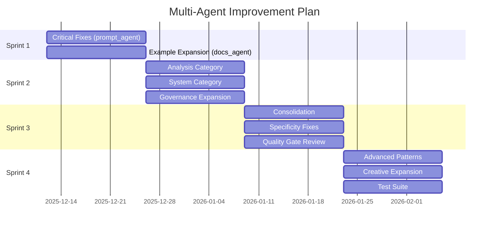

# 🤖 Multi-Agent Prompt Library Improvement Plan

**Generated:** December 11, 2025  
**Based On:** [FULL_EVALUATION_REPORT.md](FULL_EVALUATION_REPORT.md)  
**Current Score:** 66/100 (Grade C) → **Target:** 80/100 (Grade B)  
**Timeline:** 4 Sprints (8 Weeks)

---

## 📊 Executive Summary

The evaluation identified **104 prompts (65.8%)** needing improvement. This plan orchestrates **7 specialized agents** working in parallel across 4 improvement sprints to systematically raise the library from Grade C to Grade B.

### Agent Roster

| Agent | Specialization | Assigned Tasks | Priority |
|-------|----------------|----------------|----------|
| 🎯 **prompt_agent** | Prompt engineering, quality improvement | Fix missing sections, add examples | P0 |
| 📝 **docs_agent** | Documentation, descriptions, formatting | Improve clarity, add use cases | P0 |
| 🔄 **refactor_agent** | Restructuring, deduplication | Consolidate similar prompts | P1 |
| 🏗️ **architecture_agent** | System design, patterns | Create advanced patterns | P1 |
| 🔍 **code_review_agent** | Quality assurance, validation | Review improvements, catch regressions | P2 |
| 🔒 **security_agent** | Governance, compliance | Expand governance category | P2 |
| 🧪 **test_agent** | Testing, validation | Create evaluation test cases | P3 |

---

## 🚨 Sprint 1: Critical Fixes (Week 1-2)

**Focus:** Fix the 10 lowest-scoring prompts and address the most common issues

### Agent Assignments

#### 🎯 prompt_agent — Missing Section Fixes

**Task:** Add missing Description, Use Cases, and Example sections to the lowest-scoring prompts.

```markdown
@prompt_agent

For each prompt below, add the missing required sections:
1. **Description** - 2-3 sentences explaining what the prompt does
2. **Use Cases** - 3-5 bullet points of when to use it
3. **Example** - A complete, realistic example showing input/output

Priority fixes (Quality < 40):
- [ ] prompts/advanced/CoVe.md (22/100) - Missing Description, Use Cases
- [ ] prompts/system/example-research-output.md (22/100) - Missing sections
- [ ] prompts/advanced/prompt-library-refactor-react.md (33/100) - Add examples
- [ ] prompts/developers/mid-level-developer-architecture-coach.md (35/100)
- [ ] prompts/developers/api-design-consultant.md (36/100)
- [ ] prompts/advanced/chain-of-thought-guide.md (38/100)
- [ ] prompts/self-consistency-reasoning.md (38/100)
- [ ] prompts/creative/video-script-writer.md (39/100)
- [ ] prompts/creative/brand-voice-developer.md (40/100)
- [ ] prompts/developers/code-review-expert.md (40/100)
```

**Expected Impact:** +15-20 points per prompt → 10 prompts move from Grade D to Grade C

---

#### 📝 docs_agent — Example Section Expansion

**Task:** Address the #1 issue: "Missing Example section" (108 prompts affected)

```markdown
@docs_agent

Add comprehensive examples to prompts missing them. Each example should include:
1. **Context** - Brief scenario setup
2. **Input** - The actual prompt with variables filled in
3. **Expected Output** - What the AI should produce
4. **Variations** - 1-2 alternative approaches

Start with Tier 2/3 prompts that are close to Grade B:
- [ ] prompts/analysis/*.md (18 prompts need examples)
- [ ] prompts/business/*.md (27 prompts need examples)
- [ ] prompts/m365/*.md (10 prompts need examples)
```

**Expected Impact:** +3-5 points per prompt → Move 20+ prompts to Grade B

---

### Sprint 1 Metrics

| Metric | Before | Target | Owner |
|--------|--------|--------|-------|
| Grade D prompts | 104 | 80 | prompt_agent |
| Missing Example section | 108 | 60 | docs_agent |
| Average Quality Score | 66 | 70 | All |

---

## 🔧 Sprint 2: Category Improvement (Week 3-4)

**Focus:** Raise lowest-performing categories to Tier 2

### Agent Assignments

#### 🎯 prompt_agent — Analysis Category (53/100 → 70/100)

```markdown
@prompt_agent

The Analysis category has 20 prompts averaging 53/100. Focus on:

1. Add specific domain examples to generic prompts:
   - [ ] data-analysis-specialist.md - Add Excel/SQL examples
   - [ ] market-research-analyst.md - Add competitive analysis example
   - [ ] process-optimization-consultant.md - Add workflow diagram example

2. Improve prompts stuck at exactly 50/100 (14 prompts):
   - These have valid structure but lack depth
   - Add 2-3 more use cases each
   - Include "Tips" or "Best Practices" section
```

---

#### 🏗️ architecture_agent — System Category (55/100 → 70/100)

```markdown
@architecture_agent

The System category needs more sophisticated architecture patterns:

1. Enhance existing architecture prompts with:
   - [ ] Mermaid diagrams for visual clarity
   - [ ] Decision frameworks (when to use this pattern)
   - [ ] Integration examples with cloud services

2. Create new patterns for Level 4 maturity:
   - [ ] prompts/system/prompt-chain-orchestrator.md
   - [ ] prompts/system/multi-model-router.md
   - [ ] prompts/system/context-window-optimizer.md
```

---

#### 🔒 security_agent — Governance Category Expansion

```markdown
@security_agent

Governance is the highest-scoring category (73/100) but has only 8 prompts.
Expand to 15 prompts for enterprise readiness:

Create new governance prompts:
- [ ] prompts/governance/hipaa-compliance-checker.md
- [ ] prompts/governance/sox-audit-preparer.md
- [ ] prompts/governance/vendor-security-review.md
- [ ] prompts/governance/access-control-reviewer.md
- [ ] prompts/governance/data-classification-helper.md
- [ ] prompts/governance/regulatory-change-analyzer.md
- [ ] prompts/governance/compliance-policy-generator.md

Use existing high-quality governance prompts as templates.
```

---

### Sprint 2 Metrics

| Category | Before | Target | Owner |
|----------|--------|--------|-------|
| Analysis | 53/100 | 65/100 | prompt_agent |
| System | 55/100 | 65/100 | architecture_agent |
| Governance prompts | 8 | 15 | security_agent |

---

## 📈 Sprint 3: Quality Polish (Week 5-6)

**Focus:** Move Grade C prompts to Grade B, fix specificity issues

### Agent Assignments

#### 🔄 refactor_agent — Consolidation & Deduplication

```markdown
@refactor_agent

Review and consolidate similar prompts:

1. Code Review cluster (3 prompts → 1 primary + 2 variants):
   - code-review-assistant.md (57/100)
   - code-review-expert.md (40/100)
   - code-review-expert-structured.md (56/100)
   
   Action: Merge into single `code-review.md` with mode selection

2. Chain-of-Thought cluster (5 prompts):
   - Ensure clear differentiation
   - Add cross-references between related prompts
   - Create index showing when to use each

3. Architecture cluster:
   - Many 50/100 prompts are too similar
   - Add unique value to each or merge
```

---

#### 📝 docs_agent — Specificity Improvement

```markdown
@docs_agent

Address issue: "Content lacks specificity" (21 prompts)

For each prompt flagged as generic:
1. Add domain-specific terminology
2. Include concrete examples with real values
3. Add "Do" and "Don't" guidance
4. Include platform-specific notes (Copilot vs Claude vs GPT)

Priority prompts:
- [ ] All prompts with "generic tips" warning
- [ ] Prompts stuck at 50-55 range
- [ ] M365 prompts (need Microsoft-specific context)
```

---

#### 🔍 code_review_agent — Quality Gate

```markdown
@code_review_agent

Review all improvements made in Sprint 1-2:

1. Validate frontmatter compliance:
   ```bash
   python tools/validate_prompts.py
   ```

2. Check example quality:
   - Examples are realistic (not placeholder text)
   - Examples are complete (input AND output)
   - Examples use proper formatting

3. Verify no regressions:
   - Run evaluation on changed files
   - Compare scores before/after
   - Flag any that dropped in quality
```

---

### Sprint 3 Metrics

| Metric | Before | Target | Owner |
|--------|--------|--------|-------|
| Duplicate/similar prompts | ~15 | 0 | refactor_agent |
| "Generic content" warnings | 21 | 5 | docs_agent |
| Grade B prompts | 30 | 60 | All |

---

## 🚀 Sprint 4: Advanced Capabilities (Week 7-8)

**Focus:** Level 4 maturity items, new advanced patterns

### Agent Assignments

#### 🏗️ architecture_agent — Advanced Pattern Library

```markdown
@architecture_agent

Create sophisticated prompt patterns for power users:

1. Multi-step orchestration:
   - [ ] prompts/advanced/prompt-chain-orchestrator.md
   - [ ] prompts/advanced/multi-model-router.md
   - [ ] prompts/advanced/context-window-optimizer.md

2. Evaluation frameworks:
   - [ ] prompts/advanced/prompt-ab-testing-framework.md
   - [ ] prompts/system/prompt-version-comparator.md

3. Multi-modal templates:
   - [ ] prompts/advanced/vision-prompt-templates.md
   - [ ] prompts/advanced/structured-output-patterns.md
```

---

#### 🎯 prompt_agent — Creative Category Expansion

```markdown
@prompt_agent

Creative category has only 8 prompts (target: 20). Create:

- [ ] prompts/creative/case-study-builder.md
- [ ] prompts/creative/whitepaper-outliner.md
- [ ] prompts/creative/press-release-generator.md
- [ ] prompts/creative/landing-page-copy.md
- [ ] prompts/creative/seo-content-optimizer.md
- [ ] prompts/creative/podcast-script-writer.md
- [ ] prompts/creative/webinar-content-creator.md
- [ ] prompts/creative/customer-testimonial-formatter.md
- [ ] prompts/creative/infographic-content-planner.md
- [ ] prompts/creative/content-calendar-generator.md
- [ ] prompts/creative/ab-test-copy-variants.md

Use existing high-scoring creative prompts as templates.
```

---

#### 🧪 test_agent — Evaluation Test Suite

```markdown
@test_agent

Create automated tests for prompt quality:

1. Frontmatter tests:
   - All required fields present
   - Valid values for enums (type, difficulty, etc.)
   - Consistent date formats

2. Content tests:
   - Description > 50 words
   - At least 3 use cases
   - Example section > 20 lines
   - No placeholder text detected

3. Integration tests:
   - Run prompts through LLM and validate output format
   - Check for hallucination in examples
```

---

### Sprint 4 Metrics

| Metric | Before | Target | Owner |
|--------|--------|--------|-------|
| Advanced prompts | 18 | 25 | architecture_agent |
| Creative prompts | 8 | 18 | prompt_agent |
| Automated tests | 0 | 50+ | test_agent |

---

## 📋 Execution Commands

### Daily Standup Check

```powershell
# Check current state
python tools/evaluate_library.py --all --output docs/reports/DAILY_EVAL.md

# Validate all prompts
python tools/validate_prompts.py

# Generate audit CSV for tracking
python tools/audit_prompts.py --output audit_report.csv
```

### Per-Agent Execution

```powershell
# Run specific category evaluation
python tools/evaluate_library.py --folder prompts/analysis/

# Validate single prompt after edit
python tools/validate_prompts.py prompts/path/to/prompt.md

# Full evaluation after sprint
python tools/evaluation_agent.py --full --verbose
```

---

## 📊 Success Criteria

### End of Sprint 4 Targets

| Metric | Current | Target | Status |
|--------|---------|--------|--------|
| Overall Score | 66/100 | 80/100 | 🎯 |
| Grade A prompts | 0 | 10+ | 🎯 |
| Grade B prompts | 30 | 80+ | 🎯 |
| Grade D prompts | 104 | <20 | 🎯 |
| Total prompts | 158 | 180+ | 🎯 |
| Governance prompts | 8 | 15 | 🎯 |
| Creative prompts | 8 | 18 | 🎯 |

### Quality Gates

- [ ] All prompts pass frontmatter validation
- [ ] No prompts below 50/100
- [ ] All categories average 65+/100
- [ ] Every prompt has Description, Use Cases, Example sections
- [ ] No "generic content" warnings

---

## 🔄 Agent Coordination Protocol

### Handoff Rules

1. **prompt_agent → docs_agent**: After adding required sections, docs_agent reviews for clarity
2. **architecture_agent → code_review_agent**: All new patterns reviewed for quality
3. **security_agent → docs_agent**: New governance prompts get documentation polish
4. **All agents → test_agent**: All changes validated before merge

### Communication Channels

```markdown
# In each PR, tag the relevant agent:

@prompt_agent - For content quality issues
@docs_agent - For documentation improvements
@refactor_agent - For structural changes
@architecture_agent - For new patterns
@code_review_agent - For quality review
@security_agent - For governance content
@test_agent - For test coverage
```

---

## 📅 Timeline Summary



---

*Plan generated based on evaluation data from `evaluate_library.py`. Execute with agent mode or manually following the task lists above.*
