# Choosing the Right Prompting Pattern

Selecting the right prompting pattern is often the difference between a mediocre AI response and an exceptional one. This guide helps you quickly identify which pattern best fits your task.

## Why Pattern Selection Matters

Not all tasks require the same approach. Using a complex chain-of-thought prompt for a simple factual question wastes tokens and time. Conversely, using a zero-shot prompt for multi-step reasoning often produces poor results.

**The goal**: Use the simplest pattern that reliably produces quality output for your specific task.

---

## Quick Decision Flowchart

Follow this decision tree to find your pattern:

```mermaid
flowchart TD
    Start([🎯 What type of<br/>task?]) --> Q1{Simple factual<br/>or straightforward<br/>task?}
    
    Q1 -->|Yes| ZeroShot[✅ Zero-Shot<br/>Direct instructions]
    Q1 -->|No| Q2{Need consistent<br/>format/structure?}
    
    Q2 -->|Yes| Structured[✅ Structured Output<br/>JSON, tables, etc.]
    Q2 -->|No| Q3{Requires specific<br/>expertise or<br/>perspective?}
    
    Q3 -->|Yes| RoleBased[✅ Role-Based<br/>Expert persona]
    Q3 -->|No| Q4{Complex reasoning,<br/>math, or<br/>multi-step logic?}
    
    Q4 -->|Yes| CoT[✅ Chain-of-Thought<br/>Step-by-step reasoning]
    Q4 -->|No| Q5{Benefits from<br/>seeing examples?}
    
    Q5 -->|Yes| FewShot[✅ Few-Shot<br/>Example-driven]
    Q5 -->|No| Default[💡 Start with Zero-Shot<br/>Iterate if needed]
    
    style Start fill:#e1f5fe
    style Q1 fill:#fff9c4
    style Q2 fill:#fff9c4
    style Q3 fill:#fff9c4
    style Q4 fill:#fff9c4
    style Q5 fill:#fff9c4
    style ZeroShot fill:#c8e6c9
    style Structured fill:#c8e6c9
    style RoleBased fill:#c8e6c9
    style CoT fill:#c8e6c9
    style FewShot fill:#c8e6c9
    style Default fill:#b3e5fc
```

<!-- Diagram: Pattern Selection Decision Tree -->
<!-- Alt: Flowchart showing decision points for choosing between Zero-Shot, Structured Output, Role-Based, Chain-of-Thought, and Few-Shot prompting patterns based on task characteristics -->



**Pattern Selection Guide:**
- 🎯 **Start here**: Identify your task type
- ✅ **Green boxes**: Recommended patterns for your task
- 💡 **Blue box**: When uncertain, start simple and iterate

---

## Pattern Categories

### Zero-Shot: Direct Instructions

**When to use:**

- Simple, well-defined tasks
- Factual questions
- Basic transformations (summarize, translate, reformat)
- When the AI likely has strong training data for this task type

**Example:**

```text
Summarize the following email in 2 sentences:
[email content]
```
**Best for:** Quick tasks, prototyping, straightforward requests

---

### Few-Shot: Learning from Examples

**When to use:**

- Output format is specific or unconventional
- Task has nuanced requirements hard to describe in words
- You want consistent style across multiple outputs
- Zero-shot produces inconsistent results

**Example:**

```text
Convert these product descriptions to bullet points:

Example 1:
Input: "Our laptop features a 15-inch display with 16GB RAM and 512GB SSD storage."
Output:
• 15-inch display
• 16GB RAM
• 512GB SSD storage

Example 2:
Input: "The wireless headphones offer 30-hour battery life with active noise cancellation."
Output:
• 30-hour battery life
• Active noise cancellation

Now convert:
Input: "This smartphone has a 6.5-inch OLED screen, 128GB storage, and 5G connectivity."
```text
**Best for:** Format consistency, style matching, domain-specific conventions

---

### Chain-of-Thought: Step-by-Step Reasoning

**When to use:**

- Math or logic problems
- Multi-step analysis
- Decision-making with multiple factors
- Debugging or troubleshooting
- When you need to verify the AI's reasoning

**Example:**

```text
A store has 150 items. They sell 40% on Monday and 25% of the remaining items on Tuesday. How many items are left?

Think through this step-by-step:
1. Calculate items sold Monday
2. Calculate remaining after Monday
3. Calculate items sold Tuesday
4. Calculate final remaining items
```sql
**Best for:** Complex reasoning, auditability, reducing errors in multi-step tasks

---

### Role-Based: Expertise Personas

**When to use:**

- Need domain-specific knowledge or perspective
- Want particular communication style
- Task benefits from a specialized viewpoint
- Simulating expert review or feedback

**Example:**

```text
You are a senior security engineer reviewing code for vulnerabilities.

Review this authentication function and identify potential security issues:
[code snippet]
```text
**Best for:** Technical reviews, specialized advice, consistent expertise level

---

### Structured Output: Consistent Formats

**When to use:**

- Output feeds into another system (JSON, XML, CSV)
- Need predictable parsing
- Creating data for databases or APIs
- Generating reports with specific sections

**Example:**

```text
Extract the following information from this job posting and return as JSON:

{
  "job_title": "",
  "company": "",
  "location": "",
  "salary_range": "",
  "required_skills": [],
  "experience_years": ""
}

Job posting:
[posting content]
```sql
**Best for:** Data extraction, API responses, automated pipelines, consistent reports

---

## Quick Decision Table

| Task Type | Recommended Pattern | Why |
|-----------|-------------------|-----|
| Simple Q&A | Zero-shot | Direct and efficient |
| Code generation | Role-based + Zero-shot | Expertise context helps |
| Data extraction | Structured output | Predictable format |
| Math/Logic problems | Chain-of-thought | Reduces reasoning errors |
| Content in specific style | Few-shot | Examples define style |
| Document summarization | Zero-shot | Well-trained task |
| Complex analysis | Chain-of-thought | Step-by-step clarity |
| API response generation | Structured output | Machine-readable |
| Creative writing | Role-based or Few-shot | Sets tone and style |
| Code review | Role-based | Expert perspective |
| Translation | Zero-shot | Strong baseline capability |
| Report generation | Structured + Role-based | Format + expertise |

---

## Platform-Specific Considerations

### GitHub Copilot

- Excels at zero-shot code generation with good context
- Use comments as implicit few-shot examples
- Role-based patterns less relevant; focus on clear task description

### Claude

- Strong at chain-of-thought reasoning
- Handles long structured outputs well
- Responds well to role-based prompts with detailed personas

### ChatGPT

- Versatile across all patterns
- Few-shot examples particularly effective
- Good at following structured output schemas

### Azure OpenAI

- System messages ideal for role-based patterns
- Supports JSON mode for structured output
- Consider token limits when using few-shot with long examples

### M365 Copilot

- Context-aware within Office applications
- Zero-shot works well with document context
- Structured output useful for Excel and data tasks

---

## Common Mistakes to Avoid

### 1. Over-Engineering Simple Tasks

❌ **Don't**: Use chain-of-thought for "What is the capital of France?"
✅ **Do**: Match complexity to task requirements

### 2. Skipping Examples When Format Matters

❌ **Don't**: Describe a complex format in words when examples would be clearer
✅ **Do**: Provide 2-3 examples for unconventional output formats

### 3. Vague Role Definitions

❌ **Don't**: "Act as an expert"
✅ **Do**: "You are a senior backend engineer with 10 years of Python experience, specializing in API design"

### 4. Mixing Too Many Patterns

❌ **Don't**: Combine role + few-shot + chain-of-thought + structured output in one prompt
✅ **Do**: Use the minimum combination needed; usually 1-2 patterns suffice

### 5. Ignoring Iteration

❌ **Don't**: Assume your first pattern choice is final
✅ **Do**: Start simple, add complexity only if results are insufficient

---

## Pattern Combination Guidelines

Sometimes you need to combine patterns. Here are effective combinations:

| Combination | Use Case |
|-------------|----------|
| Role + Zero-shot | Expert task execution |
| Role + Chain-of-thought | Expert reasoning with visibility |
| Few-shot + Structured | Consistent formatted output |
| Role + Structured | Expert-level data extraction |
| Chain-of-thought + Structured | Reasoned analysis with formatted results |

**Rule of thumb**: Combine at most 2 patterns. If you need more, break the task into multiple prompts.

---

## Next Steps

Now that you can select the right pattern:

1. **Practice with examples**: Try each pattern on a task you know well
2. **Learn pattern details**: Deep-dive into specific patterns in [/techniques](/techniques/README.md)
3. **See real prompts**: Browse the [prompt library](/prompts/index.md) for production examples
4. **Understand the fundamentals**: Review [prompt engineering concepts](/concepts/index.md)

---

## Quick Reference Card

```text
┌─────────────────────────────────────────────────────────┐
│           PATTERN SELECTION QUICK REFERENCE             │
├─────────────────────────────────────────────────────────┤
│ ZERO-SHOT      → Simple tasks, factual, transformations │
│ FEW-SHOT       → Specific format, style consistency     │
│ CHAIN-OF-THOUGHT → Reasoning, math, multi-step logic   │
│ ROLE-BASED     → Expert perspective, domain knowledge   │
│ STRUCTURED     → JSON/data output, API responses        │
├─────────────────────────────────────────────────────────┤
│ DEFAULT: Start with zero-shot, add complexity as needed │
└─────────────────────────────────────────────────────────┘
```text
Remember: **Simplicity first**. The best prompt is the simplest one that reliably produces quality output.
