# Full-Stack Generation Workflow - Visual Overview

This document provides a comprehensive visual overview of the Full-Stack Application Generation workflow using Mermaid diagrams.

## Workflow Architecture

### High-Level Flow

```mermaid
flowchart TB
    subgraph INPUT["📥 INPUTS"]
        REQ[Business Requirements]
        MOCK[UI Mockups<br/>Optional]
        TECH[Tech Preferences<br/>Optional]
    end

    subgraph ANALYSIS["🔍 ANALYSIS PHASE"]
        VA[Vision Agent]
        RA[Requirements Agent]
    end

    subgraph DESIGN["🏗️ DESIGN PHASE"]
        AA[Architect Agent]
        DA[Database Agent]
        API[API Agent]
    end

    subgraph BUILD["⚙️ BUILD PHASE"]
        BE[Backend Coder]
        FE[Frontend Coder]
    end

    subgraph QUALITY["✅ QUALITY PHASE"]
        RV[Reviewer Agent]
        TA[Test Agent]
        DOC[Documentation Agent]
    end

    subgraph OUTPUT["📤 OUTPUTS"]
        APP[Complete Application]
        TESTS[Test Suite]
        DOCS[Documentation]
    end

    INPUT --> ANALYSIS
    ANALYSIS --> DESIGN
    DESIGN --> BUILD
    BUILD --> QUALITY
    QUALITY --> OUTPUT

    style INPUT fill:#e1f5fe
    style ANALYSIS fill:#fff3e0
    style DESIGN fill:#f3e5f5
    style BUILD fill:#e8f5e9
    style QUALITY fill:#fce4ec
    style OUTPUT fill:#e0f2f1
```



### Detailed Step Sequence


## Agent Interactions

### Data Flow Between Agents


## Model Selection Strategy


## Artifact Generation

### Output Structure


## Scoring & Evaluation

### Rubric Breakdown


### Evaluation Flow

```mermaid
flowchart LR
    subgraph Evaluation["Evaluation Pipeline"]
        OUT[Workflow Output] --> EVAL[Evaluator]
        GOLD[Golden Output] --> EVAL
        RUB[Rubrics] --> EVAL
        
        EVAL --> SC1[Correctness Score]
        EVAL --> SC2[Quality Score]
        EVAL --> SC3[Completeness Score]
        EVAL --> SC4[Documentation Score]
        EVAL --> SC5[Efficiency Score]
        
        SC1 --> AGG[Aggregator]
        SC2 --> AGG
        SC3 --> AGG
        SC4 --> AGG
        SC5 --> AGG
        
        AGG --> TOTAL[Total Score]
        AGG --> GRADE[Grade A-F]
        AGG --> PASS{Pass?}
        
        PASS -->|≥70%| YES[✅ Passed]
        PASS -->|<70%| NO[❌ Failed]
    end
```



## Logging Hierarchy

```mermaid
flowchart TD
    subgraph Logging["5-Level Hierarchical Logging"]
        L1[🔷 Workflow Level]
        L2[🔶 Step Level]
        L3[🔵 Agent Level]
        L4[🟢 Model Level]
        L5[🟣 Tool Level]
        
        L1 --> L2
        L2 --> L3
        L3 --> L4
        L3 --> L5
        
        L1 ---|"workflow.start<br/>workflow.complete"| E1[Events]
        L2 ---|"step.start<br/>step.complete"| E2[Events]
        L3 ---|"agent.start<br/>agent.complete"| E3[Events]
        L4 ---|"model.call<br/>model.response"| E4[Events]
        L5 ---|"tool.invoke<br/>tool.result"| E5[Events]
    end

    subgraph Metrics["Captured Metrics"]
        M1[Tokens Used]
        M2[Cost Estimate]
        M3[Duration MS]
        M4[Success Rate]
    end

    L4 --> M1
    L4 --> M2
    L1 --> M3
    L1 --> M4
```



## State Machine


## Example Execution Timeline


## Usage Example

```python
import asyncio
from multiagent_workflows import ModelManager, WorkflowEngine, VerboseLogger
from multiagent_workflows.workflows import FullStackWorkflow

async def generate_application():
    # Initialize components
    model_manager = ModelManager(allow_remote=True)
    logger = VerboseLogger(workflow_id="demo")
    
    # Create workflow
    workflow = FullStackWorkflow(
        model_manager=model_manager,
        logger=logger,
    )
    
    # Execute with requirements
    result = await workflow.execute({
        "requirements": """
        Build a task management application with:
        - User authentication (email/password, OAuth)
        - Task CRUD with due dates and priorities
        - Team collaboration features
        - Real-time notifications
        - Dashboard with analytics
        """,
        "tech_stack": {
            "frontend": "React + TypeScript",
            "backend": "Python FastAPI",
            "database": "PostgreSQL"
        }
    })
    
    # Access outputs
    print(f"Generated {len(result['artifacts'])} artifacts")
    print(f"Backend files: {result['artifacts'].get('backend_files', {}).keys()}")
    print(f"Frontend files: {result['artifacts'].get('frontend_files', {}).keys()}")
    
    # Export logs
    logger.export_to_markdown("execution_log.md")
    
    return result

asyncio.run(generate_application())
```

## Key Metrics

| Metric | Target | Description |
|--------|--------|-------------|
| Generation Time | <30 min | Total workflow execution time |
| Test Coverage | >80% | Generated test coverage |
| Code Quality Score | >7/10 | Based on review agent |
| Requirements Coverage | 100% | All requirements addressed |
| Security Score | >8/10 | No critical vulnerabilities |
