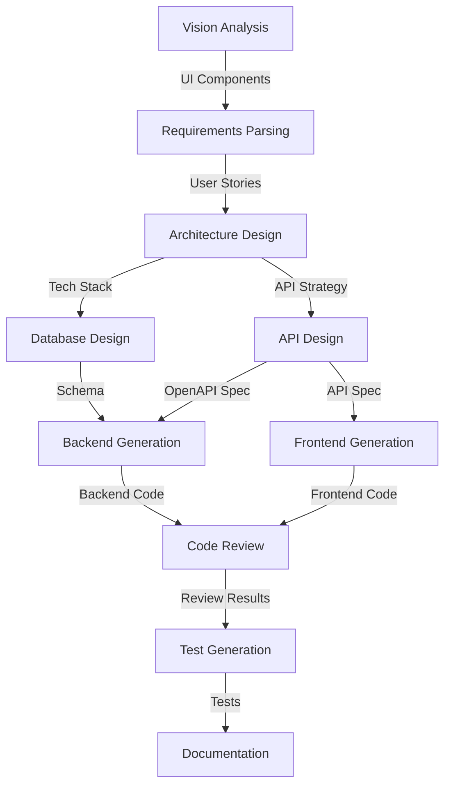

# Workflow 1: Full-Stack Application Generation

Transforms business requirements and UI mockups into a complete, deployable full-stack application.

## Overview

This workflow orchestrates multiple specialized agents to convert high-level business requirements into production-ready code, including:

- Backend API with database integration
- Frontend with responsive UI
- Comprehensive test suite
- Complete documentation

## Agents

| Agent | Model Preference | Description |
|-------|------------------|-------------|
| Vision Agent | `vision` | Analyzes UI mockups (if provided) |
| Requirements Agent | `code_gen` | Parses business requirements |
| Architecture Agent | `reasoning` | Designs system architecture |
| Database Agent | `code_gen` | Creates database schema |
| API Agent | `code_gen` | Designs API contracts |
| Code Generator | `code_gen` | Generates backend/frontend code |
| Reviewer Agent | `code_review` | Reviews for security and quality |
| Test Agent | `code_gen` | Generates comprehensive tests |
| Documentation Agent | `documentation` | Generates docs and README |

## Inputs

| Name | Type | Required | Description |
|------|------|----------|-------------|
| `requirements` | text | Yes | Business requirements document |
| `mockup_path` | file | No | Path to UI mockup image(s) |
| `tech_stack` | object | No | Technology preferences |

## Outputs

| Name | Type | Description |
|------|------|-------------|
| `application` | directory | Complete application codebase |
| `documentation` | directory | Generated documentation |
| `tests` | directory | Test suites |

## Workflow Steps



## Example Usage

```python
import asyncio
from multiagent_workflows import ModelManager, WorkflowEngine

async def generate_app():
    manager = ModelManager()
    engine = WorkflowEngine(manager)
    
    result = await engine.execute_workflow(
        workflow_name="fullstack_generation",
        inputs={
            "requirements": """
            Build a task management application with:
            - User authentication (email/password)
            - Task CRUD operations
            - Team collaboration features
            - Real-time notifications
            """,
            "tech_stack": {
                "frontend": "React + TypeScript",
                "backend": "Python FastAPI",
                "database": "PostgreSQL"
            }
        }
    )
    
    print(f"Generated {len(result.outputs)} artifacts")
    return result

asyncio.run(generate_app())
```

## Scoring Rubric

| Category | Weight | Criteria |
|----------|--------|----------|
| Functional Correctness | 40% | Requirements coverage, working application, test pass rate |
| Code Quality | 25% | Architecture, standards, error handling, security |
| Completeness | 20% | Frontend, backend, database completeness |
| Documentation | 10% | API docs, setup guide, comments |
| Efficiency | 5% | Generation time, resource usage |

**Pass Threshold**: 70%

## Best Practices

1. **Detailed Requirements**: The more detailed the requirements, the better the output
2. **Tech Stack Hints**: Specify preferred frameworks to match your team's expertise
3. **Iterative Refinement**: Review generated code and provide feedback for improvements
4. **Security Review**: Always have a human review security-critical code
