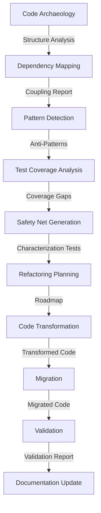

# Workflow 2: Legacy Code Refactoring & Modernization

Analyzes legacy codebases and systematically refactors them to modern patterns while preserving behavior.

## Overview

This workflow helps organizations modernize legacy code in a safe, incremental manner:

- Analyze existing code structure and dependencies
- Identify anti-patterns and code smells
- Create characterization tests as a safety net
- Apply incremental transformations
- Validate behavioral equivalence

## Agents

| Agent | Model Preference | Description |
|-------|------------------|-------------|
| Archaeologist Agent | `reasoning` | Deep analysis of legacy code structure |
| Dependency Agent | `code_gen` | Maps dependencies and coupling |
| Pattern Agent | `reasoning` | Detects anti-patterns and code smells |
| Test Analyst Agent | `code_gen` | Analyzes existing test coverage |
| Safety Net Agent | `code_gen` | Generates characterization tests |
| Planner Agent | `code_gen` | Creates refactoring roadmap |
| Transformer Agent | `code_gen` | Applies code transformations |
| Migration Agent | `code_gen` | Migrates to modern frameworks |
| Validator Agent | `code_review` | Verifies behavioral equivalence |
| Documentation Agent | `documentation` | Updates documentation |

## Inputs

| Name | Type | Required | Description |
|------|------|----------|-------------|
| `codebase_path` | directory | Yes | Path to legacy codebase |
| `target_framework` | string | No | Target modern framework |
| `constraints` | object | No | Refactoring constraints |

## Outputs

| Name | Type | Description |
|------|------|-------------|
| `refactored_code` | directory | Modernized codebase |
| `migration_plan` | file | Step-by-step migration guide |
| `test_suite` | directory | Characterization and regression tests |
| `change_log` | file | Detailed change documentation |

## Workflow Steps



## Example Usage

```python
import asyncio
from multiagent_workflows import ModelManager, WorkflowEngine

async def refactor_legacy_code():
    manager = ModelManager()
    engine = WorkflowEngine(manager)
    
    result = await engine.execute_workflow(
        workflow_name="legacy_refactoring",
        inputs={
            "codebase_path": "./legacy_app",
            "target_framework": "FastAPI",
            "constraints": {
                "preserve_api_contracts": True,
                "max_file_changes_per_commit": 10
            }
        }
    )
    
    return result

asyncio.run(refactor_legacy_code())
```

## Scoring Rubric

| Category | Weight | Criteria |
|----------|--------|----------|
| Correctness | 50% | Behavioral equivalence, test coverage, no regressions |
| Improvement Quality | 30% | Complexity reduction, maintainability, modern patterns |
| Safety | 15% | Incremental changes, rollback plan |
| Documentation | 5% | Migration guide, architecture updates |

**Pass Threshold**: 70%

## Best Practices

1. **Start with tests**: Generate characterization tests before any changes
2. **Small commits**: Make incremental changes that can be easily reviewed
3. **Preserve behavior**: Verify behavioral equivalence at each step
4. **Document decisions**: Record why changes were made
5. **Rollback ready**: Always have a way to revert changes
