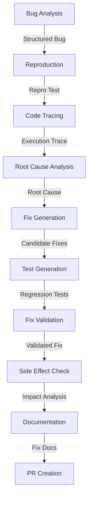

# Workflow 3: Intelligent Bug Triage & Automated Fixing

Analyzes bug reports, reproduces issues, identifies root causes, and generates fixes with regression tests.

## Overview

This workflow automates the bug fixing process:

- Parse and understand bug reports
- Create minimal reproduction cases
- Trace execution to find failure points
- Identify root causes through deep analysis
- Generate candidate fixes
- Create regression tests
- Prepare pull requests

## Agents

| Agent | Model Preference | Description |
|-------|------------------|-------------|
| Bug Analyst Agent | `code_gen` | Parses bug reports into structured format |
| Reproduction Agent | `code_gen` | Creates minimal reproduction cases |
| Tracer Agent | `reasoning` | Traces execution to find failure points |
| Root Cause Agent | `reasoning` | Identifies fundamental issues |
| Fix Generator Agent | `code_gen` | Generates candidate fixes |
| Test Generator Agent | `code_gen` | Creates regression tests |
| Validator Agent | `code_gen` | Validates fixes work correctly |
| Side Effect Agent | `code_review` | Checks for unintended consequences |
| Documentation Agent | `documentation` | Documents the fix |
| PR Agent | `coordination` | Creates pull request content |

## Inputs

| Name | Type | Required | Description |
|------|------|----------|-------------|
| `bug_report` | text | Yes | Bug report content |
| `codebase_path` | directory | Yes | Path to affected codebase |
| `priority` | string | No | Bug priority (critical/high/medium/low) |

## Outputs

| Name | Type | Description |
|------|------|-------------|
| `fix_patch` | file | Generated fix as a patch file |
| `regression_tests` | directory | Tests to prevent regression |
| `pull_request` | object | Formatted PR content |
| `analysis_report` | file | Root cause analysis documentation |

## Workflow Steps



## Example Usage

```python
import asyncio
from multiagent_workflows import ModelManager, WorkflowEngine

async def fix_bug():
    manager = ModelManager()
    engine = WorkflowEngine(manager)
    
    bug_report = """
    Title: Login fails with special characters in password
    
    Steps to reproduce:
    1. Go to login page
    2. Enter username: testuser
    3. Enter password: p@ss&word!
    4. Click login
    
    Expected: User logs in successfully
    Actual: Error "Invalid credentials" even though credentials are correct
    
    Environment: Production, Chrome 120
    """
    
    result = await engine.execute_workflow(
        workflow_name="bug_fixing",
        inputs={
            "bug_report": bug_report,
            "codebase_path": "./backend",
            "priority": "high"
        }
    )
    
    return result

asyncio.run(fix_bug())
```

## Scoring Rubric

| Category | Weight | Criteria |
|----------|--------|----------|
| Correctness | 50% | Bug fixed, regression tests, no new bugs |
| Analysis Quality | 25% | Root cause identification, impact analysis, reproduction |
| Solution Quality | 15% | Minimal change, code quality |
| Documentation | 10% | PR description, code comments |

**Pass Threshold**: 70%

## Best Practices

1. **Reproduce first**: Always create a failing test before fixing
2. **Find root cause**: Don't just fix symptoms
3. **Minimal fixes**: Make the smallest change that fixes the issue
4. **Add tests**: Every fix should include regression tests
5. **Check side effects**: Verify the fix doesn't break other functionality
6. **Document clearly**: Explain why the bug occurred and how it was fixed
