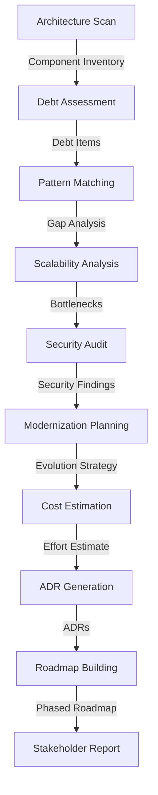

# Workflow 4: Architecture Evolution & Technical Debt Assessment

Analyzes existing architecture, identifies technical debt, and creates an evolution roadmap with ADRs.

## Overview

This workflow helps organizations evolve their architecture:

- Scan and document current architecture
- Identify and quantify technical debt
- Compare against best practices
- Analyze scalability and security
- Create evolution strategy
- Generate Architecture Decision Records (ADRs)
- Build actionable roadmap

## Agents

| Agent | Model Preference | Description |
|-------|------------------|-------------|
| Architecture Scanner Agent | `reasoning` | Analyzes current system architecture |
| Debt Assessor Agent | `reasoning` | Identifies and quantifies technical debt |
| Pattern Matcher Agent | `code_gen` | Compares to industry best practices |
| Scalability Agent | `code_gen` | Analyzes scaling bottlenecks |
| Security Auditor Agent | `code_review` | Reviews security architecture |
| Modernization Planner Agent | `code_gen` | Creates evolution strategy |
| Cost Estimator Agent | `code_gen` | Estimates effort and ROI |
| ADR Agent | `documentation` | Generates Architecture Decision Records |
| Roadmap Agent | `coordination` | Builds phased migration roadmap |
| Reporter Agent | `documentation` | Creates executive summary |

## Inputs

| Name | Type | Required | Description |
|------|------|----------|-------------|
| `codebase_path` | directory | Yes | Path to codebase |
| `business_context` | text | No | Business goals and constraints |
| `target_scale` | object | No | Expected scale requirements |

## Outputs

| Name | Type | Description |
|------|------|-------------|
| `assessment_report` | file | Comprehensive architecture assessment |
| `evolution_roadmap` | file | Phased migration plan |
| `adrs` | directory | Architecture Decision Records |
| `executive_summary` | file | High-level recommendations |

## Workflow Steps



## Example Usage

```python
import asyncio
from multiagent_workflows import ModelManager, WorkflowEngine

async def evolve_architecture():
    manager = ModelManager()
    engine = WorkflowEngine(manager)
    
    result = await engine.execute_workflow(
        workflow_name="architecture_evolution",
        inputs={
            "codebase_path": "./monolith_app",
            "business_context": """
            We need to scale to 10x current users in 2 years.
            Budget: $500k for modernization.
            Team size: 8 engineers.
            Constraint: Cannot have more than 4 hours downtime.
            """,
            "target_scale": {
                "users": 1000000,
                "requests_per_second": 10000,
                "data_size_tb": 50
            }
        }
    )
    
    return result

asyncio.run(evolve_architecture())
```

## Scoring Rubric

| Category | Weight | Criteria |
|----------|--------|----------|
| Analysis Depth | 35% | Current state assessment, debt identification, scalability analysis |
| Strategy Quality | 35% | Evolution plan, risk assessment, cost-benefit analysis |
| Documentation | 20% | Architecture diagrams, ADRs, stakeholder summary |
| Actionability | 10% | Concrete steps, realistic timeline |

**Pass Threshold**: 70%

## Best Practices

1. **Understand current state**: Document what exists before proposing changes
2. **Quantify debt**: Assign effort and priority to debt items
3. **Consider constraints**: Factor in budget, timeline, and team capacity
4. **Phase the work**: Break large migrations into manageable phases
5. **Document decisions**: Use ADRs to record architectural choices
6. **Communicate clearly**: Prepare executive summaries for stakeholders
