# Chain-of-Thought: Decision Guide

---

## Description

A practical decision framework for choosing when and how to use Chain-of-Thought (CoT) prompting. This guide helps you select the right CoT mode (none, concise, or detailed) based on your situation, and provides best practices for maximizing reasoning quality while managing token costs.

---

## Research Foundation

This technique is based on the paper:
**Wei, J., Wang, X., Schuurmans, D., Bosma, M., Ichter, B., Xia, F., Chi, E., Le, Q., & Zhou, D. (2022).** "Chain-of-Thought Prompting Elicits Reasoning in Large Language Models." *Advances in Neural Information Processing Systems (NeurIPS) 35*. [arXiv:2201.11903](https://arxiv.org/abs/2201.11903)

Wei et al. demonstrated that prompting large language models to generate intermediate reasoning steps (a "chain of thought") significantly improves performance on complex reasoning tasks including arithmetic, commonsense, and symbolic reasoning. The paper showed accuracy improvements from 17.7% to 58.1% on GSM8K math problems when using Chain-of-Thought prompting.

---

## Use Cases

- Deciding whether to use CoT for a specific task
- Choosing between concise and detailed CoT modes
- Understanding the cost-benefit trade-offs of CoT
- Training teams on when to apply advanced prompting techniques
- Optimizing prompt engineering for production systems

## The CoT Decision Tree

```mermaid
flowchart TD
    A[🎯 Start: AI Task] --> B{Simple lookup<br/>or direct task?}
    B -->|Yes| C[✅ No CoT Needed<br/>Use direct prompt]
    B -->|No| D{Requires logical<br/>reasoning?}
    
    D -->|No| C
    D -->|Yes| E{High stakes<br/>or novel?}
    
    E -->|Yes| F[📋 USE DETAILED CoT<br/>Full justification]
    E -->|No| G{Need audit<br/>trail?}
    
    G -->|Yes| H[📝 USE CONCISE CoT<br/>Step-by-step visible]
    G -->|No| I{Multiple<br/>approaches?}
    
    I -->|Yes| J[🌳 USE TREE-OF-THOUGHTS<br/>Explore branches]
    I -->|No| H
    
    style C fill:#c8e6c9
    style F fill:#81c784
    style H fill:#aed581
    style J fill:#9575cd,color:#fff
    style A fill:#e3f2fd
```



**Decision Criteria:**
- **Simple Task**: Direct lookup, formatting, translation → No CoT
- **High Stakes**: >$10K impact, compliance, novel domain → Detailed CoT
- **Audit Trail**: Debugging, learning, transparency → Concise CoT  
- **Multiple Paths**: Architecture, strategy, exploration → Tree-of-Thoughts

---

## Text-Based Decision Tree

For reference, here's the same logic in text format:

```text
START: Do you have a task that needs AI reasoning?
│
├─→ Is it a simple lookup or straightforward task?
│   (e.g., "What's the capital of France?", "Format this JSON")
│   └─→ NO COT NEEDED - Use direct prompt
│
├─→ Does it require logical steps or problem-solving?
│   └─→ YES
│       │
│       ├─→ Is it high-stakes or novel?
│       │   (>$10K impact, compliance, untested domain)
│       │   └─→ USE DETAILED COT
│       │
│       ├─→ Do you need transparency but not full justification?
│       │   (audit trail, debugging, team learning)
│       │   └─→ USE CONCISE COT
│       │
│       └─→ Need to explore multiple approaches?
│           └─→ USE TREE-OF-THOUGHTS (see ToT guide)
<<<<<<< HEAD
```sql
=======
```text

---

>>>>>>> main
## When to Use Each Mode

### No CoT (Direct Prompting)

**Use for:**

- Simple lookups (facts, definitions, syntax)
- Straightforward formatting tasks
- Well-defined, routine operations
- Very token-sensitive applications

**Example tasks:**

- "Translate this to Spanish"
- "Extract email addresses from this text"
- "Convert CSV to JSON"
- "What's the syntax for Python list comprehension?"

**Tokens saved:** Baseline (no overhead)

### Concise CoT

**Use for:**

- Moderate complexity problems
- Debugging and troubleshooting
- Quick technical decisions
- When you need reasoning audit trail
- Time-sensitive situations

**Example tasks:**

- "Debug why this API call is failing"
- "Recommend database indexes for this query"
- "Review this code for security issues"
- "Estimate project completion time"

**Token overhead:** ~30-50 extra tokens
**Accuracy gain:** ~15-25% on reasoning tasks
**Time to completion:** +20-30%

### Detailed CoT

**Use for:**

- Complex, novel problems
- High-stakes decisions (>$10K impact)
- Architecture and strategic choices
- Teaching and knowledge transfer
- Compliance documentation needs

**Example tasks:**

- "Design migration strategy for legacy system"
- "Evaluate build vs. buy for core platform"
- "Create incident postmortem with root cause analysis"
- "Recommend enterprise security architecture"

**Token overhead:** ~200-400 extra tokens
**Accuracy gain:** ~30-50% on complex problems
**Time to completion:** +100-200%

---

## Comparative Examples

### Example 1: API Error

**Problem:** "Our API returns 401 errors sporadically"

**Direct Prompt** (No CoT):

```text
Fix: Check authentication tokens are being passed correctly.
```text
<<<<<<< HEAD
=======

>>>>>>> main
*Token count: ~15*
*Accuracy: May miss root cause*

**Concise CoT:**

```text
Step 1: 401 means authentication failure - not authorization (that's 403).
Step 2: "Sporadically" suggests timing issue - likely token expiration.
Step 3: Check if tokens are being refreshed before expiration.
Step 4: Also verify clock sync between client and server (JWT timestamps).

Fix: Implement token refresh 5 minutes before expiration. Verify NTP sync.
```text
<<<<<<< HEAD
=======

>>>>>>> main
*Token count: ~70*
*Accuracy: Good - covers main scenarios*

**Detailed CoT:**

```text
[10+ steps analyzing authentication flow, token types, edge cases, 
alternative hypotheses, considering rate limiting, caching, etc.]
```text
<<<<<<< HEAD
=======

>>>>>>> main
*Token count: ~300*
*Accuracy: Excellent - comprehensive analysis*

**Best choice:** **Concise CoT** - Sporadic 401s are common enough that concise reasoning finds the issue without over-analyzing.

### Example 2: Architecture Decision

**Problem:** "Should we use microservices or monolith for new project?"

**Direct Prompt** (No CoT):

```text
Use microservices - they're more scalable and modern.
```text
<<<<<<< HEAD
=======

>>>>>>> main
*Token count: ~15*
*Accuracy: Poor - no context consideration*

**Concise CoT:**

```text
Step 1: Team size? Small team (<10) → monolith easier to manage.
Step 2: Expected scale? <100K users → monolith sufficient.
Step 3: Domain complexity? Simple domain → monolith fine.
Step 4: Time to market? Monolith faster for MVP.

Recommendation: Start with modular monolith, extract services later if needed.
```text
<<<<<<< HEAD
=======

>>>>>>> main
*Token count: ~80*
*Accuracy: Good for common cases*

**Detailed CoT:**

```text
[Comprehensive analysis of team structure, Conway's Law, deployment pipeline,
monitoring requirements, database strategy, service boundaries, operational
overhead, cost analysis, gradual migration path, etc.]
<<<<<<< HEAD
```powershell
=======
```text

>>>>>>> main
*Token count: ~500*
*Accuracy: Excellent - considers all factors*

**Best choice:** **Detailed CoT** - Architecture decisions have long-term impact (>$100K), affecting many engineers, and are hard to reverse. Investment justified.

## Best Practices

### 1. Start Simple, Escalate if Needed

```text
Try: Direct prompt
↓ (if answer insufficient)
Try: Concise CoT
↓ (if still uncertain)
Try: Detailed CoT or Tree-of-Thoughts
```text
<<<<<<< HEAD
=======

>>>>>>> main
### 2. Match CoT Mode to Audience

- **For yourself:** Concise often sufficient
- **For team review:** Concise to detailed, depending on complexity
- **For stakeholders:** Detailed for major decisions
- **For compliance:** Detailed with full justification

### 3. Use CoT Selectively in Production

```python
def should_use_cot(task_type, stakes, complexity):
    if stakes > 10000:  # High financial impact
        return "detailed"
    elif complexity > 7:  # Scale 1-10
        return "concise"
    elif task_type in ["reasoning", "analysis", "decision"]:
        return "concise"
    else:
        return "none"
```text
<<<<<<< HEAD
=======

>>>>>>> main
### 4. Optimize Token Usage

- For batch processing: Use concise CoT only for failures/edge cases
- For interactive use: Let users toggle CoT mode
- For APIs: Cache common CoT reasoning patterns

### 5. Validate CoT Effectiveness

```python
# A/B test CoT vs no CoT
results = {
    "no_cot": measure_accuracy(tasks, mode="direct"),
    "concise_cot": measure_accuracy(tasks, mode="concise"),
    "detailed_cot": measure_accuracy(tasks, mode="detailed")
}

# Choose based on accuracy vs. cost trade-off
optimal_mode = optimize(results, cost_constraint=budget)
```text
<<<<<<< HEAD
=======

>>>>>>> main
## Common Mistakes to Avoid

### ❌ Using CoT for Simple Tasks

```text
Bad: "Using detailed CoT to convert Celsius to Fahrenheit"
Waste: 300 tokens for a simple formula
```text
<<<<<<< HEAD
=======

>>>>>>> main
### ❌ Not Using CoT for Complex Tasks

```text
Bad: "Direct prompt for system architecture decision"
Risk: Missing critical considerations, expensive mistakes
```text
<<<<<<< HEAD
=======

>>>>>>> main
### ❌ Asking for CoT but Not Providing Enough Context

```text
Bad: "Debug my code (step-by-step)" with no code or error shown
Result: Generic, unhelpful steps
```text
<<<<<<< HEAD
=======

>>>>>>> main
### ❌ Using Detailed CoT Under Time Pressure

```text
Bad: "Production is down, need detailed analysis of all possibilities"
Problem: Too slow, need concise CoT for quick fix first
```text
<<<<<<< HEAD
=======

>>>>>>> main
## Integration Patterns

### Pattern 1: Tiered Reasoning

```python
# Try fast approach first
quick_answer = llm.generate(prompt, mode="direct")

# If confidence low, escalate to CoT
if quick_answer.confidence < 0.7:
    better_answer = llm.generate(prompt, mode="concise_cot")
    
    # If still uncertain, go detailed
    if better_answer.confidence < 0.8:
        best_answer = llm.generate(prompt, mode="detailed_cot")
```text
<<<<<<< HEAD
=======

>>>>>>> main
### Pattern 2: Human-in-the-Loop

```python
# Use CoT for reasoning
reasoning = llm.generate(prompt, mode="concise_cot")

# Present steps to human for validation
if user.approves(reasoning.steps):
    execute(reasoning.final_answer)
else:
    # Escalate to detailed or revise
    reasoning = llm.generate(prompt, mode="detailed_cot", 
                            feedback=user.feedback)
```text
<<<<<<< HEAD
=======

>>>>>>> main
### Pattern 3: Caching CoT Patterns

```python
# For repeated similar tasks, cache reasoning patterns
reasoning_pattern = cache.get(f"cot_{task_category}")

if reasoning_pattern:
    # Apply cached pattern to new instance
    answer = apply_pattern(reasoning_pattern, new_task)
else:
    # Generate with detailed CoT, cache pattern
    answer = llm.generate(new_task, mode="detailed_cot")
    cache.set(f"cot_{task_category}", extract_pattern(answer))
<<<<<<< HEAD
```text
=======
```json

>>>>>>> main
## Cost-Benefit Analysis

### Token Cost Estimates

| Mode | Input Overhead | Output Overhead | Total Overhead |
|------|---------------|----------------|----------------|
| No CoT | 0 tokens | 0 tokens | 0 tokens |
| Concise CoT | +20-30 | +40-70 | +60-100 |
| Detailed CoT | +30-50 | +200-400 | +230-450 |

### When CoT Pays Off

**Break-even calculation:**

```text
CoT is worth it when:
(Accuracy Gain) × (Cost of Error) > (Token Cost) × (Price per Token)

Example:
Accuracy gain: +25% (0.25)
Cost of error: $1,000 (wrong decision cost)
Token cost: 100 extra tokens
Price per token: $0.00003 (GPT-4 pricing)

Value = 0.25 × $1,000 = $250
Cost = 100 × $0.00003 = $0.003

ROI = $250 / $0.003 = 83,333x ✓ Definitely worth it!
```text
<<<<<<< HEAD
=======

>>>>>>> main
## Quick Reference

| Situation | Recommended Mode | Why |
|-----------|-----------------|-----|
| Simple lookup | None | No reasoning needed |
| Debugging | Concise CoT | Need steps, not justification |
| Code review | Concise CoT | Audit trail important |
| Architecture decision | Detailed CoT | High stakes, long-term impact |
| Math problem | Concise CoT | Steps prevent errors |
| Novel research | Detailed CoT | Unknown territory needs exploration |
| Production incident | Concise CoT first | Quick diagnosis, escalate if needed |
| Compliance review | Detailed CoT | Documentation required |
| Teaching | Detailed CoT | Explanation aids learning |
| Batch processing | None or Concise | Token costs add up |

---

## Related Prompts

- [Chain-of-Thought: Concise Mode](chain-of-thought-concise.md) - Quick step-by-step reasoning
- [Chain-of-Thought: Detailed Mode](chain-of-thought-detailed.md) - Comprehensive analysis
<<<<<<< HEAD
- [Tree-of-Thoughts: Decision Guide](tree-of-thoughts-template.md) - When to explore multiple paths
=======
>>>>>>> main
- [ReAct Tool-Augmented](react-tool-augmented.md) - For tasks with external tools

---

## Governance Notes

- **PII Safety**: No PII handling in this guide
- **Human Review**: Detailed CoT outputs for >$10K decisions should be reviewed by domain experts
- **Audit Requirements**: Save CoT reasoning for compliance-critical decisions (7-year retention recommended)
- **Cost Management**: Monitor CoT usage in production; implement automatic fallback if token budgets exceeded
