# ToT-ReAct: Prompt Library Evaluation & Research

---

## Description

This is an executable prompt combining **Tree-of-Thoughts (ToT)** branching for parallel research exploration with **ReAct** (Reasoning + Acting) for systematic execution. Use this prompt to:

1. **Evaluate prompt library quality** using dual-rubric scoring
2. **Research new prompting techniques** for library expansion
3. **Identify content gaps** and prioritize improvements
4. **Generate improvement recommendations** with academic rigor

## Goal

Perform comprehensive evaluation and research on the `tafreeman/prompts` library to:

1. **Score existing prompts** using Quality Standards (0-100) and Effectiveness (1.0-5.0) rubrics
2. **Research new techniques** using ToT branching with Reflexion-based iteration
3. **Map repository structure** and validate standards compliance
4. **Identify content gaps** and prioritize expansion areas
5. **Generate production-ready templates** for new prompts

---

## Methodology Overview

```mermaid
flowchart TD
    subgraph Phase1["Phase 1: ToT Research Planning"]
        A["Research Question"] --> B["Generate 3-5 Research Branches"]
        B --> C["Prioritize Top 3 Branches"]
    end
    
    subgraph Phase2["Phase 2: ReAct Execution"]
        C --> D["Branch A: Thought → Action → Observe"]
        C --> E["Branch B: Thought → Action → Observe"]
        C --> F["Branch C: Thought → Action → Observe"]
    end
    
    subgraph Phase3["Phase 3: Reflexion"]
        D & E & F --> G["Self-Critique Questions"]
        G --> H{"Gaps Remain?"}
        H -->|Yes| I["Targeted Follow-up"]
        H -->|No| J["Proceed to Synthesis"]
        I --> G
    end
    
    subgraph Phase4["Phase 4: Synthesis"]
        J --> K["Compile Findings"]
        K --> L["Generate Deliverables"]
        L --> M["Quality Score + Recommendations"]
    end
    
    style Phase1 fill:#e1f5fe
    style Phase2 fill:#fff3e0
    style Phase3 fill:#e8f5e9
    style Phase4 fill:#fce4ec
```



---

## Current Repository Context

> **Repository**: `tafreeman/prompts`  
> **Last Evaluation**: December 11, 2025  
> **Prompt Count**: ~165 prompts across 9 categories  
> **Overall Score**: 79/100 (Grade B) — Dec 4, 2025 baseline

### Completed Infrastructure ✅

| Component | Status | Details |
|-----------|--------|---------|
| Frontmatter schema | ✅ Complete | 19 standardized fields, fully validated |
| Content types | ✅ Complete | conceptual, quickstart, how_to, tutorial, reference, troubleshooting |
| Validation tooling | ✅ Complete | `tools/validate_prompts.py` |
| Evaluation tooling | ✅ Complete | `tools/evaluation_agent.py`, `tools/evaluate_library.py` |
| Navigation structure | ✅ Complete | All `index.md` files created with proper frontmatter |
| Advanced techniques | ✅ Complete | CoT, ToT, ReAct, RAG, CoVe, Reflexion |

### Current Content Inventory

| Category | Count | Status | Quality Tier |
|----------|-------|--------|--------------|
| **Developers** | 26 prompts | ✅ Mature | Tier 2 (70-84) |
| **Business** | 38 prompts | ✅ Mature | Tier 2 (70-84) |
| **Analysis** | 21 prompts | ✅ Mature | Tier 2 (70-84) |
| **M365** | 20 prompts | ✅ Mature | Tier 2 (70-84) |
| **System** | 24 prompts | ✅ Mature | Tier 2 (70-84) |
| **Advanced** | 18 prompts | ✅ Mature | Tier 1 (85-100) |
| **Creative** | 9 prompts | ⚠️ Growing | Tier 3 (55-69) |
| **Governance** | 9 prompts | ⚠️ Growing | Tier 3 (55-69) |
| **Total** | ~165 prompts | | Avg: 79/100 |

### Evaluation Tools Available

| Tool | Command | Purpose |
|------|---------|---------|
| Full Evaluation | `python tools/evaluation_agent.py --full` | Autonomous multi-phase evaluation |
| Dry Run | `python tools/evaluation_agent.py --full --dry-run` | Preview evaluation plan |
| Library Scorer | `python tools/evaluate_library.py --all` | Dual-rubric scoring |
| Validation | `python tools/validate_prompts.py` | Frontmatter compliance |
| Audit | `python tools/audit_prompts.py` | Content audit CSV |

### Infrastructure Components

| Component | Count | Status |
|-----------|-------|--------|
| Agents | 7 agents | ✅ docs, code-review, test, refactor, security, architecture, prompt |
| Instructions | 10 files | ✅ Role-based (junior/mid/senior), tech-specific |
| Techniques | 12 patterns | ✅ Reflexion, agentic, context optimization |
| Frameworks | 8 integrations | ✅ Anthropic, OpenAI, LangChain, Semantic Kernel |

---

## Maturity Assessment Framework

### Level 1: Foundation ✅ COMPLETE

- [x] Consistent frontmatter schema
- [x] Validation tooling
- [x] Basic navigation (index.md files)
- [x] Content type definitions

### Level 2: Discoverability ✅ COMPLETE

- [x] Platform quickstarts
- [x] Reference documentation (cheat sheet, glossary)
- [x] Troubleshooting guides
- [x] Tutorials for onboarding

### Level 3: Content Depth 🔄 IN PROGRESS

- [x] Core categories well-covered (developers, business, analysis)
- [ ] Creative category expansion (9 → 20 target)
- [ ] Governance category expansion (3 → 15 target)
- [ ] Cross-platform prompt variants
- [ ] Industry-specific prompt packs

### Level 4: Advanced Capabilities ⏳ NEXT

- [ ] Prompt chaining/orchestration patterns
- [ ] Multi-modal prompt templates (vision, audio)
- [ ] Evaluation and testing frameworks
- [ ] A/B testing templates for prompts
- [ ] Prompt versioning best practices

### Level 5: Enterprise Readiness ⏳ FUTURE

- [ ] Role-based access patterns
- [ ] Audit trail templates
- [ ] Compliance-specific prompt packs (HIPAA, SOX, GDPR)
- [ ] Cost optimization guidance
- [ ] SLA and performance benchmarks

---

## Priority Expansion Areas (December 2025)

### P0 - Critical: Governance Category (3 → 15 prompts)

**Gap**: Enterprise customers need compliance, legal, and security prompts.

| Prompt | Type | Difficulty | Effort |
|--------|------|------------|--------|
| `compliance-policy-generator.md` | how_to | intermediate | M |
| `gdpr-data-review.md` | how_to | advanced | L |
| `hipaa-compliance-checker.md` | how_to | advanced | L |
| `sox-audit-preparer.md` | how_to | advanced | L |
| `privacy-impact-assessment.md` | how_to | intermediate | M |
| `risk-assessment-template.md` | how_to | intermediate | M |
| `vendor-security-review.md` | how_to | intermediate | M |
| `access-control-reviewer.md` | how_to | intermediate | M |
| `data-classification-helper.md` | how_to | beginner | S |
| `policy-document-generator.md` | how_to | intermediate | M |
| `audit-evidence-collector.md` | how_to | intermediate | M |
| `regulatory-change-analyzer.md` | how_to | advanced | L |

### P1 - High: Creative Category (9 → 20 prompts)

**Gap**: Marketing and content teams need more variety.

| Prompt | Type | Difficulty | Effort |
|--------|------|------------|--------|
| `case-study-builder.md` | how_to | intermediate | M |
| `whitepaper-outliner.md` | how_to | intermediate | M |
| `press-release-generator.md` | how_to | beginner | S |
| `landing-page-copy.md` | how_to | intermediate | M |
| `seo-content-optimizer.md` | how_to | intermediate | M |
| `podcast-script-writer.md` | how_to | intermediate | M |
| `webinar-content-creator.md` | how_to | intermediate | M |
| `customer-testimonial-formatter.md` | how_to | beginner | S |
| `infographic-content-planner.md` | how_to | beginner | S |
| `content-calendar-generator.md` | how_to | beginner | S |
| `a]b-test-copy-variants.md` | how_to | intermediate | M |

### P2 - Medium: Advanced Patterns

**Gap**: Power users need more sophisticated patterns.

| Prompt | Type | Difficulty | Effort |
|--------|------|------------|--------|
| `prompt-chain-orchestrator.md` | tutorial | advanced | L |
| `multi-model-router.md` | how_to | advanced | L |
| `context-window-optimizer.md` | how_to | advanced | M |
| `prompt-ab-testing-framework.md` | tutorial | advanced | L |
| `vision-prompt-templates.md` | reference | intermediate | M |
| `structured-output-patterns.md` | reference | intermediate | M |

### P3 - Future: Industry Packs

**Gap**: Vertical-specific prompt collections.

| Pack | Prompts | Priority |
|------|---------|----------|
| Healthcare | 10-15 | Future |
| Financial Services | 10-15 | Future |
| Legal | 10-15 | Future |
| Education | 10-15 | Future |
| Retail/E-commerce | 10-15 | Future |

---

## Available Tools

When executing this analysis, you have access to these tool categories:

### 1. Workspace Navigation

| Tool | Usage | Example |
|------|-------|---------|
| `file_search` | Find files by glob pattern | `file_search("prompts/**/*.md")` |
| `list_dir` | List directory contents | `list_dir("/prompts/")` |
| `read_file` | Read file contents | `read_file("prompts/developers/code-review.md", 1, 50)` |
| `grep_search` | Search content patterns | `grep_search("governance_tags:", isRegexp=false)` |
| `semantic_search` | Semantic code search | `semantic_search("chain of thought prompts")` |

### 2. Evaluation & Validation

| Tool | Command | Purpose |
|------|---------|---------|
| Full Evaluation | `python tools/evaluation_agent.py --full` | Autonomous multi-phase scoring |
| Dry Run | `python tools/evaluation_agent.py --full --dry-run` | Preview evaluation plan |
| Library Scorer | `python tools/evaluate_library.py --all` | Dual-rubric scoring |
| Validation | `python tools/validate_prompts.py` | Frontmatter compliance |
| Audit | `python tools/audit_prompts.py` | Content audit CSV |

### 3. External Research (MCP Tools)

| Tool | Purpose |
|------|---------|
| `fetch_webpage` | Fetch content from URLs for research |
| `github_repo` | Search GitHub repos for prompt examples |
| `mcp_context7_get-library-docs` | Get library documentation |
| `mcp_microsoft_doc_*` | Search Microsoft/Azure documentation |

### 4. Execution

| Tool | Purpose |
|------|---------|
| `run_in_terminal` | Execute Python scripts, validation, git commands |
| `create_file` | Create new prompt files |
| `replace_string_in_file` | Edit existing content |

---

## ToT-ReAct Execution Protocol

Execute using the 4-phase methodology shown above. Each phase builds on the previous.

### Phase 1: ToT Research Planning

**Generate 3-5 Research Branches** for the evaluation goal:

```markdown
## Research Branches for Library Evaluation

### Branch A: Structural Quality Analysis
- Question: How well-organized is the prompt library structure?
- Approach: Map directories, validate frontmatter, check index.md files
- Priority: High (foundational)

### Branch B: Content Coverage Assessment  
- Question: What content gaps exist across categories and audiences?
- Approach: Count by type/platform/difficulty, compare to targets
- Priority: High (roadmap input)

### Branch C: Academic Best Practices Comparison
- Question: How does this library compare to published prompting research?
- Approach: Research CoT, ToT, Reflexion patterns; compare to library coverage
- Priority: Medium (quality improvement)

### Branch D: Scoring & Benchmarking
- Question: What is the current quality score using dual rubrics?
- Approach: Run evaluation_agent.py, analyze per-category scores
- Priority: High (baseline)

### Branch E: External Competitive Analysis
- Question: How does this compare to other public prompt libraries?
- Approach: Analyze awesome-prompts, dair-ai/Prompt-Engineering-Guide
- Priority: Low (future expansion)
```

**Prioritize Top 3**: Select A, B, D for core evaluation; C, E for enhancement.

---

### Phase 2: ReAct Execution (Per Branch)

For each prioritized branch, execute Thought → Action → Observe cycles:

#### Branch A: Structural Quality

**Cycle 1 - Structure Mapping**

```text
Thought: I need to understand the repository folder hierarchy.
Action: list_dir("d:/source/tafreeman/prompts/prompts/")
Observe: [Record categories and counts]
```

**Cycle 2 - Frontmatter Audit**

```text
Thought: I need to verify all files comply with the frontmatter schema.
Action: run_in_terminal("python tools/validate_prompts.py")
Observe: [Record validation results, note failures]
```

**Cycle 3 - Governance Compliance**

```text
Thought: I need to check governance field coverage.
Action: grep_search("governance_tags:|dataClassification:", isRegexp=true)
Observe: [Calculate compliance percentage]
```

#### Branch B: Content Coverage

**Cycle 1 - Type Distribution**

```text
Thought: I need to count prompts by content type.
Action: grep_search("type: quickstart|type: how_to|type: tutorial", isRegexp=true)
Observe: [Create type distribution table]
```

**Cycle 2 - Platform Coverage**

```text
Thought: I need to verify multi-platform coverage.
Action: grep_search("platforms:.*github-copilot|platforms:.*claude|platforms:.*chatgpt", isRegexp=true)
Observe: [Create platform coverage matrix]
```

**Cycle 3 - Audience Analysis**

```text
Thought: I need to check audience distribution.
Action: grep_search("audience:.*junior|audience:.*senior|audience:.*architect", isRegexp=true)
Observe: [Create audience coverage table]
```

#### Branch D: Scoring & Benchmarking

**Cycle 1 - Run Full Evaluation**

```text
Thought: I need current quality scores using dual rubrics.
Action: run_in_terminal("python tools/evaluation_agent.py --full --verbose")
Observe: [Record overall score, per-category breakdown]
```

**Cycle 2 - Identify Low Scorers**

```text
Thought: I need to find prompts scoring below threshold.
Action: read_file("docs/reports/EVALUATION_REPORT.md", 1, 200)
Observe: [List prompts needing improvement, by priority]
```

---

### Phase 3: Reflexion Self-Critique

After completing ReAct cycles, apply structured self-critique:

```markdown
## Reflexion Questions

### Completeness Check
1. Did I evaluate ALL prompt categories? [Yes/No - list any missed]
2. Did I check BOTH rubrics (Quality 0-100 AND Effectiveness 1.0-5.0)?
3. Did I compare against target counts for each category?

### Accuracy Verification  
4. Are my counts accurate? [Re-verify with file_search if uncertain]
5. Did validation pass? [If failures, list specific files]
6. Are scores from the LATEST evaluation run?

### Gap Identification
7. What categories are below target count? [List with current/target]
8. What content types are underrepresented? [quickstart, tutorial, etc.]
9. What audiences lack coverage? [junior, senior, architect, etc.]

### Improvement Opportunities
10. Which 5 prompts would benefit most from improvement?
11. What new prompts would have highest impact?
12. Are there emerging techniques not yet covered? [Reflexion, Agentic, etc.]
```

**If gaps remain**: Return to Phase 2 for targeted follow-up actions.

---

### Phase 4: Synthesis & Deliverables

Compile findings into structured outputs:

#### Deliverable 1: Repository Structure Map

```markdown
## Repository Structure (as of YYYY-MM-DD)

prompts/
├── advanced/ (X prompts) - Tier 1
├── analysis/ (X prompts) - Tier 2
├── business/ (X prompts) - Tier 2  
├── creative/ (X prompts) - Tier 3 ⚠️
├── developers/ (X prompts) - Tier 2
├── governance/ (X prompts) - Tier 3 ⚠️
├── m365/ (X prompts) - Tier 2
└── system/ (X prompts) - Tier 2

Total: X prompts | Validation: X% pass | Overall Score: X/100
```

#### Deliverable 2: Quality Scorecard

```markdown
| Category | Count | Quality Score | Effectiveness | Trend |
|----------|-------|---------------|---------------|-------|
| Advanced | X | X/100 | X.X/5.0 | ↑↓→ |
| Analysis | X | X/100 | X.X/5.0 | ↑↓→ |
| ... | ... | ... | ... | ... |
| **Overall** | **X** | **X/100** | **X.X/5.0** | **→** |
```

#### Deliverable 3: Gap Analysis Matrix

```markdown
| Dimension | Current | Target | Gap | Priority |
|-----------|---------|--------|-----|----------|
| Governance prompts | X | 15 | X | P0 |
| Creative prompts | X | 20 | X | P1 |
| Industry packs | 0 | 45 | 45 | P2 |
| Multi-modal | 0 | 10 | 10 | P3 |
```

#### Deliverable 4: Prioritized Recommendations

```markdown
## Immediate Actions (This Sprint)
1. [Specific prompt to create or improve]
2. [Specific prompt to create or improve]

## Short-Term (Next 2 Weeks)
1. [Category expansion goal]
2. [Quality improvement target]

## Medium-Term (Next Month)
1. [New capability to add]
2. [Research area to explore]
```

#### Deliverable 5: Execution Commands

```powershell
# Validation
python tools/validate_prompts.py

# Full Evaluation (generates reports)
python tools/evaluation_agent.py --full --verbose

# Audit CSV Export
python tools/audit_prompts.py --output audit_report.csv

# Count by Category
Get-ChildItem -Path "prompts/*" -Directory | ForEach-Object { 
  "$($_.Name): $((Get-ChildItem $_.FullName -Filter *.md -Recurse).Count)" 
}
```

---

## Expansion Priorities

Based on December 2025 repository state, focus analysis on these maturity areas:

### Governance Category (CRITICAL - 3 prompts → 15 target)

**Why Critical**: Enterprise adoption requires compliance, legal, and security coverage.

**Research Focus Areas**:

- Regulatory compliance (GDPR, HIPAA, SOX, CCPA)
- Security review and incident response
- Policy and procedure generation
- Audit preparation and evidence collection
- Risk assessment and mitigation

**Recommended Additions**:

1. `compliance-policy-generator.md` - Generate compliance policies
2. `gdpr-data-review.md` - GDPR compliance assessment
3. `hipaa-compliance-checker.md` - Healthcare data compliance
4. `sox-audit-preparer.md` - Financial controls audit
5. `privacy-impact-assessment.md` - PIA documentation
6. `risk-assessment-template.md` - Risk identification and scoring
7. `vendor-security-review.md` - Third-party security assessment
8. `access-control-reviewer.md` - Permission and access audit
9. `data-classification-helper.md` - Data sensitivity classification
10. `policy-document-generator.md` - Policy drafting assistance
11. `audit-evidence-collector.md` - Audit documentation
12. `regulatory-change-analyzer.md` - Regulatory impact analysis

### Creative Category (HIGH - 9 prompts → 20 target)

**Why High**: Content and marketing teams drive significant AI adoption.

**Research Focus Areas**:

- Long-form content (whitepapers, case studies)
- SEO and content optimization
- Multimedia content (podcasts, webinars, video)
- Campaign and launch content
- Content planning and strategy

**Recommended Additions**:

1. `case-study-builder.md` - Customer success stories
2. `whitepaper-outliner.md` - Long-form technical content
3. `press-release-generator.md` - Media announcements
4. `landing-page-copy.md` - Conversion-focused web copy
5. `seo-content-optimizer.md` - Search optimization
6. `podcast-script-writer.md` - Audio content scripts
7. `webinar-content-creator.md` - Presentation content
8. `customer-testimonial-formatter.md` - Quote formatting
9. `infographic-content-planner.md` - Visual content planning
10. `content-calendar-generator.md` - Editorial planning
11. `ab-test-copy-variants.md` - A/B testing variations

### Advanced Patterns (MEDIUM - Add sophisticated capabilities)

**Why Medium**: Power users and architects need advanced patterns.

**Research Focus Areas**:

- Multi-step prompt orchestration
- Cross-model routing and fallback
- Context optimization strategies
- Evaluation and testing frameworks
- Structured output patterns

**Recommended Additions**:

1. `prompt-chain-orchestrator.md` - Multi-step workflows
2. `multi-model-router.md` - Model selection logic
3. `context-window-optimizer.md` - Token management
4. `prompt-ab-testing-framework.md` - Testing methodology
5. `vision-prompt-templates.md` - Image/vision prompts
6. `structured-output-patterns.md` - JSON/schema outputs

### Industry Packs (FUTURE - Vertical-specific collections)

**Why Future**: Enterprise customers need domain expertise.

| Industry | Key Use Cases | Prompt Count |
|----------|---------------|--------------|
| Healthcare | Patient communication, clinical documentation, HIPAA compliance | 10-15 |
| Financial Services | Risk analysis, regulatory reporting, fraud detection | 10-15 |
| Legal | Contract review, legal research, document drafting | 10-15 |
| Education | Curriculum design, assessment creation, student feedback | 10-15 |
| Retail/E-commerce | Product descriptions, customer service, inventory analysis | 10-15 |

---

## Execution Instructions

### Quick Start

```powershell
# 1. Run automated evaluation (recommended)
python tools/evaluation_agent.py --full --verbose

# 2. Or execute this prompt manually in an AI assistant
# Load this file in Claude, GPT-4, or GitHub Copilot Chat
# The agent will follow the ToT-ReAct protocol above
```

### Manual Execution Steps

1. **Phase 1 - ToT Planning**: Generate 3-5 research branches for your evaluation goal
2. **Phase 2 - ReAct Execution**: For each branch, execute Thought → Action → Observe cycles
3. **Phase 3 - Reflexion**: Apply self-critique questions, iterate if gaps remain
4. **Phase 4 - Synthesis**: Compile the 5 deliverables

### Validation Commands

```powershell
# Frontmatter validation
python tools/validate_prompts.py

# Full evaluation with reports
python tools/evaluation_agent.py --full --verbose

# Dry run (preview only)
python tools/evaluation_agent.py --full --dry-run

# Content audit CSV
python tools/audit_prompts.py --output audit_report.csv

# Count prompts by category
Get-ChildItem -Path "prompts/*" -Directory | ForEach-Object { 
  "$($_.Name): $((Get-ChildItem $_.FullName -Filter *.md -Recurse).Count)" 
}
```

### Previous Evaluations

| Document | Date | Score | Notes |
|----------|------|-------|-------|
| `CoVE Reflexion Prompt Library Evaluation.md` | 2025-12-11 | 79/100 | ToT methodology research |
| `docs/TOT_EVALUATION_REPORT.md` | 2025-12-05 | 79/100 | Tree-of-Thoughts evaluation |
| `docs/evaluations/EVALUATION_REPORT_*.md` | 2025-12-04 | 79/100 | Archived baseline reports |

---

## Related Resources

- [Evaluation Agent Guide](../../tools/archive/EVALUATION_AGENT_GUIDE.md) - Detailed agent documentation
- [Validate Prompts](../../tools/validate_prompts.py) - Frontmatter validation
- [Evaluate Library](../../tools/evaluate_library.py) - Dual-rubric scoring
- [Frontmatter Schema](../../reference/frontmatter-schema.md) - Field definitions
- [Content Types](../../reference/content-types.md) - Type selection guide
- [Advanced Techniques](../../techniques/index.md) - CoT, ToT, Reflexion patterns

---

## Changelog

| Version | Date | Changes |
|---------|------|---------|
| 5.0 | 2025-12-11 | Integrated ToT-ReAct-Reflexion methodology; updated to current tooling; added 4-phase execution protocol |
| 4.0 | 2025-12-02 | Updated after Phase 1-6 completion; added maturity framework, new expansion priorities |
| 3.0 | 2025-11-30 | Added governance context, expanded deliverables |
| 2.0 | 2025-11-29 | Initial ReAct structure |
