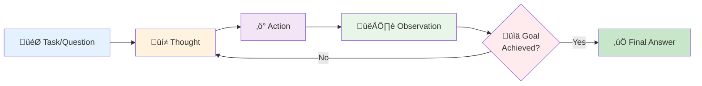

## Description

ReAct (Reasoning + Acting) is an advanced prompting pattern that combines Chain-of-Thought reasoning with external tool interaction. The AI explicitly articulates its thought process (Think), takes actions using tools (Act), observes the results (Observe), and reflects on whether the goal is achieved (Reflect). This creates a transparent, auditable loop ideal for complex tasks requiring information retrieval, API calls, or multi-step workflows.

## ReAct Cycle Visualization

The ReAct pattern follows a continuous loop of reasoning and acting:



**Legend:**

- üí≠ **Thought**: Explicit reasoning about what to do next
- ‚ö° **Action**: Call to external tool/API with parameters
- 👁️ **Observation**: System returns actual tool output
- üìä **Reflection**: Assess progress toward goal
- ‚úÖ **Answer**: Complete response when sufficient information gathered

## Variables

| Variable | Required? | Description | Example |
| --- |---:| --- | --- |
| `[DESCRIBE_TASK_GOAL]` | Yes | The goal/problem to solve using ReAct loops. | `Investigate and fix failing CI tests` |
| `[PROVIDE_BACKGROUND]` | No | Background that constrains tools and approach. | `Failures started after dependency upgrade` |
| `[LIST_TOOLS_WITH_DESCRIPTIONS]` | Yes | The toolset available (names + what they do). | `read_file (inspect files), grep_search (find patterns), run_tests (execute suite)` |

## Example

**Input**

- `[DESCRIBE_TASK_GOAL]`: `Triage a production incident from logs and metrics`
- `[PROVIDE_BACKGROUND]`: `High p99 latency since 14:00 UTC; suspected DB regression`
- `[LIST_TOOLS_WITH_DESCRIPTIONS]`: `log_search, metrics_query, deploy_history`

**Expected output (high level)**

- Several Think/Act/Observe/Reflect cycles
- A final, actionable recommendation and next steps

## Prompt

```text
You are an AI assistant using the ReAct (Reasoning + Acting) pattern to solve tasks.

**Task**: [DESCRIBE_TASK_GOAL]

**Context**: [PROVIDE_BACKGROUND]

**Available Tools**:
[LIST_TOOLS_WITH_DESCRIPTIONS]

**Instructions**:
Use the Think ‚Üí Act ‚Üí Observe ‚Üí Reflect cycle until the task is complete.

For each cycle, format your response as:

**Thought [N]**: [Explain what you're thinking, what you need to know next, why this action makes sense]

**Action [N]**: [Specify the tool and parameters]
Tool: [TOOL_NAME]
Parameters: {
  "param1": "value1",
  "param2": "value2"
}

[SYSTEM WILL PROVIDE OBSERVATION]

**Observation [N]**: [System returns tool output - you analyze it here]

**Reflection [N]**: [Assess if you're closer to the goal, what you learned, what's next]

**Thought 2**: The SQL Injection in /api/users/search is the highest risk. I need to understand what this endpoint does and whether it's frequently used. If it's a public endpoint with high traffic, the risk multiplies. Let me fetch the API documentation for this endpoint.

**Action 2**:
Tool: api_documentation_fetch
Parameters: {
  "endpoint": "/api/users/search"
}

**Observation 2**:
[System returns:]
{
  "endpoint": "/api/users/search",
  "method": "GET",
  "authentication": "None - Public endpoint",
  "rate_limit": "1000 requests/hour per IP",
  "parameters": [
    {"name": "query", "type": "string", "required": true, "description": "Search term for user lookup"},
    {"name": "limit", "type": "integer", "default": 10}
  ],
  "usage_stats": {
    "avg_requests_per_day": 12500,
    "peak_requests_per_hour": 2100
  }
}

**Reflection 2**: This is concerning - it's a PUBLIC endpoint (no authentication) with high traffic (12.5K requests/day). SQL injection here is extremely dangerous as attackers can query/modify the database without authentication. This must be priority #1. Now I should check git history to see if this was introduced recently or has been there a while.

**Thought 4**: The second critical issue is Broken Authentication on /api/auth/login (CVSS 8.2). Let me fetch documentation to understand what's wrong with the authentication mechanism.

**Action 4**:
Tool: api_documentation_fetch
Parameters: {
  "endpoint": "/api/auth/login"
}

**Observation 4**:
[System returns:]
{
  "endpoint": "/api/auth/login",
  "method": "POST",
  "authentication": "None - this IS the auth endpoint",
  "rate_limit": "5 attempts per minute per IP",
  "description": "User authentication endpoint",
  "parameters": [
    {"name": "username", "type": "string", "required": true},
    {"name": "password", "type": "string", "required": true}
  ],
  "response": {
    "success": {"token": "JWT token", "user_id": "integer"},
    "failure": {"error": "Invalid credentials", "remaining_attempts": "integer"}
  },
  "notes": "Rate limiting implemented at IP level. Returns remaining attempts on failure."
}

**Reflection 4**: I see the issue - the "remaining_attempts" in the error response is a security weakness (information disclosure about rate limiting). Also, IP-based rate limiting is easily bypassed with proxies. However, I need more context on what the security scanner specifically flagged as "Broken Authentication". Let me query if there are any lockout mechanisms in the database.

**Final Answer**:

## Security Vulnerability Risk Report

### Executive Summary
Found 5 vulnerabilities (1 Critical, 1 High, 2 Medium, 1 Low). Two vulnerabilities are actively being exploited and require immediate attention. Budget: 40 hours available.

### Priority 1: Critical - IMMEDIATE ACTION REQUIRED

**1. SQL Injection in /api/users/search (CVSS 9.1)**

- **Risk**: Public endpoint, no authentication, 12.5K requests/day
- **Root Cause**: Recently introduced (Sept 2024, commit a3f9d12) during rushed feature development
- **Exploitation**: Potential for data breach, data manipulation, or full database compromise
- **Effort**: 8-12 hours (recent code, should be straightforward to fix)
- **Fix**: Implement parameterized queries, add input validation
- **Testing**: 4 hours for thorough testing across all query variations

**Engineering estimate**: 16 hours total

### Priority 3: Medium - NEXT SPRINT

**3. XSS in /api/comments/create (CVSS 6.5)**

- **Effort**: 4 hours (add output escaping, CSP headers)

**4. Missing Rate Limiting on /api/data/export (CVSS 5.3)**

- **Effort**: 6 hours (implement rate limiting, add quota system)

**Combined estimate**: 10 hours

### Budget Allocation (40 hours available)

**Sprint 1 (This sprint)**: 38 hours

- SQL Injection fix: 16 hours ‚úì
- Broken Authentication fix: 22 hours ‚úì

**Sprint 2 (Next sprint)**: 10 hours

- XSS fix: 4 hours
- Rate Limiting: 6 hours

**Backlog**: 2 hours

- Debug endpoint fix: 2 hours

### Recommended Immediate Actions

1. **TODAY**: Deploy temporary WAF rules to block obvious SQL injection patterns on /api/users/search
2. **TODAY**: Increase rate limiting on /api/auth/login from 5 to 3 attempts/min
3. **THIS WEEK**: Complete Priority 1 fix and deploy (SQL Injection)
4. **NEXT WEEK**: Complete Priority 2 fix and deploy (Broken Authentication)

### Monitoring Recommendations

- Alert on SQL error rates from /api/users/search endpoint
- Dashboard for failed login attempts per username
- Weekly security scan to catch regression

**Total engineering time**: 50 hours across 2 sprints
**Critical path**: 38 hours (fits in 40-hour budget for this sprint with 2 hours buffer)
```text

## Output Schema (JSON)

For automation pipelines:

```json
{
  "task": "...",
  "cycles": [
    {
      "cycle": 1,
      "thought": "...",
      "action": {
        "tool": "tool_name",
        "parameters": {}
      },
      "observation": "...",
      "reflection": "..."
    }
  ],
  "final_answer": "...",
  "tools_used": ["tool1", "tool2"],
  "total_cycles": 5,
  "success": true
}
```text

---

## Governance Notes

- **PII Safety**: Exercise caution when using tools that query databases or APIs containing PII
- **Human Review Required**: When tools interact with external systems, production databases, or modify data
- **Audit Trail**: The Think-Act-Observe-Reflect cycle provides natural audit trail - log all cycles
- **Tool Access Control**: Restrict tool access based on user permissions and data sensitivity
- **Error Handling**: Tools may fail or timeout - always handle gracefully and log failures

## Platform Adaptations

### GitHub Copilot with MCP Tools

```text
@workspace use ReAct pattern to [task] with available tools: @mcp-tool1, @mcp-tool2
```text

### Custom API Implementation

```python
def react_loop(task, tools, max_cycles=10):
    for cycle in range(1, max_cycles + 1):
        thought = llm.generate(f"Thought {cycle} for: {task}")
        action = llm.generate(f"Action {cycle} given thought: {thought}")

        tool_name = extract_tool(action)
        params = extract_params(action)
        observation = tools[tool_name](**params)

        reflection = llm.generate(
            f"Reflect on: {observation}"
        )

        if should_stop(reflection):
            return llm.generate(f"Final answer for: {task}")

    return "Max cycles reached without solution"
```json
