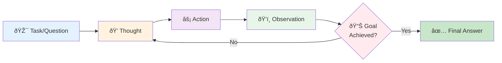

# ReAct: Tool-Augmented Reasoning

---

## Description

ReAct (Reasoning + Acting) is an advanced prompting pattern that combines Chain-of-Thought reasoning with external tool interaction. The AI explicitly articulates its thought process (Think), takes actions using tools (Act), observes the results (Observe), and reflects on whether the goal is achieved (Reflect). This creates a transparent, auditable loop ideal for complex tasks requiring information retrieval, API calls, or multi-step workflows.

---

## Research Foundation

This technique builds upon foundational work in tool-augmented reasoning:
**Yao, S., Zhao, J., Yu, D., Du, N., Shafran, I., Narasimhan, K., & Cao, Y. (2022).** "ReAct: Synergizing Reasoning and Acting in Language Models." *International Conference on Learning Representations (ICLR) 2023*. [arXiv:2210.03629](https://arxiv.org/abs/2210.03629)

The pattern has been further refined through reflection mechanisms:
**Shinn, N., Cassano, F., Gopinath, A., Narasimhan, K., & Yao, S. (2023).** "Reflexion: Language Agents with Verbal Reinforcement Learning." *Advances in Neural Information Processing Systems (NeurIPS) 36*. [arXiv:2303.11366](https://arxiv.org/abs/2303.11366)

Yao et al. demonstrated that interleaving reasoning traces with task-specific actions allows models to create, maintain, and adjust plans while also interacting with external sources for additional information. Shinn et al. extended this by introducing verbal reinforcement learning, where agents reflect on task feedback signals and maintain their own reflective text in an episodic memory buffer to make better decisions in subsequent trials.

---

## ReAct Cycle Visualization

The ReAct pattern follows a continuous loop of reasoning and acting:



**Legend:**

- 💭 **Thought**: Explicit reasoning about what to do next
- âš¡ **Action**: Call to external tool/API with parameters
- ðŸ‘ï¸ **Observation**: System returns actual tool output
- 📊 **Reflection**: Assess progress toward goal
- ✅ **Answer**: Complete response when sufficient information gathered

---

## Use Cases

- Research tasks requiring multiple information sources
- Data analysis workflows with API calls or database queries
- Multi-step troubleshooting with diagnostic tools
- Document retrieval and synthesis (RAG patterns)
- Code execution and debugging workflows
- Integration testing with external systems
- Automated customer support with ticketing systems

---

## Variables

| Variable | Required? | Description | Example |
| --- |---:| --- | --- |
| `[DESCRIBE_TASK_GOAL]` | Yes | The goal/problem to solve using ReAct loops. | `Investigate and fix failing CI tests` |
| `[PROVIDE_BACKGROUND]` | No | Background that constrains tools and approach. | `Failures started after dependency upgrade` |
| `[LIST_TOOLS_WITH_DESCRIPTIONS]` | Yes | The toolset available (names + what they do). | `read_file (inspect files), grep_search (find patterns), run_tests (execute suite)` |

## Example

**Input**

- `[DESCRIBE_TASK_GOAL]`: `Triage a production incident from logs and metrics`
- `[PROVIDE_BACKGROUND]`: `High p99 latency since 14:00 UTC; suspected DB regression`
- `[LIST_TOOLS_WITH_DESCRIPTIONS]`: `log_search, metrics_query, deploy_history`

**Expected output (high level)**

- Several Think/Act/Observe/Reflect cycles
- A final, actionable recommendation and next steps

## Prompt

```text
You are an AI assistant using the ReAct (Reasoning + Acting) pattern to solve tasks.

**Task**: [DESCRIBE_TASK_GOAL]

**Context**: [PROVIDE_BACKGROUND]

**Available Tools**:
[LIST_TOOLS_WITH_DESCRIPTIONS]

**Instructions**:
Use the Think → Act → Observe → Reflect cycle until the task is complete.

For each cycle, format your response as:

**Thought [N]**: [Explain what you're thinking, what you need to know next, why this action makes sense]

**Action [N]**: [Specify the tool and parameters]
Tool: [TOOL_NAME]
Parameters: {
  "param1": "value1",
  "param2": "value2"
}

[SYSTEM WILL PROVIDE OBSERVATION]

**Observation [N]**: [System returns tool output - you analyze it here]

**Reflection [N]**: [Assess if you're closer to the goal, what you learned, what's next]

---

Continue this cycle until you can provide:

**Final Answer**: [Complete response to the original task]

**Key Constraints**:

- Always Think before you Act
- Each Action must use a specified tool (no hallucinating tool results)
- Observe actual tool outputs - don't assume
- Reflect on whether you're making progress
- Stop when you have sufficient information to answer the task

```

**Output:**

```text
**Thought 1**: To assess security vulnerabilities, I should start with an automated security scan to get an overview. A full scan will give comprehensive results, which is important for risk prioritization. After seeing the vulnerabilities, I can investigate specific high-risk areas deeper.

**Action 1**:
Tool: security_scan
Parameters: {
  "endpoint": "https://api.example.com",
  "scan_type": "full"
}

**Observation 1**: 
[System returns:]
{
  "vulnerabilities": [
    {"type": "SQL Injection", "endpoint": "/api/users/search", "cvss": 9.1, "severity": "Critical"},
    {"type": "Broken Authentication", "endpoint": "/api/auth/login", "cvss": 8.2, "severity": "High"},
    {"type": "XSS", "endpoint": "/api/comments/create", "cvss": 6.5, "severity": "Medium"},
    {"type": "Missing Rate Limiting", "endpoint": "/api/data/export", "cvss": 5.3, "severity": "Medium"},
    {"type": "Information Disclosure", "endpoint": "/api/debug/info", "cvss": 4.1, "severity": "Low"}
  ],
  "total_issues": 5,
  "scan_duration": "12 minutes"
}

**Reflection 1**: Good - I have 5 vulnerabilities identified. The SQL Injection (CVSS 9.1) and Broken Authentication (CVSS 8.2) are Critical/High severity and should be investigated first. Before providing recommendations, I should understand what these endpoints do and check if there have been recent changes that introduced these vulnerabilities.

---

**Thought 2**: The SQL Injection in /api/users/search is the highest risk. I need to understand what this endpoint does and whether it's frequently used. If it's a public endpoint with high traffic, the risk multiplies. Let me fetch the API documentation for this endpoint.

**Action 2**:
Tool: api_documentation_fetch
Parameters: {
  "endpoint": "/api/users/search"
}

**Observation 2**:
[System returns:]
{
  "endpoint": "/api/users/search",
  "method": "GET",
  "authentication": "None - Public endpoint",
  "rate_limit": "1000 requests/hour per IP",
  "parameters": [
    {"name": "query", "type": "string", "required": true, "description": "Search term for user lookup"},
    {"name": "limit", "type": "integer", "default": 10}
  ],
  "usage_stats": {
    "avg_requests_per_day": 12500,
    "peak_requests_per_hour": 2100
  }
}

**Reflection 2**: This is concerning - it's a PUBLIC endpoint (no authentication) with high traffic (12.5K requests/day). SQL injection here is extremely dangerous as attackers can query/modify the database without authentication. This must be priority #1. Now I should check git history to see if this was introduced recently or has been there a while.

---

**Thought 3**: I need to know if this SQL injection vulnerability was recently introduced (which might mean a recent code change) or if it's been there a while (which might mean it's in legacy code). Recent introduction might indicate specific commits to review; legacy might require refactoring.

**Action 3**:
Tool: git_history_search
Parameters: {
  "keyword": "/api/users/search",
  "since": "2024-06-01"
}

**Observation 3**:
[System returns:]
{
  "matching_commits": [
    {
      "commit": "a3f9d12",
      "date": "2024-09-15",
      "author": "dev@example.com",
      "message": "Add full-text search to user endpoint - URGENT feature request",
      "files_changed": ["api/users/search_handler.py"]
    },
    {
      "commit": "b1c4e88",
      "date": "2024-07-22",
      "author": "intern@example.com",
      "message": "Optimize user search query performance",
      "files_changed": ["api/users/search_handler.py"]
    }
  ]
}

**Reflection 3**: Found it! The vulnerability was likely introduced in September (a3f9d12) when someone added "full-text search" as an urgent feature. The commit message suggests this was rushed ("URGENT"). The earlier commit in July also touched the same file. This is a recent introduction (2-3 months old), which means:

1. The attack surface is relatively new
2. It may not have been caught by code review due to urgency
3. Fixing it should be straightforward since it's recent code

Now let me check the Broken Authentication issue before finalizing recommendations.

---

**Thought 4**: The second critical issue is Broken Authentication on /api/auth/login (CVSS 8.2). Let me fetch documentation to understand what's wrong with the authentication mechanism.

**Action 4**:
Tool: api_documentation_fetch
Parameters: {
  "endpoint": "/api/auth/login"
}

**Observation 4**:
[System returns:]
{
  "endpoint": "/api/auth/login",
  "method": "POST",
  "authentication": "None - this IS the auth endpoint",
  "rate_limit": "5 attempts per minute per IP",
  "description": "User authentication endpoint",
  "parameters": [
    {"name": "username", "type": "string", "required": true},
    {"name": "password", "type": "string", "required": true}
  ],
  "response": {
    "success": {"token": "JWT token", "user_id": "integer"},
    "failure": {"error": "Invalid credentials", "remaining_attempts": "integer"}
  },
  "notes": "Rate limiting implemented at IP level. Returns remaining attempts on failure."
}

**Reflection 4**: I see the issue - the "remaining_attempts" in the error response is a security weakness (information disclosure about rate limiting). Also, IP-based rate limiting is easily bypassed with proxies. However, I need more context on what the security scanner specifically flagged as "Broken Authentication". Let me query if there are any lockout mechanisms in the database.

---

**Thought 5**: To fully understand the Broken Authentication issue, I should check if there's an account lockout mechanism. If users can attempt login indefinitely (just slowly), that's the vulnerability.

**Action 5**:
Tool: query_database
Parameters: {
  "query": "SELECT COUNT(*) as count FROM failed_login_attempts WHERE created_at > NOW() - INTERVAL '24 hours' GROUP BY username ORDER BY count DESC LIMIT 5"
}

**Observation 5**:
[System returns:]
{
  "results": [
    {"username": "admin", "count": 8423},
    {"username": "user123", "count": 6234},
    {"username": "test", "count": 4521},
    {"username": "root", "count": 3877},
    {"username": "administrator", "count": 3124}
  ]
}

**Reflection 5**: This confirms the issue - there are thousands of failed login attempts on common usernames (admin, root, test, administrator) in just 24 hours. This indicates:

1. Brute-force attacks are actively happening
2. No account lockout mechanism exists (only rate limiting)
3. Attackers are rotating IPs to bypass rate limits
4. This is being actively exploited

Combined with the earlier finding about "remaining_attempts" disclosure, this is definitely a High severity issue.

I now have enough information to provide a comprehensive risk-ranked report.

---

**Final Answer**:

## Security Vulnerability Risk Report

### Executive Summary
Found 5 vulnerabilities (1 Critical, 1 High, 2 Medium, 1 Low). Two vulnerabilities are actively being exploited and require immediate attention. Budget: 40 hours available.

### Priority 1: Critical - IMMEDIATE ACTION REQUIRED

**1. SQL Injection in /api/users/search (CVSS 9.1)**

- **Risk**: Public endpoint, no authentication, 12.5K requests/day
- **Root Cause**: Recently introduced (Sept 2024, commit a3f9d12) during rushed feature development
- **Exploitation**: Potential for data breach, data manipulation, or full database compromise
- **Effort**: 8-12 hours (recent code, should be straightforward to fix)
- **Fix**: Implement parameterized queries, add input validation
- **Testing**: 4 hours for thorough testing across all query variations

**Engineering estimate**: 16 hours total

---

### Priority 2: High - THIS SPRINT

**2. Broken Authentication in /api/auth/login (CVSS 8.2)**

- **Risk**: Actively being exploited (8,423 brute-force attempts on "admin" in 24h)
- **Issues Identified**:
  - No account lockout mechanism (only IP-based rate limiting)
  - Information disclosure (exposes remaining attempts)
  - IP rate limiting easily bypassed with proxies
- **Effort**: 16 hours
  - 6 hours: Implement account-based lockout (5 failures = 15 min lockout)
  - 4 hours: Remove "remaining_attempts" from error response
  - 4 hours: Add CAPTCHA after 3 failures
  - 2 hours: Monitoring for suspicious patterns
- **Testing**: 6 hours

**Engineering estimate**: 22 hours total

---

### Priority 3: Medium - NEXT SPRINT

**3. XSS in /api/comments/create (CVSS 6.5)**

- **Effort**: 4 hours (add output escaping, CSP headers)

**4. Missing Rate Limiting on /api/data/export (CVSS 5.3)**

- **Effort**: 6 hours (implement rate limiting, add quota system)

**Combined estimate**: 10 hours

---

### Priority 4: Low - BACKLOG

**5. Information Disclosure in /api/debug/info (CVSS 4.1)**

- **Effort**: 2 hours (disable in production, add auth requirement)

---

### Budget Allocation (40 hours available)

**Sprint 1 (This sprint)**: 38 hours

- SQL Injection fix: 16 hours ✓
- Broken Authentication fix: 22 hours ✓

**Sprint 2 (Next sprint)**: 10 hours

- XSS fix: 4 hours
- Rate Limiting: 6 hours

**Backlog**: 2 hours

- Debug endpoint fix: 2 hours

### Recommended Immediate Actions

1. **TODAY**: Deploy temporary WAF rules to block obvious SQL injection patterns on /api/users/search
2. **TODAY**: Increase rate limiting on /api/auth/login from 5 to 3 attempts/min
3. **THIS WEEK**: Complete Priority 1 fix and deploy (SQL Injection)
4. **NEXT WEEK**: Complete Priority 2 fix and deploy (Broken Authentication)

### Monitoring Recommendations

- Alert on SQL error rates from /api/users/search endpoint
- Dashboard for failed login attempts per username
- Weekly security scan to catch regression

**Total engineering time**: 50 hours across 2 sprints
**Critical path**: 38 hours (fits in 40-hour budget for this sprint with 2 hours buffer)
```text

## Output Schema (JSON)

For automation pipelines:

```json
{
  "task": "...",
  "cycles": [
    {
      "cycle": 1,
      "thought": "...",
      "action": {
        "tool": "tool_name",
        "parameters": {}
      },
      "observation": "...",
      "reflection": "..."
    }
  ],
  "final_answer": "...",
  "tools_used": ["tool1", "tool2"],
  "total_cycles": 5,
  "success": true
}
```text

---

## Governance Notes

- **PII Safety**: Exercise caution when using tools that query databases or APIs containing PII
- **Human Review Required**: When tools interact with external systems, production databases, or modify data
- **Audit Trail**: The Think-Act-Observe-Reflect cycle provides natural audit trail - log all cycles
- **Tool Access Control**: Restrict tool access based on user permissions and data sensitivity
- **Error Handling**: Tools may fail or timeout - always handle gracefully and log failures

## Platform Adaptations

### GitHub Copilot with MCP Tools

```text
@workspace use ReAct pattern to [task] with available tools: @mcp-tool1, @mcp-tool2
```text

### Custom API Implementation

```python
def react_loop(task, tools, max_cycles=10):
    for cycle in range(1, max_cycles + 1):
        thought = llm.generate(f"Thought {cycle} for: {task}")
        action = llm.generate(f"Action {cycle} given thought: {thought}")

        tool_name = extract_tool(action)
        params = extract_params(action)
        observation = tools[tool_name](**params)

        reflection = llm.generate(
            f"Reflect on: {observation}"
        )

        if should_stop(reflection):
            return llm.generate(f"Final answer for: {task}")

    return "Max cycles reached without solution"
```json
