```mermaid
graph TD
    A[🎯 Problem] --> B1[💡 Approach 1]
    A --> B2[💡 Approach 2]
    A --> B3[💡 Approach 3]

    B1 --> C1[📊 Evaluate: 7/10]
    B2 --> C2[📊 Evaluate: 9/10]
    B3 --> C3[📊 Evaluate: 5/10]

    C2 --> D1[🔍 Explore Further]
    D1 --> E1[💡 Sub-option 2a]
    D1 --> E2[💡 Sub-option 2b]

    E1 --> F1[📊 Evaluate: 8/10]
    E2 --> F2[📊 Evaluate: 10/10]

    F2 --> G[✅ Selected Solution]

    C3 -.->|Backtrack| A

    style A fill:#e3f2fd
    style B2 fill:#c8e6c9
    style C2 fill:#c8e6c9
    style F2 fill:#81c784
    style G fill:#4caf50,color:#fff
    style C3 fill:#ffcdd2
```

## Description

## Prompt



# Tree-of-Thoughts: Multi-Branch Reasoning Template

## Description

## Prompt


# Tree-of-Thoughts: Multi-Branch Reasoning Template


# Tree-of-Thoughts: Multi-Branch Reasoning Template

## Description

Tree-of-Thoughts (ToT) is an advanced reasoning pattern that explores multiple solution paths simultaneously, evaluates each branch systematically, and can backtrack when a path proves unfruitful. Unlike linear reasoning (Chain-of-Thought), ToT excels at problems with multiple valid approaches, requiring trade-off analysis or creative exploration. Essential for complex decisions, strategic planning, and architecture choices.

## Tree-of-Thoughts Visualization

ToT explores multiple solution paths and evaluates each branch:


**Key Concepts:**

- 💡 **Branch Generation**: Create multiple solution approaches
- 📊 **Evaluation**: Score each branch on feasibility, cost, risk
- 🔍 **Expansion**: Explore promising branches deeper
- ⬅️ **Backtracking**: Abandon low-scoring paths
- ✅ **Selection**: Choose highest-rated solution

## Variables

| Variable | Required? | Description | Example |
| --- |---:| --- | --- |
| `[PROBLEM_STATEMENT]` | Yes | The problem you want to solve. | `Design a multi-tier caching strategy for global users` |
| `[BACKGROUND_AND_CONSTRAINTS]` | No | Relevant background and constraints. | `Budget $500K/month; 150 countries` |
| `[WHAT_SUCCESS_LOOKS_LIKE]` | Yes | Concrete success criteria to optimize for. | `<200ms p95 latency; >80% cache hit rate` |

## Example

**Inputs**

- `[PROBLEM_STATEMENT]`: `Improve global e-commerce latency while maintaining inventory accuracy`
- `[BACKGROUND_AND_CONSTRAINTS]`: `100M users, 5M SKUs, 150 countries, $500K/month budget`
- `[WHAT_SUCCESS_LOOKS_LIKE]`: `<200ms p95 latency; >99.9% inventory accuracy; >80% cache hit rate`

**Expected output (high level)**

- 3–5 thought branches with scores
- A chosen path (or hybrid) with rationale
- Risks and mitigations

## Prompt

```text
You are an AI using Tree-of-Thoughts (ToT) reasoning to solve a complex problem.

**Problem**: [PROBLEM_STATEMENT]

**Context**: [BACKGROUND_AND_CONSTRAINTS]

**Success Criteria**: [WHAT_SUCCESS_LOOKS_LIKE]

**Instructions**:

Use multi-branch exploration to find the best solution. For each decision point, generate multiple alternative approaches, evaluate them, and pursue the most promising paths.

Format your response as:

**Problem Understanding**:

- Restate the problem
- Identify key challenges
- Note critical unknowns

**Deep Exploration of Selected Branch [X]**:

[For each selected branch, explore it deeply with substeps]

- Sub-decision points within this branch
- Implementation details
- Risk mitigation strategies

If this branch hits a dead-end or reveals unexpected complexity:
→ **BACKTRACK**: Return to previous decision point and explore alternative branch

**Branch Generation at Decision Point 1: Overall Architecture**

**Thought Branch A: CDN-Heavy Approach**

- **Description**: Use CDN (CloudFront, Cloudflare) edge caching for static content, regional Redis clusters for dynamic data
- **Pros**: 
  - CDN gets you closest to users globally
  - Proven at scale (Netflix, Spotify use this)
  - CDN handles DDoS, SSL termination (bonus value)
- **Cons**:
  - CDN cache invalidation is slow (2-5 minutes)
  - Expensive at 100M user scale
  - Dynamic content still hits regional Redis (adds hop)
- **Estimated Success Probability**: 70%
- **Score (0-10)**: 7

**Thought Branch B: Multi-Tier Write-Through Cache**

- **Description**: L1 (local in-app cache) → L2 (regional Redis) → L3 (global Redis) → Database. All writes go through cache.
- **Pros**:
  - High hit rate potential (multi-level)
  - Write-through ensures cache consistency
  - Predictable cost model
- **Cons**:
  - Write-through adds latency to writes
  - Complex invalidation across tiers
  - Single point of failure at L3
  - May not hit <200ms if L1 misses
- **Estimated Success Probability**: 55%
- **Score (0-10)**: 5.5

**Thought Branch C: Hybrid: CDN for Immutable + Regional Redis for Mutable**

- **Description**: Separate immutable content (product images, descriptions) to CDN. Mutable content (inventory, cart, prices) to regional Redis clusters.
- **Pros**:
  - Optimizes each data type appropriately
  - CDN for images/static (bulk of bytes) reduces bandwidth cost
  - Regional Redis for inventory (low latency + accuracy possible)
  - Can achieve <200ms p95 with regional presence
- **Cons**:
  - More complex architecture (two caching systems)
  - Need regional Redis in ~10-15 regions (setup overhead)
  - Inventory accuracy still requires careful TTL tuning
- **Estimated Success Probability**: 80%
- **Score (0-10)**: 8.5

**Branch Evaluation**:

- Branch A (CDN-heavy) scores well but CDN invalidation latency problematic for inventory accuracy
- Branch B (write-through) adds write latency and has SPOF concerns - lowest score
- Branch C (hybrid) balances latency, accuracy, and cost effectively - highest score

**Selected Branch**: C (Hybrid CDN + Regional Redis)
**Pruned Branches**: B (write-through) - too slow, too complex. A (CDN-heavy) - keep CDN component but add Redis layer.

**Testing Branch C Feasibility: Cost Check**

Let's validate the budget:

- Cloudflare CDN: $100K/month
- Redis (3 major regions): $80K/month
- Cloudflare Workers: $50K/month
- Database query reduction (savings): -$50K/month
- **Total**: $180K/month

✓ **Well under $500K budget** - we have $320K headroom for scaling or optimization

**BACKTRACKING EXPLORATION**:

Let's revisit Branch A (CDN-heavy) now that we know inventory accuracy can be handled with optimistic locking. Could we make Branch A work?

**Branch A.2: CDN-heavy with edge compute for inventory checks**

- Use CDN for everything
- Add edge compute (Workers/Lambda@Edge) for inventory validation
- On purchase attempt at edge:
  1. Check edge cache for inventory count
  2. Optimistic lock with DB version check
  3. If valid, decrement and respond
  4. If invalid, invalidate cache and retry

**Re-evaluation**:

- **Pros**: Simpler architecture (CDN + edge compute only, no Redis)
- **Cons**: Edge compute limited memory (can't cache all 5M SKUs), higher compute cost
- **Updated Score**: 7.5 (still lower than Branch C)

**Decision**: Branch C still superior due to Redis flexibility for complex queries (search, filtering) that edge compute can't handle efficiently.

**Final Recommendation**:

**Selected Architecture: Hybrid CDN + Regional Redis with Edge Compute**

**Implementation**:

1. **Cloudflare CDN ($100K/month)**:
   - Cache product images, descriptions (immutable)
   - TTL: 24 hours
   - Hit rate target: 95% (most requests)

2. **Regional Redis Clusters ($80K/month)**:
   - 3 major regions: US, EU, APAC
   - Cache: inventory, prices, user carts, product metadata
   - TTL: 30 seconds with optimistic locking for inventory

3. **Cloudflare Workers ($50K/month)**:
   - Edge compute for product catalog queries
   - In-memory cache for popular SKUs (top 10K products = 80% of traffic)
   - Smart routing to nearest Redis

4. **Optimistic Locking for Inventory**:
   - Version number with each cached inventory count
   - Validation before decrement
   - Retry on version mismatch

**Why This Beats Alternatives**:

- **vs. Branch A (CDN-only)**: Better latency (edge compute + Redis), more flexibility for complex queries
- **vs. Branch B (write-through)**: No write latency penalty, simpler consistency model, lower cost

**Expected Results**:

- p95 latency: ~120ms (40% improvement, meets <200ms goal) ✓
- Cache hit rate: 85% (40% improvement from 45%, exceeds 80% goal) ✓
- Cost: $180K/month (64% under budget) ✓
- Inventory accuracy: >99.9% (optimistic locking prevents overselling) ✓

**Confidence Level**: **High (85%)**

**Justification**: Architecture is proven (similar to Shopify, Amazon approaches), math checks out, well under budget with headroom for growth.

**Residual Risks & Mitigation**:

1. **Risk**: Regional failover if Redis cluster goes down
   - **Mitigation**: Multi-AZ Redis with automatic failover, fallback to DB queries
2. **Risk**: Workers memory limits with 5M SKUs
   - **Mitigation**: Cache only top 10K SKUs in Workers (80/20 rule), rest routes to Redis
3. **Risk**: Optimistic locking retry storms during flash sales
   - **Mitigation**: Exponential backoff, queue system for high-demand items
4. **Risk**: Cloudflare outage impacts entire platform
   - **Mitigation**: Multi-CDN strategy (Cloudflare primary, Fastly backup)

**Implementation Timeline**:

- Weeks 1-2: Setup Cloudflare CDN + Workers
- Weeks 3-4: Deploy Redis clusters in 3 regions
- Weeks 5-6: Implement optimistic locking
- Weeks 7-8: Migration and testing
- Week 9: Gradual rollout (10% → 50% → 100%)
- Week 10: Monitoring and optimization

```

## Governance Notes

- **PII Safety**: No inherent PII processing; ensure problem/context don't contain sensitive data
- **Human Review Required**: For decisions with >$100K impact, affecting >50 people, or strategic choices
- **Audit Trail**: Save complete ToT exploration (all branches) for accountability and learning
- **Stakeholder Communication**: ToT output can be overwhelming - create executive summary## Variables

| Variable | Description |
|---|---|
| `[BACKGROUND_AND_CONSTRAINTS]` | AUTO-GENERATED: describe `BACKGROUND_AND_CONSTRAINTS` |
| `[PROBLEM_STATEMENT]` | AUTO-GENERATED: describe `PROBLEM_STATEMENT` |
| `[WHAT_SUCCESS_LOOKS_LIKE]` | AUTO-GENERATED: describe `WHAT_SUCCESS_LOOKS_LIKE` |
| `[X]` | AUTO-GENERATED: describe `X` |

## Example

### Input

````text
[Fill in a realistic input for the prompt]
````

### Expected Output

````text
[Representative AI response]
````
## Variables

| Variable | Description |
|---|---|
| `[BACKGROUND_AND_CONSTRAINTS]` | AUTO-GENERATED: describe `BACKGROUND_AND_CONSTRAINTS` |
| `[Fill in a realistic input for the prompt]` | AUTO-GENERATED: describe `Fill in a realistic input for the prompt` |
| `[For each selected branch, explore it deeply with substeps]` | AUTO-GENERATED: describe `For each selected branch, explore it deeply with substeps` |
| `[PROBLEM_STATEMENT]` | AUTO-GENERATED: describe `PROBLEM_STATEMENT` |
| `[Representative AI response]` | AUTO-GENERATED: describe `Representative AI response` |
| `[WHAT_SUCCESS_LOOKS_LIKE]` | AUTO-GENERATED: describe `WHAT_SUCCESS_LOOKS_LIKE` |
| `[X]` | AUTO-GENERATED: describe `X` |
| `[✅ Selected Solution]` | AUTO-GENERATED: describe `✅ Selected Solution` |
| `[🎯 Problem]` | AUTO-GENERATED: describe `🎯 Problem` |
| `[💡 Approach 1]` | AUTO-GENERATED: describe `💡 Approach 1` |
| `[💡 Approach 2]` | AUTO-GENERATED: describe `💡 Approach 2` |
| `[💡 Approach 3]` | AUTO-GENERATED: describe `💡 Approach 3` |
| `[💡 Sub-option 2a]` | AUTO-GENERATED: describe `💡 Sub-option 2a` |
| `[💡 Sub-option 2b]` | AUTO-GENERATED: describe `💡 Sub-option 2b` |
| `[📊 Evaluate: 10/10]` | AUTO-GENERATED: describe `📊 Evaluate: 10/10` |
| `[📊 Evaluate: 5/10]` | AUTO-GENERATED: describe `📊 Evaluate: 5/10` |
| `[📊 Evaluate: 7/10]` | AUTO-GENERATED: describe `📊 Evaluate: 7/10` |
| `[📊 Evaluate: 8/10]` | AUTO-GENERATED: describe `📊 Evaluate: 8/10` |
| `[📊 Evaluate: 9/10]` | AUTO-GENERATED: describe `📊 Evaluate: 9/10` |
| `[🔍 Explore Further]` | AUTO-GENERATED: describe `🔍 Explore Further` |

## Example

### Input

````text
[Fill in a realistic input for the prompt]
````

### Expected Output

````text
[Representative AI response]
````

