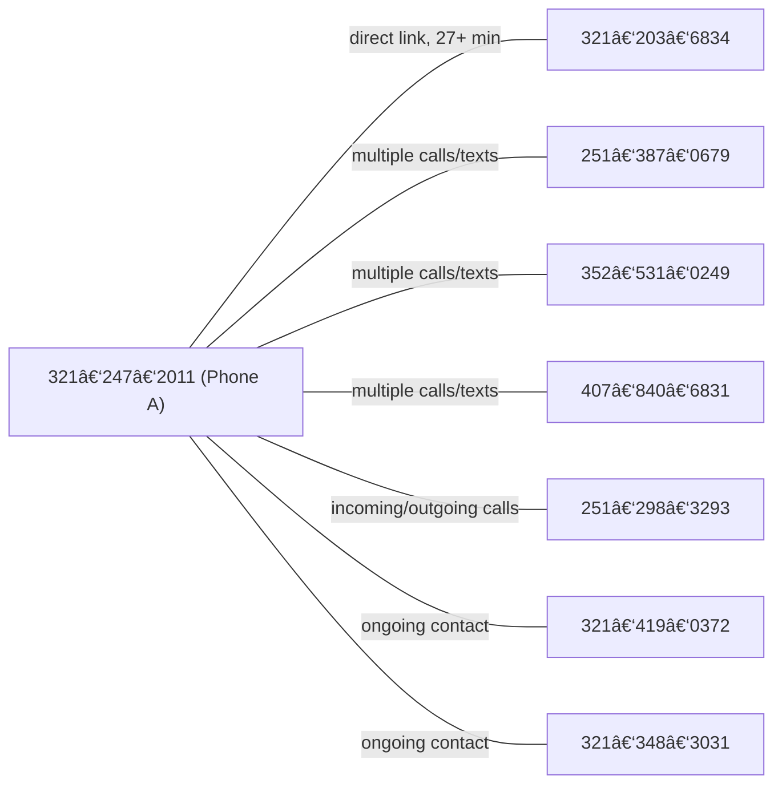
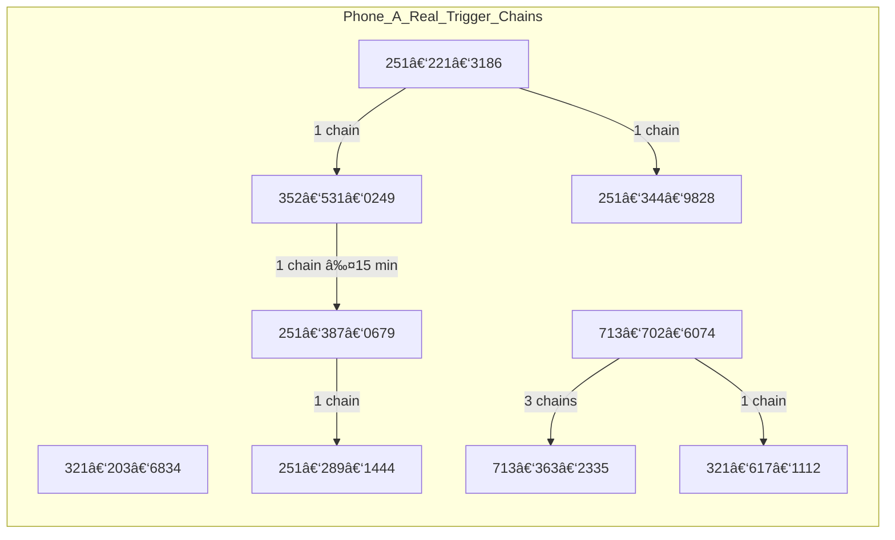
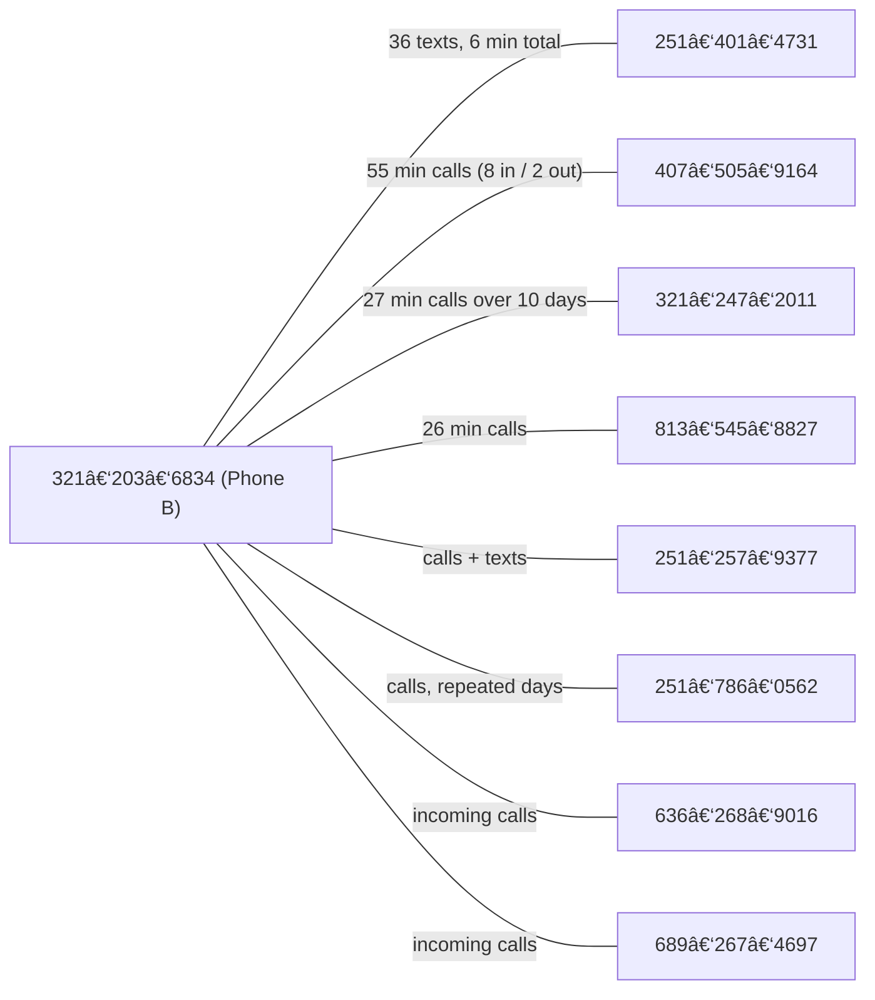
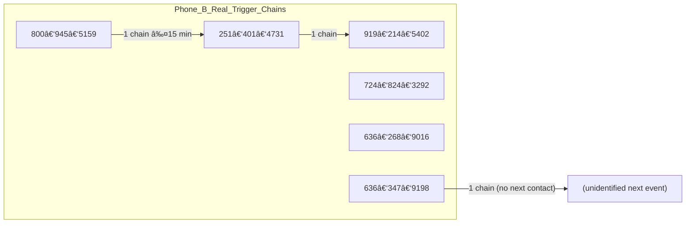
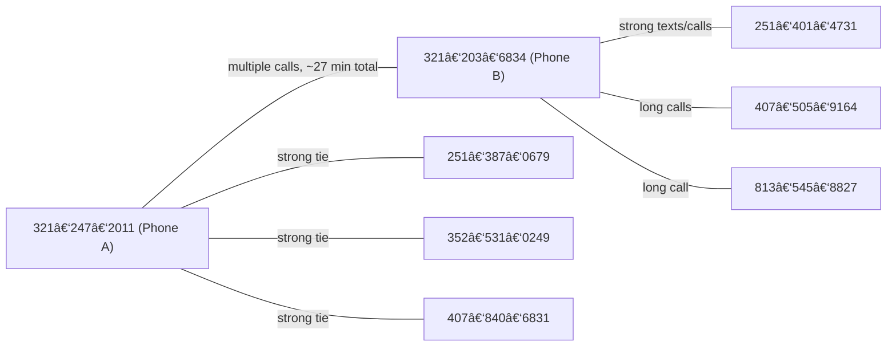

---

title: "Data Analysis and Insights Generator"
category: "analysis"
tags: ["data-analysis", "insights", "reporting", "statistics", "visualization"]
author: "Prompts Library Team"
version: "1.0"
date: "2025-10-29"
difficulty: "intermediate"
platform: "Claude Sonnet 4.5"
---

# Data Analysis and Insights Generator

## Description

Transform raw data into meaningful insights and actionable recommendations. This prompt helps data analysts, business intelligence professionals, and decision-makers extract valuable patterns, trends, and insights from their data.

## Use Cases

- Analyze sales, marketing, or operational data
- Generate executive summaries from complex datasets
- Identify trends, patterns, and anomalies
- Create data-driven recommendations
- Support decision-making with statistical analysis

## Prompt

```text
You are an experienced data analyst specializing in extracting actionable insights from data. I need help analyzing a dataset and generating insights.

**Dataset Description:**
- Type: [WHAT KIND OF DATA - e.g., sales, customer, operational, survey]
- Time Period: [TIME RANGE COVERED]
- Size: [NUMBER OF RECORDS/ROWS]
- Key Metrics: [MAIN METRICS YOU'RE TRACKING]

**Data Summary/Sample:**
[PASTE YOUR DATA SUMMARY, SAMPLE ROWS, OR KEY STATISTICS HERE]
- You can include: summary statistics, sample rows, aggregated data, or describe the data structure
- Example: "Total sales: $500K across 1,200 transactions, 5 product categories, 3 regions"

**Analysis Goals:**
1. [WHAT YOU WANT TO UNDERSTAND - e.g., identify top-performing products]
2. [ANOTHER GOAL - e.g., understand seasonal patterns]
3. [ANOTHER GOAL - e.g., find areas for improvement]

**Context:**
- Business/Organization: [YOUR INDUSTRY OR CONTEXT]
- Current Challenges: [ANY KNOWN ISSUES OR CONCERNS]
- Decision to Make: [WHAT DECISION THIS ANALYSIS WILL INFORM]

Please provide:

1. **Executive Summary**
   - 3-5 key takeaways in plain language
   - Most important finding highlighted

2. **Detailed Analysis**
   - Trends and patterns identified
   - Statistical observations
   - Comparisons (time periods, categories, segments)
   - Anomalies or outliers

3. **Insights**
   - What the data reveals (the "so what")
   - Potential root causes
   - Correlations or relationships discovered

4. **Recommendations**
   - Specific, actionable next steps
   - Prioritized by impact and feasibility
   - Expected outcomes

5. **Suggested Visualizations**
   - What charts/graphs would best communicate these insights
   - Key data points to highlight

6. **Follow-Up Questions**
   - Additional data that would strengthen analysis
   - Areas needing deeper investigation
```

## Variables

- `[WHAT KIND OF DATA]`: Type of data you're analyzing (sales, customer, marketing, etc.)
- `[TIME RANGE COVERED]`: Period your data covers
- `[NUMBER OF RECORDS/ROWS]`: Size of your dataset
- `[MAIN METRICS YOU'RE TRACKING]`: Key metrics (revenue, customers, conversions, etc.)
- `[PASTE YOUR DATA SUMMARY...]`: Your actual data or summary
- `[WHAT YOU WANT TO UNDERSTAND]`: Specific analysis goals
- `[YOUR INDUSTRY OR CONTEXT]`: Business context
- `[ANY KNOWN ISSUES OR CONCERNS]`: Current challenges
- `[WHAT DECISION THIS ANALYSIS WILL INFORM]`: Purpose of the analysis

## Example Usage

**Input:**

```text
You are an experienced data analyst specializing in extracting actionable insights from data. I need help analyzing a dataset and generating insights.

**Dataset Description:**
- Type: E-commerce sales data
- Time Period: Q1-Q4 2024 (12 months)
- Size: 15,000 transactions
- Key Metrics: Revenue, order count, average order value (AOV), customer acquisition cost (CAC)

**Data Summary/Sample:**
- Total Revenue: $1.2M (down 8% vs. 2023)
- Total Orders: 15,000 (down 12% vs. 2023)
- Average Order Value: $80 (up 4% vs. 2023)
- Customer Acquisition Cost: $45 (up 35% vs. 2023)
- Returning Customer Rate: 28% (down from 35% in 2023)
- Top Category by Revenue: Electronics (45%), Fashion (30%), Home Goods (25%)
- Geographic Split: US (60%), Canada (25%), UK (15%)
- Q4 Revenue: $450K (37.5% of annual revenue)

**Analysis Goals:**
1. Understand why revenue decreased despite higher AOV
2. Identify the cause of declining returning customer rate
3. Find opportunities to reduce customer acquisition costs

**Context:**
- Business/Organization: Small e-commerce retailer, online-only
- Current Challenges: Rising ad costs on Facebook/Google, increased competition
- Decision to Make: Where to focus marketing budget for 2025

Please provide:

1. **Executive Summary**
   - 3-5 key takeaways in plain language
   - Most important finding highlighted

2. **Detailed Analysis**
   - Trends and patterns identified
   - Statistical observations
   - Comparisons (time periods, categories, segments)
   - Anomalies or outliers

3. **Insights**
   - What the data reveals (the "so what")
   - Potential root causes
   - Correlations or relationships discovered

4. **Recommendations**
   - Specific, actionable next steps
   - Prioritized by impact and feasibility
   - Expected outcomes

5. **Suggested Visualizations**
   - What charts/graphs would best communicate these insights
   - Key data points to highlight

6. **Follow-Up Questions**
   - Additional data that would strengthen analysis
   - Areas needing deeper investigation
```

**Output:**

```text
## 1. Executive Summary

**Key Takeaways:**

1. **Volume Crisis:** You're losing customers faster than you're increasing order values—a 12% drop in orders overwhelms the 4% AOV increase, resulting in 8% revenue decline.

2. **Acquisition Efficiency Collapse:** CAC increased 35% while returning customer rate fell 20% (from 35% to 28%), indicating a broken retention funnel.

3. **Q4 Dependency:** 37.5% of annual revenue in Q4 suggests heavy holiday dependence and weak year-round engagement.

4. **Silver Lining:** Higher AOV indicates customer willingness to spend more, suggesting opportunity for upselling and premium positioning.

**🚨 MOST CRITICAL FINDING:** 
Your customer retention dropped significantly (35% → 28%) while CAC spiked 35%. This double-hit means you're spending more to acquire customers who are less likely to return—an unsustainable unit economics trajectory.

## 2. Detailed Analysis

### Revenue Decline Breakdown
- Lost orders (12% decline × previous AOV of ~$77): -$139K
- Gained from higher AOV (4% increase × current orders): +$46K
- **Net effect: -$93K (8% decline)**

**The math:** You need approximately 3% more orders just to offset a 1% loss in volume with AOV increases—you're nowhere close.

### Customer Behavior Trends

**Returning Customer Rate Drop (35% → 28%):**
- 7 percentage point decline represents roughly 1,050 fewer repeat orders
- If CAC was $45 to acquire each customer, and they're not returning, you're not recovering acquisition costs
- Average customer lifetime value declining

**Geographic Performance:**
- US market (60% of revenue): Stable but mature
- Canada/UK (40% combined): Growth opportunity or resource drain? Needs segment-level profitability analysis

**Category Analysis:**
- Electronics (45%): High-value but typically low-margin and high-return rates
- Fashion (30%): Typically seasonal, supports Q4 concentration theory
- Home Goods (25%): Often one-time purchases, explains retention challenges

### Seasonal Concentration
- Q4: 37.5% of revenue ($450K)
- Implies Q1-Q3 average: ~$250K per quarter
- **60% revenue difference between peak and trough** indicates dangerous seasonal dependency

## 3. Insights

### What the Data Reveals

**The Real Problem: You Have an Acquisition Addiction**
You're trapped in a cycle of expensive customer acquisition without retention. Here's why:

1. **Rising Ad Costs + Falling Retention = Broken Unit Economics**
   - If CAC is $45 and AOV is $80, you need 56% of acquisition cost back on first purchase
   - But with only 28% returning, lifetime value isn't covering acquisition
   - You're likely losing money on customer acquisition

2. **The "Discount Customer" Trap**
   - Rising CAC suggests you're bidding more on paid ads to acquire price-sensitive customers
   - These customers likely came through promotions and won't return at full price
   - Higher AOV might be inflated by first-purchase discounts on larger orders

3. **Product-Market Fit Questions**
   - Low returning rate (28% vs. e-commerce benchmark of 40%+) suggests:
     - Product quality issues
     - Poor post-purchase experience
     - Weak value proposition for repeat purchases
     - Category mix favoring one-time purchases

4. **Holiday Dependency Risk**
   - 37.5% of revenue in Q4 means you're essentially a gift economy
   - January-November performance is concerning—only $750K across 11 months
   - This explains retention: people buy as gifts, recipients don't become customers

### Root Cause Analysis

**Primary Driver:** Customer acquisition strategy focused on volume over quality
- Likely relying on discount promotions to drive sales
- Attracting price-sensitive, one-time buyers
- Not investing in retention/engagement

**Contributing Factors:**
- Product mix favoring one-time purchases (electronics, fashion)
- Weak post-purchase experience (no data on email engagement, but retention suggests it's lacking)
- Seasonal business model not supported by year-round engagement

## 4. Recommendations

### Priority 1: Stop the Bleeding (Immediate - 0-30 days)

**A. Implement Retention Quick Wins**
- **Action:** Launch post-purchase email sequence (Day 1, 7, 14, 30)
- **Expected Outcome:** 3-5% lift in repeat purchase rate (420-700 additional orders)
- **Cost:** Minimal (use existing email platform)
- **Impact:** High value, immediate results

**B. Create a First-Repeat Purchase Incentive**
- **Action:** Offer 15% off second purchase (60-day expiry) to all new customers
- **Expected Outcome:** Improve repeat rate from 28% to 35% (1,050 additional orders)
- **Cost:** 15% margin sacrifice on ~1,000 orders = ~$12K
- **ROI:** If those customers have 50% lifetime return rate, lifetime value increases significantly

### Priority 2: Fix Unit Economics (30-90 days)

**C. Audit and Optimize Paid Acquisition**
- **Action:** 
  - Analyze customer lifetime value (LTV) by acquisition channel
  - Cut spending on channels with LTV < 2x CAC
  - Reallocate budget to channels with better retention rates
- **Expected Outcome:** Reduce CAC by 20% ($45 → $36)
- **Implementation:** Weekly channel review, ruthless cutting of underperformers

**D. Shift to Content/SEO Strategy**
- **Action:** Invest $10K in SEO-optimized content (guides, comparisons, buying guides)
- **Expected Outcome:** Reduce reliance on paid ads, acquire higher-intent customers
- **Timeline:** 3-6 months to see results, but lower CAC long-term

### Priority 3: Build Sustainable Growth (90-365 days)

**E. Develop Subscription or Membership Model**
- **Action:** Create a VIP membership ($99/year) with perks (free shipping, early access, 10% off)
- **Expected Outcome:** 
  - 500 members in year 1 = $49.5K guaranteed revenue
  - Members likely 3-5x repeat purchase rate
- **Why:** Converts one-time buyers into committed customers

**F. Reduce Q4 Dependency**
- **Action:** Create quarterly "mini-peak" campaigns (Spring Refresh, Summer Sale, Back-to-School)
- **Expected Outcome:** Flatten seasonality—move to 30/25/25/20 split vs. current 20/20/22/38
- **Implementation:** Content calendar, inventory planning, promotional schedule

**G. Optimize Product Mix**
- **Action:** 
  - Analyze repeat purchase rates by category
  - Shift marketing focus to categories with highest retention (likely Home Goods)
  - Consider adding consumable/replenishable products
- **Expected Outcome:** Increase baseline repeat rate by 5-7 percentage points

## 5. Suggested Visualizations

To communicate these insights effectively, create:

1. **Combo Chart: Orders vs. AOV (Monthly, 2024)**
   - Bar chart: Monthly order volume
   - Line overlay: Average order value
   - Highlight: The diverging trend (orders down, AOV up)

2. **Funnel Chart: Customer Acquisition & Retention**
   - Stage 1: Visitors
   - Stage 2: First-time customers (CAC: $45)
   - Stage 3: Returning customers (28% conversion)
   - Annotate: Lost value at each stage

3. **Waterfall Chart: Revenue Change Analysis**
   - 2023 baseline
   - Order volume impact (-$139K)
   - AOV increase impact (+$46K)
   - 2024 final (-$93K)
   - Clearly shows volume as the killer

4. **Heat Map: Revenue by Quarter**
   - X-axis: Quarters (Q1-Q4)
   - Y-axis: Categories (Electronics, Fashion, Home)
   - Color intensity: Revenue
   - Highlight: Q4 concentration, category patterns

5. **Cohort Retention Curve**
   - X-axis: Months since first purchase
   - Y-axis: % of customers making another purchase
   - Compare: 2023 cohorts vs. 2024 cohorts
   - Show: Declining retention over time

6. **Scatter Plot: CAC vs. Customer LTV by Channel**
   - X-axis: Customer Acquisition Cost
   - Y-axis: Lifetime Value
   - Each point: An acquisition channel
   - Diagonal line: Break-even (LTV = 2x CAC)
   - Identify: Channels below break-even line

## 6. Follow-Up Questions

**Critical Data Needed:**

1. **Channel-Level Performance:**
   - What's the repeat purchase rate by acquisition channel?
   - Which channels have the highest LTV:CAC ratio?
   - Can we see month-over-month CAC trends by channel?

2. **Customer Segmentation:**
   - What's the average order value of first-time vs. returning customers?
   - What percentage of customers make 3+ purchases?
   - What's the time between first and second purchase for returning customers?

3. **Product Performance:**
   - Which specific products have the highest repeat purchase rates?
   - What's the return rate by category?
   - Are customers buying across categories or staying in one?

4. **Post-Purchase Engagement:**
   - What's your email open/click rate?
   - Do you have any loyalty or rewards program? Usage rates?
   - What's your customer service contact rate? (High = quality issues)

5. **Profitability:**
   - What's the gross margin by category?
   - Are you profitable on first purchase after CAC?
   - What's the contribution margin by customer cohort?

**Areas for Deeper Investigation:**

- **Customer Feedback:** Why aren't customers returning? Survey recent buyers
- **Competitive Analysis:** Are competitors offering better retention incentives?
- **Website Experience:** Is the purchase experience causing friction?
- **Shipping/Fulfillment:** Delays or issues preventing repeat purchases?

---

**Next Steps:**
1. Gather the additional data requested above
2. Implement Priority 1 recommendations immediately
3. Set up weekly tracking for repeat purchase rate and CAC
4. Schedule 30-day review to assess progress
```

## Tips

- Provide as much context as possible about your business and goals
- Include summary statistics rather than raw data dumps for cleaner analysis
- Be specific about what decisions you're trying to make
- If you have hypothesis about what's happening, mention them
- Ask for specific types of visualizations if you have preferences
- Request statistical significance testing if you're comparing groups
- Follow up with deeper dives on specific findings

## Changelog

### Version 1.0 (2025-10-29)

- Initial version

### 1. Phone A – 321‑247‑2011: real‑number relationships



### 2. Phone A – 321‑247‑2011: real‑number trigger chains



### 3. Phone B – 321‑203‑6834: real‑number relationships



### 4. Phone B – 321‑203‑6834: real‑number trigger chains



### 5. Joint overview: both phones and key real‑number contacts



## Communication Patterns: Investigator's Summary

### 1. Overall structure

The phone records describe two distinct users:

- **Phone A – 321‑247‑2011** (your primary line)  
- **Phone B – 321‑203‑6834** (a line you loaned to someone else)

Both phones show sustained activity over the period, but they operate in **partially overlapping, partially separate social circles**.

### 2. Relationship strength by contact

**Phone A (321‑247‑2011)**  

- Communication is concentrated in a **small set of recurring contacts**.  
- Several numbers show high relationship scores driven by repeated calls, texts, and multi‑day activity.  
- Directional metrics indicate a mix of:
  - **Mutual ties** (roughly balanced incoming/outgoing),
  - Contacts that **primarily call in** to A (A receives far more than it initiates),
  - And a few that A **chases** (A dials out more than it receives).

**Phone B (321‑203‑6834)**  

- Also has a tight cluster of strong contacts, but the **top numbers differ** from Phone A's list.  
- Some contacts generate substantial call minutes (long conversations) rather than just frequent short calls.  
- A notable feature is the **repeated, bidirectional traffic between B and A (321‑247‑2011)**: the two phones are in regular contact with each other, suggesting coordination, check‑ins, or logistical communication.

**Shared vs unique contacts**  

- The overlap heatmap shows a **small set of shared contacts** that both phones interact with.  
- Most strong ties, however, are **phone‑specific**, consistent with the phones being used by two different people with some shared environment but their own circles.

### 3. Temporal behavior

**Daily volume**  

- Both phones exhibit **uneven but recognizable rhythms**: periods of routine traffic with intermittent spikes.  
- Some high‑activity days line up across both phones, indicating days where both users were more communicative or involved in shared events.

**Time of day**  

- Heatmaps reveal:
  - A concentration of traffic in **daytime and early evening hours** for normal business/personal activity.
  - Additional **late‑night or very early‑morning events** clustered around certain contacts, which stand out from the baseline and may represent sensitive or higher‑risk interactions.

### 4. Trigger and relay patterns

The trigger‑chain analysis (events within 15 minutes of each other) highlights:

- **Stable chains between specific contact pairs** for each phone.  
  - Example patterns: after contact X calls/texts, contact Y often appears next within a short window.
- These repeated A→B or B→C sequences suggest **coordinated or relay‑style communication**, where information or decisions may be passed along quickly between two or more parties.
- Some chains involve:
  - **One of the primary phones and a secondary contact**, indicating that person tends to be brought into conversations following certain interactions.
  - Occasional chains that include the **other primary phone**, hinting at back‑and‑forth coordination between the two users around particular episodes.

### 5. Network centrality (non‑short‑code numbers)

When short‑code/service numbers are excluded and only full phone numbers are considered:

- A small group of contacts emerge as **network hubs**:
  - They accumulate high relationship scores across one or both phones.
  - Some connect exclusively to one phone (owner‑specific hubs).
  - A few connect to **both** phones and appear in multiple trigger chains, making them prime **bridge nodes** between the two users' networks.
- These hubs represent the **best candidates for deeper scrutiny**:
  - Their behavior aligns strongly with overall activity spikes.
  - Changes in their contact frequency over time are likely to align with key events or shifts in the relationship between the two people.

### 6. High‑level interpretation

Putting the charts together:

- The two phones behave as **distinct but interacting actors**.  
- Each maintains its own core contact set, but there are several **shared connections and recurring trigger sequences**, implying that the users operate in related contexts.
- Communication is **not random**:
  - It clusters in time,
  - Centers on a small number of high‑intensity relationships,
  - And shows structured chains and substitution patterns rather than independent one‑off interactions.

For investigative purposes, the most informative next steps are:

1. Focus on **top non‑short‑code contacts** by relationship score for each phone.  
2. Pay particular attention to:
   - Contacts that are **strong for both phones** (bridges), and  
   - Contacts that frequently appear in **trigger chains** before or after calls involving the other phone.

## Changelog

### Version 1.0 (2025-10-29)

- Initial version
