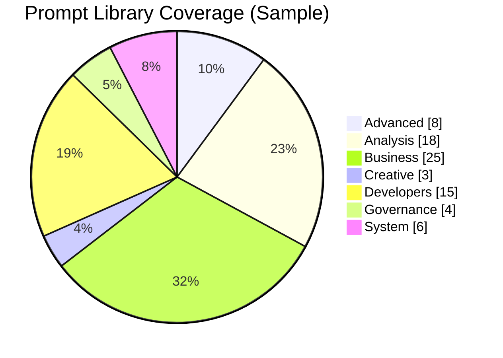

<!-- markdownlint-disable MD025 -->
# Library Capability Radar Chart Generator

## Description

This prompt guides the generation of a Radar Chart (Spider Plot) to assess the maturity and balance of the prompt library across key domains.

## Goal

To highlight strengths and weaknesses in the library's coverage across different categories.

## Context

The library covers 7 key domains: Advanced, Analysis, Business, Creative, Developers, Governance, and System.

## Inputs

- `[CATEGORY_COUNTS]`: The number of prompts in each category.

## Assumptions

- A higher count indicates higher maturity or coverage in that domain.

## Constraints

- The chart must include axes for all 7 key domains.
- The scale should be appropriate for the file counts.

## Process / Reasoning Style

Comparative analysis.

## Output Requirements

- A detailed description or code (e.g., Python/Matplotlib, Excel instructions) to generate the chart.

## Use Cases

- Strategic planning for library expansion.
- Identifying under-served domains (gaps).
- Reporting on library growth and balance.

## Prompt

```text
Design a Radar Chart (Spider Plot) to score the maturity of my prompt library across its 7 key domains: Advanced, Analysis, Business, Creative, Developers, Governance, and System.

Use the provided [CATEGORY_COUNTS] for the axes.
The axis for each domain should represent the number of prompts available (e.g., Business might score 25, while Creative scores 2).

This visualization should highlight gaps in the library—for example, showing a strong spike in "Business" analysis but a potential deficiency in "Creative" or "Governance" tools.
```

## Example Visualization (Mermaid)

Mermaid does not yet provide a native radar/spider plot primitive. Use this `pie` diagram as a stand-in to compare category proportions, or translate the same counts into your preferred radar tool.


