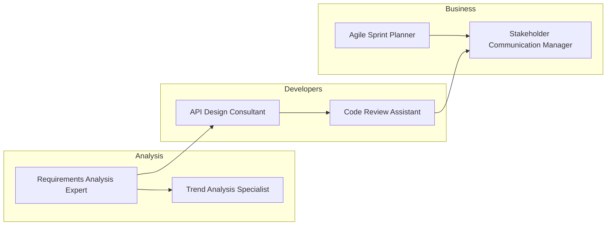

<!-- markdownlint-disable MD025 -->
# Library Network Graph Generator

## Description

This prompt guides the generation of a Network Graph visualization to show relationships and workflows between different prompts in the library.

## Goal

To visualize how prompts connect to each other, revealing clusters of related capabilities and potential workflows.

## Context

The prompt library contains many individual files that can be used together in workflows (e.g., SDLC, Business Planning).

## Inputs

- `[PROMPT_LIST]`: List of prompts in the library.
- `[WORKFLOW_DEFINITIONS]`: Optional definitions of workflows connecting prompts.

## Assumptions

- Prompts in the same category are related.
- Prompts can be linked in sequence to form workflows.

## Constraints

- Treat each prompt file as a node.
- Draw edges between related prompts.

## Process / Reasoning Style

Analytical and creative visualization.

## Output Requirements

- A detailed description or code (e.g., Python/NetworkX, Mermaid, or Graphviz) to generate the graph.

## Use Cases

- Understanding dependencies between prompts.
- Designing new workflows by seeing connected capabilities.
- Visualizing the complexity and interconnectedness of the library.

## Prompt

```text
Generate a Network Graph visualization for this prompt library using the provided [PROMPT_LIST].

Treat each prompt file (e.g., "agile-sprint-planner.md", "code-review-assistant.md") as a node.
Draw edges (lines) between prompts that belong to the same category (e.g., all "Business" prompts connected).
Additionally, link prompts that are part of the same workflow (e.g., connect "requirements-analysis-expert.md" to "api-design-consultant.md" and "quality-assurance-planner.md" to represent an SDLC flow).

This should look like a constellation showing clusters of related capabilities.
```

## Example Visualization (Mermaid)

Represent the relationships using Mermaid's `graph` syntax. Replace the sample prompts or add additional nodes and edges to reflect your real workflows.


