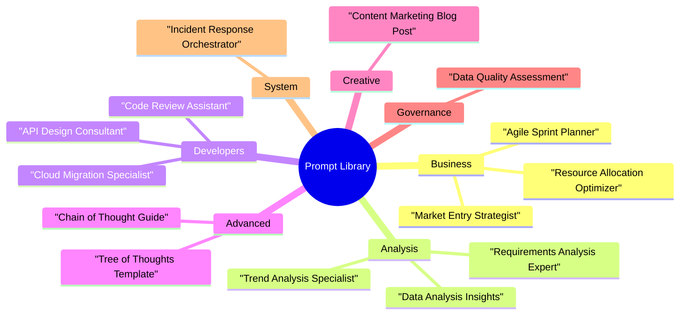

<!-- markdownlint-disable MD025 -->
# Library Structure Treemap Generator

## Description

This prompt guides the generation of a hierarchical Treemap chart to visualize the structure of the prompt library. It helps in understanding the distribution of prompts across different categories.

## Goal

To create a visual representation that allows users to instantly see the relative sizes of different prompt categories.

## Context

The user has a library of prompts organized into folders (Business, Analysis, Developers, etc.) and wants to visualize this structure.

## Inputs

- `[PROMPT_LIBRARY_STRUCTURE]`: The file structure or list of files in the prompt library.

## Assumptions

- The library is organized hierarchically.
- File counts are a good proxy for "size" or "importance" in this context.

## Constraints

- The output should be a description or code to generate a Treemap.
- Tiles should be sized by count.
- Color-coding should be used for categories.

## Process / Reasoning Style

Direct instruction for visualization generation.

## Output Requirements

- A detailed description or code (e.g., Python/Matplotlib, Mermaid, or Vega-Lite) to generate the chart.

## Use Cases

- Visualizing the current state of the prompt library.
- Identifying which categories are well-populated and which are sparse.
- Presenting the library structure to stakeholders.

## Prompt

```text
Create a hierarchical Treemap chart to visualize my prompt library structure based on the provided [PROMPT_LIBRARY_STRUCTURE].

The top-level hierarchy should be the main folders (Business, Analysis, Developers, Advanced, Creative, Governance, System).
Inside each category, show the individual prompt files as tiles.
Size the tiles equally to represent count, or color-code them by "Category" to show which domains have the most coverage.

I want to instantly see that "Business" and "Analysis" are my largest sections compared to "Creative" or "System".
```

## Example Visualization (Mermaid)

Use Mermaid's `mindmap` diagram to approximate a treemap-style hierarchy. Replace the sample prompts with your actual files or aggregate labels when the list is long.


