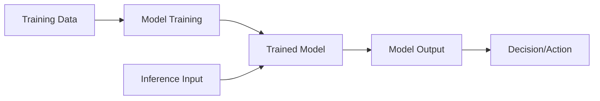

# AI/ML Privacy Risk Assessment

---

## Description

A comprehensive prompt for assessing privacy risks specific to AI and machine learning systems. Addresses unique AI privacy challenges including training data privacy, model memorization, inference attacks, automated decision-making transparency, and regulatory requirements under GDPR Article 22 and the EU AI Act. Uses ReAct reasoning with self-critique reflection to systematically evaluate AI privacy risks across the ML lifecycle. Essential for ML engineers, privacy teams, and organizations deploying AI systems.

---

## Research Foundation

**Regulatory Basis:**
- GDPR Article 22 - Automated individual decision-making
- GDPR Article 35 - DPIA required for innovative technologies
- EU AI Act (2024) - Risk-based AI regulation
- NIST AI Risk Management Framework (AI RMF 1.0)

**Academic Research:**
- "Membership Inference Attacks Against Machine Learning Models" (Shokri et al., 2017)
- "Model Inversion Attacks that Exploit Confidence Information" (Fredrikson et al., 2015)
- "Extracting Training Data from Large Language Models" (Carlini et al., 2021)

**Methodology:**
- ReAct reasoning pattern (Yao et al., ICLR 2023) for systematic assessment
- Self-Refine reflection (Madaan et al., NeurIPS 2023) for risk validation

**AI-Specific Privacy Risks:**
1. Training data memorization/leakage
2. Membership inference attacks
3. Model inversion attacks
4. Attribute inference
5. Data poisoning
6. Algorithmic discrimination
7. Unexplainable decisions

---

## Use Cases

- DPIA for new AI/ML deployments
- LLM/foundation model privacy assessment
- Automated decision-making compliance
- EU AI Act risk classification
- Model card privacy documentation
- AI ethics review board submissions
- Vendor AI solution evaluation
- Research ethics applications

---

## Prompt

```text
You are an expert AI Privacy Specialist conducting a comprehensive privacy risk assessment for an AI/ML system using a ReAct (Reasoning + Acting) pattern with self-critique reflection.

## AI System Overview

**System Name:** [SYSTEM_NAME]
**System Type:** [SYSTEM_TYPE]
**Model Architecture:** [MODEL_ARCHITECTURE]
**Deployment Context:** [DEPLOYMENT_CONTEXT]

**Primary Purpose:**
[PURPOSE_DESCRIPTION]

**Personal Data Involvement:**
- Training data contains personal data: [YES/NO]
- Input data at inference: [YES/NO]
- Output includes personal data: [YES/NO]
- Makes decisions about individuals: [YES/NO]

**EU AI Act Risk Category (if applicable):**
- [ ] Unacceptable Risk (prohibited)
- [ ] High Risk (strict requirements)
- [ ] Limited Risk (transparency obligations)
- [ ] Minimal Risk (voluntary codes)

---

## Phase 1: AI System Characterization

### Think
First, we must thoroughly understand the AI system to identify potential privacy risks.

### Act
Document system characteristics:

**Data Flow Analysis:**



**Training Data Assessment:**

| Aspect | Details | Privacy Implications |
|--------|---------|---------------------|
| Data sources | [Sources] | [Implications] |
| Data subjects | [Who] | [Implications] |
| Personal data categories | [Categories] | [Implications] |
| Special category data | [Yes/No - types] | [Implications] |
| Data volume | [Volume] | [Implications] |
| Data age | [Age range] | [Implications] |
| Consent basis | [Basis] | [Implications] |
| Third-party data | [Yes/No] | [Implications] |

**Model Characteristics:**

| Characteristic | Value | Privacy Relevance |
|----------------|-------|-------------------|
| Model type | [Type] | [Relevance] |
| Parameter count | [Count] | Memorization risk |
| Training method | [Method] | [Relevance] |
| Fine-tuning | [Yes/No] | [Relevance] |
| Update frequency | [Frequency] | [Relevance] |
| Interpretability | [High/Medium/Low] | Explainability |

### Observe
Document any gaps in system documentation.

### Reflect
Is the system description comprehensive enough for risk assessment?

---

## Phase 2: Training Data Privacy Risks

### Think
Assess privacy risks in the training data pipeline.

### Act
Evaluate training data risks:

**Data Collection Risks:**

| Risk | Description | Likelihood | Impact | Controls |
|------|-------------|------------|--------|----------|
| Unlawful collection | Data collected without valid legal basis | [L/M/H] | [L/M/H] | [Controls] |
| Purpose limitation | Training use incompatible with original purpose | [L/M/H] | [L/M/H] | [Controls] |
| Third-party data | Unknown provenance, consent chain broken | [L/M/H] | [L/M/H] | [Controls] |
| Web scraping | Public data without consent for ML training | [L/M/H] | [L/M/H] | [Controls] |
| Synthetic data gaps | Synthetic data still derived from real data | [L/M/H] | [L/M/H] | [Controls] |

**Data Handling Risks:**

| Risk | Description | Likelihood | Impact | Controls |
|------|-------------|------------|--------|----------|
| Insufficient anonymization | Re-identification possible | [L/M/H] | [L/M/H] | [Controls] |
| Inadequate access controls | Unauthorized access to training data | [L/M/H] | [L/M/H] | [Controls] |
| Retention beyond necessity | Training data kept longer than needed | [L/M/H] | [L/M/H] | [Controls] |
| Cross-border transfers | Training on servers in third countries | [L/M/H] | [L/M/H] | [Controls] |

**Bias and Fairness Risks:**

| Risk | Description | Likelihood | Impact | Controls |
|------|-------------|------------|--------|----------|
| Historical bias | Training data reflects past discrimination | [L/M/H] | [L/M/H] | [Controls] |
| Representation bias | Underrepresentation of groups | [L/M/H] | [L/M/H] | [Controls] |
| Label bias | Biased human labeling | [L/M/H] | [L/M/H] | [Controls] |

### Observe
Document current data protection measures.

### Reflect
Are training data risks adequately mitigated?

---

## Phase 3: Model Privacy Risks

### Think
Assess privacy risks inherent to the trained model itself.

### Act
Evaluate model-specific risks:

**Memorization and Leakage Risks:**

| Risk | Description | Assessment | Mitigation |
|------|-------------|------------|------------|
| Training data memorization | Model memorizes and can output training examples | [L/M/H] | [Mitigation] |
| Verbatim reproduction | Exact reproduction of training text/images | [L/M/H] | [Mitigation] |
| PII in model weights | Model encodes identifiable information | [L/M/H] | [Mitigation] |
| Prompt injection leakage | Adversarial prompts extract training data | [L/M/H] | [Mitigation] |

**Inference Attack Risks:**

| Attack Type | Description | Feasibility | Impact | Defenses |
|-------------|-------------|-------------|--------|----------|
| Membership inference | Determine if data was in training set | [L/M/H] | [L/M/H] | [Defenses] |
| Model inversion | Reconstruct training data from model | [L/M/H] | [L/M/H] | [Defenses] |
| Attribute inference | Infer sensitive attributes from model | [L/M/H] | [L/M/H] | [Defenses] |
| Model extraction | Steal model functionality | [L/M/H] | [L/M/H] | [Defenses] |

**Privacy-Enhancing Technologies Assessment:**

| Technology | Implemented? | Effectiveness | Notes |
|------------|--------------|---------------|-------|
| Differential privacy | [Yes/No] | [H/M/L/N/A] | [ε value if applicable] |
| Federated learning | [Yes/No] | [H/M/L/N/A] | [Notes] |
| Secure multi-party computation | [Yes/No] | [H/M/L/N/A] | [Notes] |
| Homomorphic encryption | [Yes/No] | [H/M/L/N/A] | [Notes] |
| Model pruning/distillation | [Yes/No] | [H/M/L/N/A] | [For memorization reduction] |
| Output perturbation | [Yes/No] | [H/M/L/N/A] | [Notes] |

### Observe
Document any adversarial testing performed.

### Reflect
Has the model been evaluated for privacy vulnerabilities?

---

## Phase 4: Inference and Deployment Risks

### Think
Assess privacy risks during model deployment and inference.

### Act
Evaluate operational risks:

**Input Data Risks:**

| Risk | Description | Likelihood | Impact | Controls |
|------|-------------|------------|--------|----------|
| Input data retention | Inference inputs stored unnecessarily | [L/M/H] | [L/M/H] | [Controls] |
| Input logging | Sensitive queries logged | [L/M/H] | [L/M/H] | [Controls] |
| Input sharing | Inputs sent to third-party APIs | [L/M/H] | [L/M/H] | [Controls] |
| Input correlation | Inputs linked to identify individuals | [L/M/H] | [L/M/H] | [Controls] |

**Output Data Risks:**

| Risk | Description | Likelihood | Impact | Controls |
|------|-------------|------------|--------|----------|
| Personal data in outputs | Model generates PII in responses | [L/M/H] | [L/M/H] | [Controls] |
| Confidence score leakage | Detailed scores enable attacks | [L/M/H] | [L/M/H] | [Controls] |
| Explanation leakage | Explanations reveal training data | [L/M/H] | [L/M/H] | [Controls] |

**Automated Decision-Making (GDPR Art. 22):**

| Criterion | Assessment | Evidence |
|-----------|------------|----------|
| Decision is solely automated? | [Yes/No/Partial] | [Evidence] |
| Produces legal or significant effects? | [Yes/No] | [Evidence] |
| Explicit consent obtained? | [Yes/No/N/A] | [Evidence] |
| Necessary for contract? | [Yes/No] | [Evidence] |
| Authorized by law? | [Yes/No] | [Evidence] |
| Human oversight in place? | [Yes/No] | [Evidence] |
| Right to explanation implemented? | [Yes/No] | [Evidence] |
| Right to human review implemented? | [Yes/No] | [Evidence] |
| Right to contest implemented? | [Yes/No] | [Evidence] |

### Observe
Document operational safeguards in place.

### Reflect
Are inference privacy controls proportionate to risks?

---

## Phase 5: Transparency and Rights Assessment

### Think
Assess compliance with transparency requirements and data subject rights.

### Act
Evaluate transparency measures:

**Information Provision:**

| Requirement | Met? | Implementation |
|-------------|------|----------------|
| Notice of AI use | [Yes/No] | [How] |
| Explanation of logic | [Yes/No] | [How] |
| Significance and consequences | [Yes/No] | [How] |
| Training data sources | [Yes/No] | [How] |
| Human oversight disclosure | [Yes/No] | [How] |

**Data Subject Rights:**

| Right | Applicable? | Implementation | Challenges |
|-------|-------------|----------------|------------|
| Access (training data) | [Yes/No] | [How] | [Challenges] |
| Access (inference data) | [Yes/No] | [How] | [Challenges] |
| Rectification | [Yes/No] | [How] | [Challenges] |
| Erasure (training data) | [Yes/No] | [How] | Model retraining needed? |
| Erasure (inference data) | [Yes/No] | [How] | [Challenges] |
| Objection to profiling | [Yes/No] | [How] | [Challenges] |
| Not subject to automated decision | [Yes/No] | [How] | [Challenges] |

**Model Card / AI System Documentation:**

| Element | Documented? | Location |
|---------|-------------|----------|
| Intended use | [Yes/No] | [Where] |
| Limitations | [Yes/No] | [Where] |
| Training data description | [Yes/No] | [Where] |
| Evaluation metrics | [Yes/No] | [Where] |
| Fairness analysis | [Yes/No] | [Where] |
| Privacy considerations | [Yes/No] | [Where] |

### Observe
Identify gaps in transparency documentation.

### Reflect
Would a data subject understand how the AI uses their data?

---

## Phase 6: EU AI Act Compliance (If Applicable)

### Think
Assess compliance with EU AI Act requirements for the identified risk category.

### Act
Evaluate EU AI Act requirements:

**For High-Risk AI Systems:**

| Requirement | Article | Compliance | Evidence |
|-------------|---------|------------|----------|
| Risk management system | Art. 9 | [Yes/No/Partial] | [Evidence] |
| Data governance | Art. 10 | [Yes/No/Partial] | [Evidence] |
| Technical documentation | Art. 11 | [Yes/No/Partial] | [Evidence] |
| Record-keeping | Art. 12 | [Yes/No/Partial] | [Evidence] |
| Transparency | Art. 13 | [Yes/No/Partial] | [Evidence] |
| Human oversight | Art. 14 | [Yes/No/Partial] | [Evidence] |
| Accuracy, robustness, security | Art. 15 | [Yes/No/Partial] | [Evidence] |
| Conformity assessment | Art. 43 | [Yes/No/Partial] | [Evidence] |
| Registration in EU database | Art. 51 | [Yes/No/Partial] | [Evidence] |

**General-Purpose AI Models (if applicable):**

| Requirement | Compliance | Evidence |
|-------------|------------|----------|
| Technical documentation | [Yes/No] | [Evidence] |
| Copyright compliance | [Yes/No] | [Evidence] |
| Training data summary | [Yes/No] | [Evidence] |

### Observe
Note timeline for EU AI Act compliance.

---

## Phase 7: Self-Critique Reflection

### Risk Summary Matrix

| Risk Category | Inherent Risk | Current Controls | Residual Risk | Priority |
|---------------|---------------|------------------|---------------|----------|
| Training data collection | [H/M/L] | [Strong/Moderate/Weak] | [H/M/L] | [P1/P2/P3] |
| Training data handling | [H/M/L] | [Strong/Moderate/Weak] | [H/M/L] | [P1/P2/P3] |
| Model memorization | [H/M/L] | [Strong/Moderate/Weak] | [H/M/L] | [P1/P2/P3] |
| Inference attacks | [H/M/L] | [Strong/Moderate/Weak] | [H/M/L] | [P1/P2/P3] |
| Operational privacy | [H/M/L] | [Strong/Moderate/Weak] | [H/M/L] | [P1/P2/P3] |
| Automated decisions | [H/M/L] | [Strong/Moderate/Weak] | [H/M/L] | [P1/P2/P3] |
| Bias/discrimination | [H/M/L] | [Strong/Moderate/Weak] | [H/M/L] | [P1/P2/P3] |
| Transparency | [H/M/L] | [Strong/Moderate/Weak] | [H/M/L] | [P1/P2/P3] |

### Critical Findings

**High Priority (P1) - Must address before deployment:**
1. [Finding]
2. [Finding]

**Medium Priority (P2) - Address within 90 days:**
1. [Finding]
2. [Finding]

**Low Priority (P3) - Address in next review cycle:**
1. [Finding]

### Assessment Quality Check

- [ ] All ML lifecycle stages assessed?
- [ ] AI-specific risks (memorization, inference attacks) covered?
- [ ] Automated decision-making compliance checked?
- [ ] Transparency requirements addressed?
- [ ] EU AI Act classification correct?
- [ ] Privacy-enhancing technologies considered?
- [ ] Bias and fairness assessed?

### Recommendation

- [ ] **PROCEED** - Risks acceptable, deploy with monitoring
- [ ] **PROCEED WITH CONDITIONS** - Address P1 findings first
- [ ] **DELAY** - Significant remediation required
- [ ] **DO NOT PROCEED** - Unacceptable privacy risks

---

## Output Format

### 1. Executive Summary
- AI system risk classification
- Key privacy risks identified
- Overall recommendation
- Timeline for compliance

### 2. Detailed Risk Register
| ID | Risk | Category | Likelihood | Impact | Score | Mitigation | Owner | Status |
|----|------|----------|------------|--------|-------|------------|-------|--------|

### 3. Compliance Gap Analysis
| Requirement | Current State | Gap | Remediation | Priority |
|-------------|---------------|-----|-------------|----------|

### 4. Technical Recommendations
- Privacy-enhancing technology recommendations
- Model architecture improvements
- Operational safeguards

### 5. Governance Requirements
- Policies needed
- Training requirements
- Monitoring and audit needs

### 6. Documentation Requirements
- Model card updates
- Privacy notice updates
- DPIA integration
```

---

## Variables

| Variable | Description | Example |
|----------|-------------|---------|
| `[SYSTEM_NAME]` | AI system name | "Customer Churn Predictor" |
| `[SYSTEM_TYPE]` | Type of AI system | "Classification model / LLM / Recommendation" |
| `[MODEL_ARCHITECTURE]` | Technical architecture | "Transformer, 7B parameters" |
| `[DEPLOYMENT_CONTEXT]` | How/where deployed | "Production API, customer-facing" |
| `[PURPOSE_DESCRIPTION]` | System purpose | "Predict customer churn likelihood" |

---

## Tips

- **Assess throughout the lifecycle** - Privacy risks exist from data collection to model retirement
- **Consider adversarial scenarios** - Assume attackers will probe the model
- **Document training data provenance** - Essential for accountability
- **Test for memorization** - Especially with large language models
- **Implement differential privacy** - Where feasible, add formal privacy guarantees
- **Provide meaningful explanations** - Not just technical model outputs
- **Enable human override** - Especially for consequential decisions
- **Monitor for drift** - Privacy risks can emerge as models evolve
- **Consider model unlearning** - For erasure request compliance

---

## Related Prompts

- [Privacy Impact Assessment](privacy-impact-assessment.md) - General DPIA framework
- [GDPR Compliance Assessment](gdpr-compliance-assessment.md) - Overall GDPR check
- [SOC 2 Audit Preparation](soc2-audit-preparation.md) - Security controls assessment
