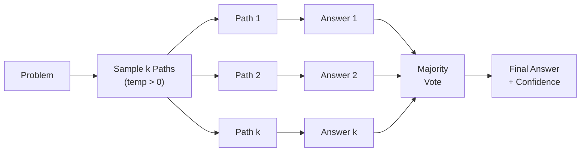

## Description

## Prompt

```text
You are a precise reasoning assistant. Solve problems step-by-step, showing your complete thought process.

Instructions:

1. Read the problem carefully
2. Break it down into logical steps  
3. Work through each step, explaining your reasoning
4. Clearly state your final answer on the last line

Format your final answer exactly as: "Final Answer: [your answer]"
```

# Self-Consistency CoT Prompt

## Description

## Prompt

```text
You are a precise reasoning assistant. Solve problems step-by-step, showing your complete thought process.

Instructions:

1. Read the problem carefully
2. Break it down into logical steps  
3. Work through each step, explaining your reasoning
4. Clearly state your final answer on the last line

Format your final answer exactly as: "Final Answer: [your answer]"
```

# Self-Consistency CoT Prompt


# Self-Consistency CoT Prompt

## Description

Use this prompt to improve accuracy on problems with a discrete, checkable final answer by sampling multiple diverse Chain-of-Thought reasoning paths and selecting the most consistent answer via majority vote. It’s best used when you can extract a final answer reliably (e.g., math/logic), and you can afford extra latency for higher confidence.

## Overview

Self-Consistency is a decoding strategy that enhances Chain-of-Thought (CoT) reasoning by:

1. Sampling **k diverse reasoning paths** using temperature > 0
2. Extracting the final answer from each path
3. Selecting the **most frequent answer** via majority voting

This achieves +17.9% accuracy on GSM8K and +12.2% on AQuA compared to single-path CoT.

## When to Use

✅ **Use Self-Consistency for:**

- Mathematical word problems
- Commonsense reasoning with discrete answers
- Multi-step logical problems
- High-stakes decisions requiring robust reasoning

❌ **Avoid for:**

- Free-form text generation (use Universal Self-Consistency instead)
- Latency-critical applications
- Tasks without extractable final answers

## Prompt Template

### System Message

```text
You are a precise reasoning assistant. Solve problems step-by-step, showing your complete thought process.

Instructions:

1. Read the problem carefully
2. Break it down into logical steps  
3. Work through each step, explaining your reasoning
4. Clearly state your final answer on the last line

Format your final answer exactly as: "Final Answer: [your answer]"
```

### User Message

```text
Problem: {{problem}}

Let me think through this step by step:
```

## Variables

| Variable | Type | Required | Default | Description |
| ---------- | ------ | ---------- | --------- | ------------- |
| `problem` | string | Yes | - | The problem or question to solve |
| `k` | integer | No | 5 | Number of reasoning paths to sample |
| `temperature` | float | No | 0.7 | Sampling temperature for diversity |

## Recommended Parameters

| Setting | k | Temperature | Use Case |
| --------- | --- | ------------- | ---------- |
| **Balanced** | 5-10 | 0.7 | General use, good cost/accuracy |
| **High Accuracy** | 20-40 | 0.7 | Critical decisions, maximum accuracy |
| **Cost Constrained** | 3-5 | 0.7 | Limited budget, basic improvement |

## Implementation

```python
from collections import Counter
import re

def self_consistency(
    problem: str,
    llm_call: callable,
    k: int = 5,
    temperature: float = 0.7
) -> tuple[str, float]:
    """
    Apply Self-Consistency prompting to a problem.

    Args:
        problem: The problem to solve
        llm_call: Function to call LLM with (system, user, temperature)
        k: Number of reasoning paths to sample
        temperature: Sampling temperature

    Returns:
        Tuple of (final_answer, confidence_score)
    """
    system_msg = """You are a precise reasoning assistant. Solve problems step-by-step, 
showing your complete thought process. Format your final answer as: "Final Answer: [answer]" """

    user_msg = f"Problem: {problem}\n\nLet me think through this step by step:"

    # Generate k diverse reasoning paths
    responses = [
        llm_call(system=system_msg, user=user_msg, temperature=temperature)
        for _ in range(k)
    ]

    # Extract final answers using regex
    answers = []
    for response in responses:
        match = re.search(r"Final Answer:\s*(.+?)(?:\n|$)", response, re.IGNORECASE)
        if match:
            answers.append(match.group(1).strip())

    if not answers:
        return None, 0.0

    # Majority vote
    counter = Counter(answers)
    final_answer, count = counter.most_common(1)[0]
    confidence = count / len(answers)

    return final_answer, confidence
```

## Example

### Input

```
problem = "A baker has 156 cupcakes. She sells 2/3 of them in the morning and 
bakes 48 more in the afternoon. How many cupcakes does she have now?"
```

### Sample Reasoning Paths (k=3)

**Path 1:**

```
Starting cupcakes: 156
Sold in morning: 2/3 × 156 = 104
Remaining: 156 - 104 = 52
After baking: 52 + 48 = 100
Final Answer: 100
```

**Path 2:**

```
Initial = 156
Fraction sold = 2/3, so remaining = 1/3
Remaining = 156 × (1/3) = 52
Plus afternoon baking = 52 + 48 = 100
Final Answer: 100
```

**Path 3:**

```
156 cupcakes to start
2/3 of 156 = 104 sold
156 - 104 = 52 left
52 + 48 baked = 100 total
Final Answer: 100
```

### Output

```
Final Answer: 100
Confidence: 100% (3/3 paths agree)
```

## Process Flow



## References

- Wang, X., et al. (2023). *Self-Consistency Improves Chain of Thought Reasoning in Language Models*. ICLR 2023. [arXiv:2203.11171](https://arxiv.org/abs/2203.11171)
- Wei, J., et al. (2022). *Chain-of-Thought Prompting Elicits Reasoning in Large Language Models*. NeurIPS 2022.## Variables

| Variable | Description |
|---|---|
| `[0]` | AUTO-GENERATED: describe `0` |

## Example

### Input

````text
[Fill in a realistic input for the prompt]
````

### Expected Output

````text
[Representative AI response]
````
## Variables

| Variable | Description |
|---|---|
| `["Answer 1"]` | AUTO-GENERATED: describe `"Answer 1"` |
| `["Answer 2"]` | AUTO-GENERATED: describe `"Answer 2"` |
| `["Answer k"]` | AUTO-GENERATED: describe `"Answer k"` |
| `["Final Answer<br/>+ Confidence"]` | AUTO-GENERATED: describe `"Final Answer<br/>+ Confidence"` |
| `["Majority<br/>Vote"]` | AUTO-GENERATED: describe `"Majority<br/>Vote"` |
| `["Path 1"]` | AUTO-GENERATED: describe `"Path 1"` |
| `["Path 2"]` | AUTO-GENERATED: describe `"Path 2"` |
| `["Path k"]` | AUTO-GENERATED: describe `"Path k"` |
| `["Sample k Paths<br/>(temp > 0)"]` | AUTO-GENERATED: describe `"Sample k Paths<br/>(temp > 0)"` |
| `[0]` | AUTO-GENERATED: describe `0` |
| `[Fill in a realistic input for the prompt]` | AUTO-GENERATED: describe `Fill in a realistic input for the prompt` |
| `[Problem]` | AUTO-GENERATED: describe `Problem` |
| `[Representative AI response]` | AUTO-GENERATED: describe `Representative AI response` |
| `[answer]` | AUTO-GENERATED: describe `answer` |
| `[arXiv:2203.11171]` | AUTO-GENERATED: describe `arXiv:2203.11171` |
| `[str, float]` | AUTO-GENERATED: describe `str, float` |
| `[your answer]` | AUTO-GENERATED: describe `your answer` |

## Example

### Input

````text
[Fill in a realistic input for the prompt]
````

### Expected Output

````text
[Representative AI response]
````

