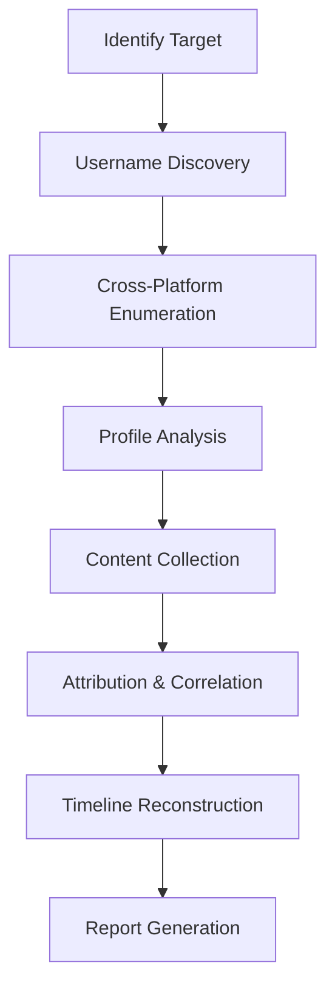

# SOCMINT - Social Media Intelligence

Professional-grade prompts and methodologies for conducting ethical and legal social media intelligence (SOCMINT) and open-source intelligence (OSINT) investigations.

## ⚠️ Important Legal & Ethical Notice

**THESE PROMPTS ARE FOR AUTHORIZED INVESTIGATIONS ONLY**

- ✅ Law enforcement with proper authorization
- ✅ Corporate security investigations within legal bounds
- ✅ Academic research with IRB approval
- ✅ Cybersecurity threat intelligence
- ❌ Stalking, harassment, or invasion of privacy
- ❌ Unauthorized surveillance
- ❌ Identity theft or fraud

**Always comply with:**

- Local and international laws
- Terms of Service of platforms
- Privacy regulations (GDPR, CCPA, etc.)
- Professional ethics standards

## 📋 Contents

```text
socmint/
├── README.md                              # This file
├── socmint-investigator.md                # Comprehensive SOCMINT methodology
├── attribution-analysis.md                # Link accounts to real identities
├── company-osint-investigation.md         # Corporate intelligence
├── domain-investigation.md                # Domain and infrastructure analysis
├── email-investigation.md                 # Email-based investigations
├── email-osint-investigation.md           # Email OSINT techniques
├── image-geolocation-analysis.md          # Locate photos geographically
├── instagram-osint.md                     # Instagram-specific techniques
├── phone-investigation.md                 # Phone number investigations
├── social-media-profile-analysis.md       # Profile deep-dive analysis
├── telegram-osint.md                      # Telegram investigations
├── threat-intelligence.md                 # Cyber threat intelligence
├── timeline-reconstruction.md             # Event timeline creation
├── username-investigation.md              # Username searches
└── username-pivot-investigation.md        # Username correlation
```

## 🎯 What is SOCMINT
**Social Media Intelligence (SOCMINT)** is the collection and analysis of information from social media platforms for intelligence purposes. It combines:

- **OSINT**: Open-Source Intelligence (publicly available data)
- **HUMINT**: Human Intelligence (behavioral analysis)
- **SIGINT**: Signals Intelligence (communication patterns)
- **GEOINT**: Geospatial Intelligence (location data)

## ✨ Key Capabilities

### Investigation Types

| Investigation | Prompt | Use Case |
| --------------- | -------- | ---------- |
| **Profile Analysis** | [social-media-profile-analysis.md](./social-media-profile-analysis.md) | Deep dive into individual profiles |
| **Username Pivot** | [username-pivot-investigation.md](./username-pivot-investigation.md) | Find related accounts |
| **Attribution** | [attribution-analysis.md](./attribution-analysis.md) | Link accounts to real identities |
| **Timeline** | [timeline-reconstruction.md](./timeline-reconstruction.md) | Reconstruct event sequences |
| **Geolocation** | [image-geolocation-analysis.md](./image-geolocation-analysis.md) | Locate images geographically |
| **Threat Intel** | [threat-intelligence.md](./threat-intelligence.md) | Cyber threat analysis |

### Platform-Specific

| Platform | Prompt | Special Features |
| ---------- | -------- | ------------------ |
| **Instagram** | [instagram-osint.md](./instagram-osint.md) | Visual content, hashtags, stories |
| **Telegram** | [telegram-osint.md](./telegram-osint.md) | Channels, groups, bots |
| **Email** | [email-osint-investigation.md](./email-osint-investigation.md) | Breach data, email validation |
| **Domain** | [domain-investigation.md](./domain-investigation.md) | WHOIS, DNS, infrastructure |
| **Phone** | [phone-investigation.md](./phone-investigation.md) | Carrier lookup, validation |

## 🚀 Quick Start

### For First-Time Investigators

1. **Start with the framework**: [socmint-investigator.md](./socmint-investigator.md)
2. **Understand attribution**: [attribution-analysis.md](./attribution-analysis.md)
3. **Learn platform-specific techniques**: Choose your platform prompt
4. **Document everything**: Use timeline reconstruction

### Basic Investigation Workflow



## 🛠️ Tools & Techniques

### Essential OSINT Tools

**Username Enumeration:**

- [Sherlock](https://github.com/sherlock-project/sherlock) - Find usernames across 400+ sites
- [Maigret](https://github.com/soxoj/maigret) - Advanced username search
- [WhatsMyName](https://whatsmyname.app/) - Username checker

**Social Media:**

- [Social-Analyzer](https://github.com/qeeqbox/social-analyzer) - Profile analysis
- [Twint](https://github.com/twintproject/twint) - Twitter scraping (when working)
- [Instaloader](https://instaloader.github.io/) - Instagram data

**Geolocation:**

- [GeoSpy](https://geospy.ai/) - AI-powered geolocation
- Google Earth Pro - Satellite imagery
- SunCalc - Solar position analysis

**Infrastructure:**

- WHOIS lookup - Domain ownership
- [SecurityTrails](https://securitytrails.com/) - DNS history
- [Shodan](https://www.shodan.io/) - Internet-connected devices

### Investigation Techniques

#### 1. Username Pivot

Find all accounts belonging to a person:

```text
Target: username "john_doe_1985"

1. Run Sherlock/Maigret
2. Check variations:
   - johndoe1985
   - john.doe.1985
   - JohnDoe1985
3. Correlate using:
   - Profile pictures
   - Bio text
   - Location data
   - Posting times

```

#### 2. Image Geolocation

Locate where a photo was taken:

```text
Analyze:

1. EXIF data (if not stripped)
2. Visual landmarks
3. Architecture style
4. Language on signs
5. Vehicle license plates
6. Flora/fauna (climate indicators)
7. Solar angle (time/location)
8. Reverse image search

```

#### 3. Timeline Reconstruction

Build event timeline:

```text
Collect:

- Post timestamps
- Location check-ins
- Photo EXIF data
- Comments/interactions
- Platform activity logs

Correlate:

- Cross-platform posting
- Travel patterns
- Social connections
- Behavioral patterns

```

## 📚 Prompt Categories

### Attribution & Identity

**[attribution-analysis.md](./attribution-analysis.md)**

- Link anonymous accounts to real identities
- Correlate behavioral patterns
- Identify unique identifiers
- Build confidence scores

**[username-investigation.md](./username-investigation.md)**

- Systematic username search
- Platform enumeration
- Variation generation

**[username-pivot-investigation.md](./username-pivot-investigation.md)**

- Cross-platform correlation
- Account linking
- Identity consolidation

### Platform Analysis

**[instagram-osint.md](./instagram-osint.md)**

- Profile scraping
- Follower/following analysis
- Story archiving
- Hashtag tracking

**[telegram-osint.md](./telegram-osint.md)**

- Channel discovery
- Group infiltration (ethical)
- Bot analysis
- Message history

**[social-media-profile-analysis.md](./social-media-profile-analysis.md)**

- Deep profile dive
- Behavioral analysis
- Network mapping
- Content patterns

### Technical Investigations

**[email-osint-investigation.md](./email-osint-investigation.md)**

- Breach database searches
- Email validation
- Domain correlation
- Service enumeration

**[phone-investigation.md](./phone-investigation.md)**

- Carrier identification
- Number validation
- Location (country/region)
- Associated accounts

**[domain-investigation.md](./domain-investigation.md)**

- WHOIS lookup
- DNS enumeration
- SSL certificate analysis
- Historical data

### Specialized Analysis

**[image-geolocation-analysis.md](./image-geolocation-analysis.md)**

- Visual landmark identification
- EXIF data extraction
- Geospatial correlation
- Confidence scoring

**[timeline-reconstruction.md](./timeline-reconstruction.md)**

- Event sequencing
- Gap analysis
- Pattern identification
- Visual timeline creation

**[threat-intelligence.md](./threat-intelligence.md)**

- Threat actor profiling
- Campaign tracking
- IOC collection
- Attribution

## 🎓 Best Practices

### 1. Operational Security (OpSec)

✅ **Do:**

- Use dedicated investigation accounts (sock puppets)
- Connect through VPN/Tor
- Use separate browser profiles
- Clear cookies/cache regularly
- Document your methodology

❌ **Don't:**

- Use personal accounts
- Connect from identifiable IPs
- Save login credentials
- Screenshot with metadata
- Leave digital footprints

### 2. Legal Compliance

✅ **Do:**

- Verify your legal authority
- Stay within Terms of Service
- Document consent/authorization
- Respect privacy laws
- Maintain chain of custody

❌ **Don't:**

- Access private accounts
- Use stolen credentials
- Impersonate others
- Scrape without permission
- Share PII inappropriately

### 3. Documentation

Every investigation should include:

```text
INVESTIGATION LOG

Target Information:

- Known identifiers
- Platforms investigated
- Time period

Methodology:

- Tools used
- Techniques applied
- Search queries
- Timestamps

Findings:

- Evidence collected
- Screenshots (with metadata)
- URLs and archives
- Correlation analysis

Chain of Custody:

- Who collected
- When collected
- How stored
- Access log

```

### 4. Verification

Always verify findings:

```text
Verification Checklist:
□ Multiple sources confirm
□ Metadata verified
□ Timeline coherent
□ No contradictions
□ Screenshots archived
□ Sources documented
```

## 📊 Investigation Template

```markdown
# Investigation Report: [Target Name/ID]

## Executive Summary
Brief overview of findings

## Target Identification

- Primary identifier: [username/email/phone]
- Associated identifiers: [list]
- Confidence level: [High/Medium/Low]

## Platforms Identified
| Platform | Username | Profile URL | Last Activity |
| ---------- | ---------- | ------------- | --------------- |
| Twitter  | @user    | url         | 2025-11-30    |

## Key Findings

1. Finding 1 with evidence
2. Finding 2 with evidence

## Timeline

- YYYY-MM-DD: Event 1
- YYYY-MM-DD: Event 2

## Attribution Analysis
Evidence linking accounts to real identity

## Recommendations
Actions based on findings

## Appendix

- Screenshots
- Tool outputs
- Raw data

```

## 🔒 Privacy & Ethics

### Ethical Guidelines

1. **Legitimate Purpose**: Only investigate with legal authority
2. **Proportionality**: Use least intrusive methods
3. **Necessity**: Collect only required information
4. **Transparency**: Document your methods
5. **Accountability**: Be prepared to justify actions

### Privacy Considerations

- **PII Protection**: Handle personal data securely
- **Data Retention**: Delete when no longer needed
- **Access Control**: Limit who can view findings
- **Secure Storage**: Encrypt sensitive data
- **Disclosure**: Follow proper channels

## 🛡️ Security Considerations

### Protect Yourself

```text
Investigation Security Checklist:
□ VPN/Tor enabled
□ Dedicated VM/container
□ Burner accounts created
□ No personal info used
□ Browser fingerprint managed
□ JavaScript controlled
□ Location services off
□ Camera/mic blocked
```

### Protect Evidence

```text
Evidence Security:
□ Screenshots with timestamps
□ URLs archived (archive.org)
□ Metadata preserved
□ Chain of custody maintained
□ Encrypted storage
□ Access logged
□ Backup created
```

## 📖 Additional Resources

### Learning Resources

- [OSINT Framework](https://osintframework.com/) - Tool directory
- [Bellingcat](https://www.bellingcat.com/) - Investigation techniques
- [OSINT Curious](https://osintcurio.us/) - OSINT training
- [Trace Labs](https://www.tracelabs.org/) - OSINT CTF practice

### Legal Resources

- [GDPR Guidelines](https://gdpr.eu/)
- [CCPA Information](https://oag.ca.gov/privacy/ccpa)
- [Computer Fraud and Abuse Act](https://www.justice.gov/jm/criminal-resource-manual-1030-computer-fraud-and-abuse-act)

### Tools

- [OSINT Tools Collection](https://github.com/jivoi/awesome-osint)
- [IntelTechniques Tools](https://inteltechniques.com/tools/)

## 🤝 Contributing

When adding SOCMINT prompts:

1. **Include legal disclaimer** in each prompt
2. **Emphasize ethical use** throughout
3. **Provide OpSec guidance** for investigators
4. **Document limitations** of techniques
5. **Include verification methods**
6. **Test with dummy data** only

See [CONTRIBUTING.md](../../CONTRIBUTING.md) for guidelines.

## ⚖️ Disclaimer

The prompts in this directory are provided for **lawful investigation purposes only**. Users are solely responsible for:

- Ensuring they have proper legal authority
- Complying with applicable laws and regulations
- Respecting platform Terms of Service
- Protecting privacy rights
- Using information ethically

Misuse of these techniques may result in:

- Civil liability
- Criminal prosecution
- Professional sanctions
- Platform bans

**When in doubt, consult legal counsel before proceeding.**

## 📝 Version History

- **1.0** (2025-11-30): Initial release with comprehensive SOCMINT methodologies

---

**Need Help?** Contact your organization's legal/compliance team or [open an issue](https://github.com/tafreeman/prompts/issues) for technical questions.
