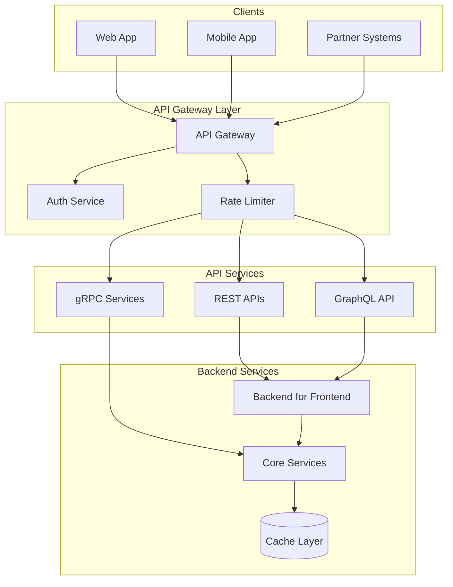

# API Architecture Designer

## Description

Designs comprehensive API architectures including gateway patterns, authentication strategies, rate limiting, versioning, and documentation frameworks. Provides detailed technical specifications for REST, GraphQL, and gRPC APIs with security, scalability, and compliance considerations.

## Architecture Diagram



## Use Cases

- Designing API gateway architectures for microservices ecosystems
- Building multi-tenant SaaS API platforms with rate limiting
- Creating partner integration APIs with OAuth 2.0 authentication
- Establishing API versioning strategies for long-lived public APIs
- Implementing BFF (Backend for Frontend) patterns for mobile apps

## Variables

- `[domain]`: Business domain (e.g., "Open Banking / Financial Services")
- `[consumers]`: API consumers (e.g., "Internal mobile app, Partner fintechs, Third-party aggregators")
- `[integrations]`: Integration requirements (e.g., "Core banking system, Payment gateway, Identity provider")
- `[security]`: Security needs (e.g., "PSD2 compliance, Strong Customer Authentication (SCA), Audit logging")
- `[scalability]`: Scalability goals (e.g., "10K concurrent users, 50K API calls/minute at peak")

## Example

### Context
A multinational retail bank needs to expose Open Banking APIs to comply with PSD2 regulations while also supporting their mobile app and partner fintech integrations.

### Input

```text
Business Domain: Retail Banking (Open Banking / PSD2)
API Consumers: Mobile banking app, 50+ third-party fintechs, internal systems
Integration Requirements: Core banking (SOAP), Card processor (ISO 8583), Fraud detection (REST)
Security Needs: PSD2 SCA, OAuth 2.0 FAPI profile, certificate-bound tokens
Scalability Goals: 10,000 TPS peak, 99.99% availability, <200ms p99 latency
```

### Expected Output

```text
## API Architecture Design

### 1. API Design Patterns

- **Style:** REST Level 3 (HATEOAS) for discoverability and self-documentation
- **Gateway:** Kong Enterprise as API Gateway with custom plugins for PSD2 compliance
- **BFF Pattern:** Separate BFFs for Mobile (aggregated views) and Partner (granular resources)
- **Versioning:** URI-based versioning (/v1/, /v2/) with 12-month deprecation policy

### 2. Authentication Strategy

- **Protocol:** OAuth 2.0 with OpenID Connect (OIDC) using FAPI Read-Write profile
- **Strong Customer Authentication (SCA):** Dynamic linking with PKCE and signed request objects
- **Certificate Binding:** mTLS with eIDAS QWAC certificates for TPP identification
- **Token Lifetime:** Access tokens: 5 minutes, Refresh tokens: 90 days with rotation

### 3. Rate Limiting and Throttling
| Tier | Rate Limit | Burst | Use Case |
| ------ | ----------- | ------- | ---------- |
| Free | 100 req/min | 20 | Sandbox testing |
| Partner | 1,000 req/min | 200 | Production TPPs |
| Premium | 10,000 req/min | 2,000 | Strategic partners |
| Internal | Unlimited | N/A | Mobile app |

### 4. Versioning Strategy

- **Semantic Versioning:** MAJOR.MINOR for breaking vs additive changes
- **Sunset Headers:** X-API-Sunset header 6 months before deprecation
- **Changelog:** Machine-readable changelog at /api/changelog

### 5. Documentation Framework

- **OpenAPI 3.1:** Single source of truth for all API specifications
- **Developer Portal:** Self-service portal with sandbox environment
- **SDKs:** Auto-generated SDKs for Python, JavaScript, Java, .NET

### 6. Monitoring and Analytics

- **Metrics:** Request volume, latency percentiles (p50, p95, p99), error rates by endpoint
- **Alerting:** PagerDuty integration for >1% error rate or p99 >500ms
- **Business Analytics:** API usage by partner, revenue per API call

```

## Related Prompts

- [Microservices Architecture Expert](microservices-architecture-expert.md) - For service decomposition behind APIs
- [Security Architecture Specialist](security-architecture-specialist.md) - For API security controls
- [Performance Architecture Optimizer](performance-architecture-optimizer.md) - For API latency optimization
- [Cloud Architecture Consultant](cloud-architecture-consultant.md) - For cloud-native API deployments
- [Enterprise Integration Architect](enterprise-integration-architect.md) - For backend system integration

---

## Related Prompts

- Browse other Architect prompts in this category
- Check the system folder for similar templates
