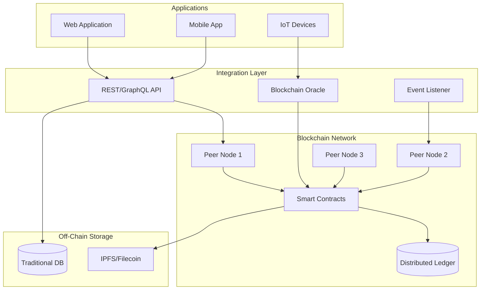

# Blockchain Architecture Specialist

---

## Description

Designs blockchain-based architectures for enterprise use cases including supply chain, digital identity, and tokenization. This prompt guides architects through platform selection, smart contract design, consensus mechanisms, and integration with existing enterprise systems while addressing security, scalability, and governance requirements.

---

## Architecture Diagram



---

## Decision Framework

### When to Use Blockchain

| Criteria | Indicators |
| ---------- | ------------ |
| **Multiple Parties** | 3+ organizations need shared truth without central authority |
| **Trust Issues** | Parties don't fully trust each other or intermediaries |
| **Audit Trail** | Immutable, tamper-proof transaction history required |
| **Disintermediation** | Removing middlemen provides significant value |
| **Asset Tokenization** | Digital representation of physical or financial assets |

### When NOT to Use Blockchain

- Single organization controls all data
- Complete trust exists between parties
- High-frequency transactions (>10,000 TPS needed)
- Data needs to be frequently modified or deleted
- Simple database with traditional access control suffices
- GDPR "right to be forgotten" requirements conflict with immutability

---

## Use Cases

- Supply chain provenance tracking with multi-party verification
- Digital identity and credential management systems
- Tokenization of real-world assets (real estate, securities)
- Cross-border payment and settlement networks
- Decentralized autonomous organization (DAO) governance
- NFT marketplaces and digital collectibles platforms

---

## Prompt

```text
Design blockchain architecture for:

Use Case: [use_case]
Blockchain Type: [blockchain_type]
Consensus Requirements: [consensus]
Integration Needs: [integrations]

Include:

1. Blockchain platform selection
2. Smart contract architecture
3. Integration patterns
4. Security considerations
5. Scalability solutions
6. Governance model

```text

**Output:**

```text
## Blockchain Architecture

### 1. Platform Selection

*   **Hyperledger Fabric:** Chosen for privacy channels (competitors don't see each other's volume) and high throughput (3000+ tps).

### 2. Smart Contract (Chaincode) Architecture

*   **Asset:** `LuxuryItem` (ID, Manufacturer, CurrentOwner, Status, History).
*   **Functions:** `Mint()` (Factory), `TransferOwnership()` (Logistics/Retail), `VerifyAuthenticity()` (Public).
*   **Endorsement Policy:** Requires signature from Manufacturer Org + Logistics Org.

### 3. Integration Patterns

*   **Off-Chain Storage:** Store high-res product photos/certificates in IPFS, store hash on-chain (Cost optimization).
*   **Event Listener:** Node.js service listening for `ItemTransferred` events to update SAP ERP status.

[... continues with security and scalability ...]
```text

---

## Variables

- `[use_case]`: Business use case (e.g., "Supply chain provenance for luxury goods authentication")
- `[blockchain_type]`: Blockchain type (e.g., "Permissioned / Private consortium")
- `[consensus]`: Consensus requirements (e.g., "High throughput (3000+ TPS), finality under 5 seconds")
- `[integrations]`: Integration needs (e.g., "SAP ERP, IoT sensors for tracking, Mobile verification app")

---

## Cloud Platform Notes

### Azure

- **Platform**: Azure Confidential Ledger for tamper-proof data, Azure Blockchain Workbench (deprecated)
- **Managed Nodes**: Partner solutions (ConsenSys Quorum, R3 Corda) via Azure Marketplace
- **Integration**: Azure Logic Apps, Event Grid for blockchain event processing
- **Identity**: Azure AD for permissioned network participant management

### AWS

- **Platform**: Amazon Managed Blockchain (Hyperledger Fabric, Ethereum)
- **Serverless**: AWS Lambda for off-chain processing triggered by blockchain events
- **Storage**: Amazon QLDB for centralized immutable ledger use cases
- **Integration**: Amazon EventBridge for blockchain event routing

### GCP

- **Blockchain Node Engine**: Managed Ethereum nodes for Web3 applications
- **BigQuery**: Blockchain analytics with public datasets (Bitcoin, Ethereum)
- **Cloud Functions**: Event-driven processing for smart contract events
- **Integration**: Pub/Sub for blockchain event streaming

---

## Example

### Context
A global luxury goods consortium (5 manufacturers, 200+ retailers, logistics partners) needs to track product authenticity from factory to consumer to combat counterfeiting worth $500B annually.

### Input

```text
Use Case: Luxury goods supply chain provenance (anti-counterfeiting)
Blockchain Type: Permissioned consortium (5 founding members, 200+ participants)
Consensus Requirements: Fast finality (<2s), 3000+ TPS, privacy between competitors
Integration Needs: SAP ERP, IoT sensors, mobile consumer verification app
```

### Expected Output

- Platform: Hyperledger Fabric with private channels per manufacturer
- Smart Contracts: MintProduct(), TransferCustody(), VerifyAuthenticity()
- Integration: SAP Cloud Platform adapter, IPFS for off-chain photos
- Security: HSM for signing keys, third-party smart contract audits
- Governance: 3/5 consortium vote for network changes

---

## Tips

- Start with a clear understanding of why blockchain is needed vs. traditional database
- Consider hybrid architectures with off-chain storage for large data
- Plan governance and legal agreements before technical implementation
- Use testnets extensively before mainnet deployment
- Factor in the learning curve for development teams

---

## Related Prompts

- [Security Architecture Specialist](security-architecture-specialist.md) - For cryptographic security design
- [Enterprise Integration Architect](enterprise-integration-architect.md) - For legacy system integration
- [Data Architecture Designer](data-architecture-designer.md) - For on-chain vs off-chain data strategy
- [Compliance Architecture Designer](compliance-architecture-designer.md) - For regulatory considerations
- [IoT Architecture Designer](iot-architecture-designer.md) - For IoT-blockchain integration
