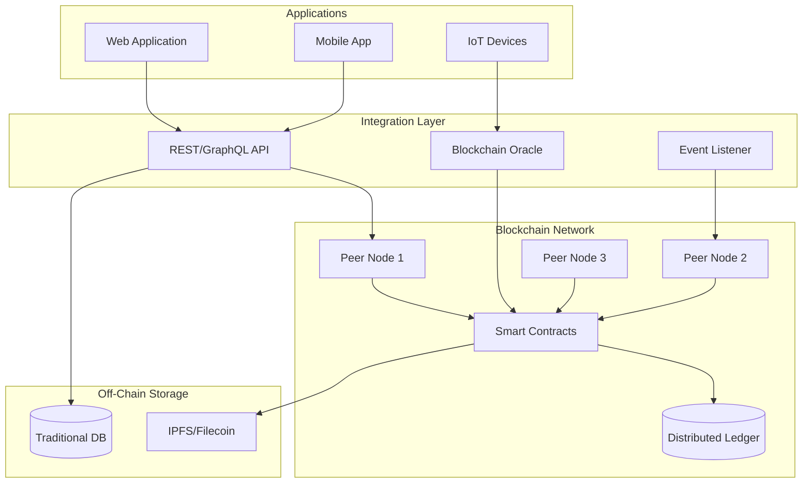

# Blockchain Architecture Specialist

## Description

Designs blockchain-based architectures for supply chain, digital identity, asset tokenization, and decentralized applications. Provides technical specifications for smart contracts, consensus mechanisms, and integration with legacy systems while addressing scalability, privacy, and compliance requirements.

## Architecture Diagram



## Use Cases

- Supply chain provenance tracking with multi-party verification
- Digital identity and credential management systems
- Tokenization of real-world assets (real estate, securities)
- Cross-border payment and settlement networks
- Decentralized autonomous organization (DAO) governance
- NFT marketplaces and digital collectibles platforms

## Variables

- `[use_case]`: Business use case (e.g., "Supply chain provenance for luxury goods authentication")
- `[blockchain_type]`: Blockchain type (e.g., "Permissioned / Private consortium")
- `[consensus]`: Consensus requirements (e.g., "High throughput (3000+ TPS), finality under 5 seconds")
- `[integrations]`: Integration needs (e.g., "SAP ERP, IoT sensors for tracking, Mobile verification app")

## Example

### Context
A global luxury goods consortium (5 manufacturers, 200+ retailers, logistics partners) needs to track product authenticity from factory to consumer to combat counterfeiting worth $500B annually.

### Input

```text
Use Case: Luxury goods supply chain provenance (anti-counterfeiting)
Blockchain Type: Permissioned consortium (5 founding members, 200+ participants)
Consensus Requirements: Fast finality (<2s), 3000+ TPS, privacy between competitors
Integration Needs: SAP ERP, IoT sensors, mobile consumer verification app
```

### Expected Output

- Platform: Hyperledger Fabric with private channels per manufacturer
- Smart Contracts: MintProduct(), TransferCustody(), VerifyAuthenticity()
- Integration: SAP Cloud Platform adapter, IPFS for off-chain photos
- Security: HSM for signing keys, third-party smart contract audits
- Governance: 3/5 consortium vote for network changes

## Related Prompts

- [Security Architecture Specialist](security-architecture-specialist.md) - For cryptographic security design
- [Enterprise Integration Architect](enterprise-integration-architect.md) - For legacy system integration
- [Data Architecture Designer](data-architecture-designer.md) - For on-chain vs off-chain data strategy
- [Compliance Architecture Designer](compliance-architecture-designer.md) - For regulatory considerations
- [IoT Architecture Designer](iot-architecture-designer.md) - For IoT-blockchain integration
