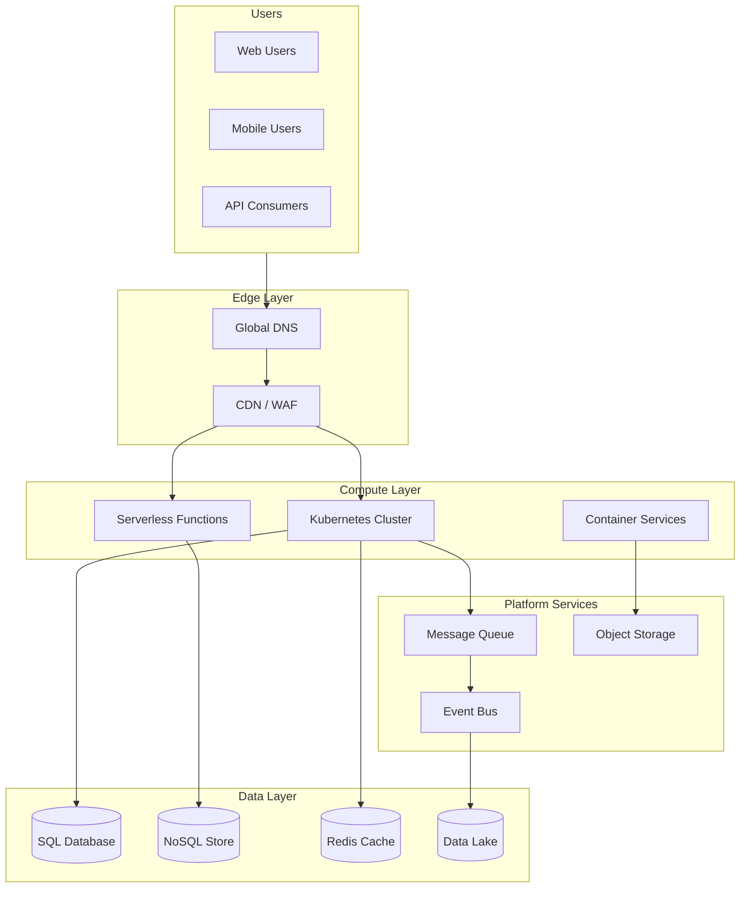

# Cloud Architecture Consultant

## Description

Designs cloud-native architectures for scalable, resilient applications across AWS, Azure, and GCP. Provides recommendations for compute, storage, networking, and cost optimization strategies while addressing compliance, security, and disaster recovery requirements.

## Architecture Diagram



## Use Cases

- Migrating on-premises applications to cloud-native architectures
- Designing multi-region deployments for global user bases
- Implementing serverless architectures for event-driven workloads
- Building hybrid cloud solutions connecting on-premises and cloud
- Cost optimization through right-sizing and reserved capacity planning
- Disaster recovery and business continuity architecture

## Variables

- `[application]`: Application name and description (e.g., "Global video streaming platform with 50M subscribers")
- `[provider]`: Cloud provider (e.g., "AWS (primary), multi-region deployment")
- `[scalability]`: Scalability requirements (e.g., "Handle 10x traffic spikes during live events")
- `[compliance]`: Compliance requirements (e.g., "GDPR, CCPA, SOC 2 Type II")
- `[budget]`: Budget constraints (e.g., "$2M annual cloud spend, optimize for cost efficiency")

## Example

### Context
A streaming video platform needs to support 10 million concurrent viewers during live events, with content delivery to 50+ countries, while maintaining costs under $200K/month.

### Input

```text
Application: Global Video Streaming Platform
Cloud Provider: AWS (primary), with multi-CDN strategy
Scalability Needs: 10M concurrent viewers, 500k requests/sec, auto-scale 0 to peak in <5 min
Compliance Requirements: GDPR (EU), CCPA (California), content licensing geo-restrictions
Budget Constraints: $200k/month target, optimize for variable workloads
```

### Expected Output

- **Architecture Pattern**: Cell-based architecture with regional isolation
- **Compute**: EKS with Karpenter for rapid scaling, Lambda@Edge for personalization
- **Storage**: S3 Intelligent Tiering for video library, CloudFront for delivery
- **Cost Strategy**: Spot instances for transcoding (60-90% savings), reserved capacity for baseline
- **DR**: Active-active across 3 regions with Route53 health checks

## Related Prompts

- [Disaster Recovery Architect](disaster-recovery-architect.md) - For DR/BC planning
- [Performance Architecture Optimizer](performance-architecture-optimizer.md) - For cloud performance tuning
- [Security Architecture Specialist](security-architecture-specialist.md) - For cloud security controls
- [DevOps Architecture Planner](devops-architecture-planner.md) - For CI/CD in cloud
- [Microservices Architecture Expert](microservices-architecture-expert.md) - For container orchestration
- Check the system folder for similar templates
