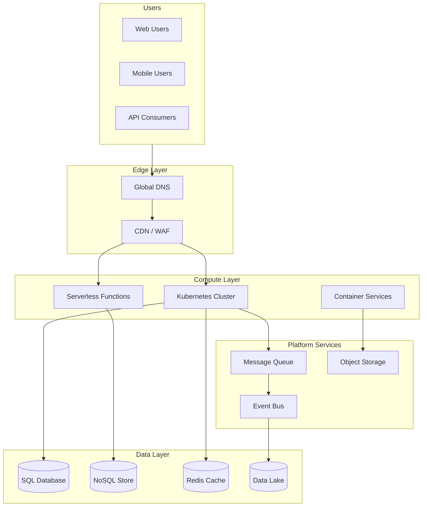

# Cloud Architecture Consultant

---

## Description

Designs cloud-native architectures for enterprise applications, covering multi-cloud strategies, serverless patterns, and infrastructure modernization. This prompt helps architects evaluate cloud service options, define deployment topologies, and create scalable, resilient solutions that align with organizational requirements and compliance standards.

---

## Architecture Diagram



---

## Decision Framework

### When to Use This Pattern

| Criteria | Indicators |
|----------|------------|
| **Greenfield Project** | New application without legacy constraints |
| **Scalability** | Need to handle 10x-100x traffic spikes |
| **Global Reach** | Users in multiple geographic regions |
| **Cost Optimization** | Pay-per-use model preferred over fixed capacity |
| **Speed to Market** | Managed services reduce time to production |

### Cloud Strategy Selection

| Strategy | When to Use | Trade-offs |
|----------|-------------|------------|
| **Single Cloud** | Vendor commitment, simplified ops | Vendor lock-in risk |
| **Multi-Cloud** | Best-of-breed, risk mitigation | Complexity, skill requirements |
| **Hybrid Cloud** | Data sovereignty, gradual migration | Integration complexity |
| **Cloud-Agnostic** | Maximum portability | Lowest common denominator |

---

## Use Cases

- Migrating on-premises applications to cloud-native architectures
- Designing multi-region deployments for global user bases
- Implementing serverless architectures for event-driven workloads
- Building hybrid cloud solutions connecting on-premises and cloud
- Cost optimization through right-sizing and reserved capacity planning
- Disaster recovery and business continuity architecture

---

## Prompt

```text
Design cloud architecture for:

Application: [application]
Cloud Provider: [provider]
Scalability Needs: [scalability]
Compliance Requirements: [compliance]
Budget Constraints: [budget]

Provide:
1. Cloud service selection
2. Architecture patterns
3. Cost optimization
4. Security design
5. Disaster recovery
6. Migration strategy
```text

**Output:**

```text
## Cloud Architecture Design

### 1. Cloud Service Selection
*   **Compute:** EKS (Kubernetes) for microservices, Lambda for event triggers.
*   **Content Delivery:** CloudFront with Lambda@Edge for personalization.
*   **Media Processing:** AWS Elemental MediaConvert for transcoding.

### 2. Architecture Patterns
*   **Cell-Based Architecture:** Isolate failure domains by sharding users into "cells" (self-contained stacks).
*   **CQRS:** Separate read paths (Catalog browsing) from write paths (Watch history).

### 3. Cost Optimization
*   **Spot Fleet:** Use Spot instances for stateless transcoding workers (60-90% savings).
*   **Intelligent Tiering:** S3 Intelligent-Tiering for video library storage.

[... continues with security and disaster recovery ...]
```text

---

## Variables

- `[application]`: Application name and description (e.g., "Global video streaming platform with 50M subscribers")
- `[provider]`: Cloud provider (e.g., "AWS (primary), multi-region deployment")
- `[scalability]`: Scalability requirements (e.g., "Handle 10x traffic spikes during live events")
- `[compliance]`: Compliance requirements (e.g., "GDPR, CCPA, SOC 2 Type II")
- `[budget]`: Budget constraints (e.g., "$2M annual cloud spend, optimize for cost efficiency")

---

## Cloud Platform Notes

### Azure
- **Compute**: Azure Kubernetes Service (AKS), Azure Functions, Container Apps
- **Storage**: Azure Blob Storage, Azure Data Lake Storage Gen2
- **Database**: Azure SQL, Cosmos DB (multi-model), Azure Cache for Redis
- **Networking**: Azure Front Door, Application Gateway, Virtual WAN
- **DevOps**: Azure DevOps, GitHub Actions with Azure integration

### AWS
- **Compute**: EKS, Lambda, Fargate, EC2 with Auto Scaling
- **Storage**: S3, EFS, FSx
- **Database**: Aurora, DynamoDB, ElastiCache
- **Networking**: CloudFront, ALB/NLB, Transit Gateway
- **DevOps**: CodePipeline, CodeBuild, CDK

### GCP
- **Compute**: GKE, Cloud Functions, Cloud Run
- **Storage**: Cloud Storage, Filestore
- **Database**: Cloud SQL, Spanner, Firestore, Memorystore
- **Networking**: Cloud CDN, Cloud Load Balancing, Cloud Armor
- **DevOps**: Cloud Build, Cloud Deploy, Anthos

---

## Example

### Context
A streaming video platform needs to support 10 million concurrent viewers during live events, with content delivery to 50+ countries, while maintaining costs under $200K/month.

### Input
```text
Application: Global Video Streaming Platform
Cloud Provider: AWS (primary), with multi-CDN strategy
Scalability Needs: 10M concurrent viewers, 500k requests/sec, auto-scale 0 to peak in <5 min
Compliance Requirements: GDPR (EU), CCPA (California), content licensing geo-restrictions
Budget Constraints: $200k/month target, optimize for variable workloads
```

### Expected Output

- **Architecture Pattern**: Cell-based architecture with regional isolation
- **Compute**: EKS with Karpenter for rapid scaling, Lambda@Edge for personalization
- **Storage**: S3 Intelligent Tiering for video library, CloudFront for delivery
- **Cost Strategy**: Spot instances for transcoding (60-90% savings), reserved capacity for baseline
- **DR**: Active-active across 3 regions with Route53 health checks

---

## Tips

- Start with Well-Architected Framework review for your cloud provider
- Use landing zone patterns for multi-account/subscription governance
- Implement FinOps practices from day one
- Consider cloud-native managed services before IaaS
- Plan for multi-region from the start even if deploying single region initially

---

## Related Prompts

- [Disaster Recovery Architect](disaster-recovery-architect.md) - For DR/BC planning
- [Performance Architecture Optimizer](performance-architecture-optimizer.md) - For cloud performance tuning
- [Security Architecture Specialist](security-architecture-specialist.md) - For cloud security controls
- [DevOps Architecture Planner](devops-architecture-planner.md) - For CI/CD in cloud
- [Microservices Architecture Expert](microservices-architecture-expert.md) - For container orchestration
- Check the system folder for similar templates
