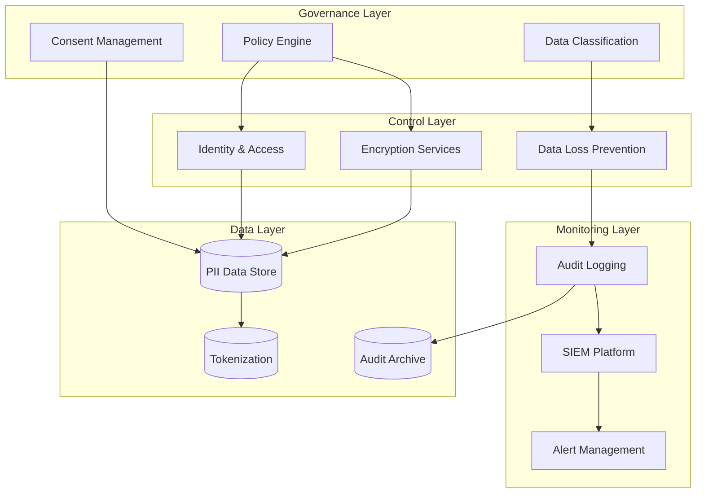

## Description

## Prompt



Designs compliance-focused architectures

## Description

## Prompt


Designs compliance-focused architectures


# Compliance Architecture Designer

## Description

Designs compliance-focused architectures for GDPR, HIPAA, PCI-DSS, SOX, and ISO 27001. Provides frameworks for data governance, privacy controls, audit logging, and automated compliance verification while maintaining operational efficiency and supporting multi-regulation requirements.

## Architecture Diagram


## Use Cases

- Designing GDPR-compliant data processing architectures
- Building HIPAA-compliant healthcare information systems
- Implementing PCI-DSS compliant payment processing
- Creating SOX-compliant financial reporting systems
- Establishing multi-regulation compliance frameworks
- Architecting data residency solutions for global operations

## Variables

- `[application]`: Application name and description (e.g., "Multi-tenant HR SaaS platform")
- `[regulations]`: Regulatory requirements (e.g., "GDPR, SOC 2 Type II, ISO 27001")
- `[data_types]`: Data types handled (e.g., "PII (name, email), SPII (SSN, salary), financial records")
- `[deployment]`: Deployment model (e.g., "AWS multi-region with EU data residency requirements")

## Example

### Context
A global HR SaaS platform processing employee data across 30 countries needs to comply with GDPR, CCPA, and prepare for ISO 27001 certification.

### Input

```text
Regulatory Requirements: GDPR (EU), CCPA (California), ISO 27001 certification target
Business Domain: HR SaaS platform with 500+ enterprise customers
Data Sensitivity: Employee PII including SSN, salary, health benefits
Audit Requirements: Annual SOC 2 Type II audit, customer audit rights
```

### Expected Output

- **Framework**: Unified Control Framework mapping ISO 27001 to GDPR articles
- **Data Governance**: Auto-classification at ingestion, tenant-specific encryption keys
- **Privacy Controls**: Consent management service, automated DSAR handling
- **Retention**: Automated lifecycle policies with crypto-shredding for deletion
- **Audit Trail**: Immutable audit logs with 7-year retention

## Related Prompts

- [Security Architecture Specialist](security-architecture-specialist.md) - For security control implementation
- [Data Architecture Designer](data-architecture-designer.md) - For data governance frameworks
- [Disaster Recovery Architect](disaster-recovery-architect.md) - For business continuity compliance
- [Enterprise Integration Architect](enterprise-integration-architect.md) - For compliant data exchange
- [Cloud Architecture Consultant](cloud-architecture-consultant.md) - For cloud compliance certifications## Variables

_No bracketed variables detected._

## Example

### Input

````text
[Fill in a realistic input for the prompt]
````

### Expected Output

````text
[Representative AI response]
````
## Variables

| Variable | Description |
|---|---|
| `[(Audit Archive)]` | AUTO-GENERATED: describe `(Audit Archive)` |
| `[(PII Data Store)]` | AUTO-GENERATED: describe `(PII Data Store)` |
| `[(Tokenization)]` | AUTO-GENERATED: describe `(Tokenization)` |
| `[Alert Management]` | AUTO-GENERATED: describe `Alert Management` |
| `[Audit Logging]` | AUTO-GENERATED: describe `Audit Logging` |
| `[Cloud Architecture Consultant]` | AUTO-GENERATED: describe `Cloud Architecture Consultant` |
| `[Consent Management]` | AUTO-GENERATED: describe `Consent Management` |
| `[Control Layer]` | AUTO-GENERATED: describe `Control Layer` |
| `[Data Architecture Designer]` | AUTO-GENERATED: describe `Data Architecture Designer` |
| `[Data Classification]` | AUTO-GENERATED: describe `Data Classification` |
| `[Data Layer]` | AUTO-GENERATED: describe `Data Layer` |
| `[Data Loss Prevention]` | AUTO-GENERATED: describe `Data Loss Prevention` |
| `[Disaster Recovery Architect]` | AUTO-GENERATED: describe `Disaster Recovery Architect` |
| `[Encryption Services]` | AUTO-GENERATED: describe `Encryption Services` |
| `[Enterprise Integration Architect]` | AUTO-GENERATED: describe `Enterprise Integration Architect` |
| `[Fill in a realistic input for the prompt]` | AUTO-GENERATED: describe `Fill in a realistic input for the prompt` |
| `[Governance Layer]` | AUTO-GENERATED: describe `Governance Layer` |
| `[Identity & Access]` | AUTO-GENERATED: describe `Identity & Access` |
| `[Monitoring Layer]` | AUTO-GENERATED: describe `Monitoring Layer` |
| `[Policy Engine]` | AUTO-GENERATED: describe `Policy Engine` |
| `[Representative AI response]` | AUTO-GENERATED: describe `Representative AI response` |
| `[SIEM Platform]` | AUTO-GENERATED: describe `SIEM Platform` |
| `[Security Architecture Specialist]` | AUTO-GENERATED: describe `Security Architecture Specialist` |
| `[application]` | AUTO-GENERATED: describe `application` |
| `[data_types]` | AUTO-GENERATED: describe `data_types` |
| `[deployment]` | AUTO-GENERATED: describe `deployment` |
| `[regulations]` | AUTO-GENERATED: describe `regulations` |

## Example

### Input

````text
[Fill in a realistic input for the prompt]
````

### Expected Output

````text
[Representative AI response]
````

