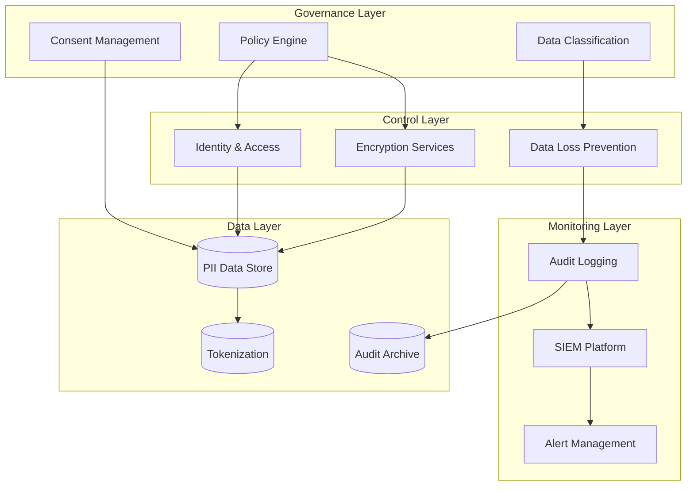

# Compliance Architecture Designer

---

## Description

Designs compliance-focused architectures that meet regulatory requirements including GDPR, HIPAA, SOX, PCI-DSS, and industry-specific standards. This prompt guides architects through control framework implementation, data governance design, audit trail architecture, and continuous compliance monitoring strategies.

---

## Architecture Diagram



---

## Decision Framework

### Compliance Requirements Matrix

| Regulation | Key Requirements | Architecture Impact |
|------------|------------------|--------------------|
| **GDPR** | Data minimization, right to erasure, consent | Tokenization, soft delete, consent service |
| **HIPAA** | PHI protection, access controls, audit trails | Encryption at rest/transit, RBAC, comprehensive logging |
| **SOX** | Financial controls, segregation of duties | Approval workflows, immutable audit logs |
| **PCI-DSS** | Cardholder data protection | Network segmentation, tokenization, key management |
| **SOC 2** | Security, availability, confidentiality | Control frameworks, monitoring, incident response |

### When to Engage Compliance Architecture

| Criteria | Indicators |
|----------|------------|
| **Regulated Industry** | Healthcare, finance, government, critical infrastructure |
| **Personal Data** | Processing PII, PHI, or financial data |
| **Multi-Jurisdiction** | Operating in EU, California, or multiple regions |
| **Audit Requirements** | External audits, certification requirements |
| **Data Residency** | Specific geographic data storage requirements |

---

## Use Cases

- Designing GDPR-compliant data processing architectures
- Building HIPAA-compliant healthcare information systems
- Implementing PCI-DSS compliant payment processing
- Creating SOX-compliant financial reporting systems
- Establishing multi-regulation compliance frameworks
- Architecting data residency solutions for global operations

---

## Prompt

```text
Design compliant architecture for:

Regulatory Requirements: [regulations]
Business Domain: [domain]
Data Sensitivity: [sensitivity]
Audit Requirements: [audit]

Provide:
1. Compliance framework
2. Control implementation
3. Data governance
4. Audit trail design
5. Monitoring strategy
6. Reporting mechanisms
```text

**Output:**

```text
## Compliance Architecture

### 1. Compliance Framework
*   **Strategy:** "Privacy by Design" and "Zero Trust".
*   **Mapping:** Unified Control Framework (UCF) mapping ISO 27001 controls to GDPR articles.

### 2. Control Implementation
*   **Data Sovereignty:** Tenant pinning to specific AWS regions (e.g., EU-West-1 for German customers) to satisfy GDPR residency.
*   **Encryption:** Field-level encryption for SPII (SSN, Salary) using distinct KMS keys per tenant.

### 3. Data Governance
*   **Classification:** Auto-tagging data at ingestion (Public, Internal, Confidential, Restricted).
*   **Retention:** Automated S3 Lifecycle policies to delete candidate data after 6 months (GDPR minimization).
*   **Deletion:** "Tombstoning" records for Right to be Forgotten, ensuring backups are also scrubbed (crypto-shredding).

[... continues with audit trail and monitoring ...]
```text

---

## Variables

- `[application]`: Application name and description (e.g., "Multi-tenant HR SaaS platform")
- `[regulations]`: Regulatory requirements (e.g., "GDPR, SOC 2 Type II, ISO 27001")
- `[data_types]`: Data types handled (e.g., "PII (name, email), SPII (SSN, salary), financial records")
- `[deployment]`: Deployment model (e.g., "AWS multi-region with EU data residency requirements")

---

## Cloud Platform Notes

### Azure
- **Compliance Tools**: Azure Policy, Azure Blueprints, Compliance Manager
- **Data Protection**: Azure Information Protection, Customer Lockbox
- **Key Management**: Azure Key Vault with HSM, Customer-Managed Keys
- **Audit**: Azure Activity Log, Azure Monitor, Microsoft Sentinel
- **Certifications**: 90+ compliance offerings including GDPR, HIPAA, SOC 2

### AWS
- **Compliance Tools**: AWS Config, AWS Audit Manager, Security Hub
- **Data Protection**: Macie (PII detection), CloudHSM, KMS
- **Governance**: Organizations, Control Tower, Service Control Policies
- **Audit**: CloudTrail, CloudWatch Logs, OpenSearch
- **Certifications**: HIPAA BAA, PCI-DSS, SOC 1/2/3, FedRAMP

### GCP
- **Compliance Tools**: Security Command Center, Policy Intelligence
- **Data Protection**: Cloud DLP, Cloud KMS, Confidential Computing
- **Governance**: Organization Policy, Access Transparency
- **Audit**: Cloud Audit Logs, Cloud Logging
- **Certifications**: ISO 27001, SOC 2, HIPAA, PCI-DSS

---

## Example

### Context
A global HR SaaS platform processing employee data across 30 countries needs to comply with GDPR, CCPA, and prepare for ISO 27001 certification.

### Input
```text
Regulatory Requirements: GDPR (EU), CCPA (California), ISO 27001 certification target
Business Domain: HR SaaS platform with 500+ enterprise customers
Data Sensitivity: Employee PII including SSN, salary, health benefits
Audit Requirements: Annual SOC 2 Type II audit, customer audit rights
```

### Expected Output

- **Framework**: Unified Control Framework mapping ISO 27001 to GDPR articles
- **Data Governance**: Auto-classification at ingestion, tenant-specific encryption keys
- **Privacy Controls**: Consent management service, automated DSAR handling
- **Retention**: Automated lifecycle policies with crypto-shredding for deletion
- **Audit Trail**: Immutable audit logs with 7-year retention

---

## Tips

- Start with a unified control framework that maps multiple regulations
- Implement privacy by design and security by default principles
- Automate compliance evidence collection for audit readiness
- Use data classification as the foundation for all controls
- Plan for "right to be forgotten" from day one

---

## Related Prompts

- [Security Architecture Specialist](security-architecture-specialist.md) - For security control implementation
- [Data Architecture Designer](data-architecture-designer.md) - For data governance frameworks
- [Disaster Recovery Architect](disaster-recovery-architect.md) - For business continuity compliance
- [Enterprise Integration Architect](enterprise-integration-architect.md) - For compliant data exchange
- [Cloud Architecture Consultant](cloud-architecture-consultant.md) - For cloud compliance certifications
