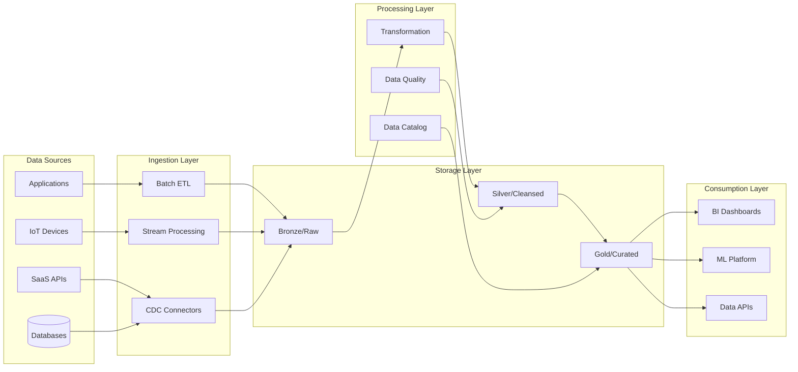

# Data Architecture Designer

---

## Description

Designs enterprise data architectures including data lakes, data warehouses, lakehouse patterns, and real-time streaming platforms. This prompt guides architects through data modeling strategies, ETL/ELT pipeline design, data governance frameworks, and analytics platform selection to create unified data ecosystems.

---

## Architecture Diagram



---

## Decision Framework

### Architecture Pattern Selection

| Pattern | When to Use | Trade-offs |
|---------|-------------|------------|
| **Data Warehouse** | Structured data, known queries, BI focus | Schema rigidity, cost at scale |
| **Data Lake** | Raw data storage, data science, schema-on-read | Query complexity, governance challenges |
| **Lakehouse** | Best of both, unified analytics | Platform maturity, complexity |
| **Data Mesh** | Decentralized teams, domain ownership | Coordination overhead, tooling needs |
| **Real-time** | Sub-second latency requirements | Complexity, cost, operational burden |

### When to Use This Pattern

| Criteria | Indicators |
|----------|------------|
| **Data Volume** | Terabytes to petabytes of data |
| **Multiple Sources** | 10+ data sources requiring integration |
| **Analytics Needs** | BI reporting, ML/AI, or advanced analytics |
| **Data Products** | Need to share data across teams/domains |
| **Compliance** | Data lineage and governance requirements |

---

## Use Cases

- Building enterprise data lakes with medallion architecture
- Designing real-time streaming analytics platforms
- Creating Customer 360 unified data models
- Implementing data mesh architectures for large organizations
- Modernizing legacy data warehouses to cloud-native solutions
- Establishing data governance and quality frameworks

---

## Prompt

```text
Design data architecture for:

Business Requirements: [requirements]
Data Sources: [sources]
Data Volume: [volume]
Analytics Needs: [analytics]
Governance Requirements: [governance]

Provide:
1. Data model design
2. Storage strategy
3. Data pipeline architecture
4. Governance framework
5. Quality management
6. Analytics platform
```text

**Output:**

```text
## Data Architecture Design

### 1. Data Model Design (Lakehouse)
*   **Bronze Layer (Raw):** Immutable landing zone for all source data (Parquet format).
*   **Silver Layer (Cleansed):** Conformed dimensions, PII tokenized, data quality checks applied.
*   **Gold Layer (Curated):** Aggregated "Customer 360" tables optimized for BI.

### 2. Storage Strategy
*   **Data Lake:** S3 (Standard for hot, Glacier Deep Archive for >3 years).
*   **Warehouse:** Snowflake (Separation of storage and compute).

### 3. Data Pipeline Architecture
*   **Ingestion:** Kafka Connect for real-time streams (Clickstream), Airbyte for batch (CRM/ERP).
*   **Transformation:** dbt (Data Build Tool) for SQL-based transformations in Snowflake.
*   **Orchestration:** Airflow for dependency management.

[... continues with governance and quality management ...]
```text

---

## Variables

- `[domain]`: Business domain (e.g., "E-commerce retail analytics platform")
- `[data_sources]`: Data sources (e.g., "Clickstream, CRM (Salesforce), ERP (SAP), Social media APIs")
- `[analytics_needs]`: Analytics requirements (e.g., "Real-time personalization, Customer 360 view, Predictive churn")
- `[scale]`: Data scale (e.g., "10TB daily ingestion, 5PB total storage, 500 concurrent analysts")

---

## Cloud Platform Notes

### Azure
- **Storage**: Azure Data Lake Storage Gen2, Azure Blob Storage
- **Processing**: Azure Synapse Analytics, Azure Databricks, Data Factory
- **Streaming**: Event Hubs, Stream Analytics
- **Governance**: Microsoft Purview (data catalog, lineage, classification)
- **BI**: Power BI with DirectQuery and Import modes

### AWS
- **Storage**: S3 with Intelligent Tiering, Lake Formation
- **Processing**: Redshift, EMR, Glue, Athena
- **Streaming**: Kinesis Data Streams, Kinesis Data Firehose
- **Governance**: AWS Glue Data Catalog, Lake Formation permissions
- **BI**: QuickSight with SPICE engine

### GCP
- **Storage**: Cloud Storage, BigLake
- **Processing**: BigQuery, Dataflow, Dataproc
- **Streaming**: Pub/Sub, Dataflow (unified batch/stream)
- **Governance**: Dataplex, Data Catalog
- **BI**: Looker, Looker Studio

---

## Example

### Context
A retail company with 500 stores needs to build a Customer 360 platform integrating POS transactions, e-commerce, loyalty program, and marketing data.

### Input
```text
Business Requirements: Customer 360 view, real-time personalization, churn prediction
Data Sources: POS systems (500 stores), e-commerce, CRM, loyalty app, marketing tools
Data Volume: 2TB daily ingestion, 5 years retention, 10M customers
Analytics Needs: Real-time dashboards, ML churn model, customer segmentation
Governance Requirements: GDPR compliance, data lineage, PII masking
```

### Expected Output

- **Architecture**: Lakehouse with medallion layers (Bronze/Silver/Gold)
- **Ingestion**: Kafka for real-time, Airbyte for SaaS, CDC for DBs
- **Processing**: dbt transformations, Great Expectations for quality
- **Storage**: Delta Lake on S3 with lifecycle policies
- **Governance**: Collibra catalog, automated PII detection

---

## Tips

- Start with business use cases, not technology choices
- Implement data quality checks at each layer boundary
- Use data contracts between producers and consumers
- Plan for schema evolution from day one
- Consider data mesh principles for large organizations

---

## Related Prompts

- [Cloud Architecture Consultant](cloud-architecture-consultant.md) - For cloud data platform selection
- [Compliance Architecture Designer](compliance-architecture-designer.md) - For data governance requirements
- [Enterprise Integration Architect](enterprise-integration-architect.md) - For data source integration
- [Performance Architecture Optimizer](performance-architecture-optimizer.md) - For query optimization
- [Microservices Architecture Expert](microservices-architecture-expert.md) - For data APIs and services
