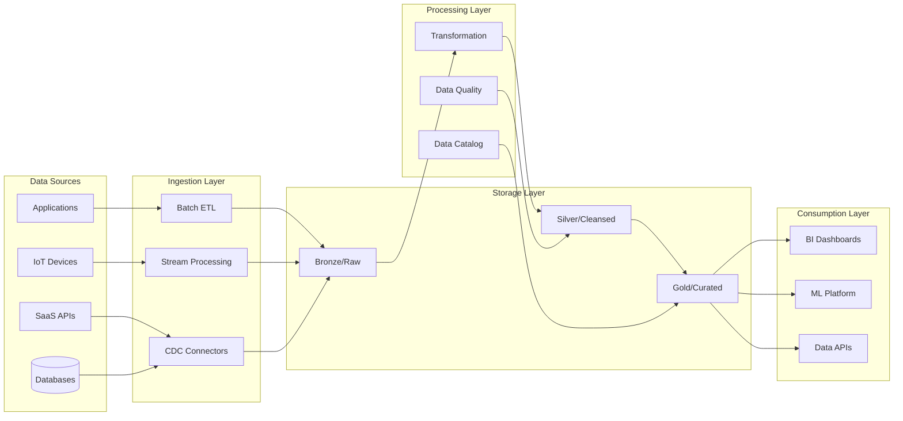

# Data Architecture Designer

## Description

Designs enterprise data architectures including data lakes, lakehouses, and modern data platforms. Provides strategies for data ingestion, quality, governance, and analytics consumption while addressing scalability, real-time processing, and regulatory compliance requirements.

## Architecture Diagram



## Use Cases

- Building enterprise data lakes with medallion architecture
- Designing real-time streaming analytics platforms
- Creating Customer 360 unified data models
- Implementing data mesh architectures for large organizations
- Modernizing legacy data warehouses to cloud-native solutions
- Establishing data governance and quality frameworks

## Variables

- `[domain]`: Business domain (e.g., "E-commerce retail analytics platform")
- `[data_sources]`: Data sources (e.g., "Clickstream, CRM (Salesforce), ERP (SAP), Social media APIs")
- `[analytics_needs]`: Analytics requirements (e.g., "Real-time personalization, Customer 360 view, Predictive churn")
- `[scale]`: Data scale (e.g., "10TB daily ingestion, 5PB total storage, 500 concurrent analysts")

## Example

### Context
A retail company with 500 stores needs to build a Customer 360 platform integrating POS transactions, e-commerce, loyalty program, and marketing data.

### Input

```text
Business Requirements: Customer 360 view, real-time personalization, churn prediction
Data Sources: POS systems (500 stores), e-commerce, CRM, loyalty app, marketing tools
Data Volume: 2TB daily ingestion, 5 years retention, 10M customers
Analytics Needs: Real-time dashboards, ML churn model, customer segmentation
Governance Requirements: GDPR compliance, data lineage, PII masking
```

### Expected Output

- **Architecture**: Lakehouse with medallion layers (Bronze/Silver/Gold)
- **Ingestion**: Kafka for real-time, Airbyte for SaaS, CDC for DBs
- **Processing**: dbt transformations, Great Expectations for quality
- **Storage**: Delta Lake on S3 with lifecycle policies
- **Governance**: Collibra catalog, automated PII detection

## Related Prompts

- [Cloud Architecture Consultant](cloud-architecture-consultant.md) - For cloud data platform selection
- [Compliance Architecture Designer](compliance-architecture-designer.md) - For data governance requirements
- [Enterprise Integration Architect](enterprise-integration-architect.md) - For data source integration
- [Performance Architecture Optimizer](performance-architecture-optimizer.md) - For query optimization
- [Microservices Architecture Expert](microservices-architecture-expert.md) - For data APIs and services
