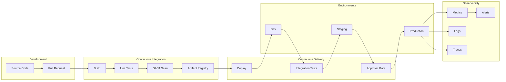

# DevOps Architecture Planner

---

## Description

Designs DevOps and CI/CD architectures for enterprise software delivery, including pipeline design, infrastructure as code patterns, and platform engineering strategies. This prompt guides architects through toolchain selection, deployment strategies, observability implementation, and DevSecOps integration.

---

## Architecture Diagram



---

## Decision Framework

### Deployment Strategy Selection

| Strategy | When to Use | Risk Level | Rollback Time |
|----------|-------------|------------|---------------|
| **Rolling** | Stateless apps, gradual rollout | Medium | Minutes |
| **Blue-Green** | Zero downtime, instant rollback | Low | Seconds |
| **Canary** | Risk mitigation, metrics validation | Low | Seconds |
| **Feature Flags** | A/B testing, gradual exposure | Very Low | Instant |
| **Recreate** | Legacy apps, database migrations | High | Minutes-Hours |

### When to Use This Pattern

| Criteria | Indicators |
|----------|------------|
| **Release Frequency** | Multiple deployments per day/week |
| **Team Size** | 5+ developers contributing to same codebase |
| **Environments** | 3+ environments (dev, staging, prod) |
| **Compliance** | Audit trails, change management required |
| **Reliability** | SLA requirements >99.9% |

---

## Use Cases

- Designing enterprise CI/CD pipelines with security gates
- Implementing GitOps workflows with ArgoCD or Flux
- Building platform engineering internal developer platforms (IDP)
- Creating infrastructure as code strategies with Terraform/Pulumi
- Establishing observability stacks (metrics, logs, traces)
- Integrating DevSecOps practices (SAST, DAST, SCA)

---

## Prompt

```text
Design DevOps architecture for:

Development Team: [team]
Technology Stack: [stack]
Deployment Environments: [environments]
Quality Requirements: [quality]

Provide:
1. CI/CD pipeline design
2. Infrastructure as code
3. Monitoring and observability
4. Security integration
5. Deployment strategies
6. Automation framework
```text

**Output:**

```text
## DevOps Architecture

### 1. CI/CD Pipeline Design (GitLab CI / GitHub Actions)
*   **Commit Stage:** Unit Tests, Checkstyle, SAST (SonarQube).
*   **Build Stage:** Build Docker container, tag with commit SHA, push to ECR.
*   **Deploy Dev:** Helm upgrade to Dev namespace.
*   **Integration Test:** Run API integration tests against Dev.
*   **Promote:** Manual approval gate for Staging/Prod.

### 2. Infrastructure as Code (IaC)
*   **Tool:** Terraform with remote state locking (S3 + DynamoDB).
*   **Structure:** Modular approach (VPC module, EKS module, RDS module) to enforce standards across squads.

### 3. Deployment Strategy
*   **Production:** Blue/Green deployment using ArgoCD Rollouts.
    *   Traffic shifted 1% -> 10% -> 50% -> 100% based on health metrics (Error rate < 1%).
    *   Instant rollback if metrics degrade.

[... continues with observability and security integration ...]
```text

---

## Variables

- `[team]`: Development team (e.g., "8 squads, 50+ developers, Java/Kotlin microservices")
- `[stack]`: Technology stack (e.g., "Spring Boot, Kubernetes, PostgreSQL, Redis")
- `[environments]`: Deployment environments (e.g., "Dev, Staging, Prod (multi-region)")
- `[quality]`: Quality requirements (e.g., "99.95% SLA, < 15 min MTTR, zero-downtime deploys")

---

## Cloud Platform Notes

### Azure
- **CI/CD**: Azure DevOps Pipelines, GitHub Actions
- **IaC**: Azure Bicep, Terraform with Azure provider
- **Container Registry**: Azure Container Registry (ACR)
- **GitOps**: Azure Arc-enabled Kubernetes with Flux
- **Observability**: Azure Monitor, Application Insights, Log Analytics

### AWS
- **CI/CD**: CodePipeline, CodeBuild, CodeDeploy
- **IaC**: CloudFormation, CDK, Terraform
- **Container Registry**: Elastic Container Registry (ECR)
- **GitOps**: EKS with ArgoCD or Flux
- **Observability**: CloudWatch, X-Ray, OpenSearch

### GCP
- **CI/CD**: Cloud Build, Cloud Deploy
- **IaC**: Deployment Manager, Terraform, Pulumi
- **Container Registry**: Artifact Registry
- **GitOps**: GKE with Config Sync or ArgoCD
- **Observability**: Cloud Monitoring, Cloud Trace, Cloud Logging

---

## Example

### Context
A fintech startup with 50 developers needs to implement a CI/CD pipeline that supports 20+ microservices with strict compliance requirements.

### Input
```text
Development Team: 50 developers, 8 squads, platform engineering team
Technology Stack: Java/Spring Boot microservices, React SPA, PostgreSQL
Deployment Environments: dev, staging, pre-prod, prod (2 regions)
Quality Requirements: <1% deployment failure rate, <15 min lead time
```

### Expected Output

- **Pipeline**: GitHub Actions with reusable workflows per service type
- **IaC**: Terraform with module registry, Terragrunt for DRY patterns
- **Deployment**: ArgoCD GitOps, Blue-Green with automated rollback
- **Observability**: Grafana stack (Prometheus, Loki, Tempo)
- **Security**: Snyk for SCA, SonarQube for SAST

---

## Tips

- Start with developer experience, not tooling
- Implement trunk-based development for faster flow
- Use ephemeral environments for PR previews
- Automate everything including documentation
- Measure DORA metrics from day one

---

## Related Prompts

- [Cloud Architecture Consultant](cloud-architecture-consultant.md) - For cloud infrastructure decisions
- [Security Architecture Specialist](security-architecture-specialist.md) - For DevSecOps integration
- [Microservices Architecture Expert](microservices-architecture-expert.md) - For service deployment patterns
- [Performance Architecture Optimizer](performance-architecture-optimizer.md) - For pipeline performance
- [Disaster Recovery Architect](disaster-recovery-architect.md) - For deployment recovery strategies
