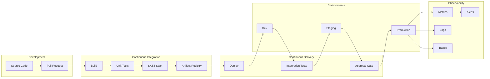

# DevOps Architecture Planner

## Description

Designs CI/CD pipelines, GitOps workflows, and platform engineering solutions. Provides strategies for infrastructure as code, deployment automation, observability, and DevSecOps integration while optimizing for development velocity, reliability, and compliance.

## Architecture Diagram



## Use Cases

- Designing enterprise CI/CD pipelines with security gates
- Implementing GitOps workflows with ArgoCD or Flux
- Building platform engineering internal developer platforms (IDP)
- Creating infrastructure as code strategies with Terraform/Pulumi
- Establishing observability stacks (metrics, logs, traces)
- Integrating DevSecOps practices (SAST, DAST, SCA)

## Variables

- `[team]`: Development team (e.g., "8 squads, 50+ developers, Java/Kotlin microservices")
- `[stack]`: Technology stack (e.g., "Spring Boot, Kubernetes, PostgreSQL, Redis")
- `[environments]`: Deployment environments (e.g., "Dev, Staging, Prod (multi-region)")
- `[quality]`: Quality requirements (e.g., "99.95% SLA, < 15 min MTTR, zero-downtime deploys")

## Example

### Context
A fintech startup with 50 developers needs to implement a CI/CD pipeline that supports 20+ microservices with strict compliance requirements.

### Input

```text
Development Team: 50 developers, 8 squads, platform engineering team
Technology Stack: Java/Spring Boot microservices, React SPA, PostgreSQL
Deployment Environments: dev, staging, pre-prod, prod (2 regions)
Quality Requirements: <1% deployment failure rate, <15 min lead time
```

### Expected Output

- **Pipeline**: GitHub Actions with reusable workflows per service type
- **IaC**: Terraform with module registry, Terragrunt for DRY patterns
- **Deployment**: ArgoCD GitOps, Blue-Green with automated rollback
- **Observability**: Grafana stack (Prometheus, Loki, Tempo)
- **Security**: Snyk for SCA, SonarQube for SAST

## Related Prompts

- [Cloud Architecture Consultant](cloud-architecture-consultant.md) - For cloud infrastructure decisions
- [Security Architecture Specialist](security-architecture-specialist.md) - For DevSecOps integration
- [Microservices Architecture Expert](microservices-architecture-expert.md) - For service deployment patterns
- [Performance Architecture Optimizer](performance-architecture-optimizer.md) - For pipeline performance
- [Disaster Recovery Architect](disaster-recovery-architect.md) - For deployment recovery strategies
