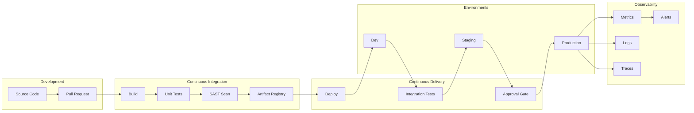

## Description

## Prompt



Designs DevOps and CI/CD architectures

## Description

## Prompt


Designs DevOps and CI/CD architectures


# DevOps Architecture Planner

## Description

Designs CI/CD pipelines, GitOps workflows, and platform engineering solutions. Provides strategies for infrastructure as code, deployment automation, observability, and DevSecOps integration while optimizing for development velocity, reliability, and compliance.

## Architecture Diagram


## Use Cases

- Designing enterprise CI/CD pipelines with security gates
- Implementing GitOps workflows with ArgoCD or Flux
- Building platform engineering internal developer platforms (IDP)
- Creating infrastructure as code strategies with Terraform/Pulumi
- Establishing observability stacks (metrics, logs, traces)
- Integrating DevSecOps practices (SAST, DAST, SCA)

## Variables

- `[team]`: Development team (e.g., "8 squads, 50+ developers, Java/Kotlin microservices")
- `[stack]`: Technology stack (e.g., "Spring Boot, Kubernetes, PostgreSQL, Redis")
- `[environments]`: Deployment environments (e.g., "Dev, Staging, Prod (multi-region)")
- `[quality]`: Quality requirements (e.g., "99.95% SLA, < 15 min MTTR, zero-downtime deploys")

## Example

### Context
A fintech startup with 50 developers needs to implement a CI/CD pipeline that supports 20+ microservices with strict compliance requirements.

### Input

```text
Development Team: 50 developers, 8 squads, platform engineering team
Technology Stack: Java/Spring Boot microservices, React SPA, PostgreSQL
Deployment Environments: dev, staging, pre-prod, prod (2 regions)
Quality Requirements: <1% deployment failure rate, <15 min lead time
```

### Expected Output

- **Pipeline**: GitHub Actions with reusable workflows per service type
- **IaC**: Terraform with module registry, Terragrunt for DRY patterns
- **Deployment**: ArgoCD GitOps, Blue-Green with automated rollback
- **Observability**: Grafana stack (Prometheus, Loki, Tempo)
- **Security**: Snyk for SCA, SonarQube for SAST

## Related Prompts

- [Cloud Architecture Consultant](cloud-architecture-consultant.md) - For cloud infrastructure decisions
- [Security Architecture Specialist](security-architecture-specialist.md) - For DevSecOps integration
- [Microservices Architecture Expert](microservices-architecture-expert.md) - For service deployment patterns
- [Performance Architecture Optimizer](performance-architecture-optimizer.md) - For pipeline performance
- [Disaster Recovery Architect](disaster-recovery-architect.md) - For deployment recovery strategies## Variables

_No bracketed variables detected._

## Example

### Input

````text
[Fill in a realistic input for the prompt]
````

### Expected Output

````text
[Representative AI response]
````
## Variables

| Variable | Description |
|---|---|
| `[Alerts]` | AUTO-GENERATED: describe `Alerts` |
| `[Approval Gate]` | AUTO-GENERATED: describe `Approval Gate` |
| `[Artifact Registry]` | AUTO-GENERATED: describe `Artifact Registry` |
| `[Build]` | AUTO-GENERATED: describe `Build` |
| `[Cloud Architecture Consultant]` | AUTO-GENERATED: describe `Cloud Architecture Consultant` |
| `[Continuous Delivery]` | AUTO-GENERATED: describe `Continuous Delivery` |
| `[Continuous Integration]` | AUTO-GENERATED: describe `Continuous Integration` |
| `[Deploy]` | AUTO-GENERATED: describe `Deploy` |
| `[Dev]` | AUTO-GENERATED: describe `Dev` |
| `[Development]` | AUTO-GENERATED: describe `Development` |
| `[Disaster Recovery Architect]` | AUTO-GENERATED: describe `Disaster Recovery Architect` |
| `[Environments]` | AUTO-GENERATED: describe `Environments` |
| `[Fill in a realistic input for the prompt]` | AUTO-GENERATED: describe `Fill in a realistic input for the prompt` |
| `[Integration Tests]` | AUTO-GENERATED: describe `Integration Tests` |
| `[Logs]` | AUTO-GENERATED: describe `Logs` |
| `[Metrics]` | AUTO-GENERATED: describe `Metrics` |
| `[Microservices Architecture Expert]` | AUTO-GENERATED: describe `Microservices Architecture Expert` |
| `[Observability]` | AUTO-GENERATED: describe `Observability` |
| `[Performance Architecture Optimizer]` | AUTO-GENERATED: describe `Performance Architecture Optimizer` |
| `[Production]` | AUTO-GENERATED: describe `Production` |
| `[Pull Request]` | AUTO-GENERATED: describe `Pull Request` |
| `[Representative AI response]` | AUTO-GENERATED: describe `Representative AI response` |
| `[SAST Scan]` | AUTO-GENERATED: describe `SAST Scan` |
| `[Security Architecture Specialist]` | AUTO-GENERATED: describe `Security Architecture Specialist` |
| `[Source Code]` | AUTO-GENERATED: describe `Source Code` |
| `[Staging]` | AUTO-GENERATED: describe `Staging` |
| `[Traces]` | AUTO-GENERATED: describe `Traces` |
| `[Unit Tests]` | AUTO-GENERATED: describe `Unit Tests` |
| `[environments]` | AUTO-GENERATED: describe `environments` |
| `[quality]` | AUTO-GENERATED: describe `quality` |
| `[stack]` | AUTO-GENERATED: describe `stack` |
| `[team]` | AUTO-GENERATED: describe `team` |

## Example

### Input

````text
[Fill in a realistic input for the prompt]
````

### Expected Output

````text
[Representative AI response]
````

