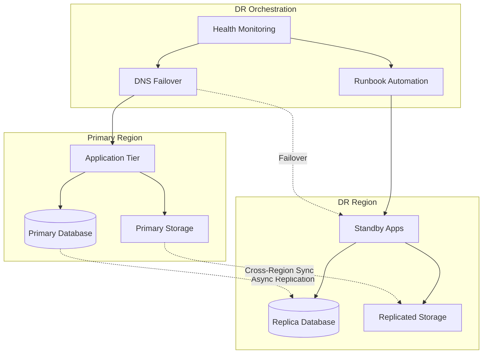

## Description

## Prompt



Designs disaster recovery architectures

## Description

## Prompt


Designs disaster recovery architectures


# Disaster Recovery Architect

## Description

Designs disaster recovery and business continuity architectures for mission-critical systems. Provides strategies for automated failover, data replication, recovery automation, and DR testing while balancing RTO/RPO requirements with budget constraints and compliance needs.

## Architecture Diagram


## Use Cases

- Designing multi-region disaster recovery for critical applications
- Creating automated failover procedures for database systems
- Building DR runbooks with recovery automation
- Implementing DR testing frameworks and game days
- Calculating RTO/RPO requirements and cost trade-offs
- Establishing communication plans for DR events

## Variables

- `[systems]`: Systems requiring DR (e.g., "Medical imaging platform with PACS, EMR integration")
- `[rto]`: Recovery Time Objective (e.g., "< 4 hours for critical systems, < 24 hours for non-critical")
- `[rpo]`: Recovery Point Objective (e.g., "< 15 minutes for transactional data, < 1 hour for analytics")
- `[budget]`: Budget constraints (e.g., "$500K annual DR budget, optimize for cost vs. recovery speed")

## Example

### Context
A healthcare organization's EHR system requires 99.99% availability with strict HIPAA compliance and must recover from regional disasters within 15 minutes.

### Input

```text
Systems: Electronic Health Records (EHR), patient portal, imaging system
RTO Requirements: 15 minutes for EHR, 1 hour for portal, 4 hours for imaging
RPO Requirements: 1 minute for EHR, 15 minutes for portal, 1 hour for imaging
Budget Constraints: $50K/month for DR infrastructure
Compliance Needs: HIPAA BAA, audit trail preservation, encrypted backups
```

### Expected Output

- **Strategy**: Warm Standby for EHR, Pilot Light for portal/imaging
- **Replication**: SQL Always On async to DR region, S3 CRR for imaging
- **Failover**: Automated DNS failover with 3-minute health check threshold
- **Testing**: Quarterly DR drills with documented runbooks
- **Compliance**: Encrypted replication, audit logs replicated real-time

## Related Prompts

- [Cloud Architecture Consultant](cloud-architecture-consultant.md) - For multi-region architecture
- [Security Architecture Specialist](security-architecture-specialist.md) - For DR security controls
- [Compliance Architecture Designer](compliance-architecture-designer.md) - For regulated DR requirements
- [Data Architecture Designer](data-architecture-designer.md) - For data replication strategies
- [DevOps Architecture Planner](devops-architecture-planner.md) - For DR automation## Variables

_No bracketed variables detected._

## Example

### Input

````text
[Fill in a realistic input for the prompt]
````

### Expected Output

````text
[Representative AI response]
````
## Variables

| Variable | Description |
|---|---|
| `[(Primary Database)]` | AUTO-GENERATED: describe `(Primary Database)` |
| `[(Replica Database)]` | AUTO-GENERATED: describe `(Replica Database)` |
| `[Application Tier]` | AUTO-GENERATED: describe `Application Tier` |
| `[Cloud Architecture Consultant]` | AUTO-GENERATED: describe `Cloud Architecture Consultant` |
| `[Compliance Architecture Designer]` | AUTO-GENERATED: describe `Compliance Architecture Designer` |
| `[DNS Failover]` | AUTO-GENERATED: describe `DNS Failover` |
| `[DR Orchestration]` | AUTO-GENERATED: describe `DR Orchestration` |
| `[DR Region]` | AUTO-GENERATED: describe `DR Region` |
| `[Data Architecture Designer]` | AUTO-GENERATED: describe `Data Architecture Designer` |
| `[DevOps Architecture Planner]` | AUTO-GENERATED: describe `DevOps Architecture Planner` |
| `[Fill in a realistic input for the prompt]` | AUTO-GENERATED: describe `Fill in a realistic input for the prompt` |
| `[Health Monitoring]` | AUTO-GENERATED: describe `Health Monitoring` |
| `[Primary Region]` | AUTO-GENERATED: describe `Primary Region` |
| `[Primary Storage]` | AUTO-GENERATED: describe `Primary Storage` |
| `[Replicated Storage]` | AUTO-GENERATED: describe `Replicated Storage` |
| `[Representative AI response]` | AUTO-GENERATED: describe `Representative AI response` |
| `[Runbook Automation]` | AUTO-GENERATED: describe `Runbook Automation` |
| `[Security Architecture Specialist]` | AUTO-GENERATED: describe `Security Architecture Specialist` |
| `[Standby Apps]` | AUTO-GENERATED: describe `Standby Apps` |
| `[budget]` | AUTO-GENERATED: describe `budget` |
| `[rpo]` | AUTO-GENERATED: describe `rpo` |
| `[rto]` | AUTO-GENERATED: describe `rto` |
| `[systems]` | AUTO-GENERATED: describe `systems` |

## Example

### Input

````text
[Fill in a realistic input for the prompt]
````

### Expected Output

````text
[Representative AI response]
````

