# Disaster Recovery Architect

---

## Description

Designs disaster recovery architectures that ensure business continuity and meet RTO/RPO requirements. This prompt guides architects through DR strategy selection, replication patterns, failover automation, and recovery testing frameworks for mission-critical systems.

---

## Architecture Diagram

```mermaid
flowchart TB
    subgraph Primary[Primary Region]
        App1[Application Tier]
        DB1[(Primary Database)]
        Storage1[Primary Storage]
    end

    subgraph Secondary[DR Region]
        App2[Standby Apps]
        DB2[(Replica Database)]
        Storage2[Replicated Storage]
    end

    subgraph Orchestration[DR Orchestration]
        Health[Health Monitoring]
        DNS[DNS Failover]
        Runbook[Runbook Automation]
    end

    App1 --> DB1
    App1 --> Storage1
    DB1 -.->|Async Replication| DB2
    Storage1 -.->|Cross-Region Sync| Storage2
    Health --> DNS
    Health --> Runbook
    DNS --> App1
    DNS -.->|Failover| App2
    Runbook --> App2
    App2 --> DB2
    App2 --> Storage2
```



---

## Decision Framework

### DR Strategy Selection

| Strategy | RTO | RPO | Cost | Best For |
| ---------- | ----- | ----- | ------ | ---------- |
| **Backup & Restore** | Hours | Hours | $ | Non-critical systems |
| **Pilot Light** | 10-30 min | Minutes | $$ | Core business apps |
| **Warm Standby** | Minutes | Seconds | $$$ | Mission-critical |
| **Hot Standby** | Seconds | Near-zero | $$$$ | Financial/healthcare |
| **Active-Active** | Zero | Zero | $$$$$ | Global, always-on |

### RTO/RPO Requirements Matrix

| System Tier | RTO Target | RPO Target | Strategy |
| ------------- | ------------ | ------------ | ---------- |
| Tier 1 (Critical) | <15 min | <1 min | Active-Active or Hot |
| Tier 2 (Important) | <1 hour | <15 min | Warm Standby |
| Tier 3 (Standard) | <4 hours | <1 hour | Pilot Light |
| Tier 4 (Non-critical) | <24 hours | <24 hours | Backup & Restore |

---

## Use Cases

- Designing multi-region disaster recovery for critical applications
- Creating automated failover procedures for database systems
- Building DR runbooks with recovery automation
- Implementing DR testing frameworks and game days
- Calculating RTO/RPO requirements and cost trade-offs
- Establishing communication plans for DR events

---

## Prompt

```text
Design disaster recovery for:

Systems: [systems]
RTO Requirements: [rto]
RPO Requirements: [rpo]
Budget Constraints: [budget]
Compliance Needs: [compliance]

Provide:

1. DR strategy and design
2. Backup and replication
3. Failover procedures
4. Testing framework
5. Recovery automation
6. Communication plan

```text

**Output:**

```text
## Disaster Recovery Strategy

### 1. DR Design: "Warm Standby" (Pilot Light)

*   **Primary Region:** US-East (N. Virginia)
*   **DR Region:** US-West (Oregon) - Sufficient distance for geographic redundancy.

### 2. Replication Strategy

*   **Database:** SQL Server Always On Availability Groups with Async commit to DR region.
*   **Imaging Data:** S3 Cross-Region Replication (CRR) with versioning enabled (RPO < 1 min).

### 3. Failover Procedures

1.  **Detection:** CloudWatch alarm triggers if Primary Health Check fails for 3 consecutive minutes.
2.  **Database:** Script promotes DR Read Replica to Primary Master.
3.  **DNS:** Route53 Health Check automatically updates DNS records to point to DR Load Balancer.

[... continues with testing framework and recovery automation ...]
```text

---

## Variables

- `[systems]`: Systems requiring DR (e.g., "Medical imaging platform with PACS, EMR integration")
- `[rto]`: Recovery Time Objective (e.g., "< 4 hours for critical systems, < 24 hours for non-critical")
- `[rpo]`: Recovery Point Objective (e.g., "< 15 minutes for transactional data, < 1 hour for analytics")
- `[budget]`: Budget constraints (e.g., "$500K annual DR budget, optimize for cost vs. recovery speed")

---

## Cloud Platform Notes

### Azure

- **DR Services**: Azure Site Recovery, Azure Backup
- **Database DR**: SQL Always On, Cosmos DB multi-region, Geo-redundant storage
- **DNS Failover**: Azure Traffic Manager, Azure Front Door
- **Automation**: Azure Automation Runbooks, Logic Apps
- **Regions**: 60+ regions, Availability Zones in major regions

### AWS

- **DR Services**: AWS Backup, CloudEndure Disaster Recovery
- **Database DR**: RDS Multi-AZ, Aurora Global Database, DynamoDB Global Tables
- **DNS Failover**: Route 53 health checks and failover routing
- **Automation**: Lambda, Step Functions, Systems Manager runbooks
- **Regions**: 30+ regions with cross-region replication options

### GCP

- **DR Services**: Backup and DR Service, Persistent Disk snapshots
- **Database DR**: Cloud SQL HA, Spanner multi-region, Firestore multi-region
- **DNS Failover**: Cloud DNS with health checks, Global Load Balancer
- **Automation**: Cloud Functions, Workflows
- **Regions**: 35+ regions with dual-region and multi-region options

---

## Example

### Context
A healthcare organization's EHR system requires 99.99% availability with strict HIPAA compliance and must recover from regional disasters within 15 minutes.

### Input

```text
Systems: Electronic Health Records (EHR), patient portal, imaging system
RTO Requirements: 15 minutes for EHR, 1 hour for portal, 4 hours for imaging
RPO Requirements: 1 minute for EHR, 15 minutes for portal, 1 hour for imaging
Budget Constraints: $50K/month for DR infrastructure
Compliance Needs: HIPAA BAA, audit trail preservation, encrypted backups
```

### Expected Output

- **Strategy**: Warm Standby for EHR, Pilot Light for portal/imaging
- **Replication**: SQL Always On async to DR region, S3 CRR for imaging
- **Failover**: Automated DNS failover with 3-minute health check threshold
- **Testing**: Quarterly DR drills with documented runbooks
- **Compliance**: Encrypted replication, audit logs replicated real-time

---

## Tips

- Calculate true cost of downtime to justify DR investment
- Test DR procedures regularly with documented runbooks
- Automate failover decisions where possible
- Consider data sovereignty in DR region selection
- Plan for "failback" after primary recovery

---

## Related Prompts

- [Cloud Architecture Consultant](cloud-architecture-consultant.md) - For multi-region architecture
- [Security Architecture Specialist](security-architecture-specialist.md) - For DR security controls
- [Compliance Architecture Designer](compliance-architecture-designer.md) - For regulated DR requirements
- [Data Architecture Designer](data-architecture-designer.md) - For data replication strategies
- [DevOps Architecture Planner](devops-architecture-planner.md) - For DR automation
