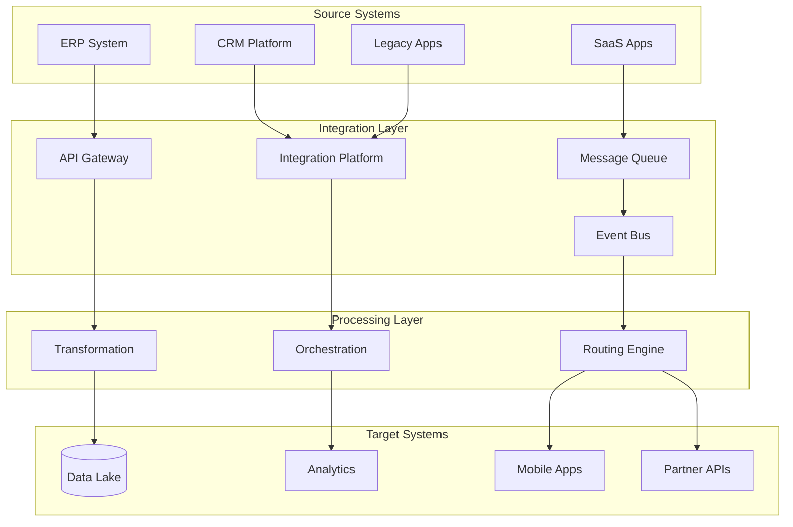

# Enterprise Integration Architect

---

## Description

Designs enterprise integration solutions connecting disparate systems, applications, and data sources. This prompt guides architects through integration patterns (EAI, ESB, iPaaS), API strategies, event-driven architectures, and data transformation pipelines for complex enterprise ecosystems.

---

## Architecture Diagram



---

## Decision Framework

### Integration Pattern Selection

| Pattern | When to Use | Trade-offs |
|---------|-------------|------------|
| **Point-to-Point** | Simple, few integrations | Spaghetti at scale |
| **Hub-and-Spoke (ESB)** | Centralized control, legacy | Single point of failure |
| **Event-Driven** | Real-time, loose coupling | Eventual consistency |
| **API-Led** | Self-service, composable | API management overhead |
| **Hybrid iPaaS** | SaaS-heavy, cloud-first | Vendor dependency |

### Integration Style Decision Matrix

| Requirement | Sync API | Async Message | Event Stream | Batch |
|-------------|----------|---------------|--------------|-------|
| Real-time response | ✅ | ❌ | ❌ | ❌ |
| Fire-and-forget | ❌ | ✅ | ✅ | ❌ |
| High volume | ⚠️ | ✅ | ✅ | ✅ |
| Guaranteed delivery | ⚠️ | ✅ | ✅ | ✅ |
| Complex transformation | ✅ | ✅ | ⚠️ | ✅ |

---

## Use Cases

- Integrating ERP, CRM, and marketing automation platforms
- Building event-driven architectures with Apache Kafka or cloud event buses
- Creating B2B integration hubs for partner onboarding
- Migrating from ESB to API-led integration
- Implementing master data management (MDM) synchronization
- Designing hybrid integration platforms (on-prem + cloud)

---

## Prompt

```text
Design integration architecture for:

Systems to Integrate: [systems]
Data Flow Requirements: [data_flow]
Performance Requirements: [performance]
Security Requirements: [security]

Include:
1. Integration patterns
2. API design strategy
3. Data transformation
4. Error handling
5. Monitoring and logging
6. Governance framework
```text
```xml

**Output:**

```text
## Integration Architecture

### 1. Integration Patterns
*   **Orchestration:** MuleSoft/Camel for complex Order-to-Cash workflow state management.
*   **Event-Driven:** "Order Created" event published to Kafka topic to trigger parallel downstream processes (Billing, Fulfillment).

### 2. Data Flow Design
1.  **Order Entry:** Salesforce triggers webhook to Integration Layer.
2.  **Validation:** Integration Layer calls SAP synchronously to check Inventory (Real-time).
3.  **Payment:** If stock exists, call Stripe to capture funds.
4.  **Fulfillment:** Publish `OrderConfirmed` event. Logistics App consumes event to schedule shipment.

### 3. Error Handling (Reliability)
*   **Dead Letter Queues (DLQ):** For failed messages (e.g., SAP downtime) to allow manual replay.
*   **Circuit Breaker:** Stop calling SAP if error rate > 10% to prevent cascading failure.

[... continues with monitoring and governance ...]
```text

---

## Variables

- `[systems]`: Systems to integrate (e.g., "Salesforce CRM, SAP ERP, Stripe payments, Logistics WMS")
- `[data_flow]`: Data flow requirements (e.g., "Real-time order sync, batch inventory updates nightly")
- `[performance]`: Performance requirements (e.g., "< 200ms API latency, 10K orders/hour peak")
- `[security]`: Security requirements (e.g., "PCI-DSS for payments, field-level encryption for PII")

---

## Cloud Platform Notes

### Azure
- **Integration**: Azure Integration Services (Logic Apps, Service Bus, API Management, Event Grid)
- **iPaaS**: Azure Integration Account for B2B/EDI
- **Messaging**: Service Bus (queues/topics), Event Hubs (streaming)
- **Hybrid**: Azure Arc, On-premises data gateway
- **B2B**: EDI, AS2, X12 support in Integration Account

### AWS
- **Integration**: Amazon EventBridge, Step Functions, AppFlow
- **Messaging**: SQS (queues), SNS (pub/sub), Kinesis (streaming)
- **API**: API Gateway, AppSync (GraphQL)
- **Hybrid**: AWS Outposts, Direct Connect
- **B2B**: AWS B2B Data Interchange (EDI)

### GCP
- **Integration**: Application Integration, Pub/Sub
- **Messaging**: Pub/Sub (streaming), Cloud Tasks (queues)
- **API**: Apigee for API management
- **Hybrid**: Anthos for hybrid/multi-cloud
- **Workflows**: Cloud Workflows for orchestration

---

## Example

### Context
A manufacturing company needs to integrate SAP ERP, Salesforce CRM, and logistics partners for Order-to-Cash visibility.

### Input
```text
Systems to Integrate: SAP S/4HANA, Salesforce, 15 logistics partners, e-commerce platform
Data Flow Requirements: Order → Fulfillment → Shipping → Delivery updates
Performance Requirements: 500 orders/minute peak, <5s end-to-end latency
Security Requirements: OAuth 2.0 for partners, field-level encryption for PII
```

### Expected Output

- **Pattern**: API-Led connectivity with experience, process, and system APIs
- **Platform**: MuleSoft Anypoint for orchestration, Kafka for events
- **Error Handling**: Dead letter queues, circuit breakers for resilience
- **Monitoring**: Centralized logging, distributed tracing, business KPIs

---

## Tips

- Start with a canonical data model for common entities
- Implement circuit breakers for all external integrations
- Use event sourcing for audit and replay capabilities
- Plan for partner onboarding with self-service portals
- Monitor business metrics, not just technical metrics

---

## Related Prompts

- [API Architecture Designer](api-architecture-designer.md) - For API design patterns
- [Data Architecture Designer](data-architecture-designer.md) - For data transformation
- [Microservices Architecture Expert](microservices-architecture-expert.md) - For service decomposition
- [Security Architecture Specialist](security-architecture-specialist.md) - For integration security
- [Cloud Architecture Consultant](cloud-architecture-consultant.md) - For cloud integration services
