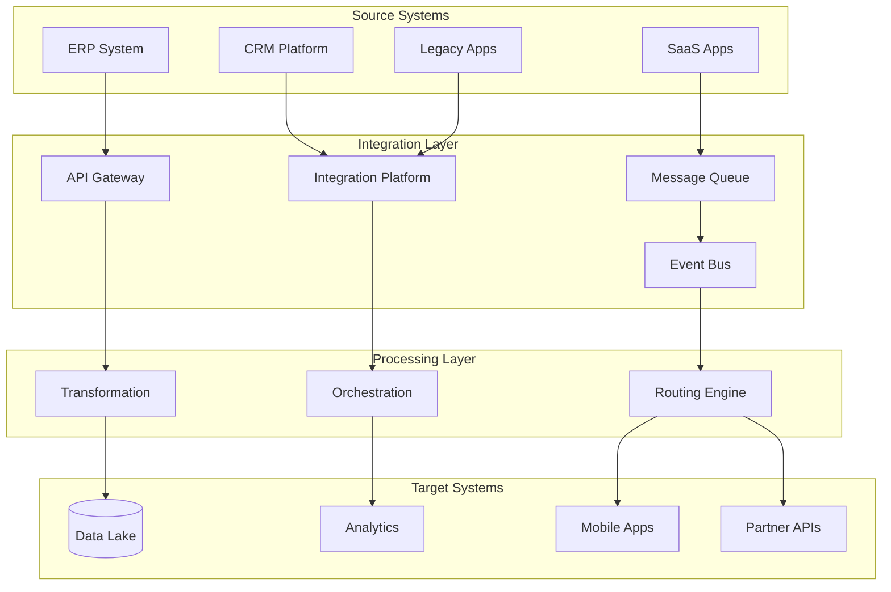

## Description

## Prompt



Designs enterprise integration solutions

## Description

## Prompt


Designs enterprise integration solutions


# Enterprise Integration Architect

## Description

Designs enterprise integration solutions including API-led connectivity, event-driven architectures, and B2B integration hubs. Provides strategies for connecting ERP, CRM, SaaS platforms, and partner systems while addressing performance, security, and hybrid cloud integration requirements.

## Architecture Diagram


## Use Cases

- Integrating ERP, CRM, and marketing automation platforms
- Building event-driven architectures with Apache Kafka or cloud event buses
- Creating B2B integration hubs for partner onboarding
- Migrating from ESB to API-led integration
- Implementing master data management (MDM) synchronization
- Designing hybrid integration platforms (on-prem + cloud)

## Variables

- `[systems]`: Systems to integrate (e.g., "Salesforce CRM, SAP ERP, Stripe payments, Logistics WMS")
- `[data_flow]`: Data flow requirements (e.g., "Real-time order sync, batch inventory updates nightly")
- `[performance]`: Performance requirements (e.g., "< 200ms API latency, 10K orders/hour peak")
- `[security]`: Security requirements (e.g., "PCI-DSS for payments, field-level encryption for PII")

## Example

### Context
A manufacturing company needs to integrate SAP ERP, Salesforce CRM, and logistics partners for Order-to-Cash visibility.

### Input
```text

Systems to Integrate: SAP S/4HANA, Salesforce, 15 logistics partners, e-commerce platform
Data Flow Requirements: Order → Fulfillment → Shipping → Delivery updates
Performance Requirements: 500 orders/minute peak, <5s end-to-end latency
Security Requirements: OAuth 2.0 for partners, field-level encryption for PII

```

### Expected Output

- **Pattern**: API-Led connectivity with experience, process, and system APIs
- **Platform**: MuleSoft Anypoint for orchestration, Kafka for events
- **Error Handling**: Dead letter queues, circuit breakers for resilience
- **Monitoring**: Centralized logging, distributed tracing, business KPIs

## Related Prompts

- [API Architecture Designer](api-architecture-designer.md) - For API design patterns
- [Data Architecture Designer](data-architecture-designer.md) - For data transformation
- [Microservices Architecture Expert](microservices-architecture-expert.md) - For service decomposition
- [Security Architecture Specialist](security-architecture-specialist.md) - For integration security
- [Cloud Architecture Consultant](cloud-architecture-consultant.md) - For cloud integration services## Variables

_No bracketed variables detected._

## Example

### Input

````text
[Fill in a realistic input for the prompt]
````

### Expected Output

````text
[Representative AI response]
````
## Variables

| Variable | Description |
|---|---|
| `[(Data Lake)]` | AUTO-GENERATED: describe `(Data Lake)` |
| `[API Architecture Designer]` | AUTO-GENERATED: describe `API Architecture Designer` |
| `[API Gateway]` | AUTO-GENERATED: describe `API Gateway` |
| `[Analytics]` | AUTO-GENERATED: describe `Analytics` |
| `[CRM Platform]` | AUTO-GENERATED: describe `CRM Platform` |
| `[Cloud Architecture Consultant]` | AUTO-GENERATED: describe `Cloud Architecture Consultant` |
| `[Data Architecture Designer]` | AUTO-GENERATED: describe `Data Architecture Designer` |
| `[ERP System]` | AUTO-GENERATED: describe `ERP System` |
| `[Event Bus]` | AUTO-GENERATED: describe `Event Bus` |
| `[Fill in a realistic input for the prompt]` | AUTO-GENERATED: describe `Fill in a realistic input for the prompt` |
| `[Integration Layer]` | AUTO-GENERATED: describe `Integration Layer` |
| `[Integration Platform]` | AUTO-GENERATED: describe `Integration Platform` |
| `[Legacy Apps]` | AUTO-GENERATED: describe `Legacy Apps` |
| `[Message Queue]` | AUTO-GENERATED: describe `Message Queue` |
| `[Microservices Architecture Expert]` | AUTO-GENERATED: describe `Microservices Architecture Expert` |
| `[Mobile Apps]` | AUTO-GENERATED: describe `Mobile Apps` |
| `[Orchestration]` | AUTO-GENERATED: describe `Orchestration` |
| `[Partner APIs]` | AUTO-GENERATED: describe `Partner APIs` |
| `[Processing Layer]` | AUTO-GENERATED: describe `Processing Layer` |
| `[Representative AI response]` | AUTO-GENERATED: describe `Representative AI response` |
| `[Routing Engine]` | AUTO-GENERATED: describe `Routing Engine` |
| `[SaaS Apps]` | AUTO-GENERATED: describe `SaaS Apps` |
| `[Security Architecture Specialist]` | AUTO-GENERATED: describe `Security Architecture Specialist` |
| `[Source Systems]` | AUTO-GENERATED: describe `Source Systems` |
| `[Target Systems]` | AUTO-GENERATED: describe `Target Systems` |
| `[Transformation]` | AUTO-GENERATED: describe `Transformation` |
| `[data_flow]` | AUTO-GENERATED: describe `data_flow` |
| `[performance]` | AUTO-GENERATED: describe `performance` |
| `[security]` | AUTO-GENERATED: describe `security` |
| `[systems]` | AUTO-GENERATED: describe `systems` |

## Example

### Input

````text
[Fill in a realistic input for the prompt]
````

### Expected Output

````text
[Representative AI response]
````

