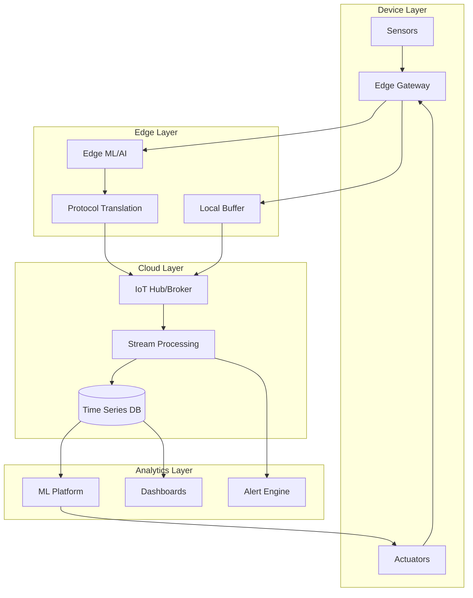

# IoT Architecture Designer

---

## Description

Designs IoT system architectures for connected devices, sensor networks, and edge computing solutions. This prompt guides architects through device management, communication protocols, data processing pipelines, edge-to-cloud patterns, and security frameworks for industrial and consumer IoT deployments.

---

## Architecture Diagram



---

## Decision Framework

### Protocol Selection

| Protocol | When to Use | Trade-offs |
|----------|-------------|------------|
| **MQTT** | Low bandwidth, unreliable networks | QoS overhead, broker dependency |
| **HTTP/REST** | Simple devices, request-response | Higher overhead, no push |
| **CoAP** | Constrained devices, UDP | Less mature tooling |
| **AMQP** | Enterprise messaging, transactions | Complex, higher resource use |
| **WebSocket** | Real-time bidirectional | Persistent connection overhead |

### Edge vs Cloud Processing

| Criteria | Edge | Cloud |
|----------|------|-------|
| Latency requirements | <100ms | >1s acceptable |
| Connectivity | Intermittent/offline | Always connected |
| Data volume | High-frequency, filter locally | All data needed centrally |
| Privacy/compliance | Data must stay local | Cloud processing permitted |
| ML inference | Real-time decisions | Batch/training workloads |

---

## Use Cases

- Designing industrial IoT (IIoT) for manufacturing predictive maintenance
- Building smart building/city sensor networks
- Creating connected vehicle fleet management systems
- Implementing agricultural IoT for precision farming
- Designing healthcare wearable monitoring platforms
- Building retail smart shelf and inventory systems

---

## Prompt

```text
Design IoT architecture for:

Use Case: [use_case]
Device Types: [devices]
Data Volume: [data_volume]
Connectivity: [connectivity]
Security Requirements: [security]

Provide:
1. Device architecture
2. Communication protocols
3. Data processing pipeline
4. Cloud integration
5. Security framework
6. Management platform
```text

**Output:**

```text
## IoT Architecture Design

### 1. Device Architecture
*   **Edge Gateway:** Aggregates sensor data via LoRaWAN, performs local anomaly detection (Edge ML), and batches uploads to cloud.
*   **Protocol:** MQTT over TLS for efficient, lightweight messaging.

### 2. Data Processing Pipeline
*   **Ingestion:** AWS IoT Core (MQTT Broker).
*   **Hot Path (Real-time):** IoT Rules -> Kinesis Data Streams -> Lambda (Alerting if temp > threshold).
*   **Cold Path (Analytics):** Kinesis Firehose -> S3 Data Lake -> Athena/Quicksight for historical trend analysis.

### 3. Security Framework
*   **Device Identity:** X.509 Certificates provisioned at manufacturing.
*   **Network:** Network segmentation separating OT (Operational Tech) from IT networks.

[... continues with management platform and cloud integration ...]
```text

---

## Variables

- `[use_case]`: IoT use case (e.g., "Cold chain monitoring for pharmaceutical distribution")
- `[devices]`: Device types (e.g., "Temperature/humidity sensors, GPS trackers, Edge gateways")
- `[data_volume]`: Data volume (e.g., "50,000 sensors, 1 reading/minute = 72M data points/day")
- `[connectivity]`: Connectivity (e.g., "LoRaWAN for sensors, LTE for gateways, intermittent connectivity")
- `[security]`: Security requirements (e.g., "FDA 21 CFR Part 11 compliance, data integrity assurance")

---

## Cloud Platform Notes

### Azure
- **IoT Hub**: Device management, D2C/C2D messaging, device twins
- **Edge**: Azure IoT Edge for containerized edge workloads
- **Analytics**: Stream Analytics, Time Series Insights, Azure Digital Twins
- **ML**: Azure ML on Edge, Custom Vision on Edge
- **Security**: Azure Sphere, Device Provisioning Service (DPS)

### AWS
- **IoT Core**: MQTT broker, device shadows, rules engine
- **Edge**: AWS IoT Greengrass for edge compute and ML
- **Analytics**: Kinesis, IoT Analytics, Timestream
- **ML**: SageMaker Edge Manager, Panorama (vision)
- **Security**: IoT Device Defender, X.509 certificates

### GCP
- **Edge**: Edge TPU, Anthos for edge Kubernetes
- **Analytics**: Dataflow, BigQuery for time series
- **ML**: AutoML Edge, Vertex AI edge deployment
- **Alternative**: Partner solutions (Clearblade, Losant)

---

## Example

### Context
A food manufacturer needs to monitor 500 cold storage facilities for FDA compliance.

### Input
```text
Use Case: Cold chain monitoring for FDA compliance (FSMA)
Device Types: Temperature sensors (5 per facility), humidity, door sensors
Data Volume: 500 facilities × 7 sensors × 1 reading/minute = 5M readings/day
Connectivity: Cellular (4G/LTE) with occasional connectivity drops
Security Requirements: Device authentication, encrypted transport, audit trail
```

### Expected Output

- **Device Architecture**: LoRaWAN sensors → Edge gateway with 4G backhaul
- **Edge Processing**: Local anomaly detection, offline buffering
- **Cloud Ingestion**: AWS IoT Core with device shadows for state sync
- **Analytics**: Real-time alerting, daily compliance reports
- **Security**: X.509 certificates at manufacturing, mutual TLS

---

## Tips

- Design for offline operation from the start
- Use device twins/shadows for state synchronization
- Implement OTA (over-the-air) update capabilities
- Plan for device lifecycle (provisioning to decommissioning)
- Separate OT (operational technology) from IT networks

---

## Related Prompts

- [Security Architecture Specialist](security-architecture-specialist.md) - For IoT security controls
- [Data Architecture Designer](data-architecture-designer.md) - For time series data management
- [Cloud Architecture Consultant](cloud-architecture-consultant.md) - For cloud IoT platform selection
- [Enterprise Integration Architect](enterprise-integration-architect.md) - For IT/OT integration
- [Blockchain Architecture Specialist](blockchain-architecture-specialist.md) - For IoT supply chain traceability
